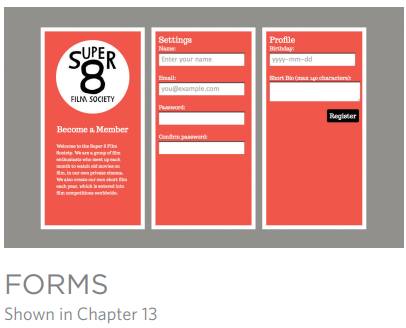
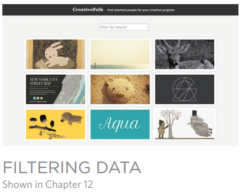
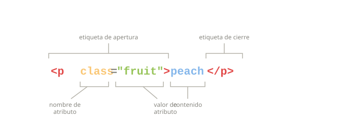

# INTRODUCCION

Este libro explica cómo se puede usar JavaScript en los navegadores para hacer que las páginas web sean más interactivas, interesantes y fáciles de usar. También aprenderás sobre jQuery, porque hace que escribir JavaScript sea mucho más sencillo. 

Para aprovechar al máximo este libro, necesitarás saber cómo crear páginas web usando HTML y CSS. Más allá de eso, no se requiere ninguna experiencia previa en programación. Aprender a programar con JavaScript implica:

- [x] Comprender algunos conceptos básicos de programación y los términos que los programadores de JavaScript utilizan para describirlos.  
- [x] Aprender el propio lenguaje y, como todos los idiomas, conocer su vocabulario y cómo estructurar tus “oraciones” (es decir, tus instrucciones y expresiones en JavaScript).  
- [x] Familiarizarte con su uso observando ejemplos de cómo JavaScript se emplea comúnmente en los sitios web actuales.

El único equipo que necesita para utilizar este libro es una computadora con un navegador web moderno instalado y su editor de código favorito (por ejemplo, Notepad, TextEdit, Sublime Text o Coda).

## CÓMO JAVASCRIPT HACE LAS PÁGINAS WEB MÁS INTERACTIVAS

1. **ACCEDER A CONTENIDO** 
   
    Puedes usar JavaScript para seleccionar cualquier elemento, atributo o texto de una página HTML. Por ejemplo:  

    - [x] Seleccionar el texto dentro de todos los elementos `<p>` de una página.  
    - [x] Seleccionar todos los elementos que tengan un atributo `class` con el valor `note`.  
    - [x] Descubrir qué se escribió en un campo de texto cuyo atributo `id` tiene el valor `email`.
  
2.  **MODIFICAR CONTENIDO**
     
    Puedes usar JavaScript para agregar elementos, atributos y texto a la página, o para eliminarlos. Por ejemplo:  

      - [x] Añadir un párrafo de texto después del primer elemento `<p>`.  
      - [x] Cambiar el valor de los atributos `class` para activar nuevas reglas de CSS en esos elementos.  
      - [x] Modificar el tamaño o la posición de un elemento.

3. **PROGRAMAR REGLAS** 
    
    Puedes especificar un conjunto de pasos que el navegador debe seguir (como una receta), lo que le permite acceder o cambiar el contenido de una página. Por ejemplo:  

    - [x] Un script de galería podría comprobar qué imagen ha hecho clic el usuario y mostrar una versión más grande de esa imagen.  
    - [x] Una calculadora de hipotecas podría recoger valores de un formulario, realizar un cálculo y mostrar las cuotas de pago.  
    - [x] Una animación podría comprobar las dimensiones de la ventana del navegador y mover una imagen hasta la parte inferior del área visible (también conocida como *viewport*).  

4. **REACCIONAR A EVENTOS** 
    
    Puedes indicar que un script se ejecute cuando se produzca un evento específico. Por ejemplo, podría ejecutarse cuando:  

       - [x] Se pulsa un botón.  
       - [x] Se hace clic (o se toca) un enlace.  
       - [x] El cursor se coloca encima de un elemento.  
       - [x] Se introduce información en un formulario.  
       - [x] Ha pasado un intervalo de tiempo.  
       - [x] La página web ha terminado de cargarse.

## EJEMPLOS DE JAVASCRIPT EN EL NAVEGADOR

Ser capaz de cambiar el contenido de una página HTML mientras se encuentra cargada en el navegador es algo muy potente. Los ejemplos siguientes dependen de la capacidad para:  

   - [x] **Acceder** al contenido de la página.  
   - [x] **Modificar** el contenido de la página.  
   - [x] **Programar** reglas o instrucciones que el navegador pueda seguir.  
   - [x] **Reaccionar** a eventos desencadenados por el usuario o por el navegador.


Las presentaciones (slideshows) pueden mostrar varias imágenes diferentes (u otro contenido HTML) dentro del mismo espacio en una página determinada. Pueden reproducirse de forma automática como una secuencia, o los usuarios pueden pasar manualmente de una diapositiva a otra. Esto permite mostrar más contenido dentro de un espacio limitado.  

**React:** Script que se dispara cuando la página se carga.  
**Access:** Obtener cada diapositiva del slideshow.  
**Modify:** Mostrar solo la primera diapositiva (ocultar las demás).  
**Program:** Configurar un temporizador: cuándo mostrar la siguiente diapositiva.  
**Modify:** Cambiar cuál diapositiva se muestra.  
**React:**  Cuando el usuario hace clic en el botón para cambiar la diapositiva.  
**Program:** Determinar cuál diapositiva mostrar.  
**Modify:** Mostrar la diapositiva solicitada.



Validar formularios (comprobar si se han rellenado correctamente) es importante cuando la información la proporciona el usuario. JavaScript permite avisar al usuario si se han cometido errores. También puede realizar cálculos más avanzados basados en los datos introducidos y mostrar los resultados al usuario.  

**React:**  El usuario pulsa el botón de enviar cuando ha introducido su nombre.  
**Access:** Obtener el valor del campo del formulario.  
**Program:**  Comprobar si el nombre es lo suficientemente largo.  
**Modify:** Mostrar un mensaje de advertencia si el nombre no es lo suficientemente largo.


Puede que no desees obligar a los visitantes a recargar todo el contenido de una página web, sobre todo si solo necesitas actualizar una pequeña parte de ella. Recargar solamente una sección de la página puede hacer que el sitio parezca más rápido y se comporte más como una aplicación.  

**React:**  Script que se dispara cuando el usuario hace clic en un enlace.  
**Access:** El enlace que han clickeado.  
**Program:** Cargar el nuevo contenido solicitado a partir de ese enlace.  
**Access:**  Encontrar el elemento de la página que se debe reemplazar.  
**Modify:**  Reemplazar ese contenido con el nuevo contenido.



Si tienes mucha información que mostrar en una página, puedes ayudar a los usuarios a encontrar lo que necesitan proporcionando filtros. En este caso, se generan botones usando los datos almacenados en los atributos de los elementos HTML. Cuando el usuario hace clic en uno de los botones, solo se muestran las imágenes que tienen esa palabra clave.  

**React:**  Script que se dispara cuando la página se carga.  
**Program:** Recopilar las palabras clave de las imágenes.  
**Program:** Convertir esas palabras clave en botones sobre los que el usuario puede hacer clic.  
**React:**  El usuario hace clic en uno de los botones.  
**Program:** Buscar el subconjunto de imágenes relevantes que deben mostrarse.  
**Modify:**  Mostrar el subconjunto de imágenes que usan esa etiqueta.

## LA ESTRUCTURA DE ESTE LIBRO

Para enseñarle JavaScript, este libro se divide en dos secciones:

### CONCEPTOS CLAVE

Los primeros nueve capítulos te introducen a los conceptos básicos de la programación y al lenguaje JavaScript. En el camino aprenderás cómo se usa para crear sitios web más entretenidos, interactivos y fáciles de usar.  

El c**apítulo 1** revisa algunos conceptos clave de la programación, mostrándote cómo los ordenadores crean modelos del mundo usando datos y cómo se usa JavaScript para cambiar el contenido de una página HTML.  

Los c**apítulos 2‑4** tratan los fundamentos del lenguaje JavaScript.  

El **capítulo 5** explica cómo el Modelo de Objetos del Documento (DOM) permite acceder y modificar el contenido de un documento mientras está cargado en el navegador. 

El **capítulo 6** analiza cómo los eventos pueden utilizarse para ejecutar código.  

El **capítulo 7** te muestra cómo jQuery puede hacer que escribir scripts sea más rápido y sencillo.  

El **capítulo 8** te presenta a Ajax, un conjunto de técnicas que permiten cambiar solo una parte de una página web sin recargarla por completo.  

El **capítulo 9** aborda las Interfaces de Programación de Aplicaciones (API), incluyendo las nuevas API que forman parte de HTML5 y las de sitios como Google Maps.

### APLICACIONES PRÁCTICAS 

Para este punto ya habrás visto muchos ejemplos de cómo se usa JavaScript en sitios web populares. Esta sección reúne todas las técnicas que has aprendido hasta ahora, para darte demostraciones prácticas de cómo los desarrolladores profesionales usan JavaScript. No solo verás una selección de ejemplos detallados, sino que también aprenderás más sobre el proceso de diseñar y escribir scripts desde cero. 

El **Capítulo 10** trata el manejo de errores y la depuración, y explica más sobre cómo se procesa JavaScript. 

El **Capítulo 11** muestra técnicas para crear paneles de contenido como sliders, ventanas modales, paneles con pestañas y acordeones. 

El **Capítulo 12** demuestra varias técnicas para filtrar y ordenar datos. Esto incluye filtrar una galería de imágenes y reordenar las filas de una tabla haciendo clic en los encabezados de columna. 

El **Capítulo 13** trata las mejoras en formularios y cómo validar sus campos. A menos que ya seas un programador seguro de sí mismo, probablemente te resultará útil leer el libro de principio a fin la primera vez. Sin embargo, una vez que hayas comprendido los conceptos básicos, esperamos que siga siendo una referencia útil mientras creas tus propios scripts.

## HTML y CSS: UNA REFERENCIA RÁPIDA
Antes de mirar JavaScript, aclaremos algunos términos HTML y CSS.
Observe cómo los atributos HTML y las propiedades CSS utilizan pares de `nombre/valor`.

**ELEMENTOS HTML**

Los elementos HTML se agregan al contenido de una página para describir su estructura. Un elemento consta de las etiquetas de apertura y cierre, además de su contenido.

Las etiquetas suelen venir en pares con una **etiqueta de apertura y una etiqueta de cierre**. Hay algunos elementos vacíos sin contenido (por ejemplo, ).
Tienen una etiqueta de cierre automático.

Las etiquetas de apertura pueden contener atributos que nos dicen más sobre ese elemento. Los atributos tienen un nombre y un valor. El valor normalmente se da entre comillas.

```html
<p class="fruit">peach</p> <!--#(1)!-->
```

1. - `fruit` = selector· 
    - `{color:pink}` = bloque de declaracion· 
    - `color` = nombre de la propiedad· 
    - `pink` = valor de la propiedad.
  
    


**REGLAS CSS**

CSS utiliza reglas para indicar cómo se deben mostrar los contenidos de uno o más 
elementos en el navegador. Cada regla tiene un selector y un bloque de declaración.

El **selector** CSS indica a qué elemento(s) se aplica la regla. El bloque de declaración contiene reglas que indican cómo deben aparecer esos elementos.

Cada declaración en el **bloque de declaración** tiene una propiedad (el aspecto que desea controlar) y un valor, que es la configuración.
para esa propiedad.
```css
.fruit {color:pink; } /* #(1)!*/
```

1. - `<p>` = etiqueta de apertura · 
    - `class="fruit"` = atributo · 
    - `peach` = contenido · 
    - `</p>` = etiqueta de cierre


## SOPORTE DEL NAVEGADOR

Algunos ejemplos iniciales de este libro no funcionan con Internet Explorer 8 y versiones anteriores (pero hay ejemplos de código alternativos que sí funcionan en IE8 y que se pueden descargar desde [http://javascriptbook.com](http://javascriptbook.com)). Explicamos técnicas para trabajar con navegadores antiguos en capítulos posteriores.

Cada versión de un navegador web agrega nuevas características.A menudo, estas nuevas características hacen que ciertas tareas sean más fáciles o se consideran mejores que el uso de técnicas antiguas.

Pero los visitantes de un sitio web no siempre se mantienen al día con las últimas versiones de los navegadores, por lo que los desarrolladores web no siempre pueden depender de las tecnologías más recientes.

Como verás, existen muchas inconsistencias entre navegadores que afectan a los desarrolladores de JavaScript.

jQuery te ayudará a lidiar con las inconsistencias entre navegadores (esta es una de las principales razones por las que jQuery ganó popularidad rápidamente entre los desarrolladores web). Pero antes de aprender jQuery, es útil saber qué es lo que te ayuda a lograr.

Para hacer que JavaScript sea más fácil de aprender, los primeros capítulos utilizan algunas características de JavaScript que no son compatibles con IE8. Pero:

   - Aprenderás cómo lidiar con IE8 y navegadores más antiguos en capítulos posteriores (porque sabemos que muchos clientes esperan que los sitios funcionen en IE8). Solo requiere conocer algo de código adicional o ser consciente de ciertos problemas adicionales.

   - En línea encontrarás alternativas disponibles para cada ejemplo que no funcione en IE8. Pero revisa los comentarios en esos ejemplos de código para asegurarte de conocer los problemas relacionados con su uso.
