# The ABC of Programming

Antes de aprender como leer y escribir el propio lenguaje JavaScript, es necesario familiarizarse con algunos conceptos clave de la programación informática. Estos estarán cubiertos de tres secciones:

- [x] ¿Qué es un script y cómo crear uno?
- [x] ¿Cómo encajan las computadoras con el mundo que las rodea?
- [x] ¿Cómo escribir un script para un pagina web? 

Una vez que haya aprendido los conceptos básicos, los siguientes capítulos le mostrarán cómo se puede utilizar el lenguaje JavaScript para indicarle a los navegadores lo que desea que hagan.

### ¿QUÉ ES UN SCRIPT Y CÓMO CREO UNO?

Un script es una serie de instrucciones que un la computadora puede seguir para lograr una meta. Puede comparar scripts con cualquiera de los siguientes:

**RECETAS**

Siguiendo las instrucciones de una receta, paso a paso y en el orden establecido, los cocineros pueden crear un plato que nunca antes habían preparado.

Algunos scripts son simples y solo manejan un escenario específico, como una receta sencilla para un plato básico. Otros scripts pueden realizar muchas tareas, como una receta para una comida compleja de tres tiempos.

Otra similitud es que, si eres nuevo en la cocina o en la programación, hay mucha terminología nueva que aprender.

**HANDBOOKS** - _Manuales guía o guías generales_

Las grandes empresas suelen proporcionar manuales a los nuevos empleados que contienen procedimientos a seguir en determinadas situaciones.

Por ejemplo, los manuales de hoteles pueden contener pasos a seguir en diferentes escenarios, como cuando un huésped hace el check-in, cuando una habitación necesita ser arreglada, cuando suena una alarma de incendio, entre otros.

En cualquiera de estos escenarios, los empleados necesitan seguir únicamente los pasos para ese tipo específico de evento. (No querrías que alguien revisara todos y cada uno de los pasos de todo el manual mientras esperas hacer el check-in).

De manera similar, en un script complejo, el navegador podría usar solo una parte del código disponible en un momento determinado.

**MANUALES** - _Manuales técnicos o de operación_

Los mecánicos suelen consultar manuales de reparación de automóviles cuando trabajan en modelos con los que no están familiarizados. Estos manuales contienen una serie de pruebas para verificar las funciones principales del vehículo, junto con detalles sobre cómo repararlas.

Por ejemplo, puede haber instrucciones sobre cómo probar los frenos. Si pasan esta prueba, el mecánico puede continuar con la siguiente sin necesidad de reparar los frenos. Pero, si fallan, el mecánico deberá seguir las instrucciones para arreglarlos.

Luego, el mecánico puede volver y probar los frenos nuevamente para verificar si el problema fue solucionado. Si ahora los frenos pasan la prueba, el mecánico sabe que están arreglados y puede continuar con la siguiente revisión.

De manera similar, los scripts pueden permitir que el navegador verifique la situación actual y solo ejecute un conjunto de pasos si esa acción es apropiada.

Los scripts están formados por instrucciones que una computadora puede seguir paso a paso.Un navegador puede usar diferentes partes del script dependiendo de cómo el usuario interactúe con la página web. Los scripts pueden ejecutar distintas secciones del código en respuesta a la situación que ocurre a su alrededor.

### ESCRIBIR UN SCRIPT

> Para escribir un script, primero debe establecer su objetivo y luego enumerar las tareas que deben completarse para lograrlo.

Los seres humanos pueden alcanzar objetivos complejos sin pensar demasiado en ellos; por ejemplo, podrías conducir un automóvil, preparar el desayuno o enviar un correo electrónico sin necesitar un conjunto detallado de instrucciones. Pero la primera vez que hacemos estas cosas pueden parecer intimidantes.

Por eso, cuando aprendemos una nueva habilidad, a menudo la dividimos en tareas más pequeñas y aprendemos una a la vez. Con la experiencia, esas tareas individuales se vuelven familiares y parecen más simples.

Algunos de los scripts que leerás o escribirás cuando termines este libro serán bastante complejos y podrían parecer intimidantes al principio. Sin embargo, un script es solo una serie de instrucciones cortas, cada una realizada en orden para resolver el problema en cuestión. Por eso crear un script es como escribir una receta o un manual que permite a una computadora resolver un problema paso a paso.

Sin embargo, vale la pena señalar que una computadora no aprende a realizar tareas como lo haríamos tú o yo; necesita seguir instrucciones cada vez que realiza la tarea. Así que un programa debe darle a la computadora suficientes detalles para ejecutar la tarea como si cada vez fuera la primera vez.

> Comience con el panorama general de lo que desea lograr y divídalo en pasos más pequeños.

1. DEFINIR EL OBJETIVO
    
    Primero, necesitas definir la tarea que quieres lograr. Puedes pensar en esto como un problema que la computadora debe resolver.

2. DISEÑAR EL SCRIPT
    
    Para diseñar un script, divides el objetivo en una serie de tareas que estarán involucradas en resolver ese problema. Esto puede representarse utilizando un diagrama de flujo.

    Luego puedes escribir los pasos individuales que la computadora necesita realizar para completar cada tarea (y cualquier información que necesite para realizarla), de forma similar a escribir una receta que pueda seguir.

3. CODIFICAR CADA PASO

    Cada uno de los pasos debe escribirse en un lenguaje de programación que la computadora entienda. En nuestro caso, esto es JavaScript.

    Aunque puede ser tentador comenzar a programar de inmediato, vale la pena dedicar tiempo a diseñar el script antes de empezar a escribirlo.

### DISEÑAR UN SCRIPT: TAREAS

Una vez que conozca el objetivo de su guión, podrá elaborar las tareas individuales necesarias para lograrlo. Esta vista de alto nivel de las tareas se puede representar mediante un diagrama de flujo.

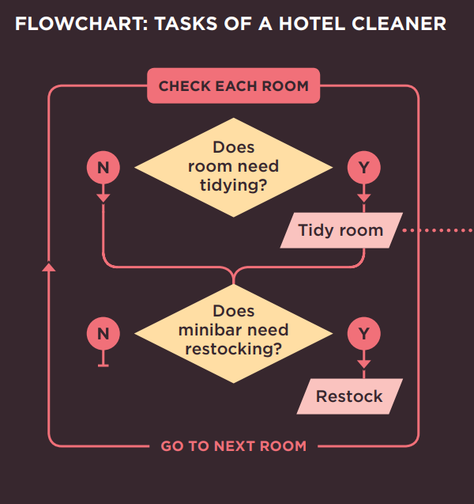


### RESUMEN

**A: ¿Qué es un script y cómo creo uno?**

- Un script es una serie de instrucciones que la computadora puede seguir para lograr un objetivo.
- Cada vez que el script se ejecuta, es posible que solo utilice un subconjunto de todas las instrucciones.
- Las computadoras abordan las tareas de una manera diferente a los humanos, por lo que tus instrucciones deben permitir que la computadora resuelva la tarea programáticamente.
- Para abordar la escritura de un script, divide tu objetivo en una serie de tareas y luego determina cada paso necesario para completar esa tarea (un diagrama de flujo puede ayudar).

## ¿CÓMO ENCAJAN LAS COMPUTADORAS CON EL MUNDO QUE LAS RODEA?

Aquí hay una maqueta de un hotel, junto con algunos árboles de juguete, personas de juguete y autos de juguete. Para un humano, está claro qué tipo de objeto del mundo real representa cada uno.

Una computadora no tiene un concepto predefinido de lo que es un hotel o un auto. No sabe para qué se usan. Tu laptop o teléfono no tendrá una marca favorita de auto, ni sabrá qué calificación de estrellas tiene tu hotel.

Entonces, ¿cómo usamos las computadoras para crear aplicaciones de reserva de hoteles o videojuegos donde los jugadores puedan correr carreras de autos? La respuesta es que los programadores crean un tipo de modelo muy diferente, especialmente para las computadoras.

Los programadores crean estos modelos utilizando datos. Eso no es tan extraño ni tan aterrador como suena, porque los datos son todo lo que la computadora necesita para seguir las instrucciones que le das y llevar a cabo sus tareas.

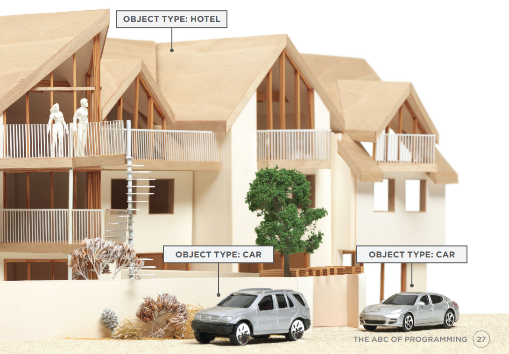

### OBJETOS y PROPIEDADES

Si no pudiera ver la imagen del hotel y los automóviles, los datos en los cuadros de información por sí solos le dirían mucho sobre esta escena.

#### OBJETOS (COSAS)

En la programación informática, cada cosa física del mundo puede representarse como un objeto. Aquí hay dos tipos diferentes de objetos: un hotel y un auto. Los programadores podrían decir que hay una instancia del objeto hotel y dos instancias del objeto auto.

Cada objeto puede tener lo suyo:
- **Propiedades**
- **Eventos**
- **Métodos**

Juntos crean un modelo funcional de ese objeto.

#### PROPIEDADES (CARACTERÍSTICAS)

Ambos autos comparten características comunes. De hecho, todos los autos tienen una marca, un color y un tamaño de motor. Incluso podrías determinar su velocidad actual. Los programadores llaman a estas características las propiedades de un objeto.

Cada propiedad tiene un nombre y un valor, y cada uno de estos pares nombre/valor te dice algo sobre cada instancia individual del objeto.

La propiedad más obvia de este hotel es su nombre. El valor de esa propiedad es Quay. Puedes saber la cantidad de habitaciones que tiene el hotel mirando el valor junto a la propiedad rooms.

#### OBJETO HOTEL
El objeto hotel utiliza nombres y valores de propiedades para informarte sobre este hotel en particular, como el nombre del hotel, su calificación, la cantidad de habitaciones que tiene y cuántas de estas están reservadas. También puedes saber si este hotel cuenta o no con ciertas instalaciones.

#### OBJETO CARRO
Ambos objetos carro comparten las mismas propiedades, pero cada uno tiene valores diferentes para esas propiedades. Te indican la marca del auto, a qué velocidad viaja actualmente cada uno, de qué color es y qué tipo de combustible requiere.

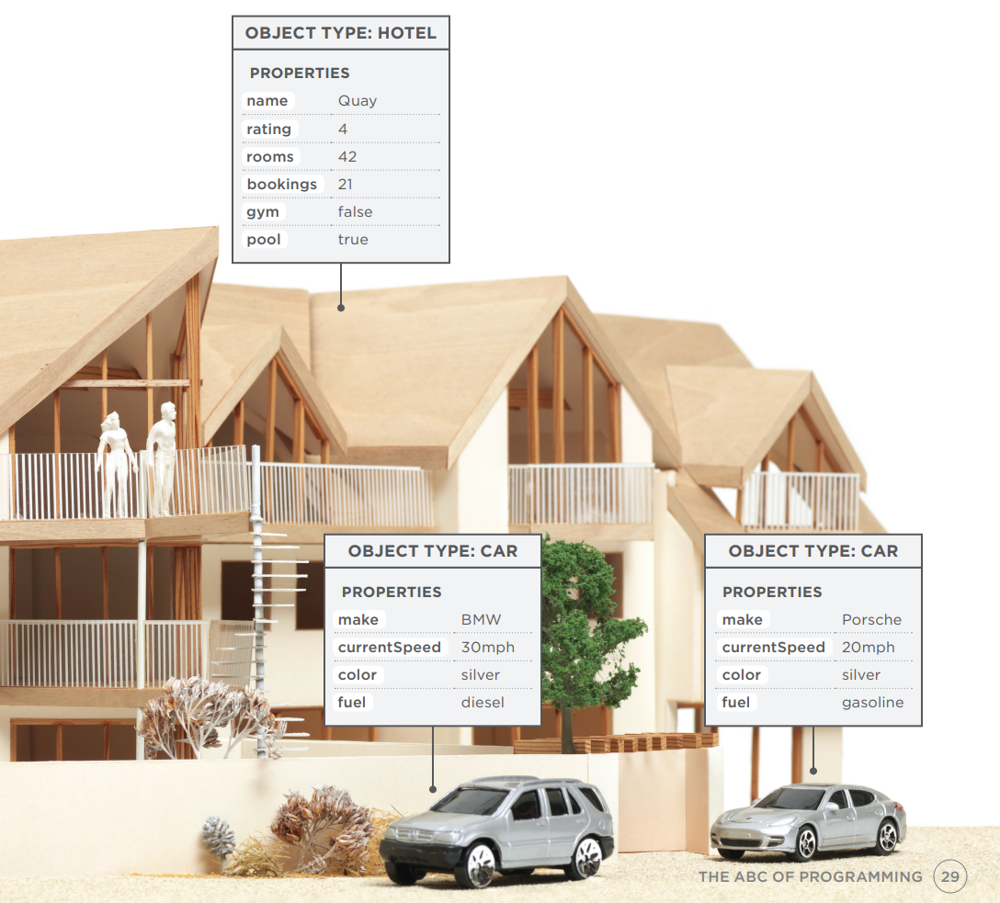


### EVENTOS
En el mundo real, las personas interactúan con los objetos. Estas interacciones pueden cambiar los valores de las propiedades de estos objetos.

#### ¿QUÉ ES UN EVENTO?
Hay formas comunes en las que las personas interactúan con cada tipo de objeto. Por ejemplo, en un auto, un conductor normalmente usa al menos dos pedales. El auto ha sido diseñado para responder de manera diferente cuando el conductor interactúa con cada uno de los diferentes pedales:

- El acelerador hace que el auto vaya más rápido
- El freno lo desacelera

De manera similar, los programas están diseñados para hacer diferentes cosas cuando los usuarios interactúan con la computadora de diferentes formas. Por ejemplo, hacer clic en un enlace de contacto en una página web podría mostrar un formulario de contacto, y escribir texto en un cuadro de búsqueda puede activar automáticamente la función de búsqueda.

Un evento es la forma que tiene la computadora de levantar la mano para decir: "¡Oye, esto acaba de suceder!"

#### ¿QUÉ HACE UN EVENTO?

Los programadores eligen a qué eventos responder. Cuando ocurre un evento específico, ese evento puede usarse para activar una sección específica del código.

Los scripts a menudo usan diferentes eventos para activar diferentes tipos de funcionalidad.

Por lo tanto, un script indicará a qué eventos el programador quiere responder y qué parte del script debe ejecutarse cuando ocurra cada uno de esos eventos.

#### OBJETO HOTEL

Un hotel regularmente recibe reservas de habitaciones. Cada vez que se reserva una habitación, se puede usar un evento llamado **book** para activar código que aumentará el valor de la propiedad **bookings**. Del mismo modo, un evento **cancel** puede activar código que disminuya el valor de la propiedad **bookings**.

#### OBJETOS CARRO

Un conductor acelerará y frenará durante cualquier viaje en auto. Un evento **accelerate** puede activar código para aumentar el valor de la propiedad **currentSpeed** y un evento **brake** puede activar código para disminuirlo. Aprenderás sobre el código que responde a los eventos y cambia estas propiedades en la siguiente página.

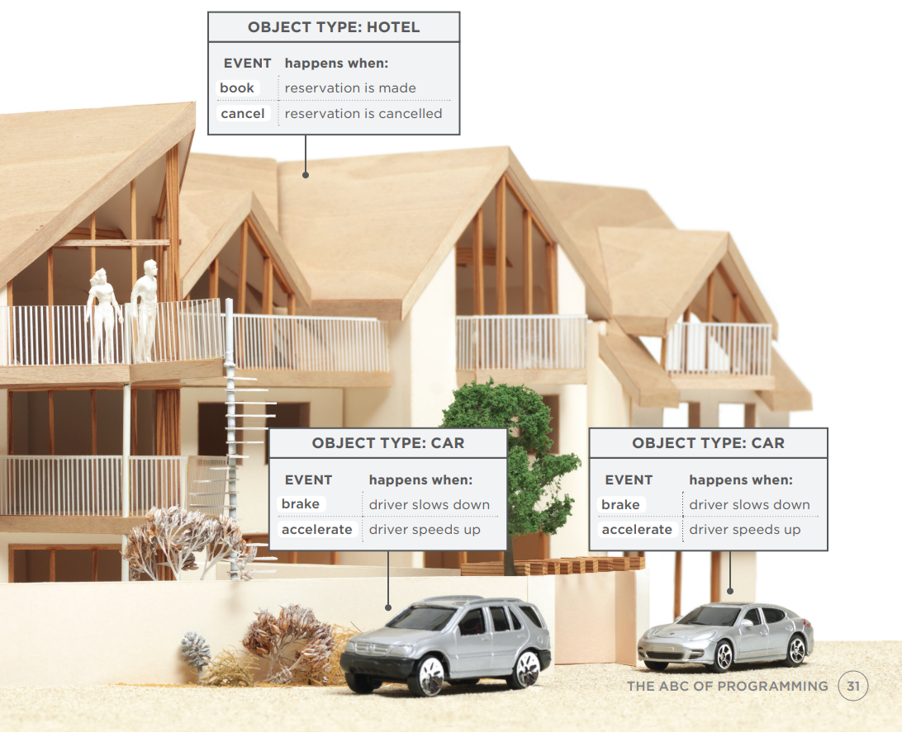

### METODOS

Los métodos representan cosas que las personas necesitan hacer con los objetos. Pueden recuperar o actualizar los valores de las propiedades de un objeto.

#### ¿QUÉ ES UN MÉTODO?

Los métodos típicamente representan cómo las personas (u otras cosas) interactúan con un objeto en el mundo real. Son como preguntas e instrucciones que:

- Te dicen algo sobre ese objeto (usando información almacenada en sus propiedades)
- Cambian el valor de una o más propiedades de ese objeto

#### ¿QUÉ HACE UN MÉTODO?
El código de un método puede contener muchas instrucciones que juntas representan una tarea. Cuando usas un método, no siempre necesitas saber cómo logra su tarea; solo necesitas saber cómo hacer la pregunta y cómo interpretar las respuestas que te dé.

#### OBJETO HOTEL
A los hoteles comúnmente se les preguntará si hay habitaciones libres. Para responder esta pregunta, se puede escribir un método que reste el número de reservas del número total de habitaciones. Los métodos también se pueden usar para aumentar y disminuir el valor de la propiedad **bookings** cuando se reservan o cancelan habitaciones.

#### OBJETOS CARRO
El valor de la propiedad **currentSpeed** necesita subir y bajar a medida que el conductor acelera y frena. El código para aumentar o disminuir el valor de la propiedad **currentSpeed** podría escribirse en un método, y ese método podría llamarse **changeSpeed()**.

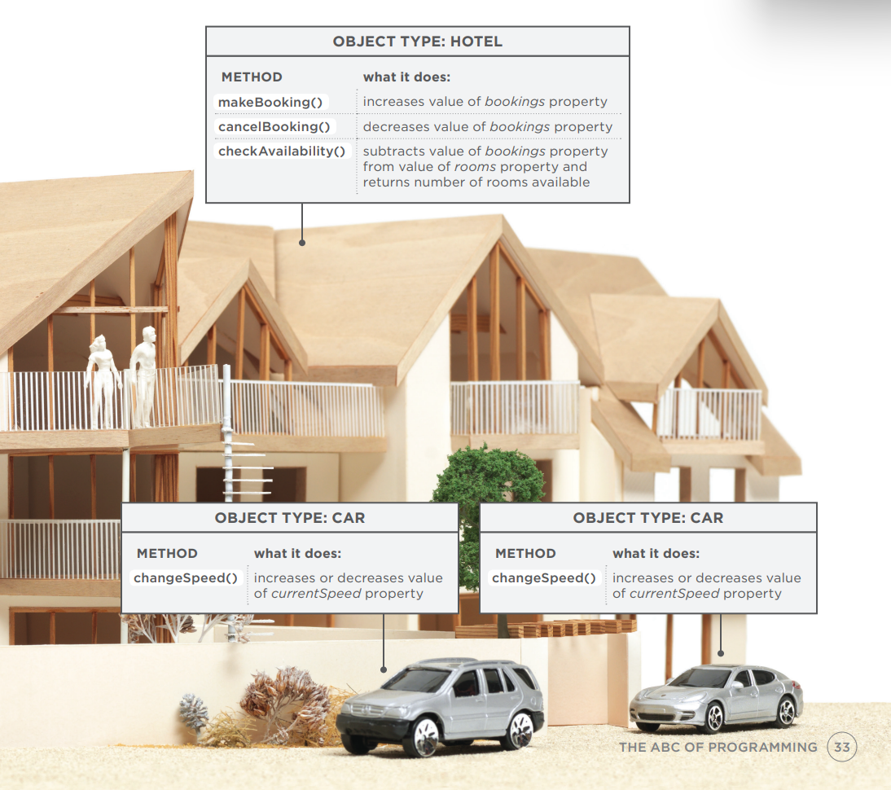

### PONIENDO TODO JUNTO
Las computadoras usan datos para crear modelos de cosas del mundo real. Los eventos, métodos y propiedades de un objeto se relacionan entre sí: los eventos pueden activar métodos, y los métodos pueden recuperar o actualizar las propiedades de un objeto.

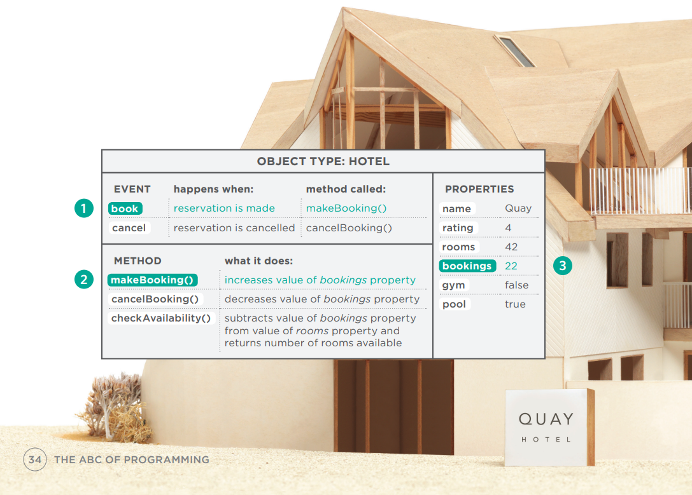

#### OBJETO HOTEL

1. Cuando se hace una reserva, el evento **book** se dispara.
2. El evento **book** activa el método **makeBooking()**, que aumenta el valor de la propiedad **bookings**.
3. El valor de la propiedad **bookings** se actualiza para reflejar cuántas habitaciones tiene disponibles el hotel.

#### OBJETOS CARRO

1. A medida que el conductor acelera, el evento **accelerate** se dispara.
2. El evento **accelerate** llama al método **changeSpeed()**, que a su vez aumenta el valor de la propiedad **currentSpeed**.
3. El valor de la propiedad **currentSpeed** refleja qué tan rápido viaja el auto.

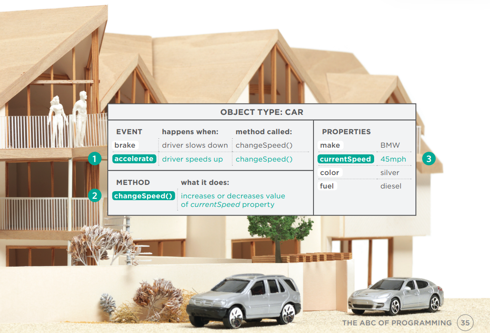

### LOS NAVEGADORES WEB SON PROGRAMAS CONSTRUIDOS CON OBJETOS

Has visto cómo los datos pueden usarse para crear un modelo de un hotel o un auto. Los navegadores web crean modelos similares de la página web que están mostrando y de la ventana del navegador en la que se muestra la página.

#### OBJETO WINDOW

En la página de la derecha puedes ver un modelo de una computadora con un navegador abierto en la pantalla. El navegador representa cada ventana o pestaña usando un objeto **window**. La propiedad **location** del objeto **window** te indicará la URL de la página actual.

#### OBJETO DOCUMENT

La página web actual cargada en cada ventana se modela usando un objeto **document**. La propiedad **title** del objeto **document** te dice lo que está entre la etiqueta de apertura `<title>` y la etiqueta de cierre `</title>` de esa página web, y la propiedad **lastModified** del objeto **document** te indica la fecha en que esta página se actualizó por última vez.

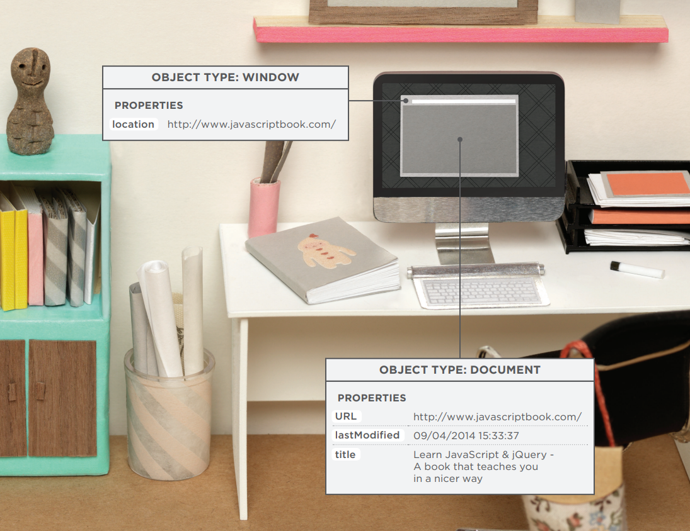

### EL OBJETO DOCUMENT REPRESENTA UNA PÁGINA HTML

Usando el objeto **document**, puedes acceder y cambiar el contenido que los usuarios ven en la página y responder a cómo interactúan con ella.

Al igual que otros objetos que representan cosas del mundo real, el objeto **document** tiene:

#### PROPIEDADES
Las propiedades describen características de la página web actual (como el título de la página).

#### MÉTODOS
Los métodos realizan tareas asociadas con el documento actualmente cargado en el navegador (como obtener información de un elemento específico o agregar nuevo contenido).

#### EVENTOS
Puedes responder a eventos, como un usuario haciendo clic o tocando un elemento.

Debido a que todos los principales navegadores web implementan el objeto **document** de la misma manera, las personas que crean los navegadores ya han:

- Implementado propiedades a las que puedes acceder para conocer la página actual en el navegador
- Escrito métodos que logran algunas tareas comunes que probablemente querrás hacer con una página HTML

Por lo tanto, aprenderás cómo trabajar con este objeto. De hecho, el objeto **document** es solo uno de un conjunto de objetos que todos los principales navegadores soportan. Cuando el navegador crea un modelo de una página web, no solo crea un objeto **document**, sino que también crea un nuevo objeto para cada elemento en la página. Juntos, estos objetos se describen en el Modelo de Objetos del Documento (DOM), que conocerás en el Capítulo 5.

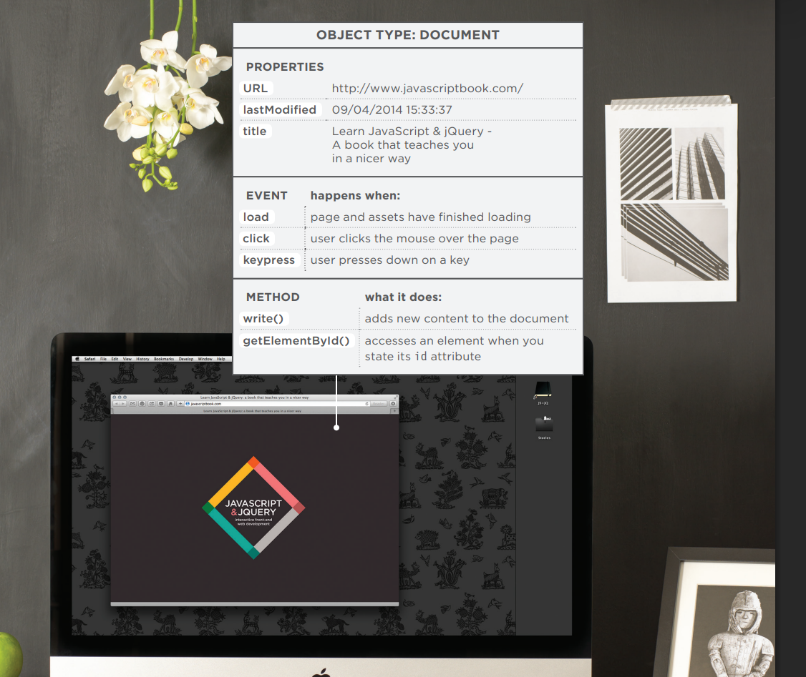

### CÓMO VE UN NAVEGADOR UNA PÁGINA WEB

Para entender cómo puedes cambiar el contenido de una página HTML usando JavaScript, necesitas saber cómo un navegador interpreta el código HTML y le aplica estilos.

#### 1: RECIBIR UNA PÁGINA COMO CÓDIGO HTML

Cada página en un sitio web puede verse como un documento separado. Por lo tanto, la web consta de muchos sitios, cada uno compuesto por uno o más documentos.

#### 2: CREAR UN MODELO DE LA PÁGINA Y ALMACENARLO EN MEMORIA

El modelo que se muestra en la página de la derecha es una representación de una página muy básica. Su estructura recuerda a un árbol genealógico. En la parte superior del modelo hay un objeto **document**, que representa el documento completo.

Debajo del objeto **document**, cada recuadro se llama **nodo**. Cada uno de estos nodos es otro objeto. Este ejemplo presenta tres tipos de nodos que representan elementos, texto dentro de los elementos y atributos.

#### 3: USAR UN MOTOR DE RENDERIZADO PARA MOSTRAR LA PÁGINA EN PANTALLA

Si no hay CSS, el motor de renderizado aplicará estilos predeterminados a los elementos HTML. Sin embargo, el código HTML de este ejemplo enlaza a una hoja de estilo CSS, por lo que el navegador solicita ese archivo y muestra la página en consecuencia.

Cuando el navegador recibe las reglas CSS, el motor de renderizado las procesa y aplica cada regla a sus elementos correspondientes. Así es como el navegador posiciona los elementos en el lugar correcto, con los colores, fuentes, etc. adecuados.

Todos los navegadores principales utilizan un intérprete de JavaScript para traducir tus instrucciones (en JavaScript) a instrucciones que la computadora pueda seguir.

Cuando usas JavaScript en el navegador, hay una parte del navegador que se llama intérprete (o motor de scripting).

El intérprete toma tus instrucciones (en JavaScript) y las traduce a instrucciones que el navegador puede usar para lograr las tareas que deseas que realice.

1. El navegador recibe una página HTML.
    ```html linenums="1"
    <!DOCTYPE html>
    <html>
    <head>
        <title>Constructive &amp; Co.</title>
        <link rel="stylesheet" href="css/c01.css" />
    </head>
    <body>
        <h1>Constructive &amp; Co.</h1>
        <p>For all orders and inquiries please call
        <em>555-3344</em></p>
    </body>
    </html>
    ```
2. Crea un modelo de la página y lo almacena en la memoria.

    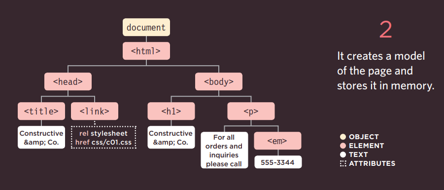

3. Muestra la página en pantalla mediante un motor de renderizado.

    

### RESUMEN

**B: ¿Cómo encajan las computadoras con el mundo que las rodea?**

- Las computadoras crean modelos del mundo utilizando datos.
- Los modelos usan objetos para representar cosas físicas. Los objetos pueden tener: **propiedades** que nos informan sobre el objeto; **métodos** que realizan tareas usando las propiedades de ese objeto; **eventos** que se activan cuando un usuario interactúa con la computadora.
- Los programadores pueden escribir código para decir "Cuando ocurra este evento, ejecuta ese código".
- Los navegadores web usan marcado HTML para crear un modelo de la página web. Cada elemento crea su propio **nodo** (que es un tipo de objeto).
- Para hacer páginas web interactivas, escribes código que utiliza el modelo del navegador de la página web.

## CÓMO ENCAJAN HTML, CSS Y JAVASCRIPT

> Antes de sumergirte en el lenguaje JavaScript, necesitas saber cómo encajará con el HTML y CSS en tus páginas web.

Los desarrolladores web generalmente hablan de tres lenguajes que se usan para crear páginas web: HTML, CSS y JavaScript.

Cuando sea posible, procura mantener los tres lenguajes en archivos separados, con la página HTML enlazando a los archivos CSS y JavaScript.

Cada lenguaje forma una capa separada con un propósito diferente. Cada capa, de izquierda a derecha, se construye sobre la anterior.

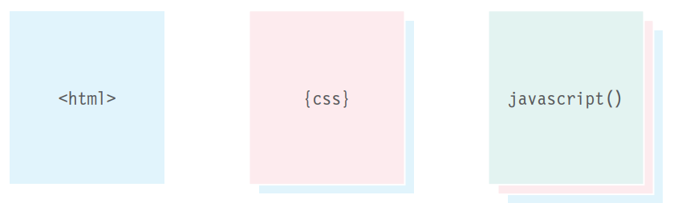

#### CAPA DE CONTENIDO — Archivos .html

Aquí es donde vive el contenido de la página. El HTML le da estructura a la página y añade semántica.

#### CAPA DE PRESENTACIÓN — Archivos .css

El CSS mejora la página HTML con reglas que indican cómo se presenta el contenido HTML (fondos, bordes, dimensiones de cajas, colores, fuentes, etc.).

#### CAPA DE COMPORTAMIENTO — Archivos .js

Aquí es donde podemos cambiar cómo se comporta la página, añadiendo interactividad. Procuraremos mantener la mayor cantidad posible de nuestro JavaScript en archivos separados.

### MEJORA PROGRESIVA

Estas tres capas forman la base de un enfoque popular para construir páginas web llamado **mejora progresiva**.

A medida que más y más dispositivos habilitados para web llegan al mercado, este concepto se está adoptando cada vez más. No solo los tamaños de pantalla son variados, sino que las velocidades de conexión y las capacidades de cada dispositivo también pueden diferir.

Además, algunas personas navegan con JavaScript desactivado, por lo que debes asegurarte de que la página siga funcionando para ellas.

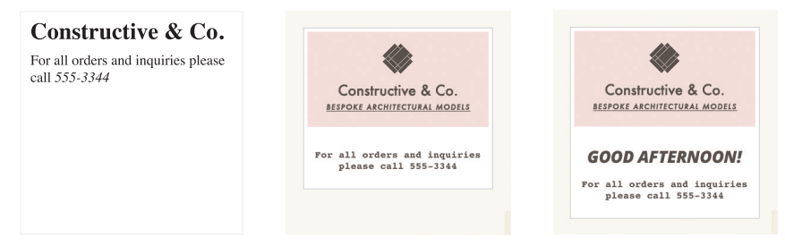

#### SOLO HTML

Comenzar con la capa HTML te permite enfocarte en lo más importante de tu sitio: su contenido. Al ser HTML plano, esta capa debería funcionar en todo tipo de dispositivos, ser accesible para todos los usuarios y cargar bastante rápido en conexiones lentas.

#### HTML+CSS

Agregar las reglas CSS en un archivo separado mantiene las reglas sobre cómo se ve la página alejadas del contenido en sí. Puedes usar la misma hoja de estilo en todo tu sitio, haciendo que tus sitios se carguen más rápido y sean más fáciles de mantener. O puedes usar diferentes hojas de estilo con el mismo contenido para crear diferentes vistas de los mismos datos.

#### HTML+CSS+JAVASCRIPT

El JavaScript se agrega al final y mejora la usabilidad de la página o la experiencia de interactuar con el sitio. Mantenerlo separado significa que la página sigue funcionando si el usuario no puede cargar o ejecutar el JavaScript. También puedes reutilizar el código en varias páginas (haciendo que el sitio se cargue más rápido y sea más fácil de mantener).

### CREANDO UN JAVASCRIPT BÁSICO

JavaScript se escribe en texto plano, al igual que HTML y CSS, por lo que no necesitas ninguna herramienta nueva para escribir un script. Este ejemplo agrega un saludo en una página HTML. El saludo cambia según la hora del día.

```js linenums="1"
var today = new Date();
var hourNow = today.getHours();
var greeting;
if (hourNow > 18) {
    greeting = 'Good evening!';
} else if (hourNow > 12) {
    greeting = 'Good afternoon!';
} else if (hourNow > 0) {
    greeting = 'Good morning!';
} else {
    greeting = 'Welcome!';
}
document.write('<h3>' + greeting + '</h3>');
```

1. Crea una carpeta para poner el ejemplo llamada **c01**, luego abre tu editor de código favorito e ingresa el texto de la derecha. 
    
    Un archivo JavaScript es solo un archivo de texto (como lo son los archivos HTML y CSS) pero tiene una extensión **.js**, así que guarda este archivo con el nombre **add-content.js**.

    No te preocupes todavía por lo que significa el código, por ahora nos enfocaremos en cómo se crea el script y cómo encaja con una página HTML.

2. Obtén el CSS y las imágenes de este ejemplo desde el sitio web que acompaña al libro: **www.javascriptbook.com**
  
    Para mantener los archivos organizados, de la misma manera que los archivos CSS suelen estar en una carpeta llamada **styles** o **css**, tus archivos JavaScript pueden estar en una carpeta llamada **scripts**, **javascript** o **js**. En este caso, guarda tu archivo en una carpeta llamada **js**.


### VINCULANDO UN ARCHIVO JAVASCRIPT DESDE UNA PÁGINA HTML

Cuando quieras usar JavaScript con una página web, usas el elemento HTML `<script>` para indicarle al navegador que se encuentra con un script. Su atributo **src** le dice a las personas dónde está almacenado el archivo JavaScript.

3. En tu editor de código, ingresa el HTML que se muestra a la izquierda. Guarda este archivo con el nombre **add-content.html**.

    El elemento HTML `<script>` se usa para cargar el archivo JavaScript en la página. Tiene un atributo llamado **src**, cuyo valor es la ruta al script que creaste. Esto le dice al navegador que busque y cargue el archivo script (similar al atributo **src** en una etiqueta ``).

