# BASIC JAVASCRIPT INSTRUCCIONS

En este capítulo, comenzarás a aprender a leer y escribir JavaScript. También aprenderás cómo darle instrucciones a un navegador web para que siga lo que deseas.

### EL LENGUAJE: SINTAXIS Y GRAMÁTICA

Como cualquier nuevo idioma, hay nuevas palabras que aprender (el vocabulario) y reglas sobre cómo se pueden combinar (la gramática y sintaxis del lenguaje).

### DANDO INSTRUCCIONES PARA QUE UN NAVEGADOR LAS SIGA

Los navegadores web (y las computadoras en general) abordan las tareas de una manera muy diferente a como lo haría un humano. Tus instrucciones deben reflejar cómo las computadoras hacen las cosas.

Comenzaremos con algunos de los bloques de construcción clave del lenguaje y veremos cómo se pueden usar para escribir scripts muy básicos (que consisten en unos pocos pasos simples) antes de pasar a ver conceptos más complejos en capítulos posteriores.

### SENTENCIAS (STATEMENTS)

!!! quote 

    Un script es una serie de instrucciones que una computadora puede seguir una por una. Cada instrucción o paso individual se conoce como **sentencia** (statement). Las sentencias deben terminar con un punto y coma.

Veremos lo que hace el código de la derecha en breve, pero por el momento observa que:

- Cada una de las líneas de código en verde es una sentencia.
- Las llaves rosadas indican el inicio y el final de un bloque de código. (Cada bloque de código podría contener muchas más sentencias).
- El código en púrpura determina qué código debería ejecutarse (como verás en la pág. 149).

### JAVASCRIPT DISTINGUE ENTRE MAYÚSCULAS Y MINÚSCULAS

JavaScript distingue entre mayúsculas y minúsculas, por lo que **hourNow** significa algo diferente que **HourNow** o **HOURNOW**.

```js linenums="1"
var today = new Date();
var hourNow = today.getHours();
var greeting;
if (hourNow > 18) {
    greeting = 'Good evening';
} else if (hourNow > 12) {
    greeting = 'Good afternoon';
} else if (hourNow > 0) {
    greeting = 'Good morning';
} else {
    greeting = 'Welcome';
}
document.write(greeting);
```

#### COMENTARIOS DE MÚLTIPLES LÍNEAS

Para escribir un comentario que abarque más de una línea, se usa un comentario de múltiples líneas, comenzando con los caracteres `/*` y terminando con los caracteres `*/`. Cualquier cosa entre estos caracteres no es procesada por el intérprete de JavaScript.

Los comentarios de múltiples líneas se usan a menudo para descripciones de cómo funciona el script, o para evitar que una sección del script se ejecute al probarlo.

#### COMENTARIOS DE UNA SOLA LÍNEA

En un comentario de una sola línea, cualquier cosa que siga a los dos caracteres de barra diagonal `//` en esa línea no será procesada por el intérprete de JavaScript. Los comentarios de una sola línea se usan a menudo para descripciones breves de lo que hace el código.

El buen uso de los comentarios te ayudará si vuelves a tu código después de varios días o meses. También ayudan a aquellos que son nuevos en tu código.

### ¿QUÉ ES UNA VARIABLE?

!!! quote 
    Un script necesita almacenar temporalmente los bits de información que requiere para hacer su trabajo. Puede almacenar estos datos en **variables**.

Cuando escribes JavaScript, tienes que decirle al intérprete cada paso individual que deseas que realice. Esto a veces implica más detalle del que podrías esperar.

Piensa en calcular el área de una pared; en matemáticas, el área de un rectángulo se obtiene multiplicando dos números:

ancho × alto = área

Puede que puedas hacer cálculos como este mentalmente, pero al escribir un script para hacer este cálculo, necesitas darle a la computadora instrucciones muy detalladas. Podrías decirle que realice los siguientes cuatro pasos en orden:

1. Recordar el valor del ancho
2. Recordar el valor del alto
3. Multiplicar ancho por alto para obtener el área
4. Devolver el resultado al usuario

En este caso, usarías variables para "recordar" los valores del ancho y del alto. (Esto también ilustra cómo un script contiene instrucciones muy explícitas sobre exactamente lo que quieres que haga la computadora).

Puedes comparar las variables con la memoria a corto plazo, porque una vez que abandonas la página, el navegador olvidará cualquier información que contenga.

Una variable es un buen nombre para este concepto porque los datos almacenados en una variable pueden cambiar (o variar) cada vez que se ejecuta un script.

No importa cuáles sean las dimensiones de una pared individual, sabes que puedes encontrar su área multiplicando el ancho de esa pared por su altura. De manera similar, los scripts a menudo necesitan lograr el mismo objetivo incluso cuando se ejecutan con diferentes datos, por lo que las variables se pueden usar para representar valores en tus scripts que probablemente cambien. Se dice que el resultado se calcula o computa usando los datos almacenados en las variables.

El uso de variables para representar números u otros tipos de datos es muy similar al concepto de álgebra (donde se usan letras para representar números). Sin embargo, hay una diferencia clave. El signo igual hace algo muy diferente en programación (como verás en las siguientes dos páginas).

### VARIABLES: CÓMO DECLARARLAS

Antes de poder usar una variable, necesitas anunciar que quieres usarla. Esto implica crear la variable y darle un nombre. Los programadores dicen que **declaras** la variable.

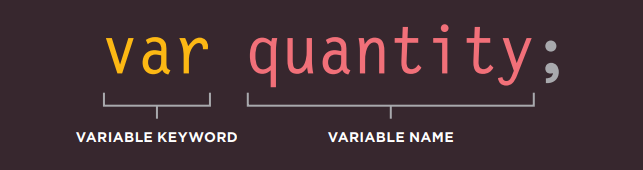

`var` es un ejemplo de lo que los programadores llaman una **palabra clave** (keyword). El intérprete de JavaScript sabe que esta palabra clave se usa para crear una variable.

Para usar la variable, debes darle un nombre. (Esto a veces se llama **identificador**). En este caso, la variable se llama **quantity**.

Si el nombre de una variable tiene más de una palabra, generalmente se escribe en **camelCase**. Esto significa que la primera palabra está toda en minúsculas y las palabras siguientes tienen su primera letra en mayúscula.

### VARIABLES: CÓMO ASIGNARLES UN VALOR

Una vez que has creado una variable, puedes indicarle qué información te gustaría que almacene para ti. Los programadores dicen que **asignas un valor** a la variable.

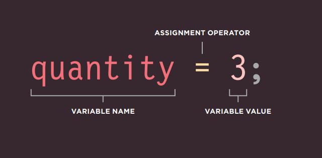

Ahora puedes usar la variable por su nombre. Aquí establecemos un valor para la variable llamada **quantity**. Cuando sea posible, el nombre de una variable debe describir el tipo de datos que contiene la variable.

El signo igual (`=`) es un **operador de asignación**. Indica que vas a asignar un valor a la variable. También se usa para actualizar el valor dado a una variable (ver pág. 68).

Hasta que hayas asignado un valor a una variable, los programadores dicen que el valor es **undefined** (indefinido).

El lugar donde se declara una variable puede afectar si el resto del script puede usarla. Los programadores llaman a esto el **ámbito** (scope) de una variable y se cubre en la pág. 98.

### TIPOS DE DATOS

JavaScript distingue entre números, cadenas de texto (strings) y valores verdaderos o falsos conocidos como **Booleanos**.

#### TIPO DE DATO NUMÉRICO

El tipo de dato numérico maneja números. 

Para tareas que implican contar o calcular sumas, usarás números del 0 al 9. Por ejemplo, cinco mil doscientos setenta y dos se escribiría **5272** (nota que no hay coma entre los miles y las centenas). También puedes tener números negativos (como **-23678**) y decimales (tres cuartos se escribe como **0.75**).

Los números no solo se usan para cosas como calculadoras; también se usan para tareas como determinar el tamaño de la pantalla, mover la posición de un elemento en una página o establecer la cantidad de tiempo que un elemento debe tomar para aparecer gradualmente.

#### TIPO DE DATO CADENA (STRING)

El tipo de dato cadena consiste en letras y otros caracteres. Observa cómo el tipo de dato cadena está encerrado entre un par de comillas. Pueden ser comillas simples o dobles, pero la comilla de apertura debe coincidir con la de cierre.

Las cadenas se pueden usar al trabajar con cualquier tipo de texto. Se usan frecuentemente para agregar nuevo contenido a una página y pueden contener marcado HTML.

#### TIPO DE DATO BOOLEANO

El tipo de dato booleano puede tener uno de dos valores: **true** (verdadero) o **false** (falso).

Puede parecer un poco abstracto al principio, pero el tipo de dato booleano es realmente muy útil. Puedes pensarlo como un interruptor de luz: está encendido o apagado.

Como verás en el Capítulo 4, los booleanos son útiles para determinar qué parte de un script debe ejecutarse.

!!! quote 
    
    Además de estos tres tipos de datos, JavaScript también tiene otros (arrays, objetos, undefined y null) que conocerás en capítulos posteriores.
    
    A diferencia de algunos otros lenguajes de programación, al declarar una variable en JavaScript, no necesitas especificar qué tipo de datos contendrá.

### USANDO UNA VARIABLE PARA ALMACENAR UN NÚMERO

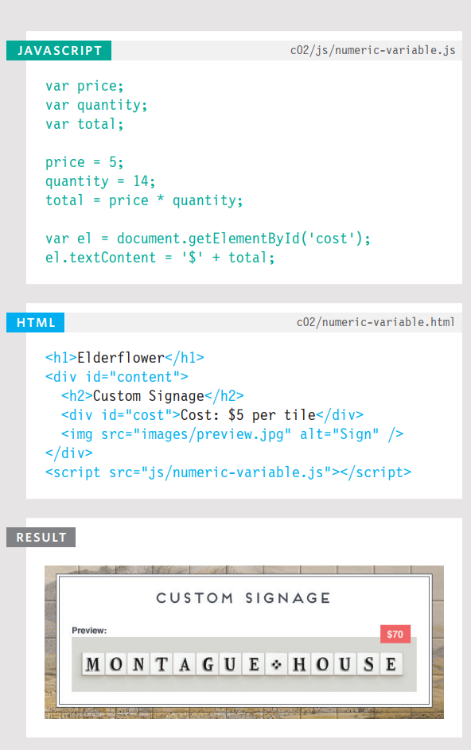 

Aquí se crean tres variables y se les asignan valores:

- **price** contiene el precio de un azulejo individual
- **quantity** contiene la cantidad de azulejos que un cliente quiere
- **total** contiene el costo total de los azulejos

Observa que los números no están escritos entre comillas.

Una vez que se ha asignado un valor a una variable, puedes usar el nombre de la variable para representar ese valor (similar a lo que habrás hecho en álgebra). Aquí, el costo total se calcula multiplicando el precio de un solo azulejo por la cantidad de azulejos que el cliente quiere.

El resultado se escribe luego en la página en las dos últimas líneas. Verás esta técnica en más detalle en las págs. 194 y 216.

La primera de estas dos líneas encuentra el elemento cuyo atributo **id** tiene un valor de **cost**, y la última línea reemplaza el contenido de ese elemento con nuevo contenido.

!!! note 

    Hay muchas formas de escribir contenido en una página, y varios lugares donde puedes colocar tu script. Las ventajas y desventajas de cada técnica se discuten en la pág. 226. Esta técnica no funcionará en IE8.


### USANDO UNA VARIABLE PARA ALMACENAR UNA CADENA

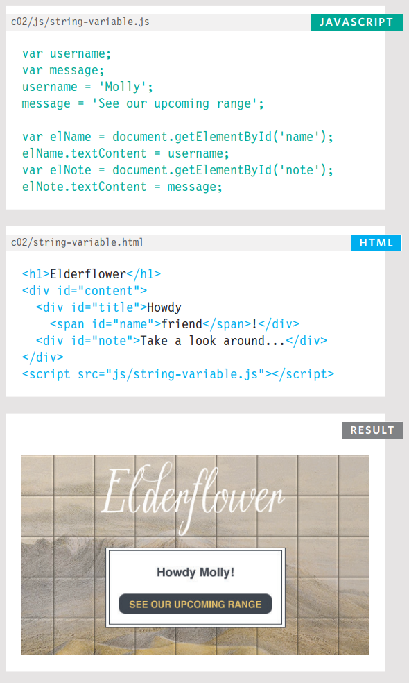

Por ahora, concéntrate en las primeras cuatro líneas de JavaScript. Se declaran dos variables (**username** y **message**), y se usan para almacenar cadenas (el nombre del usuario y un mensaje para ese usuario).

El código para actualizar la página (mostrado en las últimas cuatro líneas) se discute completamente en el Capítulo 5. Este código selecciona dos elementos usando los valores de sus atributos **id**. El texto en esos elementos se actualiza usando los valores almacenados en estas variables.

Observa cómo la cadena está colocada entre comillas. Las comillas pueden ser simples o dobles, pero deben coincidir. Si empiezas con una comilla simple, debes terminar con una comilla simple, y si empiezas con una comilla doble, debes terminar con una comilla doble.

```sh
[✓] "hellow"  [X] "hellow'
[✓] 'hellow'  [X] 'hellow"
```
Las comillas deben ser rectas (no curvas). 

```sh
[✓] " "  
[✓] ' '  
```
Las cadenas siempre deben escribirse en una sola línea.
```sh
[✓] "See our upcoming range "  
[X] 'See our 
       upcoming range '  
```

### USANDO COMILLAS DENTRO DE UNA CADENA

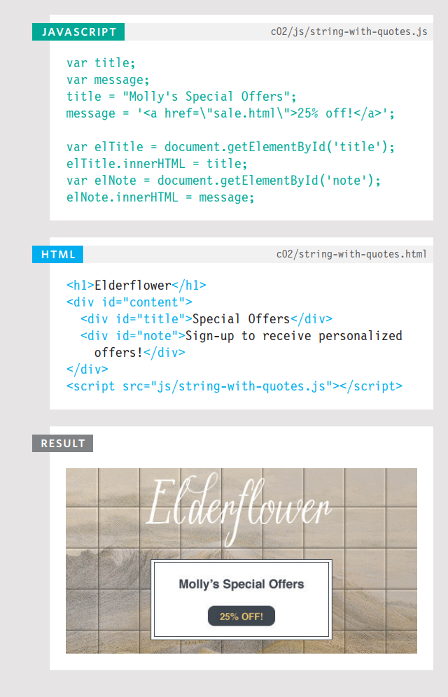

A veces querrás usar una comilla doble o simple dentro de una cadena.

Debido a que las cadenas pueden vivir entre comillas simples o dobles, si solo quieres usar comillas dobles en la cadena, podrías rodea toda la cadena con comillas simples. Si solo quieres usar comillas simples en la cadena, podrías rodear la cadena con comillas dobles.

También puedes usar una técnica llamada **escapar** los caracteres de comilla. Esto se hace usando una barra invertida (backslash) antes de cualquier tipo de comilla que aparezca dentro de una cadena.

La barra invertida le indica al intérprete que el siguiente carácter es parte de la cadena, y no el final de la misma.

> Las técnicas para agregar contenido a una página se cubren en el Capítulo 5. Este ejemplo usa una propiedad llamada **innerHTML** para agregar HTML a la página. En ciertos casos, esta propiedad puede presentar un riesgo de seguridad (discutido en las págs. 228–231).

### USANDO UNA VARIABLE PARA ALMACENAR UN BOOLEANO

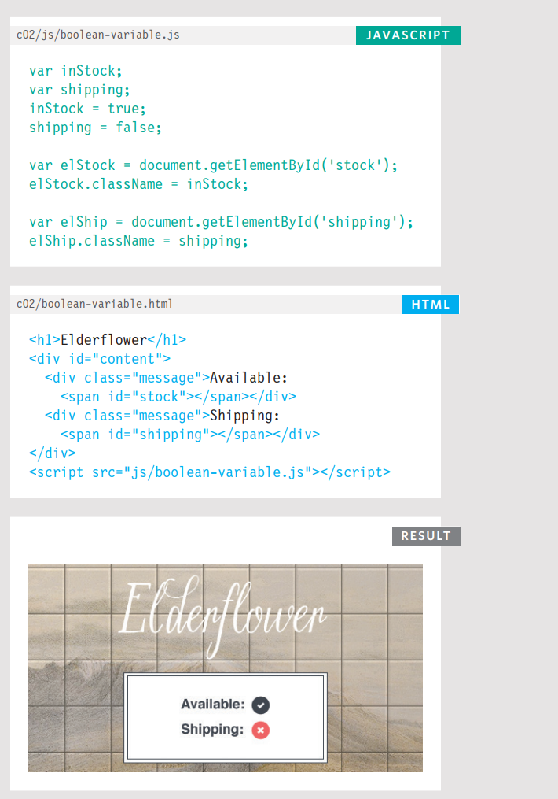

Una variable booleana solo puede tener un valor de **true** o **false**, pero este tipo de dato es muy útil.

En el ejemplo de la derecha, los valores **true** o **false** se usan en los atributos **class** de elementos HTML. Estos valores activan diferentes reglas CSS: **true** muestra una marca, **false** muestra una cruz. (Aprenderás cómo se establece el atributo **class** en el Capítulo 5).

Es raro que quieras escribir las palabras **true** o **false** en la página para que el usuario las lea, pero este tipo de dato tiene dos usos muy populares:

1. Los booleanos se usan cuando el valor solo puede ser verdadero/falso. También puedes pensar en estos valores como encendido/apagado o 0/1: **true** equivale a encendido o 1, **false** equivale a apagado o 0.

2. Los booleanos se usan cuando tu código puede tomar más de un camino. Recuerda, diferentes códigos pueden ejecutarse en diferentes circunstancias (como se muestra en los diagramas de flujo a lo largo del libro).

### ABREVIATURA PARA CREAR VARIABLES

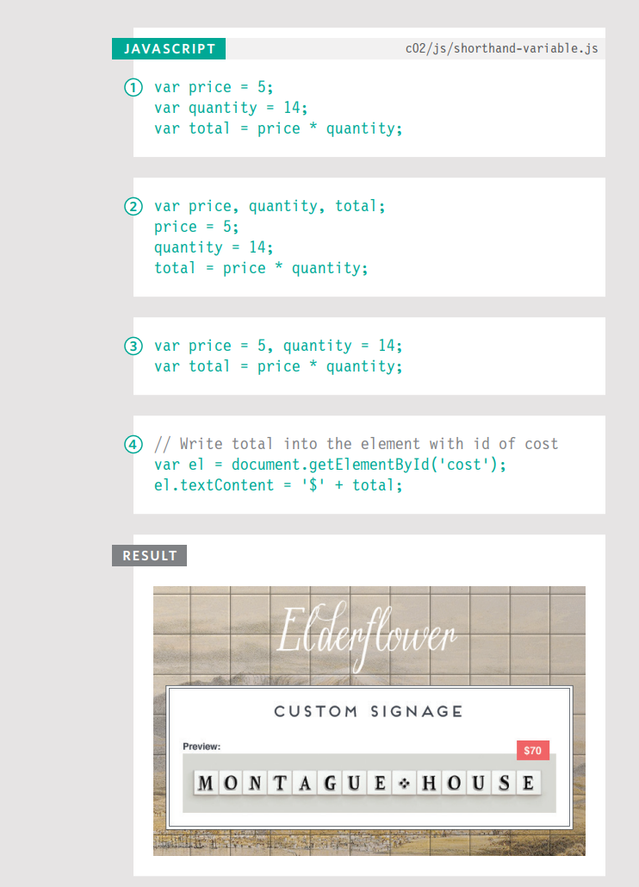

Los programadores a veces usan abreviaturas para crear variables. Aquí hay tres variaciones de cómo declarar variables y asignarles valores:

1. Las variables se declaran y se les asignan valores en la misma sentencia.
2. Tres variables se declaran en la misma línea, luego se asignan valores a cada una.
3. Dos variables se declaran y se les asignan valores en la misma línea. Luego se declara una y se le asigna un valor en la línea siguiente. (El tercer ejemplo muestra dos números, pero puedes declarar variables que contengan diferentes tipos de datos en la misma línea, por ejemplo, una cadena y un número).
4. Aquí, se usa una variable para contener una referencia a un elemento en la página HTML. Esto te permite trabajar directamente con el elemento almacenado en esa variable. (Ver más sobre esto en la pág. 190).

Aunque la abreviatura puede ahorrarte un poco de escritura, puede hacer que tu código sea un poco más difícil de seguir. Por lo tanto, cuando estés comenzando, te resultará más fácil distribuir tu código en algunas líneas más para que sea más fácil de leer y entender.

### CAMBIANDO EL VALOR DE UNA VARIABLE

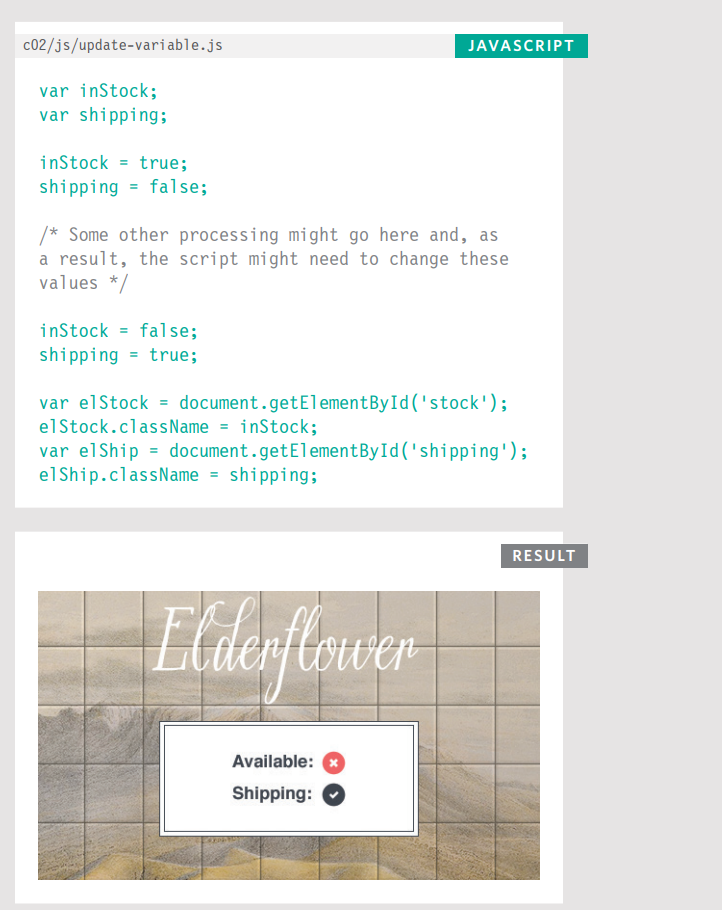

Una vez que has asignado un valor a una variable, puedes cambiar lo que está almacenado en la variable más adelante en el mismo script.

Una vez que la variable ha sido creada, no necesitas usar la palabra clave **var** para asignarle un nuevo valor. Solo usas el nombre de la variable, el signo igual (también conocido como operador de asignación) y el nuevo valor para ese atributo.

Por ejemplo, el valor de una variable **shipping** podría comenzar siendo **false**. Luego, algo en el código podría cambiar la capacidad de enviar el artículo y, por lo tanto, podrías cambiar el valor a **true**.

En este ejemplo de código, los valores de las dos variables se intercambian: una pasa de **true** a **false** y viceversa.

### REGLAS PARA NOMBRAR VARIABLES

Aquí hay seis reglas que siempre debes seguir al darle un nombre a una variable:

1. El nombre debe comenzar con una letra, un signo de dólar (`$`) o un guión bajo (`_`). No debe comenzar con un número.

2. El nombre puede contener letras, números, signo de dólar (`$`) o guión bajo (`_`). Ten en cuenta que no debes usar un guión (`-`) ni un punto (`.`) en un nombre de variable.

3. No puedes usar **palabras clave** (keywords) ni **palabras reservadas** (reserved words). Las palabras clave son palabras especiales que le indican al intérprete que haga algo. Por ejemplo, `var` es una palabra clave usada para declarar una variable. Las palabras reservadas son aquellas que podrían usarse en una versión futura de JavaScript.

4. Todas las variables distinguen entre mayúsculas y minúsculas, por lo que **score** y **Score** serían nombres de variable diferentes, pero es una mala práctica crear dos variables que tengan el mismo nombre usando diferentes mayúsculas.

5. Usa un nombre que describa el tipo de información que almacena la variable. Por ejemplo, **firstName** podría usarse para almacenar el nombre de pila de una persona, **lastName** para su apellido y **age** para su edad.

6. Si el nombre de tu variable se compone de más de una palabra, usa una letra mayúscula para la primera letra de cada palabra después de la primera palabra. Por ejemplo, **firstName** en lugar de **firstname** (esto se llama **camelCase**). También puedes usar un guión bajo entre cada palabra (no puedes usar un guión).

### ARREGLOS (ARRAYS)

!!! quote 

    Un array es un tipo especial de variable. No solo almacena un valor; almacena una lista de valores.

Deberías considerar usar un array cada vez que trabajes con una lista o un conjunto de valores que estén relacionados entre sí.

Los arrays son especialmente útiles cuando no sabes cuántos elementos contendrá una lista, porque al crear el array no necesitas especificar cuántos valores va a contener.

Si no sabes cuántos elementos tendrá una lista, en lugar de crear suficientes variables para una lista larga (cuando podrías usar solo un pequeño porcentaje de ellas), usar un array se considera una mejor solución.

Por ejemplo, un array puede ser adecuado para almacenar los artículos individuales de una lista de compras porque es una lista de elementos relacionados. Además, cada vez que escribes una nueva lista de compras, la cantidad de artículos puede ser diferente.

> Como verás en la página siguiente, los valores en un array se separan por comas. En el Capítulo 12, verás que los arrays pueden ser muy útiles al representar datos complejos.

### CREANDO UN ARRAY

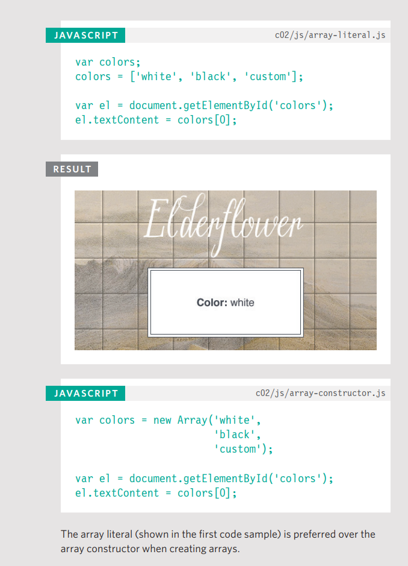

Crear un array y darle un nombre es igual que cualquier otra variable (usando la palabra clave **var** seguida del nombre del array).

Los valores se asignan al array dentro de un par de corchetes, y cada valor se separa por una coma. Los valores en el array no necesitan ser del mismo tipo de dato, por lo que puedes almacenar una cadena, un número y un booleano en el mismo array.

Esta técnica para crear un array se conoce como **array literal**. Generalmente es el método preferido para crear un array.

También puedes escribir cada valor en una línea separada:

```js linenums="1"
colors = ['white', 'black', 'custom'];
```

Arriba, puedes ver un array creado usando una técnica diferente llamada **array constructor**. Esta usa la palabra clave **new** seguida de `Array()`. Los valores se especifican entre paréntesis (no corchetes), y cada valor se separa por una coma.

### VALORES EN ARRAYS

Los valores en un array se acceden como si estuvieran en una lista numerada. Es importante saber que la numeración de esta lista comienza en cero (no en uno).

#### NUMERANDO ELEMENTOS EN UN ARRAY

Cada elemento en un array recibe automáticamente un número llamado **índice** (index). Este se puede usar para acceder a elementos específicos en el array. Considera el siguiente array que contiene tres colores:

```js linenums="1"
var colors;
colors = ['white', 'black', 'custom'];
```

De manera confusa, los valores del índice comienzan en 0 (no en 1), por lo que la siguiente tabla muestra los elementos del array y sus valores de índice correspondientes:

| INDEX | VALUE    |
|:------:|-----------|
| 0     | 'white'  |
| 1     | 'black'  |
| 2     | 'custom' |

#### ACCEDIENDO A ELEMENTOS EN UN ARRAY

Para recuperar el tercer elemento de la lista, se especifica el nombre del array junto con el número de índice entre corchetes.

Aquí puedes ver una variable llamada **itemThree** que se declara. Su valor se establece como el tercer color del array **colors**.

```js linenums="1"
var itemThree;
itemThree = colors[2];
```

#### NÚMERO DE ELEMENTOS EN UN ARRAY

Cada array tiene una propiedad llamada **length**, que contiene la cantidad de elementos en el array.

Abajo puedes ver que se declara una variable llamada **numColors**. Su valor se establece como el número de elementos en el array. El nombre del array va seguido de un punto y luego la palabra clave **length**.

```js linenums="1"
var numColors;
numColors = colors.length;
```

> A lo largo del libro (especialmente en el Capítulo 12), conocerás más características de los arrays, que son una característica muy flexible y poderosa de JavaScript.

### ACCEDIENDO Y CAMBIANDO VALORES EN UN ARRAY

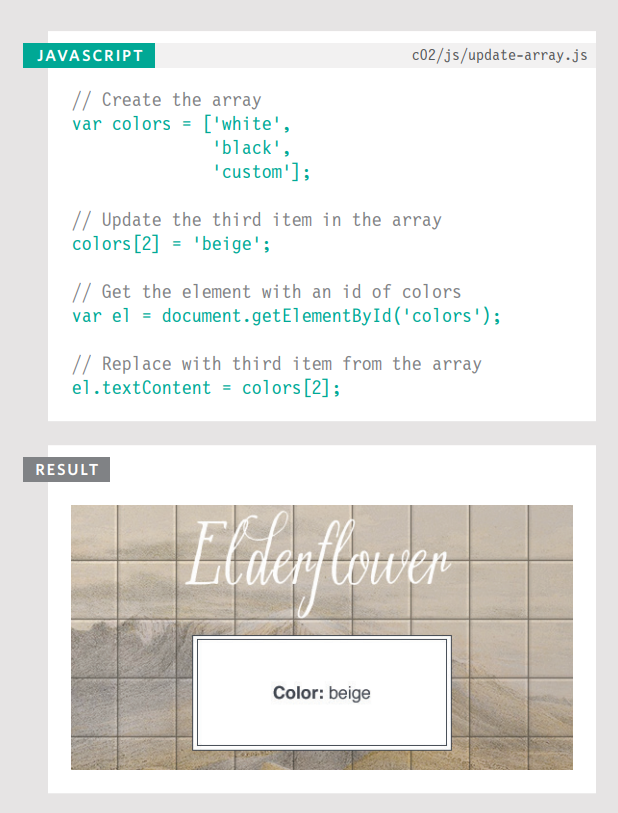

Las primeras líneas de código a la izquierda crean un array que contiene una lista de tres colores. (Los valores se pueden agregar en la misma línea o en líneas separadas como se muestra aquí).

Habiendo creado el array, el tercer elemento de la lista se cambia de **'custom'** a **'beige'**.

Para acceder a un valor de un array, después del nombre del array especificas el número de índice para ese valor entre corchetes.

Puedes cambiar el valor de un elemento en un array seleccionándolo y asignándole un nuevo valor como lo harías con cualquier otra variable (usando el signo igual y el nuevo valor para ese elemento).

En las dos últimas sentencias, el tercer elemento recién actualizado del array se agrega a la página.

Si quisieras escribir todos los elementos de un array, usarías un bucle (loop), que conocerás en la pág. 170.

### EXPRESIONES (EXPRESSIONS)

Una expresión evalúa (resulta en) un solo valor. En términos generales, hay dos tipos de expresiones.

1. **EXPRESIONES QUE ASIGNAN UN VALOR A UNA VARIABLE**

Para que una variable sea útil, necesita tener un valor. Como has visto, esto se hace usando el operador de asignación (el signo igual).

```js linenums="1"
var color = 'beige';
```

El valor de **color** ahora es **beige**. Cuando declaras una variable por primera vez usando la palabra clave **var**, se le da un valor especial de **undefined**. Esto cambiará cuando le asignes un valor.

Técnicamente, **undefined** es un tipo de dato como un número, una cadena o un booleano.

2. **EXPRESIONES QUE USAN DOS O MÁS VALORES PARA DEVOLVER UN SOLO VALOR**

Puedes realizar operaciones sobre cualquier cantidad de valores individuales para determinar un solo valor. Por ejemplo:

```js linenums="1"
var area = 3 * 2;
```

El valor de **area** ahora es **6**. Aquí la expresión `3 * 2` evalúa a 6. Este ejemplo también usa el operador de asignación, por lo que el resultado de la expresión `3 * 2` se almacena en la variable llamada **area**.

Otro ejemplo donde una expresión usa dos valores para producir un solo valor sería cuando dos cadenas se unen para crear una sola cadena.

### OPERADORES (OPERATORS)

!!! quote 

    Las expresiones dependen de cosas llamadas **operadores**; permiten a los programadores crear un solo valor a partir de uno o más valores.

---
Cubiertos en este capítulo:

**OPERADORES DE ASIGNACIÓN**

Asignan un valor a una variable
```js linenums="1"
color = 'beige';
```
El valor de **color** ahora es **beige**. (Ver pág. 61)

**OPERADORES ARITMÉTICOS**

Realizan matemáticas básicas
```js linenums="1"
area = 3 * 2;
```
El valor de **area** ahora es **6**. (Ver pág. 76)

**OPERADORES DE CADENA (STRING)**

Combinan dos cadenas
```js linenums="1"
greeting = 'Hi ' + 'Molly';
```
El valor de **greeting** ahora es **Hi Molly**. (Ver pág. 78)

---
Cubiertos en el Capítulo 4:

**OPERADORES DE COMPARACIÓN**

Comparan dos valores y devuelven **true** o **false**
```js linenums="1"
buy = 3 > 5;
```
El valor de **buy** es **false**. (Ver pág. 150)

**OPERADORES LÓGICOS**

Combinan expresiones y devuelven **true** o **false**
```js linenums="1"
buy = (5 > 3) && (2 < 4);
```
El valor de **buy** ahora es **true**. (Ver pág. 156)
---

### OPERADORES ARITMÉTICOS

JavaScript contiene los siguientes operadores matemáticos, que puedes usar con números. Puede que recuerdes algunos de la clase de matemáticas.

| NAME           | OPERATOR | PURPOSE & NOTES                                           | EXAMPLE        | RESULT |
|----------------|----------|-----------------------------------------------------------|----------------|--------|
| ADDITION       | +        | Adds one value to another                                 | 10 + 5         | 15     |
| SUBTRACTION    | -        | Subtracts one value from another                          | 10 - 5         | 5      |
| DIVISION       | /        | Divides two values                                        | 10 / 5         | 2      |
| MULTIPLICATION | *        | Multiplies two values using an asterisk                   | 10 * 5         | 50     |
| INCREMENT      | ++       | Adds one to the current number                            | i = 10; i++;   | 11     |
| DECREMENT      | --       | Subtracts one from the current number                     | i = 10; i--;   | 9      |
| MODULUS        | %        | Divides two values and returns the remainder              | 10 % 3         | 1      |

**ORDEN DE EJECUCIÓN**

Se pueden realizar varias operaciones aritméticas en una sola expresión, pero es importante entender cómo se calculará el resultado. La multiplicación y la división se realizan antes que la suma o la resta. Esto puede afectar el número que esperas ver.

Aquí los números se calculan de izquierda a derecha, por lo que el total es **16**:
```js linenums="1"
total = 2 + 4 + 10;
```

Pero en el siguiente ejemplo el total es **42** (no 60):
```js linenums="1"
total = 2 + 4 * 10;
```
Esto se debe a que la multiplicación y la división ocurren antes que la suma y la resta.

Para cambiar el orden en que se realizan las operaciones, coloca el cálculo que quieras hacer primero entre paréntesis. Así, en el siguiente ejemplo, el total es **60**:
```js linenums="1"
total = (2 + 4) * 10;
```
Los paréntesis indican que el 2 se suma al 4, y luego la cifra resultante se multiplica por 10.

### USANDO OPERADORES ARITMÉTICOS

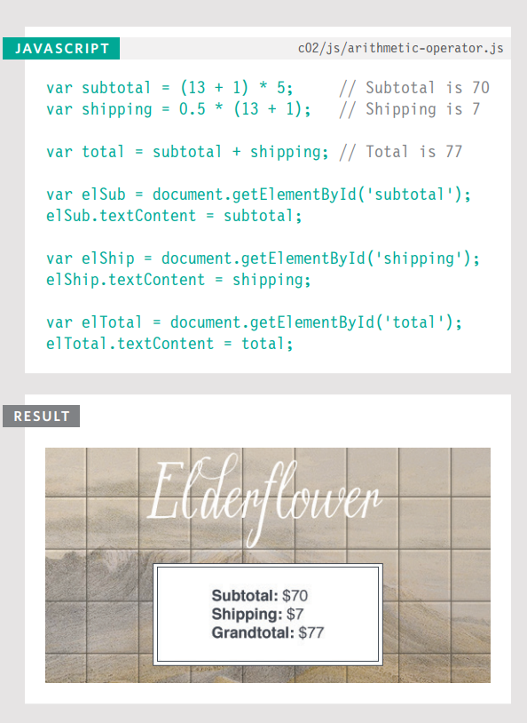

Este ejemplo demuestra cómo se usan los operadores matemáticos con números para calcular los valores combinados de dos costos.

Las primeras dos líneas crean dos variables: una para almacenar el subtotal del pedido y la otra para contener el costo de envío del pedido; por lo tanto, las variables se nombran en consecuencia: **subtotal** y **shipping**.

En la tercera línea, el total se calcula sumando estos dos valores.

Esto demuestra cómo los operadores matemáticos pueden usar variables que representan números. (Es decir, los números no necesitan estar escritos explícitamente en el código).

Las seis líneas restantes de código escriben los resultados en la pantalla.

### OPERADOR DE CADENA (STRING)

> Solo hay un operador de cadena: el símbolo `+`. Se usa para unir las cadenas a cada lado de él.

Hay muchas ocasiones en las que puedes necesitar unir dos o más cadenas para crear un solo valor. Los programadores llaman al proceso de unir dos o más cadenas para crear una nueva cadena **concatenación**.

Por ejemplo, podrías tener un nombre y un apellido en dos variables separadas y querer unirlos para mostrar el nombre completo. En este ejemplo, la variable llamada **fullName** contendría la cadena **'Ivy Stone'**.

```js
var firstName = 'Ivy ';
var lastName = 'Stone';
var fullName = firstName + lastName;
```

**MEZCLANDO NÚMEROS Y CADENAS**

Cuando colocas comillas alrededor de un número, es una cadena (no un tipo de dato numérico) y no puedes realizar operaciones de suma en cadenas.

```js
var cost1 = '7';
var cost2 = '9';
var total = cost1 + cost2;
```

Terminarías con una cadena que dice **'79'**.

Si intentas agregar un tipo de dato numérico a una cadena, entonces el número se convierte en parte de la cadena, por ejemplo, agregando un número de casa a un nombre de calle:

```js
var number = 12;
var street = 'Ivy Road';
var add = number + street;
```

Terminarías con una cadena que dice **'12Ivy Road'**.

Si intentas usar cualquiera de los otros operadores aritméticos en una cadena, el valor resultante suele ser un valor llamado **NaN**. Esto significa **"Not a Number"** (no es un número).

```js
var score = 'seven';
var score2 = 'nine';
var total = score * score2;
```

Terminarías con el valor **NaN**.

### USANDO OPERADORES DE CADENA

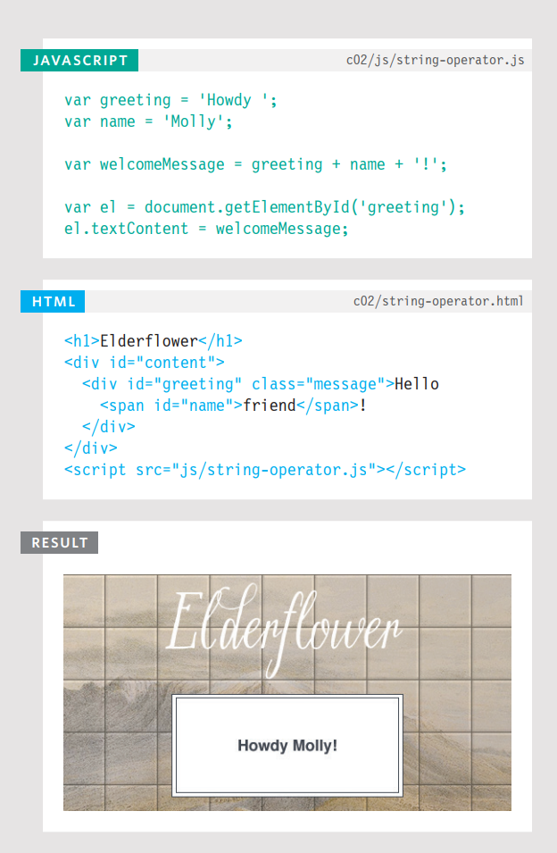

Este ejemplo mostrará un mensaje de bienvenida personalizado en la página.

La primera línea crea una variable llamada **greeting**, que almacena el mensaje para el usuario. Aquí el saludo es la palabra **Howdy**.

La segunda línea crea una variable que almacena el nombre del usuario. La variable se llama **name**, y el usuario en este caso es **Molly**.

El mensaje de bienvenida personalizado se crea concatenando (uniendo) estas dos variables, agregando un signo de exclamación, y almacenándolos en una nueva variable llamada **welcomeMessage**.

Observa la variable **greeting** en la primera línea y nota cómo hay un espacio después de la palabra **Howdy**. Si se omitiera el espacio, el valor de **welcomeMessage** sería **"HowdyMolly!"**.

### EJEMPLO

Este ejemplo combina varias técnicas que has visto a lo largo de este capítulo.

Puedes ver el código de este ejemplo en las siguientes dos páginas. Se utilizan comentarios de una sola línea para describir lo que hace cada sección del código.

Para empezar, se crean tres variables que almacenan información utilizada en el mensaje de bienvenida. Estas variables luego se concatenan (unen) para crear el mensaje completo que el usuario ve.

La siguiente parte del ejemplo demuestra cómo se realizan operaciones matemáticas básicas con números para calcular el costo de un letrero.

- Una variable llamada **sign** contiene el texto que mostrará el letrero.
- Una propiedad llamada **length** se usa para determinar cuántos caracteres hay en la cadena (conocerás esta propiedad en la pág. 128).
- El costo del letrero (el subtotal) se calcula multiplicando el número de caracteres por el costo de cada uno.
- El gran total se crea agregando $7 por el envío.

Finalmente, la información se escribe en la página seleccionando elementos y luego reemplazando el contenido de ese elemento (usando una técnica que conocerás completamente en el Capítulo 5). Selecciona elementos de la página HTML usando el valor de sus atributos **id** y luego actualiza el texto dentro de esos elementos.

Una vez que hayas trabajado con este ejemplo, deberías tener una buena comprensión básica de cómo se almacenan los datos en variables y cómo realizar operaciones básicas con los datos en esas variables.

### INSTRUCCIONES BÁSICAS DE JAVASCRIPT

```html linenums="1" title="HTML"
<!DOCTYPE html>
<html>
 <head>
    <title>JavaScript &amp; jQuery - Chapter 2: Basic JavaScript Instructions - Example</title>
    <link rel="stylesheet" href="css/c02.css" />
 </head>
 <body>
    <h1>Elderflower</h1>
    <div id="content">
    <div id="greeting" class="message">Hello!</div>
    <table>
        <tr>
            <td>Custom sign: </td>
            <td id="userSign"></td>
        </tr>
        <tr>
            <td>Total tiles: </td>
            <td id="tiles"></td>
        </tr>
        <tr>
            <td>Subtotal: </td>
            <td id="subTotal">$</td>
        </tr>
        <tr>
            <td>Shipping: </td>
            <td id="shipping">$</td>
        </tr>
        <tr>
            <td>Grand total: </td>
            <td id="grandTotal">$</td>
        </tr>
    </table>
    <a href="#" class="action">Pay Now</a>
    </div>
    <script src="js/example.js"></script>
 </body>
</html>
```

```js linenums="1" title="JAVASCRIPT"
// Create variables for the welcome message
var greeting = 'Howdy ';
var name = 'Molly';
var message = ', please check your order:';

// Concatenate the three variables above to create the welcome message
var welcome = greeting + name + message;

// Create variables to hold details about the sign
var sign = 'Montague House';
var tiles = sign.length;
var subTotal = tiles * 5;
var shipping = 7;
var grandTotal = subTotal + shipping;

// Get the element that has an id of greeting
var el = document.getElementById('greeting');

// Replace the content of that element with the personalized welcome message
el.textContent = welcome;

// Get the element that has an id of userSign then update its contents
var elSign = document.getElementById('userSign');
elSign.textContent = sign;

// Get the element that has an id of tiles then update its contents
var elTiles = document.getElementById('tiles');
elTiles.textContent = tiles;

// Get the element that has an id of subTotal then update its contents
var elSubTotal = document.getElementById('subTotal');
elSubTotal.textContent = '$' + subTotal;

// Get the element that has an id of shipping then update its contents
var elShipping = document.getElementById('shipping');
elShipping.textContent = '$' + shipping;

// Get the element that has an id of grandTotal then update its contents
var elGrandTotal = document.getElementById('grandTotal');
elGrandTotal.textContent = '$' + grandTotal;
```

### RESUMEN

- Un script se compone de una serie de sentencias. Cada sentencia es como un paso en una receta.
- Los scripts contienen instrucciones muy precisas. Por ejemplo, podrías especificar que un valor debe ser recordado antes de crear un cálculo usando ese valor.
- Las variables se usan para almacenar temporalmente piezas de información utilizadas en el script.
- Los arrays son tipos especiales de variables que almacenan más de una pieza de información relacionada.
- JavaScript distingue entre números (0-9), cadenas (texto) y valores booleanos (true o false).
- Las expresiones evalúan a un solo valor.
- Las expresiones dependen de operadores para calcular un valor.
