# FUNCTIONS METHODS & OBJECTS

Los navegadores requieren instrucciones muy detalladas sobre lo que queremos que hagan. Por lo tanto, los scripts complejos pueden llegar a tener cientos (incluso miles) de líneas. Los programadores usan funciones, métodos y objetos para organizar su código.

Este capítulo está dividido en tres secciones que presentan:

### FUNCIONES Y MÉTODOS

Las funciones consisten en una serie de sentencias que se han agrupado porque realizan una tarea específica. Un método es lo mismo que una función, excepto que los métodos se crean dentro de (y son parte de) un objeto.

### OBJETOS

En el Capítulo 1 viste que los programadores usan objetos para crear modelos del mundo usando datos, y que los objetos están compuestos de propiedades y métodos. En esta sección, aprenderás a crear tus propios objetos usando JavaScript.

### OBJETOS INCORPORADOS (BUILT-IN)

El navegador viene con un conjunto de objetos que actúan como un kit de herramientas para crear páginas web interactivas. Esta sección te presenta varios objetos incorporados, que luego verás usar a lo largo del resto del libro.

## ¿QUÉ ES UNA FUNCIÓN?

!!! quote 

    Las funciones te permiten agrupar una serie de sentencias para realizar una tarea específica. Si diferentes partes de un script repiten la misma tarea, puedes reutilizar la función (en lugar de repetir el mismo conjunto de sentencias).

Agrupar las sentencias necesarias para responder una pregunta o realizar una tarea ayuda a organizar tu código. Además, las sentencias en una función no siempre se ejecutan cuando se carga una página, por lo que las funciones también ofrecen una forma de almacenar los pasos necesarios para lograr una tarea. El script puede entonces pedirle a la función que realice todos esos pasos cuando sea necesario.

Por ejemplo, podrías tener una tarea que solo quieras realizar si el usuario hace clic en un elemento específico de la página. Si vas a pedirle a la función que realice su tarea más tarde, necesitas darle un nombre a tu función. Ese nombre debe describir la tarea que está realizando. Cuando le pides que realice su tarea, se conoce como **llamar a la función**.

Los pasos que la función necesita realizar para cumplir su tarea se empaquetan en un bloque de código. Como recordarás del capítulo anterior, un bloque de código consiste en una o más sentencias contenidas entre llaves. (No escribas un punto y coma después de la llave de cierre, como sí haces después de una sentencia).

Algunas funciones necesitan recibir información para poder realizar una tarea determinada. Por ejemplo, una función para calcular el área de una caja necesitaría saber su ancho y su alto. Las piezas de información que se pasan a una función se conocen como **parámetros**.

Cuando escribes una función y esperas que te proporcione una respuesta, esa respuesta se conoce como **valor de retorno**.

A la derecha hay un ejemplo de una función en el archivo JavaScript. Se llama `updateMessage()`. No te preocupes si no entiendes la sintaxis del ejemplo; veremos más de cerca cómo escribir y usar funciones en las páginas siguientes.

Recuerda que los lenguajes de programación a menudo dependen de pares nombre/valor. La función tiene un nombre, `updateMessage`, y el valor es el bloque de código (que consiste en sentencias). Cuando llamas a la función por su nombre, esas sentencias se ejecutarán.

!!! quote 

    También puedes tener **funciones anónimas**. No tienen nombre, por lo que no se pueden llamar. En su lugar, se ejecutan tan pronto como el intérprete se encuentra con ellas.

## UNA FUNCIÓN BÁSICA

En este ejemplo, al usuario se le muestra un mensaje en la parte superior de la página. El mensaje está contenido en un elemento HTML cuyo atributo **id** tiene un valor de **message**. El mensaje se va a cambiar usando JavaScript.

Antes de la etiqueta de cierre `</body>`, puedes ver el enlace al archivo JavaScript. El archivo JavaScript comienza con una variable usada para almacenar un nuevo mensaje, seguida de una función llamada `updateMessage()`.

No necesitas preocuparte todavía sobre cómo funciona esta función; lo aprenderás en las próximas páginas. Por ahora, solo vale la pena notar que dentro de las llaves de la función hay dos sentencias.

```html linenums="1" title="basic-function.html"
<!DOCTYPE html>
<html>
 <head>
  <title>Basic Function</title>
  <link rel="stylesheet" href="css/c03.css" />
 </head>
 <body>
  <h1>TravelWorthy</h1>
  <div id="message">Welcome to our site!</div>
  <script src="js/basic-function.js"></script>
 </body>
</html>
```
```js linenums="1" title="basic-function.js"
var msg = 'Sign up to receive our newsletter for 10% off!';
function updateMessage() {
 var el = document.getElementById('message');
 el.textContent = msg;
}
updateMessage();
```


## DECLARAR UNA FUNCIÓN

 > Para crear una función, le das un nombre y luego escribes las sentencias necesarias para realizar su tarea dentro de las llaves. Esto se conoce como una **declaración de función**.

Declaras una función usando la palabra clave **function**.

Le das a la función un nombre (a veces llamado **identificador**) seguido de paréntesis.

Las sentencias que realizan la tarea se sitúan en un bloque de código. (Están dentro de llaves).

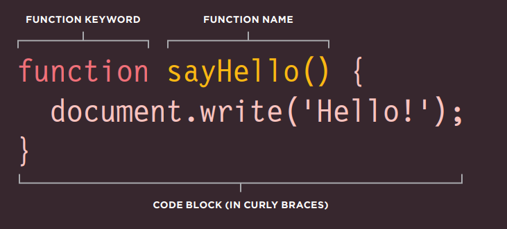

Esta función es muy básica (solo contiene una sentencia), pero ilustra cómo escribir una función. La mayoría de las funciones que verás o escribirás probablemente consistirán en más sentencias.

El punto importante es recordar que las funciones almacenan el código necesario para realizar una tarea específica, y que el script puede pedirle a la función que realice esa tarea cuando sea necesario.

Si diferentes partes de un script necesitan realizar la misma tarea, no tienes que repetir las mismas sentencias múltiples veces: usas una función para hacerlo (y reutilizas el mismo código).

## LLAMAR A UNA FUNCIÓN

Habiendo declarado la función, puedes ejecutar todas las sentencias entre sus llaves con solo una línea de código. Esto se conoce como **llamar a la función**.

Para ejecutar el código de la función, usas el nombre de la función seguido de paréntesis.

En términos de programación, dirías que este código **llama a una función**.

Puedes llamar a la misma función tantas veces como quieras dentro del mismo archivo JavaScript.

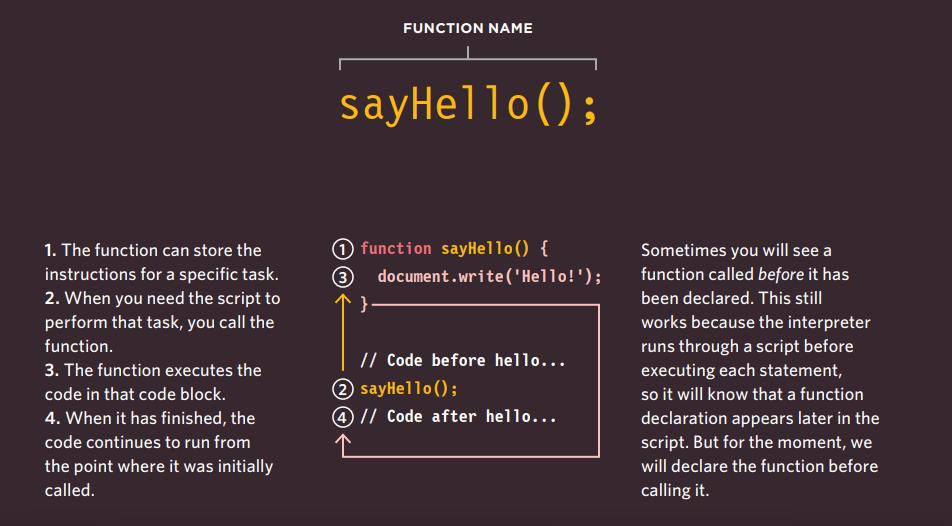

1. La función puede almacenar las instrucciones para una tarea específica.
2. Cuando necesitas que el script realice esa tarea, llamas a la función.
3. La función ejecuta el código en ese bloque de código.
4. Cuando ha terminado, el código continúa ejecutándose desde el punto donde fue llamado inicialmente.

A veces verás una función llamada antes de haber sido declarada. Esto funciona porque el intérprete revisa el script antes de ejecutar cada sentencia, por lo que sabrá que una declaración de función aparece más adelante en el script. Pero por ahora, declararemos la función antes de llamarla.

### DECLARAR FUNCIONES QUE NECESITAN INFORMACIÓN

A veces una función necesita información específica para realizar su tarea. En tales casos, cuando declaras la función le das **parámetros**. Dentro de la función, los parámetros actúan como variables.

Si una función necesita información para funcionar, indicas lo que necesita saber entre paréntesis después del nombre de la función.

Los elementos que aparecen dentro de estos paréntesis se conocen como los **parámetros** de la función. Dentro de la función, esas palabras actúan como nombres de variables.

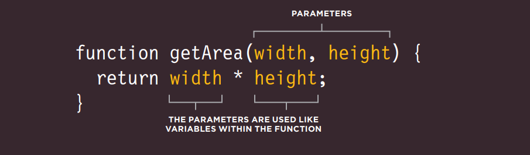

Esta función calculará y devolverá el área de un rectángulo. Para hacerlo, necesita el ancho y el alto del rectángulo. Cada vez que llamas a la función, estos valores podrían ser diferentes.

Esto demuestra cómo el código puede realizar una tarea sin conocer los detalles exactos de antemano, siempre que tenga reglas que pueda seguir para lograr la tarea.

Por lo tanto, cuando diseñas un script, debes anotar la información que la función requerirá para realizar su tarea.

Si miras dentro de la función, los nombres de los parámetros se usan igual que usarías variables. Aquí, los nombres de parámetros **width** y **height** representan el ancho y el alto de la pared.

## LLAMAR FUNCIONES QUE NECESITAN INFORMACIÓN

Cuando llamas a una función que tiene parámetros, especificas los valores que debe usar entre los paréntesis que siguen a su nombre. Los valores se llaman **argumentos** y se pueden proporcionar como valores directos o como variables.

### ARGUMENTOS COMO VALORES

Cuando la función de abajo es llamada, el número 3 se usará para el ancho de la pared, y 5 se usará para su altura.

```js linenums="1"
getArea(3, 5);
```

### ARGUMENTOS COMO VARIABLES

No tienes que especificar valores reales al llamar a una función: puedes usar variables en su lugar. Así que lo siguiente hace lo mismo:

```js linenums="1"
wallWidth = 3;
wallHeight = 5;
getArea(wallWidth, wallHeight);
```

### PARÁMETROS VS ARGUMENTOS

Las personas a menudo usan los términos parámetro y argumento indistintamente, pero hay una diferencia sutil.

Cuando se declara la función, puedes ver las palabras **width** y **height** usadas (entre paréntesis en la primera línea). Dentro de las llaves de la función, esas palabras actúan como variables. Estos nombres son los **parámetros**.

En esta página, puedes ver que la función `getArea()` está siendo llamada y el código especifica números reales que se usarán para realizar el cálculo (o variables que contienen números reales). Estos valores que pasas al código (la información que necesita para calcular el tamaño de esta pared en particular) se llaman **argumentos**.

## OBTENER UN SOLO VALOR DE UNA FUNCIÓN

Algunas funciones devuelven información al código que las llamó. Por ejemplo, cuando realizan un cálculo, devuelven el resultado.

La función `calculateArea()` devuelve el área de un rectángulo al código que la llamó.

Dentro de la función, se crea una variable llamada **area**. Esta contiene el área calculada de la caja.

La palabra clave **return** se usa para devolver un valor al código que llamó a la función.

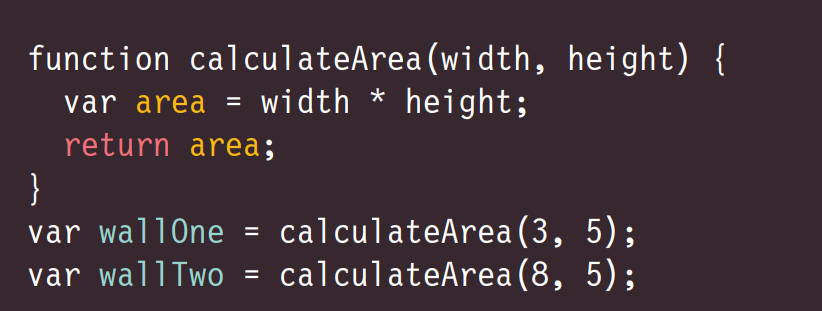

Observa que el intérprete sale de la función cuando se usa **return**. Vuelve a la sentencia que la llamó. Si hubiera habido sentencias posteriores en esta función, no se procesarían.

La variable **wallOne** contiene el valor 15, que fue calculado por la función `calculateArea()`.

La variable **wallTwo** contiene el valor 40, que fue calculado por la misma función `calculateArea()`.

Esto también demuestra cómo la misma función se puede usar para realizar los mismos pasos con diferentes valores.

### OBTENER MÚLTIPLES VALORES DE UNA FUNCIÓN

Las funciones pueden devolver más de un valor usando un array. Por ejemplo, esta función calcula el área y el volumen de una caja.

Primero, se crea una nueva función llamada `getSize()`. El área de la caja se calcula y se almacena en una variable llamada **area**.

El volumen se calcula y se almacena en una variable llamada **volume**. Ambos se colocan luego en un array llamado **sizes**.

Este array luego se devuelve al código que llamó a la función `getSize()`, permitiendo que los valores sean usados.

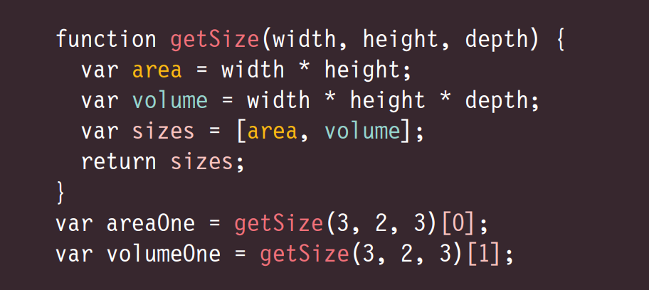

La variable **areaOne** contiene el área de una caja de 3 x 2. El área es el primer valor en el array **sizes**.

La variable **volumeOne** contiene el volumen de una caja de 3 x 2 x 3. El volumen es el segundo valor en el array **sizes**.

## FUNCIONES ANÓNIMAS Y EXPRESIONES DE FUNCIÓN

!!! quote 

    Las expresiones producen un valor. Se pueden usar donde se esperan valores. Si una función se coloca donde un navegador espera ver una expresión (por ejemplo, como un argumento de una función), entonces se trata como una expresión.

### DECLARACIÓN DE FUNCIÓN

Una declaración de función crea una función que puedes llamar más adelante en tu código. Es el tipo de función que has visto hasta ahora en este libro.

Para poder llamar a la función más adelante en tu código, debes darle un nombre, por lo que se conocen como **funciones con nombre**. A continuación, se declara una función llamada `area()`, que luego se puede llamar usando su nombre.

```js linenums="1"
function area(width, height) {
 return width * height;
};
var size = area(3, 4);
```

Como verás en la pág. 456, el intérprete siempre busca variables y declaraciones de función antes de repasar cada sección de un script, línea por línea. Esto significa que una función creada con una declaración de función puede ser llamada incluso antes de haber sido declarada.

Para obtener más información sobre cómo se procesan primero las variables y las funciones, consulta la discusión sobre el contexto de ejecución y hoisting en las págs. 452–457.

### EXPRESIÓN DE FUNCIÓN

Si colocas una función donde el intérprete esperaría ver una expresión, entonces se trata como una expresión, y se conoce como una **expresión de función**. En las expresiones de función, el nombre generalmente se omite. Una función sin nombre se llama **función anónima**. A continuación, la función se almacena en una variable llamada **area**. Se puede llamar como cualquier función creada con una declaración de función.

```js linenums="1"
var area = function(width, height) {
 return width * height;
};
var size = area(3, 4);
```

En una expresión de función, la función no se procesa hasta que el intérprete llega a esa sentencia. Esto significa que no puedes llamar a esta función antes de que el intérprete la haya descubierto. También significa que cualquier código que aparezca hasta ese punto podría potencialmente alterar lo que sucede dentro de esta función.

### EXPRESIONES DE FUNCIÓN INVOCADAS INMEDIATAMENTE (IIFE)

Esta forma de escribir una función se usa en varias situaciones diferentes. A menudo, las funciones se usan para garantizar que los nombres de las variables no entren en conflicto entre sí (especialmente si la página usa más de un script).

Estas funciones no reciben un nombre. En su lugar, se ejecutan una vez cuando el intérprete se encuentra con ellas. A continuación, la variable llamada **area** contendrá el valor devuelto por la función (en lugar de almacenar la función en sí para poder llamarla más tarde).

```js linenums="1"
var area = ( function() {
 var width = 3;
 var height = 2;
 return width * height;
} () ) ;
```

Los paréntesis finales después de la llave de cierre del bloque de código le indican al intérprete que llame a la función inmediatamente. Los operadores de agrupación son paréntesis que están ahí para asegurar que el intérprete trate esto como una expresión.

> Puedes ver los paréntesis finales en una IIFE colocados después del operador de agrupación de cierre, pero generalmente se considera una mejor práctica colocar los paréntesis finales antes del operador de agrupación de cierre, como se muestra en el código anterior.

### CUÁNDO USAR FUNCIONES ANÓNIMAS E IIFE

Verás muchas formas en que las expresiones de función anónimas y las IIFE se usan a lo largo del libro.

Se utilizan para código que solo necesita ejecutarse una vez dentro de una tarea, en lugar de ser llamado repetidamente por otras partes del script. Por ejemplo:

- Como argumento cuando se llama a una función (para calcular un valor para esa función).
- Para asignar el valor de una propiedad a un objeto.
- En manejadores y listeners de eventos (ver Capítulo 6) para realizar una tarea cuando ocurre un evento.
- Para prevenir conflictos entre dos scripts que podrían usar los mismos nombres de variables (ver pág. 99).

Las IIFE se usan comúnmente como un envoltorio alrededor de un conjunto de código. Cualquier variable declarada dentro de esa función anónima está efectivamente protegida de variables en otros scripts que podrían tener el mismo nombre. Esto se debe a un concepto llamado **ámbito** (scope), que conocerás en la siguiente página. También es una técnica muy popular con jQuery.

## ÁMBITO DE VARIABLE (VARIABLE SCOPE)

La ubicación donde declaras una variable afectará dónde se puede usar dentro de tu código. Si la declaras dentro de una función, solo se puede usar dentro de esa función. Esto se conoce como el **ámbito** (scope) de la variable.

### VARIABLES LOCALES

Cuando una variable se crea dentro de una función usando la palabra clave **var**, solo se puede usar en esa función. Se llama **variable local** o variable a nivel de función. Se dice que tiene **ámbito local** o ámbito a nivel de función. No se puede acceder fuera de la función en la que fue declarada. A continuación, **area** es una variable local.

El intérprete crea variables locales cuando la función se ejecuta y las elimina tan pronto como la función ha terminado su tarea. Esto significa que:

- Si la función se ejecuta dos veces, la variable puede tener diferentes valores cada vez.
- Dos funciones diferentes pueden usar variables con el mismo nombre sin ningún tipo de conflicto de nombres.

#### VARIABLES GLOBALES

Si creas una variable fuera de una función, entonces se puede usar en cualquier lugar dentro del script. Se llama **variable global** y tiene **ámbito global**. En el ejemplo mostrado, **wallSize** es una variable global.

Las variables globales se almacenan en memoria mientras la página web esté cargada en el navegador. Esto significa que ocupan más memoria que las variables locales, y también aumenta el riesgo de conflictos de nombres (ver siguiente página). Por estas razones, debes usar variables locales siempre que sea posible.

Si olvidas declarar una variable usando la palabra clave **var**, la variable funcionará, pero será tratada como una variable global (esto se considera una mala práctica).

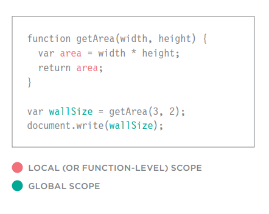

### CÓMO FUNCIONAN LA MEMORIA Y LAS VARIABLES

Las variables globales usan más memoria. El navegador tiene que recordarlas mientras la página web que las usa esté cargada. Las variables locales solo se recuerdan durante el período de tiempo en que se ejecuta una función.

#### CREAR LAS VARIABLES EN EL CÓDIGO

Cada variable que declaras ocupa memoria. Cuantas más variables tenga que recordar un navegador, más memoria requerirá tu script para ejecutarse. Los scripts que requieren mucha memoria pueden funcionar más lento, lo que a su vez hace que tu página web tarde más en responder al usuario.

```js linenums="1"
var width = 15;
var height = 30;
var isWall = true;
var canPaint = true;
```

Una variable en realidad hace referencia a un valor que está almacenado en memoria. El mismo valor se puede usar con más de una variable:

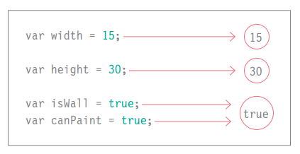

Aquí los valores para el ancho y el alto de la pared se almacenan por separado, pero el mismo valor de **true** se puede usar tanto para **isWall** como para **canPaint**.

### COLISIÓN DE NOMBRES (NAMING COLLISION)

Podrías pensar que evitarías las colisiones de nombres; después de todo, sabes qué variables estás usando. Pero muchos sitios usan scripts escritos por varias personas. Si una página HTML usa dos archivos JavaScript, y ambos tienen una variable global con el mismo nombre, puede causar errores. Imagina una página usando estos dos scripts:

```js linenums="1"
// Show size of the building plot
function showPlotSize(){
 var width = 3;
 var height = 2;
 return 'Area: " + (width * height);
}
var msg = showArea()
```

```js linenums="1"
// Show size of the garden
function showGardenSize() {
 var width = 12;
 var height = 25;
 return width * height;
}
var msg = showGardenSize();
```
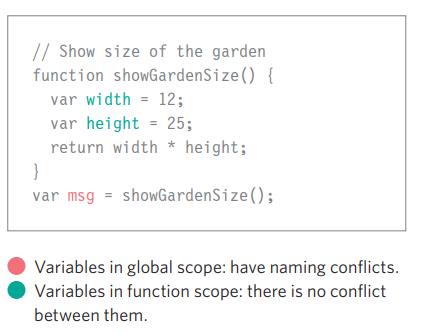

- Las variables en el ámbito global tienen conflictos de nombres. 
- Las variables en el ámbito de función no tienen conflictos entre sí.

## ¿QUÉ ES UN OBJETO?

Los objetos agrupan un conjunto de variables y funciones para crear un modelo de algo que reconocerías del mundo real. En un objeto, las variables y las funciones adoptan nuevos nombres.

### EN UN OBJETO: LAS VARIABLES SE CONOCEN COMO PROPIEDADES

Si una variable es parte de un objeto, se llama **propiedad**. Las propiedades nos informan sobre el objeto, como el nombre de un hotel o la cantidad de habitaciones que tiene. Cada hotel individual podría tener un nombre diferente y una cantidad diferente de habitaciones.

### EN UN OBJETO: LAS FUNCIONES SE CONOCEN COMO MÉTODOS

Si una función es parte de un objeto, se llama **método**. Los métodos representan tareas que están asociadas con el objeto. Por ejemplo, puedes verificar cuántas habitaciones están disponibles restando el número de habitaciones reservadas del número total de habitaciones.

> Este objeto representa un hotel. Tiene cinco propiedades y un método. El objeto está entre llaves. Se almacena en una variable llamada **hotel**.

Al igual que las variables y las funciones con nombre, las propiedades y los métodos tienen un nombre y un valor. En un objeto, ese nombre se llama **clave** (key). Un objeto no puede tener dos claves con el mismo nombre. Esto se debe a que las claves se usan para acceder a sus valores correspondientes.

El valor de una propiedad puede ser una cadena, un número, un booleano, un array o incluso otro objeto. El valor de un método siempre es una función.

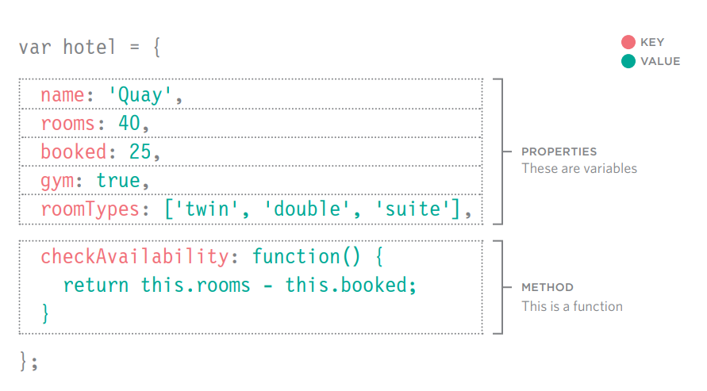

Arriba puedes ver un objeto **hotel**. El objeto contiene los siguientes pares clave/valor:

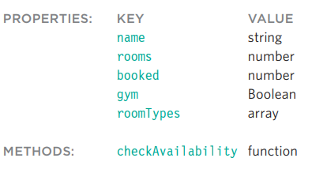

Como verás en las próximas páginas, esta es solo una de las formas en que puedes crear un objeto.

Los programadores usan muchos pares nombre/valor:

- HTML usa nombres de atributos y valores.
- CSS usa nombres de propiedades y valores.

En JavaScript:

- Las variables tienen un nombre y puedes asignarles un valor de cadena, número o booleano.
- Los arrays tienen un nombre y un grupo de valores. (Cada elemento en un array es un par nombre/valor porque tiene un número de índice y un valor).
- Las funciones con nombre tienen un nombre y un valor que es un conjunto de sentencias para ejecutar si se llama a la función.
- Los objetos consisten en un conjunto de pares nombre/valor (pero los nombres se denominan **claves**).

## CREAR UN OBJETO: NOTACIÓN LITERAL

La notación literal es la forma más fácil y popular de crear objetos. (Hay varias formas de crear objetos).

El objeto son las llaves y su contenido. El objeto se almacena en una variable llamada **hotel**, por lo que te referirías a él como el objeto **hotel**.

Separa cada clave de su valor usando dos puntos. Separa cada propiedad y método con una coma (pero no después del último valor).

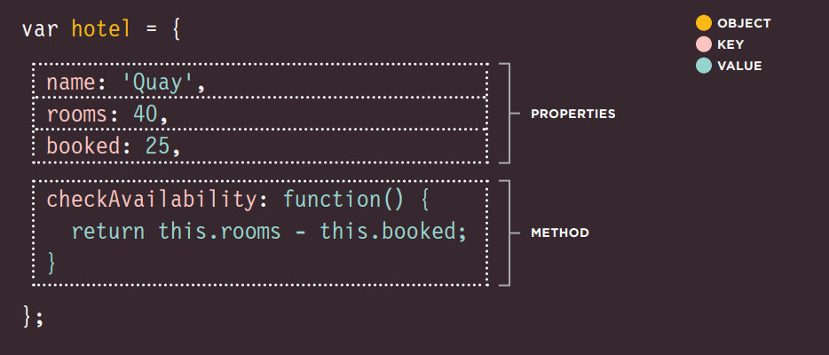

En el método `checkAvailability()`, la palabra clave **this** se usa para indicar que está usando las propiedades **rooms** y **booked** de este objeto.

Al establecer propiedades, trata los valores como lo harías con las variables: las cadenas van entre comillas y los arrays entre corchetes.

## ACCEDER A UN OBJETO Y NOTACIÓN DE PUNTO

Puedes acceder a las propiedades o métodos de un objeto usando la notación de punto. También puedes acceder a las propiedades usando corchetes.

Para acceder a una propiedad o método de un objeto, usas el nombre del objeto, seguido de un punto, luego el nombre de la propiedad o método al que quieres acceder. Esto se conoce como **notación de punto**.

El punto se conoce como el **operador de miembro**. La propiedad o método a su derecha es un miembro del objeto a su izquierda. Aquí, se crean dos variables para contener el nombre del hotel y el número de habitaciones vacantes.

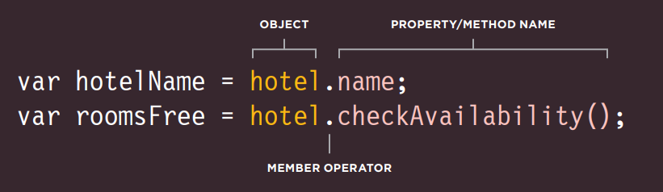

También puedes acceder a las propiedades de un objeto (pero no a sus métodos) usando la sintaxis de corchetes.

Esta vez el nombre del objeto va seguido de corchetes, y el nombre de la propiedad está dentro de ellos.

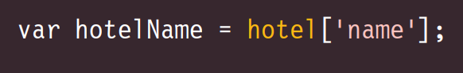

Esta notación se usa más comúnmente cuando:

- El nombre de la propiedad es un número (técnicamente permitido, pero generalmente debe evitarse).
- Se usa una variable en lugar del nombre de la propiedad (verás esta técnica en el Capítulo 12).

## CREAR OBJETOS USANDO NOTACIÓN LITERAL

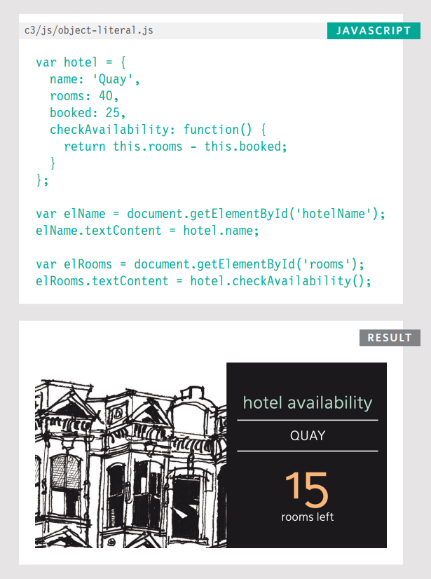

```js linenums="1"
var hotel = {
 name: 'Quay',
 rooms: 40,
 booked: 25,
 checkAvailability: function() {
 return this.rooms - this.booked;
 }
};
var elName = document.getElementById('hotelName');
elName.textContent = hotel.name;
var elRooms = document.getElementById('rooms');
elRooms.textContent = hotel.checkAvailability();
```

## CREAR MÁS LITERALES DE OBJETO

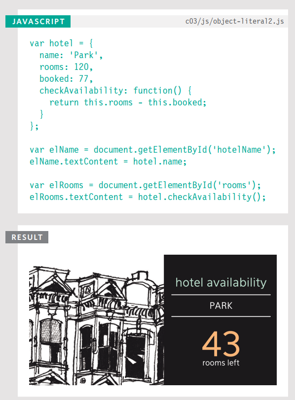

Aquí puedes ver otro objeto. Nuevamente se llama **hotel**, pero esta vez el modelo representa un hotel diferente. Por un momento, imagina que esta es una página diferente del mismo sitio web de viajes. El hotel Park es más grande. Tiene 120 habitaciones y 77 de ellas están reservadas.

Lo único que cambia en el código son los valores de las propiedades del objeto **hotel**:

- El nombre del hotel
- Cuántas habitaciones tiene
- Cuántas habitaciones están reservadas

El resto de la página funciona exactamente de la misma manera. El nombre se muestra usando el mismo código. El método `checkAvailability()` no ha cambiado y se llama de la misma manera.

Si este sitio tuviera 1,000 hoteles, lo único que necesitaría cambiar serían las tres propiedades de este objeto. Debido a que creamos un modelo para el hotel usando datos, el mismo código puede acceder y mostrar los detalles de cualquier hotel que siga el mismo modelo de datos.

Si tuvieras dos objetos en la misma página, crearías cada uno usando la misma notación pero los almacenarías en variables con nombres diferentes.

## CREAR UN OBJETO: NOTACIÓN CONSTRUCTORA

La palabra clave **new** y el constructor de objetos crean un objeto en blanco. Luego puedes agregar propiedades y métodos al objeto.

Primero, creas un nuevo objeto usando una combinación de la palabra clave **new** y la función constructora `Object()`. (Esta función es parte del lenguaje JavaScript y se usa para crear objetos).

A continuación, habiendo creado el objeto en blanco, puedes agregar propiedades y métodos usando la notación de punto. Cada sentencia que agrega una propiedad o método debe terminar con un punto y coma.

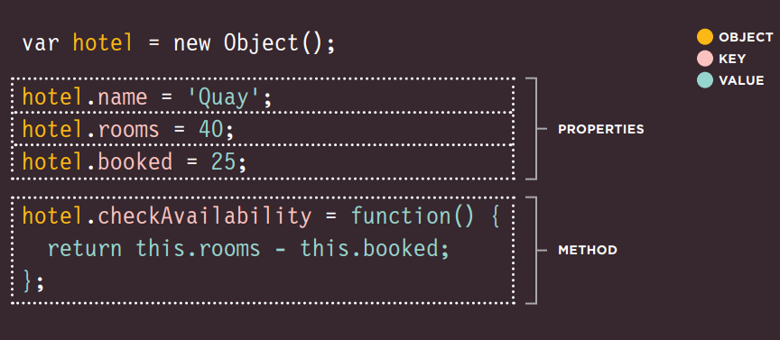

Puedes usar esta sintaxis para agregar propiedades y métodos a cualquier objeto que hayas creado (sin importar qué notación usaste para crearlo).

Para crear un objeto vacío usando notación literal usa:

```js linenums="1"
var hotel = {}
```

Las llaves crean un objeto vacío.

## ACTUALIZAR UN OBJETO

Para actualizar el valor de las propiedades, usa la notación de punto o los corchetes. Funcionan en objetos creados con notación literal o constructora. Para eliminar una propiedad, usa la palabra clave **delete**.

Para actualizar una propiedad, usa la misma técnica que se mostró para agregar propiedades al objeto, pero asígnale un nuevo valor.

Si el objeto no tiene la propiedad que estás intentando actualizar, se agregará al objeto.

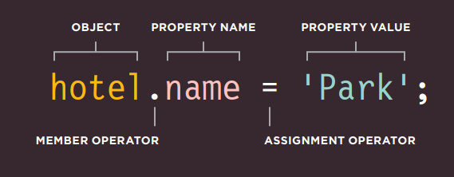

También puedes actualizar las propiedades de un objeto (pero no sus métodos) usando la sintaxis de corchetes. El nombre del objeto va seguido de corchetes, y el nombre de la propiedad está dentro de ellos.

Se agrega un nuevo valor para la propiedad después del operador de asignación. Nuevamente, si la propiedad que intentas actualizar no existe, se agregará al objeto.

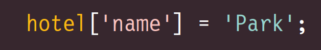

Para eliminar una propiedad, usa la palabra clave **delete** seguida del nombre del objeto y el nombre de la propiedad.

```js linenums="1"
delete hotel.name;
```

Si solo quieres limpiar el valor de una propiedad, puedes establecerla a una cadena vacía.

```js linenums="1"
hotel.name = '';
```

## CREAR MUCHOS OBJETOS: NOTACIÓN CONSTRUCTORA

A veces querrás que varios objetos representen cosas similares. Los constructores de objetos pueden usar una función como plantilla para crear objetos. Primero, crea la plantilla con las propiedades y métodos del objeto.

Una función llamada **Hotel** se usará como plantilla para crear nuevos objetos que representen hoteles. Como todas las funciones, contiene sentencias. En este caso, agregan propiedades o métodos al objeto.

La función tiene tres parámetros. Cada uno establece el valor de una propiedad en el objeto. Los métodos serán los mismos para cada objeto creado usando esta función.

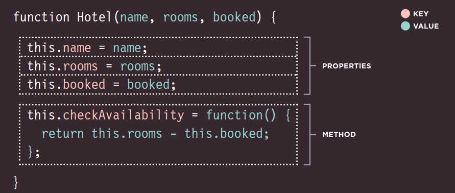

La palabra clave **this** se usa en lugar del nombre del objeto para indicar que la propiedad o método pertenece al objeto que esta función crea. Cada sentencia que crea una nueva propiedad o método para este objeto termina en un punto y coma (no una coma, que se usa en la sintaxis literal).

El nombre de una función constructora generalmente comienza con una letra mayúscula (a diferencia de otras funciones, que tienden a comenzar con una letra minúscula). La letra mayúscula sirve para recordar a los desarrolladores que usen la palabra clave **new** cuando creen un objeto usando esa función (ver siguiente página).

!!! quote

    Creas instancias del objeto usando la función constructora. La palabra clave **new** seguida de una llamada a la función crea un nuevo objeto. Las propiedades de cada objeto se dan como argumentos a la función.

Aquí, se usan dos objetos para representar dos hoteles, por lo que cada objeto necesita un nombre diferente. Cuando la palabra clave **new** llama a la función constructora, crea un nuevo objeto.

Cada vez que se llama, los argumentos son diferentes porque son los valores para las propiedades de cada hotel. Ambos objetos obtienen automáticamente el mismo método definido en la función constructora.

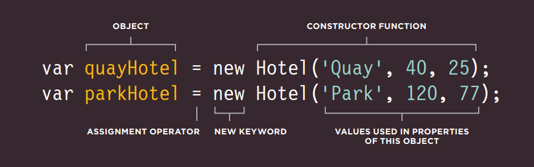

El primer objeto se llama **quayHotel**. Su nombre es 'Quay' y tiene 40 habitaciones, 25 de las cuales están reservadas.

El segundo objeto se llama **parkHotel**. Su nombre es 'Park' y tiene 120 habitaciones, 77 de las cuales están reservadas.

Incluso cuando se crean muchos objetos usando la misma función constructora, los métodos se mantienen igual porque acceden, actualizan o realizan un cálculo sobre los datos almacenados en las propiedades.

Podrías usar esta técnica si tu script contiene un objeto muy complejo que necesita estar disponible pero podría no usarse. El objeto se define en la función, pero solo se crea si es necesario.

## CREAR OBJETOS USANDO SINTAXIS CONSTRUCTORA

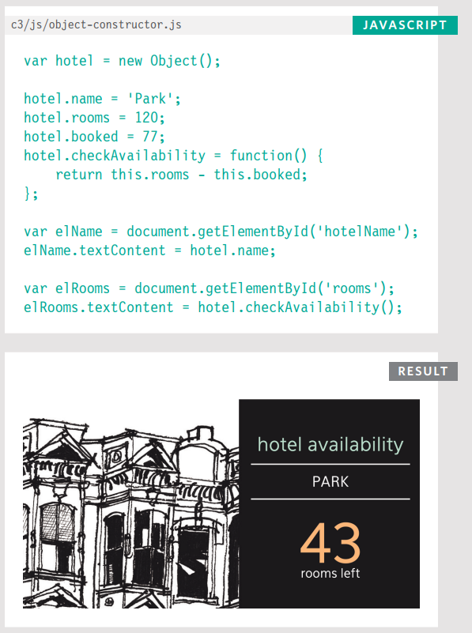

A la derecha, se crea un objeto vacío llamado **hotel** usando la función constructora.

Una vez creado, se le asignan tres propiedades y un método al objeto. (Si el objeto ya tuviera alguna de estas propiedades, esto sobrescribiría los valores en esas propiedades).

Para acceder a una propiedad de este objeto, puedes usar la notación de punto, como con cualquier objeto. Por ejemplo, para obtener el nombre del hotel podrías usar: `hotel.name`

De manera similar, para usar el método, puedes usar el nombre del objeto seguido del nombre del método: `hotel.checkAvailability()`

## CREAR Y ACCEDER A OBJETOS: NOTACIÓN CONSTRUCTORA

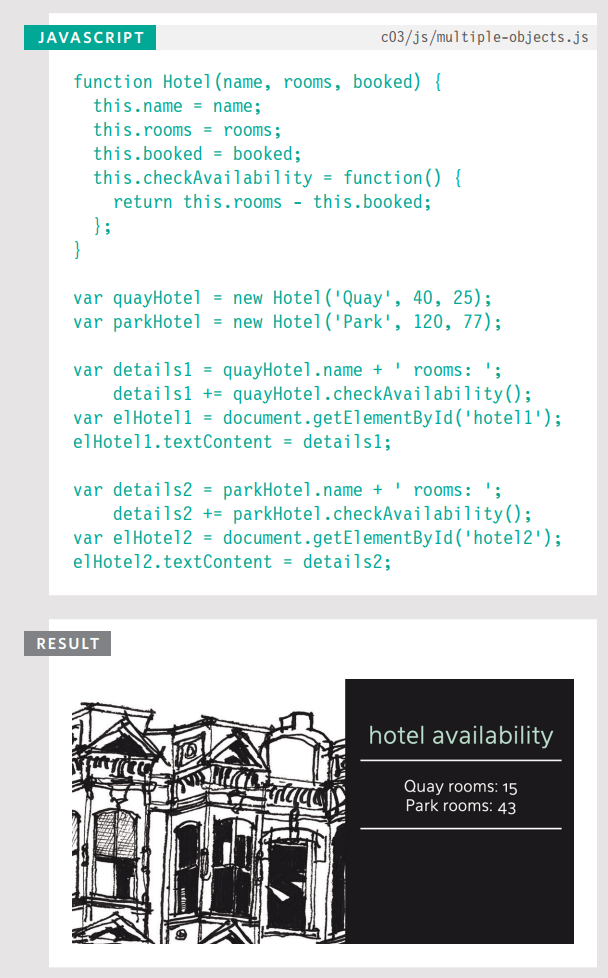

Para tener una mejor idea de por qué podrías querer crear múltiples objetos en la misma página, aquí hay un ejemplo que muestra la disponibilidad de habitaciones en dos hoteles.

Primero, una función constructora define una plantilla para los hoteles. Luego, se crean dos instancias diferentes de este tipo de objeto hotel. La primera representa un hotel llamado Quay y la segunda un hotel llamado Park.

Habiendo creado instancias de estos objetos, puedes acceder a sus propiedades y métodos usando la misma notación de punto que usas con todos los demás objetos.

En este ejemplo, se accede a datos de ambos objetos y se escriben en la página. (El HTML para este ejemplo cambia para acomodar el hotel adicional).

Para cada hotel, se crea una variable para contener el nombre del hotel, seguido de un espacio y la palabra "rooms". La línea siguiente agrega a esa variable el número de habitaciones disponibles en ese hotel. (El operador `+=` se usa para agregar contenido a una variable existente).

## AGREGAR Y ELIMINAR PROPIEDADES

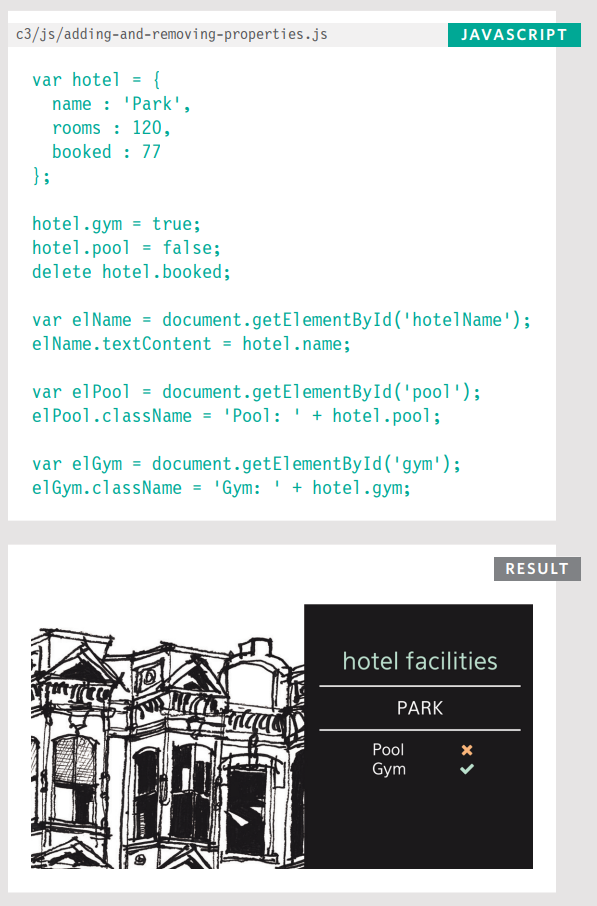

Una vez que has creado un objeto (usando notación literal o constructora), puedes agregar nuevas propiedades. Esto se hace usando la notación de punto que viste para agregar propiedades a objetos.

En este ejemplo, puedes ver que se crea una instancia del objeto **hotel** usando un literal de objeto. Inmediatamente después, al objeto **hotel** se le dan dos propiedades adicionales que muestran las instalaciones (si tiene o no gimnasio y/o piscina). Estas propiedades reciben valores booleanos (true o false).

Habiendo agregado estas propiedades al objeto, puedes acceder a ellas como cualquier otra propiedad del objeto. Aquí, actualizan el valor del atributo **class** en sus respectivos elementos para mostrar una marca de verificación o una cruz.

Para eliminar una propiedad, usas la palabra clave **delete** y luego usas la notación de punto para identificar la propiedad o método que quieres eliminar del objeto. 

En este caso, la propiedad **booked** se elimina del objeto.

> Si un objeto se crea usando una función constructora, esta sintaxis solo agrega o elimina las propiedades de esa única instancia del objeto (no de todos los objetos creados con esa función).

## RESUMEN: FORMAS DE CREAR OBJETOS
### CREAR EL OBJETO, LUEGO AGREGAR PROPIEDADES Y MÉTODOS

En ambos ejemplos, el objeto se crea en la primera línea del código. Las propiedades y métodos se agregan después.

**NOTACIÓN LITERAL**

```js linenums="1"
var hotel = {}
hotel.name = 'Quay';
hotel.rooms = 40;
hotel.booked = 25;
hotel.checkAvailability = function() {
 return this.rooms - this.booked;
};
```

Una vez que has creado un objeto, la sintaxis para agregar o eliminar propiedades y métodos de ese objeto es la misma.


**NOTACIÓN CONSTRUCTORA**

```js linenums="1"
var hotel = new Object();
hotel.name = 'Quay';
hotel.rooms = 40;
hotel.booked = 25;
hotel.checkAvailability = function() {
 return this.rooms - this.booked;
};
```

### CREAR UN OBJETO CON PROPIEDADES Y MÉTODOS

**NOTACIÓN LITERAL**

Dos puntos separan los pares clave/valor. Hay una coma entre cada par clave/valor.

```js linenums="1"
var hotel = {
 name: 'Quay',
 rooms: 40,
 booked: 25,
 checkAvailability: function() {
 return this.rooms - this.booked;
  }
};
```

**NOTACIÓN CONSTRUCTORA**

La función se puede usar para crear múltiples objetos. La palabra clave **this** se usa en lugar del nombre del objeto.

```js linenums="1"
function Hotel(name, rooms, booked) {
 this.name = name;
 this.rooms = rooms;
 this.booked = booked;
 this.checkAvailability = function() {
 return this.rooms - this.booked;
 };
}
var quayHotel = new Hotel('Quay', 40, 25);
var parkHotel = new Hotel('Park', 120, 77);
```

### THIS (ES UNA PALABRA CLAVE)

La palabra clave **this** se usa comúnmente dentro de funciones y objetos. Dónde se declare la función altera lo que **this** significa. Siempre se refiere a un objeto, generalmente el objeto en el que opera la función.

### UNA FUNCIÓN EN EL ÁMBITO GLOBAL

Cuando una función se crea en el nivel superior de un script (es decir, no dentro de otro objeto o función), entonces está en el **ámbito global** o contexto global. El objeto predeterminado en este contexto es el objeto **window**, por lo que cuando se usa **this** dentro de una función en el contexto global, se refiere al objeto **window**.

A continuación, **this** se usa para devolver propiedades del objeto **window**:

```js linenums="1"
function windowSize() {
 var width = this.innerWidth;
 var height = this.innerHeight;
 return [height, width];
}
```

Internamente, la palabra clave **this** es una referencia al objeto dentro del cual se creó la función.

### VARIABLES GLOBALES

Todas las variables globales también se convierten en propiedades del objeto **window**, por lo que cuando una función está en el contexto global, puedes acceder a las variables globales usando el objeto **window**, así como a sus otras propiedades.

Aquí, la función `showWidth()` está en el ámbito global, y `this.width` se refiere a la variable **width**:

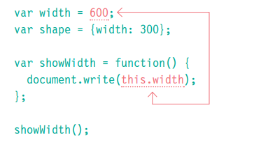

Aquí, la función escribiría un valor de 600 en la página (usando el método `write()` del objeto **document**).

Como puedes ver, el valor de **this** cambia en diferentes situaciones. Pero no te preocupes si no sigues estas dos páginas en tu primera lectura. A medida que escribas más funciones y objetos, estos conceptos se volverán más familiares, y si **this** no devuelve el valor que esperabas, estas páginas te ayudarán a descubrir por qué.

### UN MÉTODO DE UN OBJETO

Cuando una función se define dentro de un objeto, se convierte en un método. En un método, **this** se refiere al objeto que lo contiene.

En el siguiente ejemplo, el método `getArea()` aparece dentro del objeto **shape**, por lo que **this** se refiere al objeto **shape** que lo contiene:

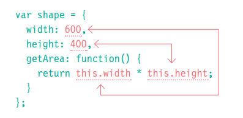

Debido a que la palabra clave **this** aquí se refiere al objeto **shape**, sería lo mismo que escribir:

```js linenums="1"
return shape.width * shape.height;
```

Si estuvieras creando varios objetos usando un constructor de objetos (y cada forma tuviera diferentes dimensiones), **this** se referiría a la instancia individual del nuevo objeto que estás creando. Cuando llamaras a `getArea()`, calcularía las dimensiones de esa instancia particular del objeto.


### EXPRESIÓN DE FUNCIÓN COMO MÉTODO

Si una función con nombre se ha definido en el ámbito global y luego se usa como un método de un objeto, **this** se refiere al objeto que lo contiene.

El siguiente ejemplo usa la misma expresión de función `showWidth()` que la de la página anterior, pero se asigna como un método de un objeto.

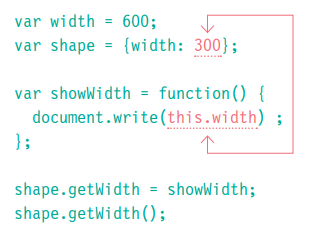

La penúltima línea indica que la función `showWidth()` se usa como un método del objeto **shape**. Al método se le da un nombre diferente: `getWidth()`.

Cuando se llama al método `getWidth()`, aunque usa la función `showWidth()`, **this** ahora se refiere al objeto **shape**, no al contexto global (y `this.width` se refiere a la propiedad **width** del objeto **shape**). Por lo tanto, escribe un valor de 300 en la página.

## RECAP: STORING DATA

En JavaScript, los datos se representan usando pares nombre/valor. Para organizar tus datos, puedes usar un arreglo u objeto para agrupar un conjunto de valores relacionados. En los arreglos y objetos, el nombre también se conoce como **key** (llave).

### VARIABLES

Una variable tiene solo una key (el nombre de la variable) y un valor.

Los nombres de las variables se separan de su valor con un signo igual (el operador de asignación):

```js linenums="1"
var hotel = 'Quay';
```

Para recuperar el valor de una variable, usa su nombre:

```js linenums="1"
// Esto recupera Quay:
hotel;
```

Cuando una variable se ha declarado pero aún no se le ha asignado un valor, es **undefined**.

Si no se usa la palabra clave **var**, la variable se declara en el ámbito global (siempre debes usarla).

### ARRAYS

Los arreglos pueden almacenar múltiples piezas de información. Cada pieza de información está separada por una coma. El orden de los valores es importante porque los elementos en un arreglo reciben un número (llamado **index**).

Los valores en un arreglo se colocan entre corchetes, separados por comas:

```js linenums="1"
var hotels = [
 'Quay',
 'Park',
 'Beach',
 'Bloomsbury'
]
```

Puedes pensar en cada elemento del arreglo como otro par clave/valor, donde la clave es el número de índice y los valores se muestran en la lista separada por comas.

Para recuperar un elemento, usa su número de índice:

```js linenums="1"
// Esto recupera Park:
hotels[1];
```

Si una clave es un número, para recuperar el valor debes colocar el número entre corchetes.

Generalmente hablando, los arreglos son los únicos casos en los que la clave sería un número.

!!! note
    Este resumen se relaciona específicamente con el almacenamiento de datos. No puedes almacenar reglas para realizar una tarea en un arreglo. Solo se pueden almacenar en una función o método.

Si quieres acceder a los elementos mediante un nombre de propiedad o clave, usa un objeto (pero ten en cuenta que cada clave en el objeto debe ser única). Si el orden de los elementos es importante, usa un arreglo.

### OBJETOS INDIVIDUALES

Los objetos almacenan conjuntos de pares nombre/valor. Pueden ser propiedades (variables) o métodos (funciones). El orden de ellos no es importante (a diferencia del arreglo). Accedes a cada dato por su clave.

En notación literal de objetos, las propiedades y métodos de un objeto se colocan entre llaves:

```js linenums="1"
var hotel = {
 name: 'Quay',
 rooms: 40
};
```

Los objetos creados con notación literal son buenos para:

- Cuando estás almacenando/transmitiendo datos entre aplicaciones
- Para objetos globales o de configuración que establecen información para la página

Para acceder a las propiedades o métodos del objeto, usa la notación de punto:

```js linenums="1"
// Esto recupera Quay:
hotel.name;
```

### MÚLTIPLES OBJETOS

Cuando necesitas crear múltiples objetos dentro de la misma página, debes usar un constructor de objetos para proporcionar una plantilla para los objetos.

```js linenums="1"
function Hotel(name, rooms) {
 this.name = name;
 this.rooms = rooms;
}
```

Luego creas instancias del objeto usando la palabra clave **new** y una llamada a la función constructora.

```js linenums="1"
var hotel1 = new Hotel('Quay', 40);
var hotel2 = new Hotel('Park', 120);
```

Los objetos creados con constructores son buenos para:

- Tienes muchos objetos con funcionalidad similar (por ejemplo, múltiples presentaciones de diapositivas/reproductores multimedia/personajes de juegos) dentro de una página
- Un objeto complejo que podría no usarse en el código

Para acceder a las propiedades o métodos del objeto, usa la notación de punto:

```js linenums="1"
// Esto recupera Park:
hotel2.name;
```

## LOS ARREGLOS SON OBJETOS

Los arreglos son en realidad un tipo especial de objeto. Contienen un conjunto relacionado de pares clave/valor (como todos los objetos), pero la clave de cada valor es su número de índice.

Como viste (en la pág. 72), los arreglos tienen una propiedad **length** que te indica cuántos elementos hay en el arreglo. En el Capítulo 12, verás que los arreglos también tienen varios otros métodos útiles.

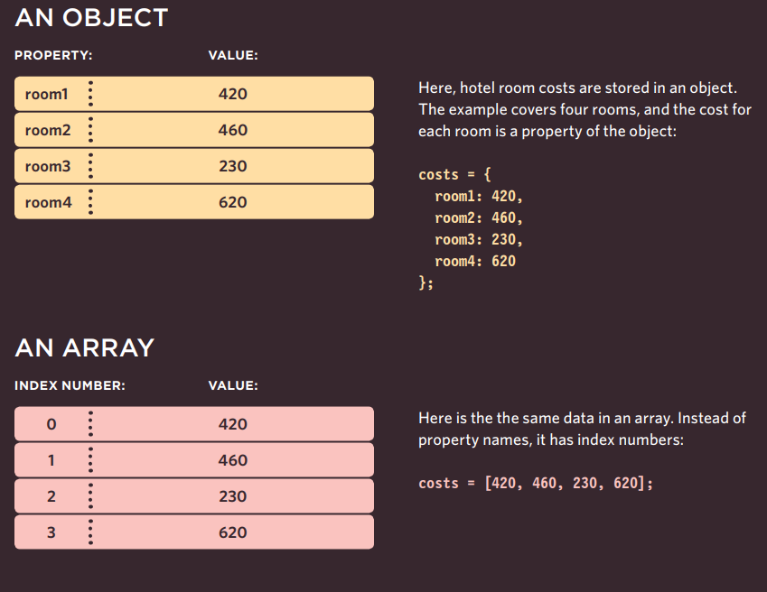

Aquí, los costos de las habitaciones del hotel se almacenan en un objeto. El ejemplo cubre cuatro habitaciones, y el costo de cada habitación es una propiedad del objeto:

```js linenums="1"
costs = {
 room1: 420,
 room2: 460,
 room3: 230,
 room4: 620
};
```

Aquí están los mismos datos en un arreglo. En lugar de nombres de propiedades, tiene números de índice:

```js linenums="1"
costs = [420, 460, 230, 620];
```

##  ARREGLOS DE OBJETOS & OBJETOS EN ARREGLOS

Puedes combinar arreglos y objetos para crear estructuras de datos complejas: los arreglos pueden almacenar una serie de objetos (y recuerdan su orden). Los objetos también pueden contener arreglos (como valores de sus propiedades).

En un objeto, el orden en que aparecen las propiedades no es importante. En un arreglo, los números de índice determinan el orden de las propiedades. Verás más ejemplos de estas estructuras de datos en el Capítulo 12.

### ARREGLOS DENTRO DE UN OBJETO

La propiedad de cualquier objeto puede contener un arreglo. En el ejemplo de la izquierda, cada elemento de una factura de hotel se almacena por separado en un arreglo. Para acceder al primer cargo de la habitación 1 usarías:

```js linenums="1"
costs.room1.items[0];
```

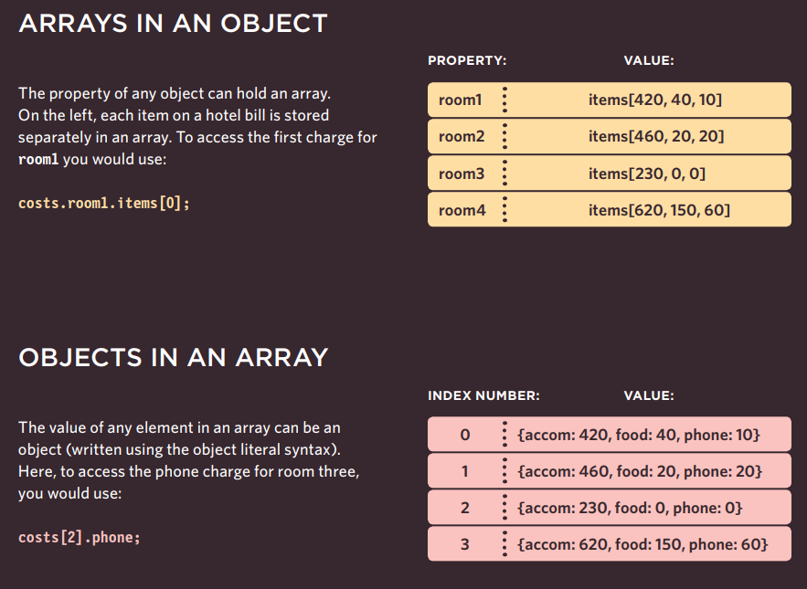

### OBJETOS DENTRO DE UN ARREGLO

El valor de cualquier elemento en un arreglo puede ser un objeto (escrito usando la sintaxis literal de objetos). Aquí, para acceder al cargo de teléfono de la habitación tres, usarías:

```js linenums="1"
costs[2].phone;
```

## QUÉ SON LOS OBJETOS INCORPORADOS

> Los navegadores vienen con un conjunto de objetos incorporados que representan cosas como la ventana del navegador y la página web actual mostrada en esa ventana. Estos objetos incorporados actúan como un kit de herramientas para crear páginas web interactivas.

Los objetos que crees usualmente estarán escritos específicamente para adaptarse a tus necesidades. Modelan los datos utilizados dentro de tu script, o contienen la funcionalidad que tu script necesita. Mientras que los objetos incorporados contienen funcionalidad comúnmente necesitada por muchos scripts. Tan pronto como una página web se ha cargado en el navegador, estos objetos están disponibles para usarse en tus scripts.

Estos objetos incorporados te ayudan a obtener una amplia gama de información, como el ancho de la ventana del navegador, el contenido del encabezado principal en la página, o la longitud del texto que un usuario ingresó en un campo de formulario. Accedes a sus propiedades o métodos usando la notación de punto, igual que lo harías con las propiedades o métodos de un objeto que tú mismo hayas escrito.

Lo primero que necesitas hacer es conocer qué herramientas están disponibles. Puedes imaginar que tu nuevo kit de herramientas tiene tres compartimentos:

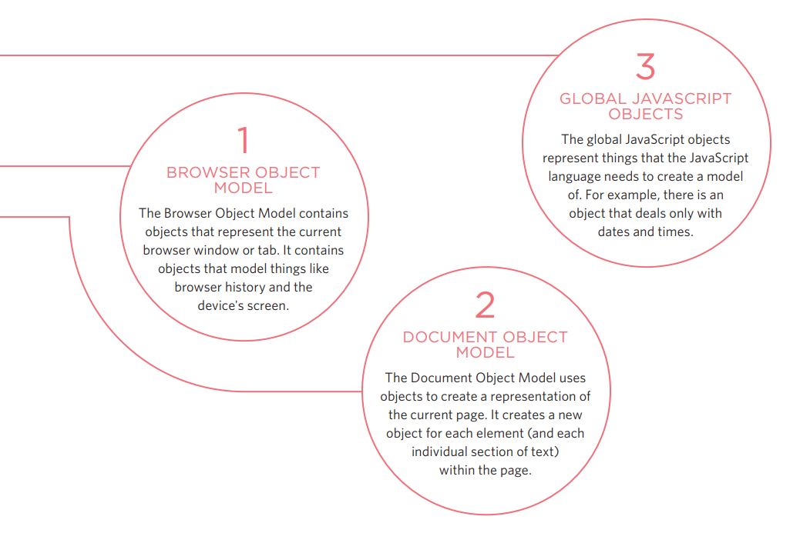

**MODELO DE OBJETOS DEL NAVEGADOR**

El Modelo de Objetos del Navegador contiene objetos que representan la ventana o pestaña actual del navegador. Contiene objetos que modelan cosas como el historial del navegador y la pantalla del dispositivo.

**MODELO DE OBJETOS DEL DOCUMENTO**

El Modelo de Objetos del Documento usa objetos para crear una representación de la página actual. Crea un nuevo objeto para cada elemento (y cada sección individual de texto) dentro de la página.

**OBJETOS GLOBALES DE JAVASCRIPT**

Los objetos globales de JavaScript representan cosas que el lenguaje JavaScript necesita para crear un modelo de sí mismo. Por ejemplo, hay un objeto que trata solo con fechas y horas.

### ¿QUÉ CUBRE ESTA SECCIÓN?

Ya has visto cómo acceder a las propiedades y métodos de un objeto, así que el propósito de esta sección es informarte sobre:

- Qué objetos incorporados están disponibles para ti
- Qué hacen sus principales propiedades y métodos

Habrá algunos ejemplos en la parte restante de este capítulo para asegurarte de que sabes cómo usarlos. Luego, a lo largo del resto del libro completo, verás muchos ejemplos prácticos de cómo se usan en una variedad de situaciones.

### ¿QUÉ ES UN MODELO DE OBJETOS?

Has visto que un objeto se puede usar para crear un modelo de algo del mundo real usando datos. Un modelo de objetos es un grupo de objetos, cada uno de los cuales representa cosas relacionadas del mundo real. Juntos forman un modelo de algo más grande.

Dos páginas atrás, se señaló que un arreglo puede contener un conjunto de objetos, o que la propiedad de un objeto podría ser un arreglo. También es posible que la propiedad de un objeto sea otro objeto. Cuando un objeto está anidado dentro de otro objeto, puedes escucharlo referido como un **objeto hijo**.

## TRES GRUPOS DE OBJETOS INCORPORADOS

### USAR OBJETOS INCORPORADOS

Los tres conjuntos de objetos incorporados ofrecen cada uno un rango diferente de herramientas que te ayudan a escribir scripts para páginas web.

El Capítulo 5 está dedicado al Modelo de Objetos del Documento porque es necesario para acceder y actualizar los contenidos de una página web.

Los otros dos conjuntos de objetos se presentarán en este capítulo, y luego los verás usar a lo largo del resto del libro.

Este libro te enseñará cómo usar estos objetos incorporados y qué tipo de información puedes obtener de cada uno. También verás ejemplos que usan muchas de sus características más populares.

No tenemos espacio para documentar exhaustivamente cada objeto en cada uno de estos modelos en este libro, por lo que puedes encontrar una lista de enlaces a recursos en línea en: http://javascriptbook.com/resources


### MODELO DE OBJETOS DEL NAVEGADOR

El Modelo de Objetos del Navegador crea un modelo de la pestaña o ventana del navegador.

El objeto más alto es el objeto **window**, que representa la ventana o pestaña actual del navegador. Sus objetos hijo representan otras características del navegador.

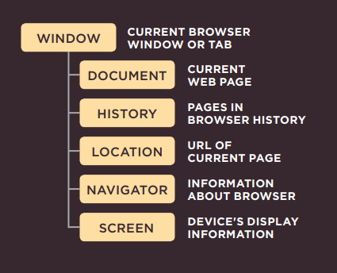


#### EJEMPLOS

El método `print()` del objeto **window** hará que se muestre el cuadro de diálogo de impresión del navegador:

```js linenums="1"
window.print();
```

La propiedad `width` del objeto **screen** te permitirá encontrar el ancho de la pantalla del dispositivo en píxeles:

```js linenums="1"
window.screen.width;
```

Conocerás el objeto **window** en la pág. 124 junto con algunas propiedades de los objetos **screen** e **history**.

### MODELO DE OBJETOS DEL DOCUMENTO

El Modelo de Objetos del Documento (DOM) crea un modelo de la página web actual.

El objeto más alto es el objeto **document**, que representa la página en su totalidad. Sus objetos hijo representan otros elementos en la página.

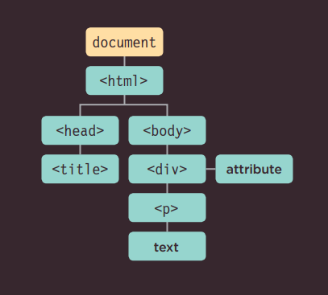

#### EJEMPLOS

El método `getElementById()` del objeto **document** obtiene un elemento por el valor de su atributo **id**:

```js linenums="1"
document.getElementById('one');
```

La propiedad `lastModified` del objeto **document** te dirá la fecha en que la página se actualizó por última vez:

```js linenums="1"
document.lastModified;
```

Conocerás el objeto **document** en la pág. 126. El Capítulo 5 profundiza en este modelo de objetos.

### OBJETOS GLOBALES DE JAVASCRIPT

Los objetos globales no forman un solo modelo. Son un grupo de objetos individuales que se relacionan con diferentes partes del lenguaje JavaScript.

Los nombres de los objetos globales usualmente comienzan con una letra mayúscula, por ejemplo, los objetos **String** y **Date**.

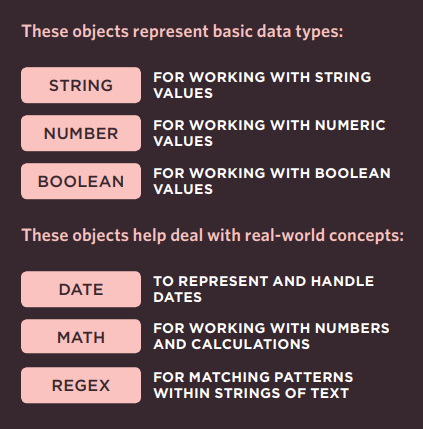

#### EJEMPLOS

El método `toUpperCase()` del objeto **String** convierte a mayúsculas todas las letras de la siguiente variable:

```js linenums="1"
hotel.toUpperCase();
```

La propiedad `PI` del objeto **Math** devolverá el valor de pi:

```js linenums="1"
Math.PI;
```

Conocerás los objetos **String**, **Number**, **Date** y **Math** más adelante en este capítulo.

## EL MODELO DE OBJETOS DEL NAVEGADOR: EL OBJETO WINDOW

El objeto **window** representa la ventana o pestaña actual del navegador. Es el objeto más alto en el Modelo de Objetos del Navegador y contiene otros objetos que te informan sobre el navegador.

Aquí hay una selección de las propiedades y métodos del objeto **window**. También puedes ver algunas propiedades de los objetos **screen** e **history** (que son hijos del objeto **window**).

| PROPIEDAD | DESCRIPCIÓN |
|---|---|
| `window.innerHeight` | Altura de la ventana (excluyendo la interfaz de usuario del navegador) (en píxeles) |
| `window.innerWidth` | Ancho de la ventana (excluyendo la interfaz de usuario del navegador) (en píxeles) |
| `window.pageXOffset` | Distancia que el documento se ha desplazado horizontalmente (en píxeles) |
| `window.pageYOffset` | Distancia que el documento se ha desplazado verticalmente (en píxeles) |
| `window.screenX` | Coordenada X del puntero, relativa a la esquina superior izquierda de la pantalla (en píxeles) |
| `window.screenY` | Coordenada Y del puntero, relativa a la esquina superior izquierda de la pantalla (en píxeles) |
| `window.location` | URL actual del objeto window (o ruta de archivo local) |
| `window.document` | Referencia al objeto document, que se usa para representar la página actual contenida en la ventana |
| `window.history` | Referencia al objeto history para la ventana o pestaña del navegador, que contiene detalles de las páginas que se han visto en esa ventana o pestaña |
| `window.history.length` | Número de elementos en el objeto history para la ventana o pestaña del navegador |
| `window.screen` | Referencia al objeto screen |
| `window.screen.width` | Accede al objeto screen y encuentra el valor de su propiedad width (en píxeles) |
| `window.screen.height` | Accede al objeto screen y encuentra el valor de su propiedad height (en píxeles) |

| MÉTODO | DESCRIPCIÓN |
|---|---|
| `window.alert()` | Crea un cuadro de diálogo con un mensaje (el usuario debe hacer clic en el botón Aceptar para cerrarlo) |
| `window.open()` | Abre una nueva ventana del navegador con la URL especificada como parámetro (si el navegador tiene software de bloqueo de ventanas emergentes instalado, este método puede no funcionar) |
| `window.print()` | Indica al navegador que el usuario quiere imprimir el contenido de la página actual (actúa como si el usuario hubiera hecho clic en una opción de impresión en la interfaz de usuario del navegador) |

### USAR EL MODELO DE OBJETOS DEL NAVEGADOR

Aquí, los datos sobre el navegador se recogen del objeto **window** y sus hijos, se almacenan en la variable **msg** y se muestran en la página. El operador `+=` agrega datos al final de la variable **msg**.

1. Dos de las propiedades del objeto **window**, `innerWidth` e `innerHeight`, muestran el ancho y la altura de la ventana del navegador.

2. Los objetos hijo se almacenan como propiedades de su objeto padre. Por lo tanto, se usa la notación de punto para acceder a ellos, igual que accederías a cualquier otra propiedad de ese objeto. A su vez, para acceder a las propiedades del objeto hijo, se usa otro punto entre el nombre del objeto hijo y sus propiedades, por ejemplo, `window.history.length`.

3. Se selecciona el elemento cuyo atributo **id** tiene un valor de `info`, y el mensaje que se ha construido hasta este punto se escribe en la página. Consulta la pág. 228 para notas sobre el uso de **innerHTML**, ya que puede ser un riesgo de seguridad si no se usa correctamente.

4. El método `alert()` del objeto **window** se usa para crear un cuadro de diálogo que se muestra sobre la página. Se conoce como un **alert box** (cuadro de alerta). Aunque este es un método del objeto **window**, puedes verlo usado por sí solo (como se muestra aquí) porque el objeto **window** se trata como el objeto predeterminado si no se especifica ninguno. (Históricamente, el método `alert()` se usaba para mostrar advertencias a los usuarios. Hoy en día hay mejores formas de proporcionar retroalimentación.)

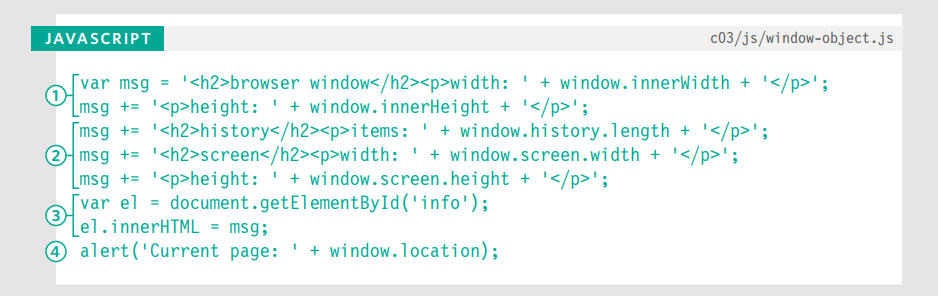

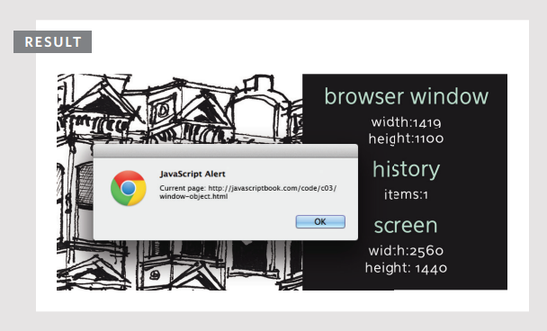


## EL MODELO DE OBJETOS DEL DOCUMENTO: EL OBJETO DOCUMENT

El objeto más alto en el Modelo de Objetos del Documento (o DOM) es el objeto **document**. Representa la página web cargada en la ventana o pestaña actual del navegador. Conocerás sus objetos hijo en el Capítulo 5.

Aquí hay algunas propiedades del objeto **document**, que te informan sobre la página actual.

Como verás en el Capítulo 5, el DOM también crea un objeto para cada elemento en la página.

| PROPIEDAD | DESCRIPCIÓN |
|---|---|
| `document.title` | Título del documento actual |
| `document.lastModified` | Fecha en que el documento fue modificado por última vez |
| `document.URL` | Devuelve una cadena que contiene la URL del documento actual |
| `document.domain` | Devuelve el dominio del documento actual |

El DOM es vital para acceder y modificar los contenidos de la página web actual.

Los siguientes son algunos de los métodos que seleccionan contenido o actualizan el contenido de una página.

| MÉTODO | DESCRIPCIÓN |
|---|---|
| `document.write()` | Escribe texto en el documento (ver restricciones en pág. 226) |
| `document.getElementById()` | Devuelve un elemento, si hay un elemento con el valor del atributo **id** que coincide (descripción completa en pág. 195) |
| `document.querySelectorAll()` | Devuelve una lista de elementos que coinciden con un selector CSS, que se especifica como parámetro (ver pág. 202) |
| `document.createElement()` | Crea un nuevo elemento (ver pág. 222) |
| `document.createTextNode()` | Crea un nuevo nodo de texto (ver pág. 222) |

## USAR EL OBJETO DOCUMENT

Este ejemplo obtiene información sobre la página y luego agrega esa información al pie de página.

1. Los detalles sobre la página se recogen de las propiedades del objeto **document**. Estos detalles se almacenan dentro de una variable llamada **msg**, junto con marcado HTML para mostrar la información. Nuevamente, el operador `+=` agrega el nuevo valor al contenido existente de la variable **msg**.

2. Ya has visto el método `getElementById()` del objeto **document** en varios ejemplos hasta ahora. Selecciona un elemento de la página usando el valor de su atributo **id**. Verás este método con más profundidad en la pág. 195.

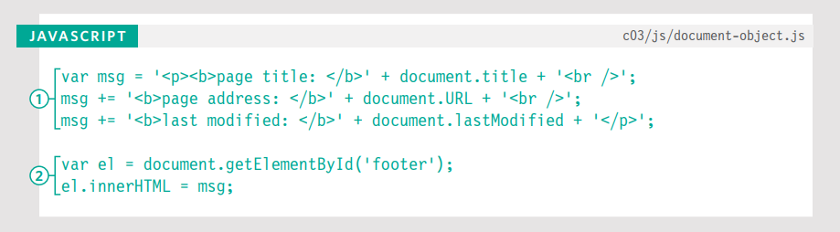

Consulta la pág. 228 para notas sobre el uso de **innerHTML**, ya que puede ser un riesgo de seguridad si no se usa correctamente. La URL se verá muy diferente si ejecutas esta página localmente en lugar de en un servidor web. Probablemente comenzará con `file:///` en lugar de `http://`.

## OBJETOS GLOBALES: EL OBJETO STRING

Siempre que tengas un valor que sea una cadena de texto (string), puedes usar las propiedades y métodos del objeto **String** en ese valor. Este ejemplo almacena la frase "Home sweet home " en una variable.

```js linenums="1"
var saying = 'Home sweet home ';
```
Estas propiedades y métodos se usan a menudo para trabajar con texto almacenado en variables u objetos. Observa cómo el nombre de la variable (**saying**) va seguido de un punto, luego la propiedad o método que se está demostrando (como el nombre de un objeto va seguido de un punto y sus propiedades o métodos).

Es por esto que el objeto **String** se conoce tanto como un objeto global, porque funciona en cualquier lugar dentro de tu script, como un objeto envoltorio (**wrapper object**) porque actúa como un envoltorio alrededor de cualquier valor que sea una cadena: puedes usar las propiedades y métodos de este objeto en cualquier valor que sea una cadena.

La propiedad **length** cuenta el número de "unidades de código" en una cadena. En la mayoría de los casos, un carácter usa una unidad de código, y la mayoría de los programadores lo usan así. Pero algunos de los caracteres raramente usados ocupan dos unidades de código.


| MÉTODO | DESCRIPCIÓN |
|---|---|
| `toUpperCase()` | Cambia la cadena a caracteres MAYÚSCULAS |
| `toLowerCase()` | Cambia la cadena a caracteres minúsculas |
| `charAt()` | Toma un número de índice como parámetro y devuelve el carácter que se encuentra en esa posición |
| `indexOf()` | Devuelve el número de índice de la primera vez que se encuentra un carácter o conjunto de caracteres dentro de la cadena |
| `lastIndexOf()` | Devuelve el número de índice de la última vez que se encuentra un carácter o conjunto de caracteres dentro de la cadena |
| `substring()` | Devuelve los caracteres encontrados entre dos números de índice, donde el carácter del primer número de índice está incluido y el carácter del último número de índice no está incluido |
| `split()` | Cuando se especifica un carácter, divide la cadena cada vez que se encuentra, luego almacena cada parte individual en un arreglo |
| `trim()` | Elimina los espacios en blanco del inicio y final de la cadena |
| `replace()` | Como buscar y reemplazar, toma un valor que debe ser encontrado y otro para reemplazarlo (por defecto, solo reemplaza la primera coincidencia que encuentra) |


Cada carácter en una cadena recibe automáticamente un número, llamado número de índice. Los números de índice siempre comienzan en cero y no en uno (igual que para los elementos en un arreglo).

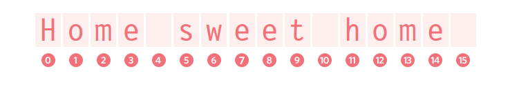

**Propiedad**

| Ejemplo | String | Resultado |
|---------|--------|-----------|
| `saying.length;` | `'Home sweet home '` | `16` |

**Métodos**

| Ejemplo | String | Resultado |
|---------|--------|-----------|
| `saying.toUpperCase();` | `'Home sweet home '` | `'HOME SWEET HOME '` |
| `saying.toLowerCase();` | `'Home sweet home '` | `'home sweet home '` |
| `saying.charAt(12);` | `'Home sweet home '` | `'o'` |
| `saying.indexOf('ee');` | `'Home sweet home '` | `7` |
| `saying.lastIndexOf('e');` | `'Home sweet home '` | `14` |
| `saying.substring(8,14);` | `'Home sweet home '` | `'et hom'` |
| `saying.split(' ');` | `'Home sweet home '` | `['Home', 'sweet', 'home', '']` |
| `saying.trim();` | `'Home sweet home '` | `'Home sweet home'` |
| `saying.replace('me','w');` | `'Home sweet home '` | `'How sweet home '` |

### TRABAJAR CON CADENAS

Este ejemplo demuestra la propiedad **length** y muchos de los métodos del objeto **String** que se muestran en la página anterior.

1. Este ejemplo comienza almacenando la frase "Home sweet home " en una variable llamada **saying**.

2. La siguiente línea te indica cuántos caracteres hay en la cadena usando la propiedad **length** del objeto **String** y almacena el resultado en una variable llamada **msg**.

3. A esto le siguen ejemplos que muestran varios de los métodos del objeto **String**.

El nombre de la variable (**saying**) va seguido de un punto, luego la propiedad o método que se está demostrando (de la misma manera que los otros objetos en este capítulo usaron la notación de punto para indicar una propiedad o método de un objeto).

4. Las últimas dos líneas seleccionan el elemento con un atributo **id** cuyo valor es `info` y luego agregan el valor de la variable **msg** dentro de ese elemento. (Recuerda, los problemas de seguridad con el uso de la propiedad **innerHTML** se discuten en la pág. 228).

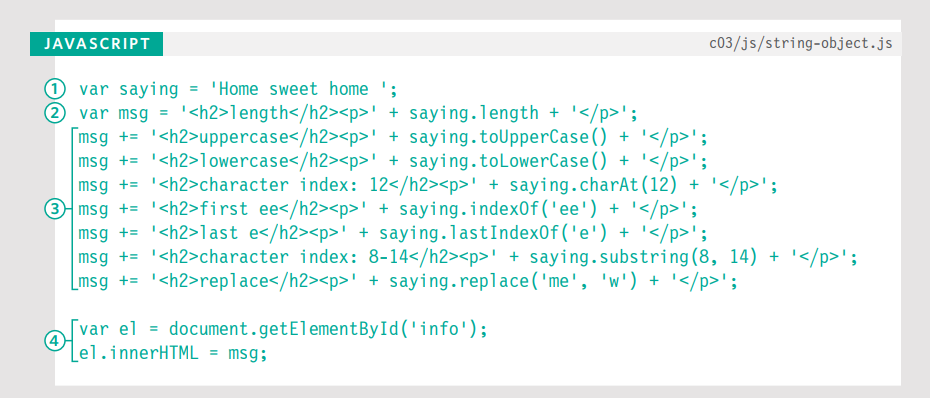


## TIPOS DE DATOS REVISITADOS

En JavaScript hay seis tipos de datos. Cinco de ellos se describen como tipos de datos simples (o primitivos). El sexto es el objeto (y se denomina tipo de datos complejo).

### TIPOS DE DATOS SIMPLES O PRIMITIVOS

JavaScript tiene cinco tipos de datos simples (o primitivos):

1. **String** (cadena de texto)
2. **Number** (número)
3. **Boolean** (booleano)
4. **Undefined** (una variable que ha sido declarada, pero aún no se le ha asignado un valor)
5. **Null** (una variable sin valor – puede haber tenido uno en algún momento, pero ya no tiene valor)

Como has visto, tanto el navegador web como el documento actual se pueden modelar usando objetos (y los objetos pueden tener métodos y propiedades). Pero puede ser confuso descubrir que un valor simple (como un string, un number o un boolean) puede tener métodos y propiedades. Internamente, JavaScript trata cada variable como un objeto por derecho propio.

- **String**: Si una variable, o la propiedad de un objeto, contiene una cadena, puedes usar las propiedades y métodos del objeto **String** en ella.
- **Number**: Si una variable, o la propiedad de un objeto, almacena un número, puedes usar las propiedades y métodos del objeto **Number** en ella (ver página siguiente).
- **Boolean**: Existe un objeto **Boolean**. Rara vez se usa. (Los valores **Undefined** y **Null** no tienen objetos.)

### TIPO DE DATOS COMPLEJO

JavaScript también define un tipo de datos complejo:

6. **Object** (objeto)

Internamente, los arreglos y las funciones se consideran tipos de objetos.

**Los arreglos son objetos**: Como viste en la pág. 118, un arreglo es un conjunto de pares clave/valor (como cualquier otro objeto). Pero no especificas el nombre en el par clave/valor de un arreglo – es un número de índice. Como otros objetos, los arreglos tienen propiedades y métodos. En la pág. 72 viste que los arreglos tienen una propiedad llamada **length**, que te indica cuántos elementos hay en ese arreglo. También hay un conjunto de métodos que puedes usar con cualquier arreglo para agregar elementos, eliminar elementos o reordenar su contenido. Conocerás esos métodos en el Capítulo 12.

**Las funciones son objetos**: Técnicamente, las funciones también son objetos. Pero tienen una característica adicional: son invocables (**callable**), lo que significa que puedes indicarle al intérprete cuándo quieres ejecutar las sentencias que contiene.

## OBJETOS GLOBALES: EL OBJETO NUMBER

> Siempre que tengas un valor que sea un número, puedes usar los métodos y propiedades del objeto **Number** en él.

Estos métodos son útiles cuando se trabaja con una variedad de aplicaciones, desde cálculos financieros hasta animaciones.

Muchos cálculos que involucran moneda (como tasas de impuestos) necesitarán redondearse a un número específico de lugares decimales.

O, en una animación, es posible que quieras especificar que ciertos elementos deben espaciarse uniformemente a lo largo de la página.

| MÉTODO | DESCRIPCIÓN |
|---|---|
| `isNaN()` | Comprueba si el valor no es un número |
| `toFixed()` | Redondea a un número específico de lugares decimales (devuelve una cadena) |
| `toPrecision()` | Redondea al número total de lugares (devuelve una cadena) |
| `toExponential()` | Devuelve una cadena que representa el número en notación exponencial |

### TÉRMINOS COMUNMENTE USADOS

- Un **integer** (entero) es un número completo (no una fracción).
- Un **real number** (número real) es un número que puede contener una parte fraccionaria.
- Un **floating point number** (número de punto flotante) es un número real que usa decimales para representar una fracción. El término "punto flotante" se refiere al punto decimal.
- La **notación científica** es una forma de escribir números que son demasiado grandes o demasiado pequeños para ser escritos convenientemente en forma decimal. Por ejemplo: 3,750,000,000 se puede representar como 3.75 × 10⁹ o 3.75e+9.

### TRABAJAR CON NÚMEROS DECIMALES

Al igual que con el objeto **String**, las propiedades y métodos del objeto **Number** se pueden usar con cualquier valor que sea un número.

1. En este ejemplo, un número se almacena en una variable llamada **originalNumber**, y luego se redondea hacia arriba o hacia abajo usando dos técnicas diferentes.

En ambos casos, necesitas indicar a cuántos dígitos quieres redondear. Esto se proporciona como un parámetro entre paréntesis para ese método.

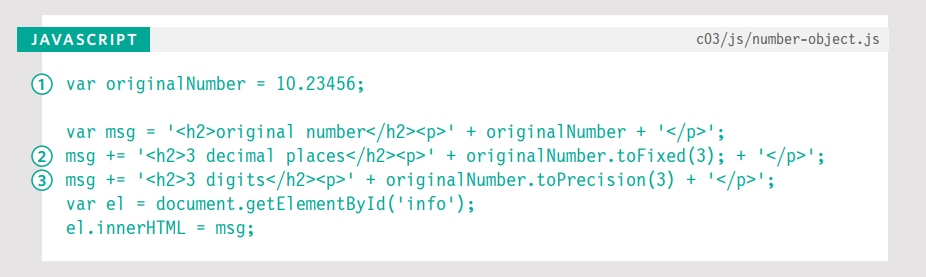

2. `originalNumber.toFixed(3)` redondeará el número almacenado en la variable **originalNumber** a tres lugares decimales. (El número de lugares decimales se especifica entre paréntesis). Devolverá el número como una cadena. Devuelve una cadena porque las fracciones no siempre se pueden representar con precisión usando números de punto flotante.

3. `toPrecision(3)` usa el número entre paréntesis para indicar el número total de dígitos que debe tener el número. También devolverá el número como una cadena. (Puede devolver una notación científica si hay más dígitos que el número especificado de posiciones).

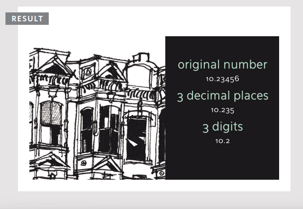

## OBJETOS GLOBALES: EL OBJETO MATH

El objeto **Math** tiene propiedades y métodos para constantes y funciones matemáticas.

| PROPIEDAD | DESCRIPCIÓN |
|---|---|
| `Math.PI` | Devuelve pi (aproximadamente 3.14159265359) |

| MÉTODO | DESCRIPCIÓN |
|---|---|
| `Math.round()` | Redondea un número al entero más cercano |
| `Math.sqrt(n)` | Devuelve la raíz cuadrada de un número positivo, ej., `Math.sqrt(9)` devuelve 3 |
| `Math.ceil()` | Redondea un número hacia arriba al entero más cercano |
| `Math.floor()` | Redondea un número hacia abajo al entero más cercano |
| `Math.random()` | Genera un número aleatorio entre 0 (incluido) y 1 (no incluido) |

Debido a que se conoce como un objeto global, puedes simplemente usar el nombre del objeto **Math** seguido de la propiedad o método al que quieres acceder.

Normalmente almacenarás el número resultante en una variable. Este objeto también tiene muchas funciones trigonométricas como `sin()`, `cos()` y `tan()`.

Las funciones trigonométricas devuelven ángulos en radianes, que luego se pueden convertir a grados si divides el número por (pi / 180).

### EL OBJETO MATH PARA CREAR NÚMEROS ALEATORIOS

Este ejemplo está diseñado para generar un número entero aleatorio entre 1 y 10. El método `random()` del objeto **Math** genera un número aleatorio entre 0 y 1 (con muchos lugares decimales).

Para obtener un número entero aleatorio entre 1 y 10, necesitas multiplicar el número generado aleatoriamente por 10. Este número aún tendrá muchos lugares decimales, así que puedes redondearlo hacia abajo al entero más cercano.

El método `floor()` se usa para redondear específicamente un número hacia abajo (en lugar de hacia arriba o hacia abajo). Esto te dará un valor entre 0 y 9. Luego sumas 1 para convertirlo en un número entre 1 y 10.

```js linenums="1"
var randomNum = Math.floor((Math.random() * 10) + 1);
var el = document.getElementById('info');
el.innerHTML = '<h2>random number</h2><p>' + randomNum + '</p>';
```

Si usaras el método `round()` en lugar de `floor()`, los números 1 y 10 se elegirían aproximadamente la mitad de veces que se elegirían 2-9. 

Cualquier valor entre 1.5 y 1.999 se redondearía a 2, y cualquier valor entre 9 y 9.
5 se redondearía a 9. 

Usar el método `floor()` asegura que el número siempre se redondee hacia abajo al entero más cercano, y luego puedes sumar 1 para asegurar que el número esté entre 1 y 10.

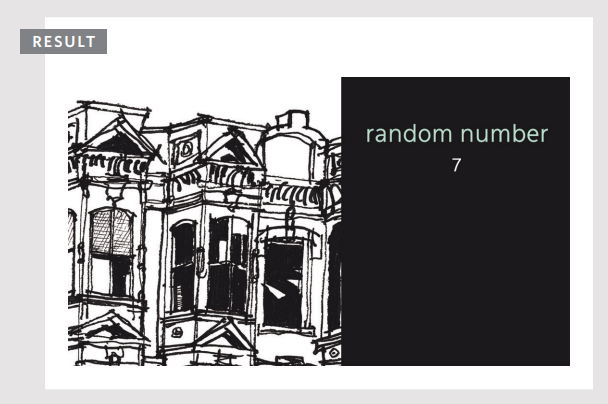

## CREAR UNA INSTANCIA DEL OBJETO DATE

Para trabajar con fechas, creas una instancia del objeto **Date**. Luego puedes especificar la hora y fecha que quieres que represente.

Para crear un objeto **Date**, usa el constructor `Date()`. La sintaxis es la misma que para crear cualquier objeto con una función constructora (ver pág. 108). Puedes usarlo para crear más de un objeto **Date**.

Por defecto, cuando creas un objeto **Date**, contendrá la fecha de hoy y la hora actual. Si quieres que almacene otra fecha, debes especificar explícitamente la fecha y hora que quieres que contenga.

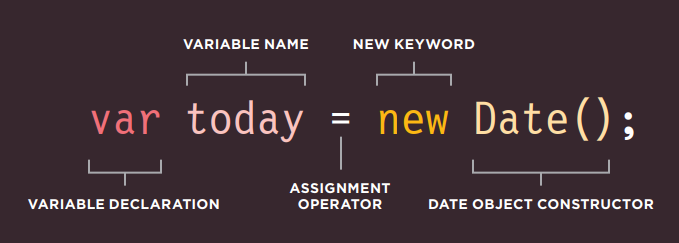

Puedes pensar en lo anterior como crear una variable llamada **today** que contiene un número. Esto se debe a que en JavaScript, las fechas se almacenan como un número: específicamente el número de milisegundos desde la medianoche del 1 de enero de 1970.

Ten en cuenta que la fecha/hora actual está determinada por el reloj de la computadora. Si el usuario está en una zona horaria diferente a la tuya, su día puede comenzar antes o después que el tuyo. Además, si el reloj interno de su computadora tiene la fecha u hora incorrecta, el objeto **Date** podría reflejar esto conteniendo la fecha incorrecta.

El constructor `Date()` le dice al intérprete de JavaScript que esta variable es una fecha, y esto a su vez te permite usar los métodos del objeto **Date** para establecer y recuperar fechas y horas de este objeto **Date** (ver la página de la derecha para una lista de métodos). Puedes establecer la fecha y/o hora usando cualquiera de los siguientes formatos (o métodos mostrados a la derecha):

```js linenums="1"
var dob = new Date(1996, 11, 26, 15, 45, 55);
var dob = new Date('Dec 26, 1996 15:45:55');
var dob = new Date(1996, 11, 26);
```

### OBJETOS GLOBALES: EL OBJETO DATE (Y HORA)

Una vez que has creado un objeto **Date**, los siguientes métodos te permiten establecer y recuperar la hora y fecha que representa.

| MÉTODO | DESCRIPCIÓN |
|---|---|
| `getDate()` / `setDate()` | Devuelve / establece el día del mes (1-31) |
| `getDay()` | Devuelve el día de la semana (0-6) |
| `getFullYear()` / `setFullYear()` | Devuelve / establece el año (4 dígitos) |
| `getHours()` / `setHours()` | Devuelve / establece la hora (0-23) |
| `getMilliseconds()` / `setMilliseconds()` | Devuelve / establece los milisegundos (0-999) |
| `getMinutes()` / `setMinutes()` | Devuelve / establece los minutos (0-59) |
| `getMonth()` / `setMonth()` | Devuelve / establece el mes (0-11) |
| `getSeconds()` / `setSeconds()` | Devuelve / establece los segundos (0-59) |
| `getTime()` / `setTime()` | Número de milisegundos desde el 1 de enero de 1970, 00:00:00 UTC (Tiempo Universal Coordinado) y un número negativo para cualquier fecha anterior |
| `getTimezoneOffset()` | Devuelve la diferencia de zona horaria en minutos para la configuración regional |
| `toDateString()` | Devuelve la "fecha" como una cadena legible por humanos |
| `toTimeString()` | Devuelve la "hora" como una cadena legible por humanos |
| `toString()` | Devuelve una cadena que representa la fecha especificada |

El método `toDateString()` mostrará la fecha en el siguiente formato: `Wed Apr 16 1975`. Si quieres mostrar la fecha de otra manera, puedes construir un formato de fecha diferente usando los métodos individuales listados anteriormente para representar las partes individuales: día, fecha, mes, año.

`toTimeString()` muestra la hora.

Varios lenguajes de programación especifican las fechas en milisegundos desde la medianoche del 1 de enero de 1970. Esto se conoce como **Unix time** (tiempo Unix).

La ubicación de un visitante puede afectar las zonas horarias y el idioma hablado. Los programadores usan el término **locale** (configuración regional) para referirse a este tipo de información basada en la ubicación.

El objeto **Date** no almacena los nombres de los días o meses, ya que varían entre idiomas. En su lugar, usa un número del 0 al 6 para los días de la semana y del 0 al 11 para los meses. Para mostrar sus nombres, necesitas crear un arreglo para almacenarlos (ver pág. 143).

### CREAR UN OBJETO DATE

1. En este ejemplo, se crea un nuevo objeto **Date** usando el constructor `Date()`. Se llama **today**.

Si no especificas una fecha al crear un objeto **Date**, contendrá la fecha y hora en que el intérprete de JavaScript encuentra esa línea de código.

Una vez que tienes una instancia del objeto **Date** (que contiene la fecha y hora actuales), puedes usar cualquiera de sus propiedades o métodos.

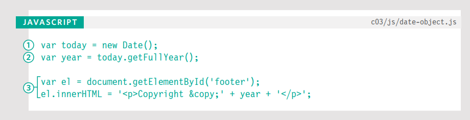

2. En este ejemplo, puedes ver que `getFullYear()` se usa para devolver el año de la fecha que se almacena en el objeto **Date**.

3. En este caso, se usa para escribir el año actual en una declaración de derechos de autor.

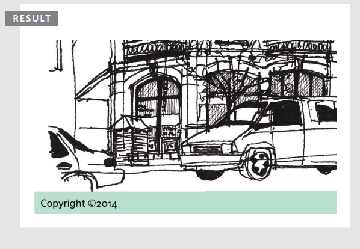

### TRABAJAR CON FECHAS Y HORAS

Para especificar una fecha y hora, puedes usar este formato: 

`YYYY, MM, DD, HH, MM, SS`. Por ejemplo: `1996, 03, 16, 15, 45, 55`. 

Esto representa las 3:45pm y 55 segundos del 16 de abril de 1996.

El orden y la sintaxis para esto es:

- **Year**: cuatro dígitos
- **Month**: 0-11 (Enero es 0)
- **Day**: 1-31
- **Hour**: 0-23
- **Minutes**: 0-59
- **Seconds**: 0-59
- **Milliseconds**: 0-999

Otra forma de formatear la fecha y hora es así: 

`MMM DD, YYYY HH:MM:SS`
`Apr 16, 1996 15:45:55`. 

Puedes omitir la parte de la hora si no la necesitas.

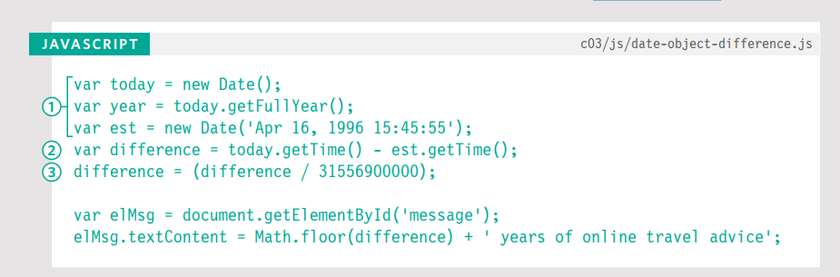

1. En este ejemplo, puedes ver una fecha establecida en el pasado.

2. Si intentas encontrar la diferencia entre dos fechas, obtendrás un resultado en milisegundos.

3. Para obtener la diferencia en días/semanas/años, divides este número por la cantidad de milisegundos en un día/semana/año. Aquí el número se divide por 31,556,900,000 – la cantidad de milisegundos en un año (que no es bisiesto).


## EJEMPLO

Este ejemplo está dividido en dos partes. La primera te muestra los detalles sobre el hotel, la tarifa de la habitación y la tarifa de oferta. La segunda parte indica cuándo expira la oferta.

Todo el código se coloca dentro de una expresión de función invocada inmediatamente (IIFE) para asegurar que cualquier nombre de variable usado en el script no entre en conflicto con nombres de variable usados en otros scripts.

La primera parte del script crea un objeto **hotel**; tiene tres propiedades (el nombre del hotel, la tarifa de la habitación y el porcentaje de descuento ofrecido), más un método para calcular el precio de oferta que se muestra al usuario.

Los detalles del descuento se escriben en la página usando información de este objeto **hotel**. Para asegurar que la tarifa con descuento se muestre con dos lugares decimales (como se muestran la mayoría de los precios), se usa el método `.toFixed()` del objeto **Number**.

La segunda parte del script muestra que la oferta expirará en siete días. Hace esto usando una función llamada `offerExpires()`. La fecha actualmente establecida en la computadora del usuario se pasa como un argumento a la función `offerExpires()` para que pueda calcular cuándo termina la oferta.

Dentro de la función, se crea un nuevo objeto **Date**; y se agregan siete días a la fecha de hoy. El objeto **Date** representa los días y meses como números (comenzando en 0), por lo que – para mostrar el nombre del día y del mes – se crean dos arreglos que almacenan todos los nombres posibles de días y meses. Cuando se escribe el mensaje, recupera el día/mes apropiado de esos arreglos.

El mensaje para mostrar la fecha de vencimiento se construye dentro de una variable llamada **expiryMsg**. El código que llama a la función `offerExpires()` y muestra el mensaje está al final del script. Selecciona el elemento donde debe aparecer el mensaje y actualiza su contenido usando la propiedad **innerHTML**, que conocerás en el Capítulo 5.

### EJEMPLO - FUNCTIONS, METHODS & OBJECTS

```js linenums="1"
/* El script se coloca dentro de una expresión de función invocada inmediatamente
 que ayuda a proteger el ámbito de las variables */
(function() {
 // PARTE UNO: CREAR OBJETO HOTEL Y ESCRIBIR LOS DETALLES DE LA OFERTA
 // Crear un objeto hotel usando sintaxis literal de objetos
 var hotel = {
   name: 'Park',
   roomRate: 240, // Cantidad en dólares
   discount: 15, // Porcentaje de descuento
   offerPrice: function() {
 var offerRate = this.roomRate * ((100 - this.discount) / 100);
 return offerRate;
 }
 };
 // Escribir el nombre del hotel, la tarifa estándar y la tarifa especial
 var hotelName, roomRate, specialRate; // Declarar variables
 
 hotelName = document.getElementById('hotelName'); // Obtener elementos
 roomRate = document.getElementById('roomRate');
 specialRate = document.getElementById('specialRate');
 
 hotelName.textContent = hotel.name; // Escribir nombre del hotel
 roomRate.textContent = '$' + hotel.roomRate.toFixed(2); // Escribir tarifa de habitación
 specialRate.textContent = '$' + hotel.offerPrice(); // Escribir precio de oferta
```

```js linenums="1"
// PARTE DOS: CALCULAR Y ESCRIBIR LOS DETALLES DE VENCIMIENTO DE LA OFERTA
var expiryMsg; // Mensaje mostrado a los usuarios
var today; // Fecha de hoy
var elEnds; // El elemento que muestra el mensaje sobre el fin de la oferta

function offerExpires(today) {
 // Declarar variables dentro de la función para ámbito local
 var weekFromToday, day, date, month, year, dayNames, monthNames;

// Agregar 7 días de tiempo (agregado en milisegundos)
 weekFromToday = new Date(today.getTime() + 7 * 24 * 60 * 60 * 1000);

// Crear arreglos para contener los nombres de los días / meses
 dayNames = ['Sunday', 'Monday', 'Tuesday', 'Wednesday', 'Thursday',
 'Friday', 'Saturday'];
 monthNames = ['January', 'February', 'March', 'April', 'May', 'June',
 'July', 'August', 'September', 'October', 'November', 'December'];
 
 // Recoger las partes de la fecha para mostrar en la página
 day = dayNames[weekFromToday.getDay()];
 date = weekFromToday.getDate();
 month = monthNames[weekFromToday.getMonth()];
 year = weekFromToday.getFullYear();
 
 // Crear el mensaje
 expiryMsg = 'Offer expires next ';
 expiryMsg += day + ' <br />(' + date + ' ' + month + ' ' + year + ')';
 return expiryMsg;
}
today = new Date(); // Poner la fecha de hoy en la variable
elEnds = document.getElementById('offerEnds'); // Obtener el elemento offerEnds
elEnds.innerHTML = offerExpires(today);        // Agregar el mensaje de vencimiento
// Finalizar la expresión de función invocada inmediatamente
}());
```

Esta es una buena demostración de varios conceptos relacionados con la fecha, pero si el usuario tiene la fecha incorrecta en su computadora (quizás su reloj está configurado incorrectamente), no mostrará una fecha dentro de siete días a partir de ahora – mostrará una fecha dentro de siete días a partir de la hora que la computadora cree que es.

### RESUMEN

- [x] Las funciones te permiten agrupar un conjunto de sentencias relacionadas que representan una sola tarea.
- [x] Las funciones pueden tomar parámetros (información requerida para hacer su trabajo) y pueden devolver un valor.
- [x] Un objeto es una serie de variables y funciones que representan algo del mundo que te rodea.
- [x] En un objeto, las variables se conocen como propiedades del objeto; las funciones se conocen como métodos del objeto.
- [x] Los navegadores web implementan objetos que representan tanto la ventana del navegador como el documento cargado en la ventana del navegador.
- [x] JavaScript también tiene varios objetos incorporados como **String**, **Number**, **Math** y **Date**. Sus propiedades y métodos ofrecen funcionalidad que te ayuda a escribir scripts.
- [x] Los arreglos y objetos se pueden usar para crear conjuntos de datos complejos (y ambos pueden contener al otro).


