# DECISIONES Y BUCLES

Al observar un diagrama de flujo (excepto en los scripts más básicos), el código puede tomar más de un camino, lo que significa que el navegador ejecuta código diferente en distintas situaciones. En este capítulo, aprenderás a crear y controlar el flujo de datos en tus scripts para manejar diferentes situaciones.

> Los scripts a menudo necesitan comportarse de manera diferente dependiendo de cómo el usuario interactúa con la página web y/o la ventana del navegador. Para determinar qué camino tomar, los programadores a menudo se basan en los siguientes tres conceptos:

| Concepto | Descripción |
|---------|-------------|
| **EVALUACIONES** | Puedes analizar valores en tus scripts para determinar si coinciden o no con los resultados esperados. |
| **DECISIONES** | Usando los resultados de las evaluaciones, puedes decidir qué camino debe seguir tu script. |
| **BUCLES** | También hay muchas ocasiones en las que querrás realizar el mismo conjunto de pasos repetidamente. |

## TOMA DE DECISIONES

A menudo hay varios lugares en un script donde se toman decisiones que determinan qué líneas de código deben ejecutarse a continuación. Los diagramas de flujo pueden ayudarte a planificar estas ocasiones.

En un diagrama de flujo, la forma de diamante representa un punto donde se debe tomar una decisión y el código puede tomar uno de dos caminos diferentes. Cada camino está compuesto por un conjunto diferente de tareas, lo que significa que debes escribir código diferente para cada situación.

Para determinar qué camino tomar, estableces una condición. Por ejemplo, puedes verificar si un valor es igual a otro, mayor que otro o menor que otro. Si la condición devuelve `true`, tomas un camino; si es `false`, tomas el otro.

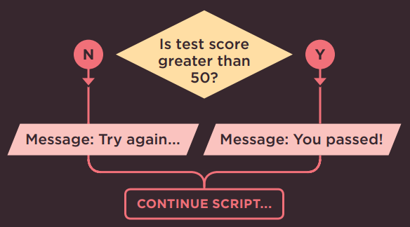

De la misma manera que hay operadores para hacer matemáticas básicas o para unir dos cadenas de texto, existen operadores de comparación que te permiten comparar valores y evaluar si una condición se cumple o no.

Ejemplos de operadores de comparación incluyen los símbolos mayor que (`>`) y menor que (`<`), y el doble signo igual (`==`) que verifica si dos valores son iguales.

## EVALUACIÓN DE CONDICIONES Y SENTENCIAS CONDICIONALES

Hay dos componentes en una decisión:

1.  **Una expresión** se evalúa y devuelve un valor.
2.  **Una sentencia condicional** dice qué hacer en una situación determinada.

### EVALUACIÓN DE UNA CONDICIÓN

Para tomar una decisión, tu código verifica el estado actual del script. Esto se hace comúnmente comparando dos valores usando un operador de comparación que devuelve un valor de `true` o `false`.

### SENTENCIAS CONDICIONALES

Una sentencia condicional se basa en el concepto de si/entonces/si no (if/then/else); si una condición se cumple, entonces tu código ejecuta una o más sentencias, si no, tu código hace algo diferente (o simplemente omite el paso).

### LO QUE ESTO DICE:

```js linenums="1"
if (score > 50) {
  document.write('You passed!');
} else {
  document.write('Try again...');
}
```

Si la condición devuelve `true`:
  ejecuta las sentencias entre el primer par de llaves
De lo contrario:
  ejecuta las sentencias entre el segundo par de llaves

(También verás valores truthy y falsy en la pág. 167. Se tratan como si fueran `true` o `false`).

También puedes tener múltiples condiciones combinando dos o más operadores de comparación. Por ejemplo, puedes verificar si dos condiciones se cumplen ambas, o si solo una de varias condiciones se cumple.

En las próximas páginas, conocerás varias variaciones de las sentencias `if...`, y también una sentencia llamada `switch`. En conjunto, se conocen como sentencias condicionales.

### OPERADORES DE COMPARACIÓN: EVALUANDO CONDICIONES

Puedes evaluar una situación comparando un valor en el script con lo que esperas que sea. El resultado será un valor booleano: `true` o `false`.

`==` ES IGUAL A

Este operador compara dos valores (números, cadenas o booleanos) para ver si son iguales.
`'Hello' == 'Goodbye'` devuelve `false` porque no son la misma cadena.
`'Hello' == 'Hello'` devuelve `true` porque son la misma cadena.
Generalmente es preferible usar el método estricto.

`!=` ES DIFERENTE DE

Este operador compara dos valores (números, cadenas o booleanos) para ver si no son iguales.

`'Hello' != 'Goodbye'` devuelve `true` porque no son la misma cadena.

`'Hello' != 'Hello'` devuelve `false` porque son la misma cadena.
Generalmente es preferible usar el método estricto.

`===` ESTRICTAMENTE IGUAL

Este operador compara dos valores para verificar que tanto el tipo de dato como el valor sean iguales.

`'3' === 3` devuelve `false` porque no son el mismo tipo de dato ni valor.

`'3' === '3'` devuelve `true` porque son el mismo tipo de dato y valor.

`!==` ESTRICTAMENTE DIFERENTE

Este operador compara dos valores para verificar que tanto el tipo de dato como el valor no sean iguales.

`'3' !== 3` devuelve `true` porque no son el mismo tipo de dato ni valor.

`'3' !== '3'` devuelve `false` porque son el mismo tipo de dato y valor.

Los programadores se refieren a la prueba o verificación de una condición como evaluar la condición. Las condiciones pueden ser mucho más complejas que las mostradas aquí, pero generalmente resultan en un valor `true` o `false`.

Hay un par de excepciones notables:

- Todo valor puede tratarse como `true` o `false` incluso si no es un valor booleano `true` o `false` (ver pág. 167).
-  En la evaluación de cortocircuito, es posible que una condición no necesite ejecutarse (ver pág. 169).

`>` **MAYOR QUE**

Este operador verifica si el número de la izquierda es mayor que el número de la derecha.

!!! info

      - [x] `4 > 3` devuelve `true`
      - [x] `3 > 4` devuelve `false`

`<` **MENOR QUE**

Este operador verifica si el número de la izquierda es menor que el número de la derecha.

!!! info

    - [x] `4 < 3` devuelve `false`
    - [x] `3 < 4` devuelve `true`
  
`>=` **MAYOR O IGUAL QUE**

Este operador verifica si el número de la izquierda es mayor o igual que el número de la derecha.

!!! info

    - [x] `4 >= 3` devuelve `true`
    - [x] `3 >= 4` devuelve `false`
    - [x] `3 >= 3` devuelve `true`

`<=` **MENOR O IGUAL QUE**

Este operador verifica si el número de la izquierda es menor o igual que el número de la derecha.

!!! info

    - [x] `4 <= 3` devuelve `false`
    - [x] `3 <= 4` devuelve `true`
    - [x] `3 <= 3` devuelve `true`

## ESTRUCTURANDO OPERADORES DE COMPARACIÓN

En cualquier condición, generalmente hay un operador y dos operandos. Los operandos se colocan a cada lado del operador. Pueden ser valores o variables. A menudo verás expresiones encerradas entre paréntesis.

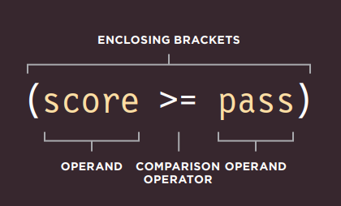

Si recuerdas del Capítulo 2, esto es un ejemplo de una expresión porque la condición se resuelve en un solo valor: en este caso será `true` o `false`.

Los paréntesis son importantes cuando la expresión se usa como condición en un operador de comparación. Pero cuando asignas un valor a una variable, no son necesarios (ver página opuesta).

## USANDO OPERADORES DE COMPARACIÓN

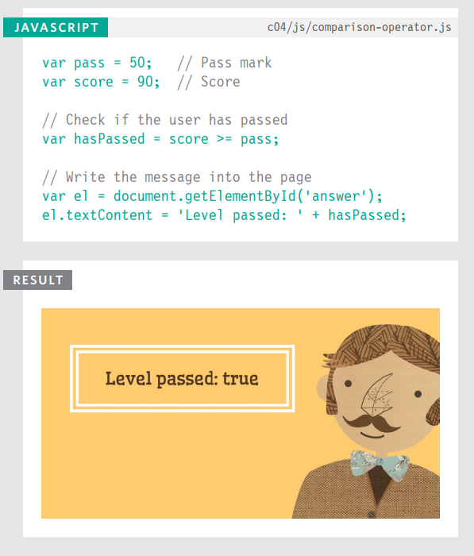

En el nivel más básico, puedes evaluar dos variables usando un operador de comparación para devolver un valor `true` o `false`.

En este ejemplo, un usuario está realizando una prueba y el script le indica si ha aprobado esta ronda de la prueba.

El ejemplo comienza estableciendo dos variables:

1. `pass` para contener la nota de aprobación
2. `score` para contener la puntuación del usuario

Para ver si el usuario ha aprobado, un operador de comparación verifica si `score` es mayor o igual que `pass`. El resultado será `true` o `false`, y se almacena en una variable llamada `hasPassed`. En la siguiente línea, el resultado se escribe en la pantalla.

Las últimas dos líneas seleccionan el elemento cuyo atributo `id` tiene un valor de `answer`, y luego actualizan su contenido. Aprenderás más sobre esta técnica en el próximo capítulo.

## USANDO EXPRESIONES CON OPERADORES DE COMPARACIÓN

El operando no tiene que ser un solo valor o nombre de variable. Un operando puede ser una expresión (porque cada expresión se evalúa como un solo valor).

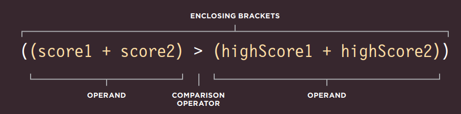

## COMPARANDO DOS EXPRESIONES

En este ejemplo, hay dos rondas en la prueba y el código verificará si el usuario ha alcanzado un nuevo puntaje más alto, superando el récord anterior.

El script comienza almacenando las puntuaciones del usuario para cada ronda en variables. Luego, las puntuaciones más altas para cada ronda se almacenan en dos variables más.

El operador de comparación verifica si la puntuación total del usuario es mayor que la puntuación más alta de la prueba y almacena el resultado en una variable llamada `comparison`.


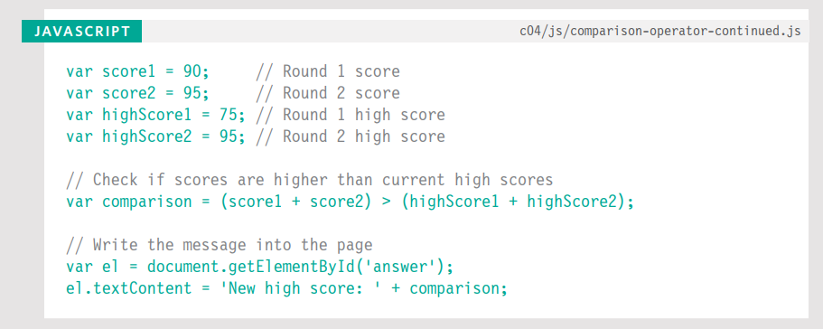

En el operador de comparación, el operando de la izquierda calcula la puntuación total del usuario. El operando de la derecha suma las puntuaciones más altas de cada ronda. El resultado se agrega luego a la página.

Cuando asignas el resultado de la comparación a una variable, no es estrictamente necesario usar los paréntesis contenedores (mostrados en blanco en la página izquierda). Algunos programadores los usan de todos modos para indicar que el código se evalúa como un solo valor. Otros solo usan paréntesis contenedores cuando forman parte de una condición.

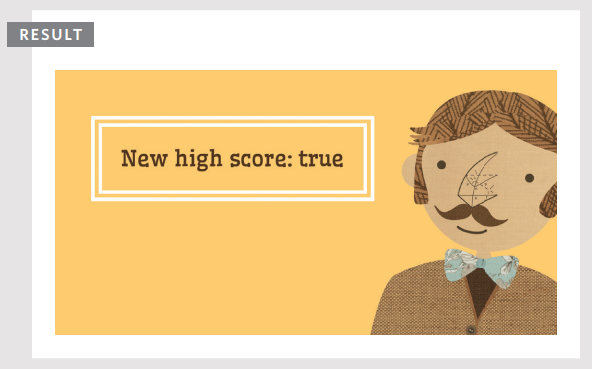

## OPERADORES LÓGICOS

Los operadores de comparación generalmente devuelven valores individuales de `true` o `false`. Los operadores lógicos te permiten comparar los resultados de más de un operador de comparación.

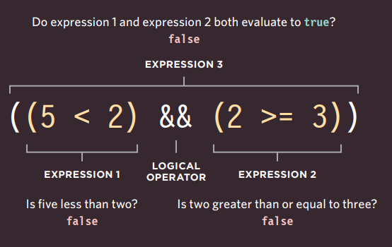

En esta línea de código hay tres expresiones, cada una de las cuales se resolverá en el valor `true` o `false`. Las expresiones de la izquierda y la derecha usan operadores de comparación, y ambas devuelven `false`.

La tercera expresión usa un operador lógico (en lugar de un operador de comparación). El operador lógico AND verifica si ambas expresiones a cada lado devuelven `true` (en este caso no lo hacen, por lo que se evalúa como `false`).

`&&` **AND LÓGICO**

Este operador prueba más de una condición.

!!! info 

    `((2 < 5) && (3 >= 2))` devuelve `true`
    
    Si ambas expresiones se evalúan como `true`, entonces la expresión devuelve `true`. Si solo una de ellas devuelve `false`, entonces la expresión devolverá `false`.

    - [x] `true && true` devuelve `true`
    - [x] `true && false` devuelve `false`
    - [x] `false && true` devuelve `false`
    - [x] `false && false` devuelve `false`

`||` **OR LÓGICO**

Este operador prueba al menos una condición.

!!! info 

    `((2 < 5) || (2 < 1))` devuelve `true`

    Si cualquiera de las expresiones se evalúa como `true`, entonces la expresión devuelve `true`. Si ambas devuelven `false`, entonces la expresión devolverá `false`.

    - [x] `true || true` devuelve `true`
    - [x] `true || false` devuelve `true`
    - [x] `false || true` devuelve `true`
    - [x] `false || false` devuelve `false`

`!` **NOT LÓGICO**

Este operador toma un solo valor booleano y lo invierte.

!!! info 

    `!(2 < 1)` devuelve `true`
    
    Esto invierte el estado de una expresión. Si era `false` (sin el `!` delante) devolvería `true`. Si la sentencia era `true`, devolvería `false`.

    - [x] `!true` devuelve `false`
    - [x] `!false` devuelve `true`

## EVALUACIÓN DE CORTO CIRCUITO

Las expresiones lógicas se evalúan de izquierda a derecha. Si la primera condición puede proporcionar suficiente información para obtener la respuesta, entonces no es necesario evaluar la segunda condición.

```js
false && cualquier cosa
  ^
  ha encontrado un false
```
No tiene sentido continuar para determinar el otro resultado. No pueden ser ambas `true`.

```js
true || cualquier cosa
  ^
  ha encontrado un true
```
No tiene sentido continuar porque al menos uno de los valores es `true`.

## USANDO AND LÓGICO

En este ejemplo, una prueba de matemáticas tiene dos rondas. Para cada ronda hay dos variables: una contiene la puntuación del usuario para esa ronda; la otra contiene la nota de aprobación para esa ronda.

El AND lógico se usa para ver si la puntuación del usuario es mayor o igual que la nota de aprobación en ambas rondas de la prueba. El resultado se almacena en una variable llamada `passBoth`.

El ejemplo finaliza informando al usuario si ha aprobado o no ambas rondas.

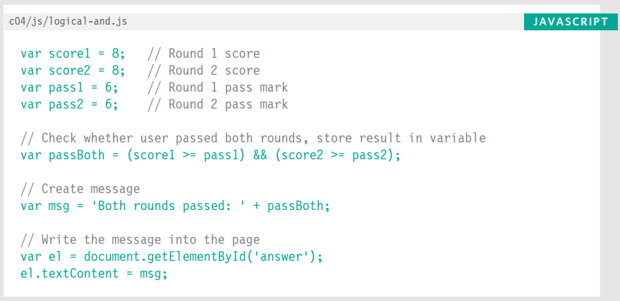

Es raro que alguna vez escribas el resultado booleano directamente en la página (como estamos haciendo aquí). Como verás más adelante en el capítulo, es más probable que verifiques una condición y, si es `true`, ejecutes otras sentencias.

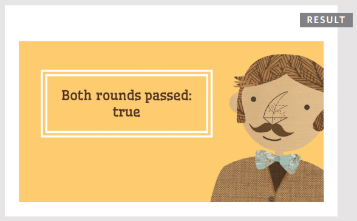

## USANDO OR LÓGICO Y NOT LÓGICO

Aquí está la misma prueba pero esta vez usando el operador OR lógico para saber si el usuario ha aprobado al menos una de las dos rondas. Si aprueba solo una ronda, no necesita volver a tomar la prueba.

Observa los números almacenados en las cuatro variables al inicio del ejemplo. El usuario ha aprobado ambas rondas, por lo que la variable `minPass` contendrá el valor booleano `true`.

A continuación, el mensaje se almacena en una variable llamada `msg`. Al final del mensaje, el NOT lógico invertirá el resultado de la variable booleana para que sea `false`. Luego se escribe en la página.

```js linenums="1"
// c04/js/logical-or-logical-not.js

var score1 = 8; // Puntuación ronda 1
var score2 = 8; // Puntuación ronda 2
var pass1 = 6; // Nota de aprobación ronda 1
var pass2 = 6; // Nota de aprobación ronda 2
// Verifica si el usuario aprobó una de las dos rondas, almacena el resultado en una variable
var minPass = ((score1 >= pass1) || (score2 >= pass2));

// Crea el mensaje
var msg = 'Resit required: ' + !(minPass);

// Escribe el mensaje en la página
var el = document.getElementById('answer');
el.textContent = msg;
```


## SENTENCIAS IF

La sentencia `if` evalúa (o verifica) una condición. Si la condición se evalúa como `true`, se ejecutan las sentencias en el bloque de código subsiguiente.

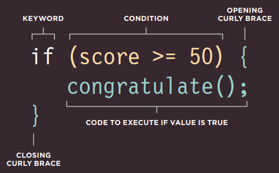

Si la condición se evalúa como `true`, el siguiente bloque de código (el código en el siguiente par de llaves) se ejecuta.

Si la condición se resuelve como `false`, las sentencias en ese bloque de código no se ejecutan. (El script continúa ejecutándose desde el final del siguiente bloque de código).

```js linenums="1"
// c04/js/if-statement.js

var score = 75; // Puntuación
var msg; // Mensaje
if (score >= 50) { // Si la puntuación es 50 o más
  msg = 'Congratulations!';
  msg += ' Proceed to the next round.';
}
var el = document.getElementById('answer');
el.textContent = msg;
```

En este ejemplo, la sentencia `if` está verificando si el valor actualmente almacenado en una variable llamada `score` es 50 o más.

En este caso, la sentencia se evalúa como `true` (porque la puntuación es 75, que es mayor que 50). Por lo tanto, el contenido de las sentencias dentro del bloque de código subsiguiente se ejecuta, creando un mensaje que felicita al usuario y le indica que continúe.

Después del bloque de código, el mensaje se escribe en la página.

Si el valor de la variable `score` hubiera sido menor que 50, las sentencias en el bloque de código no se habrían ejecutado, y el código habría continuado en la siguiente línea después del bloque de código.

En la parte de abajo hay una versión alternativa del mismo ejemplo que demuestra cómo las líneas de código no siempre se ejecutan en el orden que esperas. Si la condición se cumple entonces:

1. La primera sentencia en el bloque de código llama a la función `congratulate()`.
2. El código dentro de la función `congratulate()` se ejecuta.
3. La segunda línea dentro del bloque de código de la sentencia `if` se ejecuta.

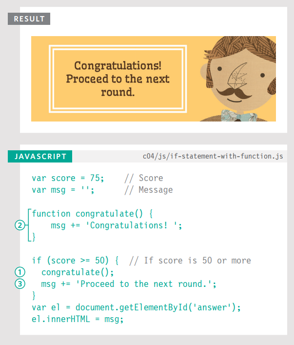

## SENTENCIAS IF...ELSE

La sentencia `if...else` verifica una condición. Si se resuelve como `true`, se ejecuta el primer bloque de código. Si la condición se resuelve como `false`, se ejecuta el segundo bloque de código.

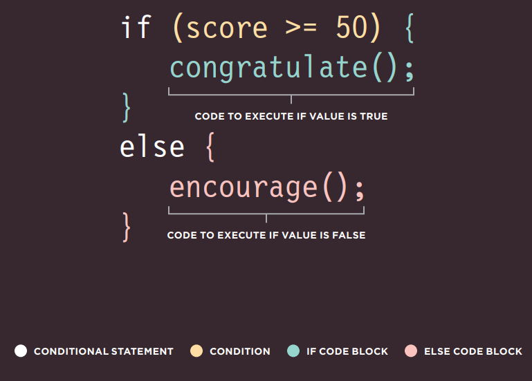

## USANDO SENTENCIAS IF...ELSE

```js linenums="1"
// c04/js/if-else-statement.js

var pass = 50; // Nota de aprobación
var score = 75; // Puntuación actual
var msg; // Mensaje

// Selecciona el mensaje según la puntuación
if (score >= pass) {
  msg = 'Congratulations, you passed!';
} else {
  msg = 'Have another go!';
}
var el = document.getElementById('answer');
el.textContent = msg;
```
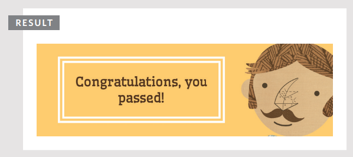

Aquí puedes ver que una sentencia `if...else` te permite proporcionar dos conjuntos de código:

1. uno si la condición se evalúa como `true`
2. otro si la condición es `false`

En esta prueba, hay dos resultados posibles: un usuario puede obtener una puntuación igual o mayor que la nota de aprobación (lo que significa que aprueba), o puede obtener una puntuación menor que la nota de aprobación (lo que significa que falla). Se requiere una respuesta para cada eventualidad. La respuesta se escribe luego en la página.

Ten en cuenta que las sentencias dentro de una sentencia `if` deben ir seguidas de un punto y coma, pero no es necesario colocar uno después de la llave de cierre de los bloques de código.

Una sentencia `if` solo ejecuta un conjunto de sentencias si la condición es `true`:

Una sentencia `if...else` ejecuta un conjunto de código si la condición es `true` o un conjunto diferente si es `false`:

## SENTENCIAS SWITCH
Una sentencia `switch` comienza con una variable llamada valor switch. Cada `case` indica un posible valor para esta variable y el código que debería ejecutarse si la variable coincide con ese valor.

```js linenums="1"
switch (level) {
  case 'One':
    title = 'Level 1';
    break;
  case 'Two':
    title = 'Level 2';
    break;
  case 'Three':
    title = 'Level 3';
    break;
  default:
    title = 'Test';
    break;
}
```


Aquí, la variable llamada `level` es el valor switch. Si el valor de la variable `level` es el string `One`, entonces se ejecuta el código del primer `case`. Si es `Two`, se ejecuta el segundo `case`. Si es `Three`, se ejecuta el tercer `case`. Si no es ninguno de estos, se ejecuta el código del `default`.

Toda la sentencia vive en un solo bloque de código (un par de llaves), y dos puntos separan la opción de las sentencias que se ejecutarán si el `case` coincide con el valor switch.

Al final de cada `case` está la palabra clave `break`. Le indica al intérprete de JavaScript que ha terminado con esta sentencia `switch` y que continúe ejecutando cualquier código subsiguiente que aparezca después.

**IF…ELSE**

- No hay necesidad de proporcionar una opción `else`. (Puedes usar solo una sentencia `if`).
- Con una serie de sentencias `if`, todas se verifican incluso si ya se encontró una coincidencia (por lo que funciona más lento que `switch`).

**SWITCH**

- Tienes una opción `default` que se ejecuta si ninguno de los `case` coincide.
- Si se encuentra una coincidencia, ese código se ejecuta; luego la sentencia `break` detiene la ejecución del resto de la sentencia `switch` (proporcionando mejor rendimiento que múltiples sentencias `if`).

## USANDO SENTENCIAS SWITCH

```js linenums="1"
var msg; // Mensaje
var level = 2; // Nivel

// Determina el mensaje según el nivel
switch (level) {
  case 1:
    msg = 'Good luck on the first test';
    break;
    
  case 2:
    msg = 'Second of three - keep going!';
    break;

  case 3:
    msg = 'Final round, almost there!';
    break;

  default:
    msg = 'Good luck!';
    break;
}
var el = document.getElementById('answer');
el.textContent = msg;
```

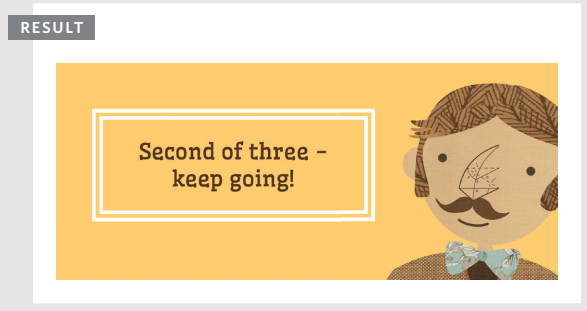

En este ejemplo, el propósito de la sentencia `switch` es presentar al usuario un mensaje diferente dependiendo del nivel en el que se encuentre. El mensaje se almacena en una variable llamada `msg`.

La variable llamada `level` contiene un número que indica en qué nivel se encuentra el usuario. Este se usa como valor switch. (El valor switch también podría ser una expresión).

En el siguiente bloque de código (dentro de las llaves), hay tres opciones para lo que podría ser el valor de la variable `level`: los números 1, 2 o 3.

Si el valor de la variable `level` es el número 1, el valor de la variable `msg` se establece en `'Good luck on the first test'`.

Si el valor es 2, dirá: `'Second of three - keep going!'`

Si el valor es 3, el mensaje dirá: `'Final round, almost there!'`

Si no se encuentra ninguna coincidencia, entonces el valor de la variable `msg` se establece en `'Good luck!'`

Cada `case` termina con la palabra clave `break` que le indica al intérprete de JavaScript que omita el resto de este bloque de código y continúe con el siguiente.

## COERCIÓN DE TIPOS Y TIPADO DÉBIL

Si usas un tipo de dato que JavaScript no esperaba, intenta darle sentido a la operación en lugar de reportar un error.

| Tipo de Dato | Propósito |
|-------------|-----------|
| string | Texto |
| number | Número |
| Boolean | `true` o `false` |
| null | Valor vacío |
| undefined | Variable declarada pero aún no se le ha asignado un valor |

> `NaN` es un valor que se cuenta como número. Puedes verlo cuando se espera un número, pero no se devuelve, ej: `('ten'/2)` da como resultado `NaN`.

JavaScript puede convertir tipos de datos detrás de escena para completar una operación. Esto se conoce como coerción de tipos. Por ejemplo, un string `'1'` podría convertirse al número `1` en la siguiente expresión: `('1' > 0)`. Como resultado, la expresión anterior se evaluaría como `true`.

Se dice que JavaScript usa tipado débil porque el tipo de dato de un valor puede cambiar. Algunos otros lenguajes requieren que especifiques qué tipo de dato tendrá cada variable. Se dice que usan tipado fuerte.

La coerción de tipos puede llevar a valores inesperados en tu código (y también causar errores). Por lo tanto, al verificar si dos valores son iguales, se considera mejor usar los operadores de igualdad estricta `===` y `!==` en lugar de `==` y `!=`, ya que estos operadores estrictos verifican que el valor y el tipo de dato coincidan.

## VALORES TRUTHY Y FALSY

Debido a la coerción de tipos, cada valor en JavaScript puede tratarse como si fuera `true` o `false`; y esto tiene algunos efectos secundarios interesantes.

### VALORES FALSY

| Valor | Descripción |
|-------|-------------|
| `var highScore = false;` | El booleano `false` tradicional |
| `var highScore = 0;` | El número cero |
| `var highScore = '';` | Valor vacío |
| `var highScore = 10/'score';` | NaN (Not a Number) |
| `var highScore;` | Una variable sin valor asignado |

Los valores falsy son tratados como si fueran `false`. La tabla de la izquierda muestra una variable `highScore` con una serie de valores, todos los cuales son falsy.

Los valores falsy también pueden ser tratados como el número 0.

> Casi todo lo demás se evalúa como truthy…

### VALORES TRUTHY

| Valor | Descripción |
|-------|-------------|
| `var highScore = true;` | El booleano `true` tradicional |
| `var highScore = 1;` | Números distintos de cero |
| `var highScore = 'carrot';` | Strings con contenido |
| `var highScore = 10/5;` | Cálculos numéricos |
| `var highScore = 'true';` | `true` escrito como string |
| `var highScore = '0';` | Cero escrito como string |
| `var highScore = 'false';` | `false` escrito como string |

 
Los valores truthy son tratados como si fueran `true`. Casi todo lo que no está en la tabla falsy puede tratarse como si fuera `true`.

Los valores truthy también pueden ser tratados como el número 1.

Además, la presencia de un objeto o un array generalmente también se considera truthy. Esto se usa comúnmente al verificar la presencia de un elemento en una página.

La página siguiente explicará más sobre por qué estos conceptos son importantes.

Casi todo lo demas se evalua como truthy...

## VERIFICANDO IGUALDAD Y EXISTENCIA

Debido a que la presencia de un objeto o array puede considerarse truthy, se usa a menudo para verificar la existencia de un elemento dentro de una página.

Un **operador unario** devuelve un resultado con solo un operando. Aquí puedes ver una sentencia `if` verificando la presencia de un elemento. Si el elemento se encuentra, el resultado es truthy, por lo que se ejecuta el primer conjunto de código. Si no se encuentra, se ejecuta el segundo conjunto.

```js linenums="1"
if (document.getElementById('header')) {
  // Encontrado: hacer algo
} else {
  // No encontrado: hacer otra cosa
}
```

Quienes son nuevos en JavaScript a menudo piensan que lo siguiente haría lo mismo:

```js linenums="1"
if (document.getElementById('header') == true)
```

Pero `document.getElementById('header')` devolvería un objeto que es un valor truthy pero no es igual a un valor booleano `true`.

Debido a la coerción de tipos, los operadores de igualdad estricta `===` y `!==` resultan en menos valores inesperados que `==` y `!=`.

Si usas `==`, los siguientes valores pueden considerarse iguales: `false`, `0` y `''` (string vacío). Sin embargo, no son equivalentes cuando se usan los operadores estrictos.

| Expresión | Resultado |
|-----------|-----------|
| `(false == 0)` | `true` |
| `(false === 0)` | `false` |
| `(false == '')` | `true` |
| `(false === '')` | `false` |
| `(0 == '')` | `true` |
| `(0 === '')` | `false` |

Aunque `null` y `undefined` son ambos falsy, no son iguales a nada más que a sí mismos. Nuevamente, no son equivalentes cuando se usan operadores estrictos.

| Expresión | Resultado |
|-----------|-----------|
| `(undefined == null)` | `true` |
| `(null == false)` | `false` |
| `(undefined == false)` | `false` |
| `(null == 0)` | `false` |
| `(undefined == 0)` | `false` |
| `(undefined === null)` | `false` |

Aunque `NaN` se considera falsy, no es equivalente a nada; ni siquiera es equivalente a sí mismo (ya que `NaN` es un número indefinible, dos no pueden ser iguales).

| Expresión | Resultado |
|-----------|-----------|
| `(NaN == null)` | `false` |
| `(NaN == NaN)` | `false` |

## VALORES DE CORTO CIRCUITO

Los operadores lógicos se procesan de izquierda a derecha. Hacen cortocircuito (se detienen) tan pronto como tienen un resultado, pero devuelven el valor que detuvo el procesamiento (no necesariamente `true` o `false`).

En la línea 1, a la variable `artist` se le asigna el valor `Rembrandt`.

En la línea 2, si la variable `artist` tiene un valor, entonces `artistA` recibirá el mismo valor que `artist` (porque un string no vacío es truthy).

```js linenums="1"
var artist = 'Rembrandt';
var artistA = (artist || 'Unknown');
```

Si el string está vacío (ver abajo), `artistA` se convierte en el string `'Unknown'`.

```js linenums="1"
var artist = '';
var artistA = (artist || 'Unknown');
```

Incluso podrías crear un objeto vacío si `artist` no tiene un valor:

```js linenums="1"
var artist = '';
var artistA = (artist || {});
```
Los operadores lógicos no siempre devolverán `true` o `false`, porque:

- Devuelven el valor que detuvo el procesamiento.
- Ese valor podría haber sido tratado como truthy o falsy aunque no fuera un booleano.

Los programadores usan esto de forma creativa (por ejemplo, para establecer valores de variables o incluso crear objetos).

---

Aquí hay tres valores. Si alguno de ellos se considera truthy, el código dentro de la sentencia `if` se ejecutará. Cuando el script encuentre `valueB` en el operador lógico, hará cortocircuito porque el número 1 se considera truthy y se ejecutará el bloque de código subsiguiente.

```js linenums="1"
valueA = 0;
valueB = 1;
valueC = 2;
if (valueA || valueB || valueC) {
  // Hacer algo aquí
}
```

Esta técnica también podría usarse para verificar la existencia de elementos dentro de una página, como se muestra en la pág. 168.

Tan pronto como se encuentra un valor truthy, las opciones restantes no se verifican. Por lo tanto, los programadores experimentados a menudo:

- Ponen el código con más probabilidades de devolver `true` primero en operaciones OR, y las respuestas `false` primero en operaciones AND.
- Colocan las opciones que requieren más potencia de procesamiento al final, por si acaso otro valor devuelve `true` y no necesitan ejecutarse.

## BUCLES

Los bucles verifican una condición. Si devuelve `true`, se ejecutará un bloque de código. Luego la condición se verificará de nuevo y si aún devuelve `true`, el bloque de código se ejecutará nuevamente. Se repite hasta que la condición devuelva `false`.

Hay tres tipos comunes de bucles:

### FOR

Si necesitas ejecutar código un número específico de veces, usa un bucle `for`. (Es el bucle más común). En un bucle `for`, la condición es usualmente un contador que se usa para indicar cuántas veces debe ejecutarse el bucle.

### WHILE

Si no sabes cuántas veces debe ejecutarse el código, puedes usar un bucle `while`. Aquí la condición puede ser algo diferente a un contador, y el código continuará repitiéndose mientras la condición sea `true`.

### DO...WHILE

El bucle `do...while` es muy similar al bucle `while`, pero tiene una diferencia clave: siempre ejecutará las sentencias dentro de las llaves al menos una vez, incluso si la condición se evalúa como `false`.

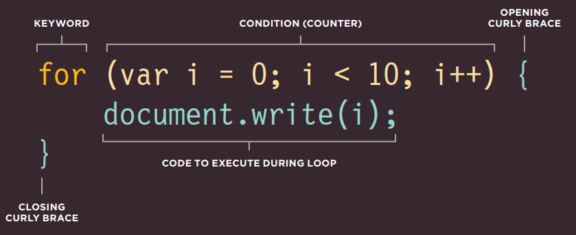

Este es un bucle `for`. La condición es un contador que cuenta hasta diez. El resultado escribiría `"0123456789"` en la página.

Si la variable `i` es menor que diez, el código dentro de las llaves se ejecuta. Luego el contador se incrementa.

La condición se verifica de nuevo, si `i` es menor que diez se ejecuta otra vez. Las siguientes tres páginas muestran cómo funciona este bucle con mayor detalle.

## CONTADORES DE BUCLES

Un bucle `for` usa un contador como condición. Esto le indica al código que se ejecute un número específico de veces. Aquí puedes ver que la condición está compuesta por tres sentencias:

### INICIALIZACIÓN

Crea una variable y la establece en 0. Esta variable se llama comúnmente `i`, y actúa como el contador.

```js linenums="1"
var i = 0;
```

La variable solo se crea la primera vez que se ejecuta el bucle. (También puedes ver la variable llamada `index`, en lugar de solo `i`).

A veces verás esta variable declarada antes de la condición. Lo siguiente es lo mismo y es principalmente una preferencia del programador:

```js linenums="1"
var i;
for (i = 0; i < 10; i++) {
  // El código va aquí
}
```

### CONDICIÓN

El bucle debe continuar ejecutándose hasta que el contador alcance un número específico.

`i < 10;`

El valor de `i` se estableció inicialmente en 0, por lo que en este caso el bucle se ejecutará 10 veces antes de detenerse.

La condición también puede usar una variable que contenga un número. Si una variable llamada `rounds` contuviera el número de rondas en una prueba y el bucle se ejecutara una vez por cada ronda, la condición sería:

```js linenums="1"
var rounds = 3;
i < (rounds);
```

### ACTUALIZACIÓN

Cada vez que el bucle ha ejecutado las sentencias dentro de las llaves, suma uno al contador.

`i++`

Se suma uno al contador usando el operador de incremento (`++`). Otra forma de leer esto es: "Toma la variable `i` y súmale uno usando el operador `++`".

También es posible que los bucles cuenten hacia abajo usando el operador de decremento (`--`).

## ITERACIÓN

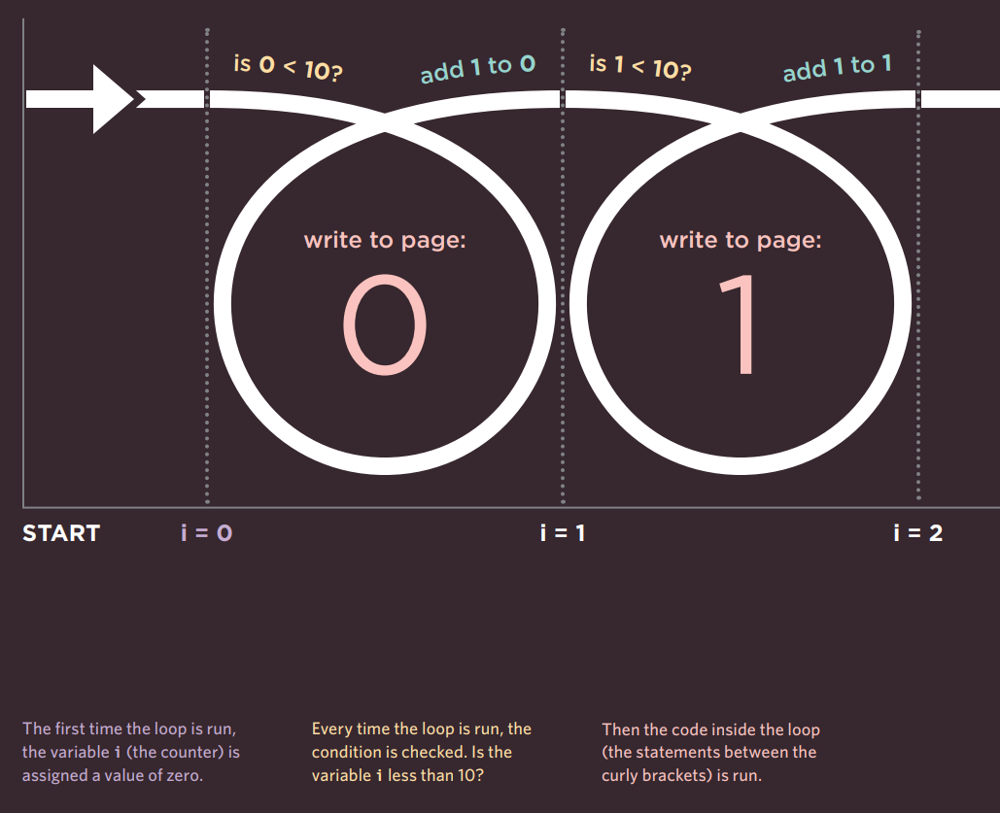

- [x] La primera vez que se ejecuta el bucle, a la variable `i` (el contador) se le asigna un valor de cero.
- [x] Cada vez que se ejecuta el bucle, se verifica la condición. ¿Es la variable `i` menor que 10?
- [x] Luego se ejecuta el código dentro del bucle (las sentencias entre las llaves).

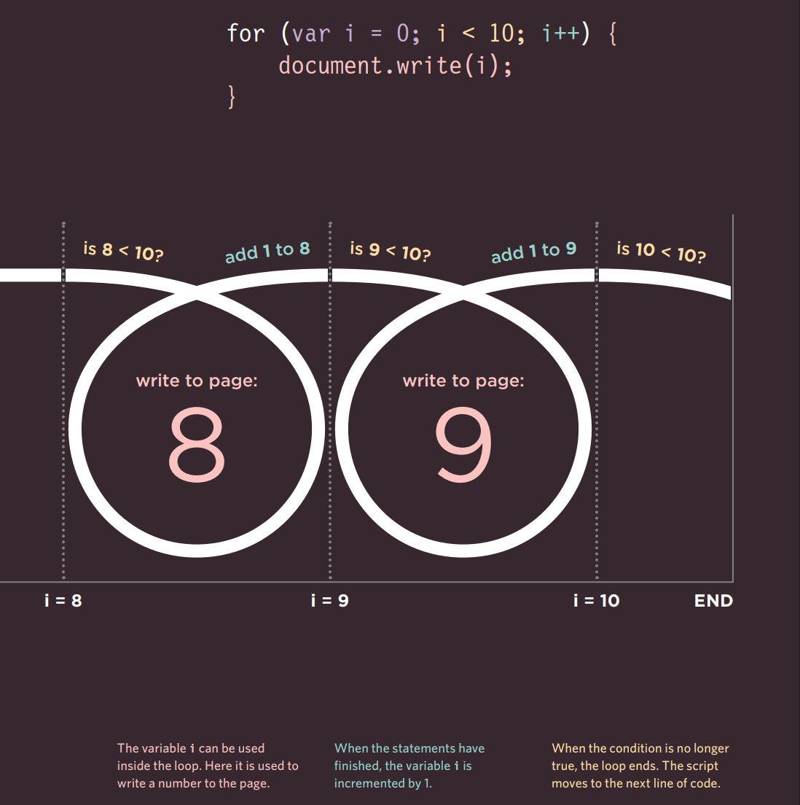

- [x] La variable `i` puede usarse dentro del bucle. Aquí se usa para escribir un número en la página.
- [x] Cuando las sentencias han terminado, la variable `i` se incrementa en 1.
- [x] Cuando la condición ya no es `true`, el bucle termina. El script pasa a la siguiente línea de código.

## CONCEPTOS CLAVE DE BUCLES

Aquí hay tres puntos a considerar cuando trabajes con bucles. Cada uno se ilustra en ejemplos en las siguientes tres páginas.

### PALABRAS CLAVE

Comúnmente verás estas dos palabras clave usadas con bucles:

**break**
Esta palabra clave causa la terminación del bucle y le indica al intérprete que pase a la siguiente sentencia de código fuera del bucle. (También puedes verla usada en funciones).

**continue**
Esta palabra clave le indica al intérprete que detenga la iteración actual y luego verifique la condición nuevamente. (Si es `true`, el código se ejecuta otra vez).

### BUCLES Y ARRAYS

Los bucles son muy útiles cuando se trabaja con arrays si quieres ejecutar el mismo código para cada elemento del array. Por ejemplo, es posible que quieras escribir el valor de cada elemento almacenado en un array en la página.

Puede que no sepas cuántos elementos tendrá un array al escribir un script, pero cuando el código se ejecute, puede verificar el número total de elementos en un bucle. Esa cifra puede usarse luego en el contador para controlar cuántas veces se ejecuta un conjunto de sentencias.

Una vez que el bucle se ha ejecutado la cantidad correcta de veces, el bucle se detiene.

### PROBLEMAS DE RENDIMIENTO

Es importante recordar que cuando un navegador encuentra JavaScript, deja de hacer cualquier otra cosa hasta que ha procesado ese script.

Si tu bucle solo maneja una pequeña cantidad de elementos, esto no será un problema. Sin embargo, si tu bucle contiene muchos elementos, puede hacer que la página tarde más en cargar.

Si la condición nunca devuelve `false`, obtienes lo que comúnmente se conoce como un bucle infinito. El código no dejará de ejecutarse hasta que tu navegador se quede sin memoria (rompiendo tu script).

Cualquier variable que puedas definir fuera del bucle y que no cambie dentro del bucle debe definirse fuera de él. Si se declarara dentro del bucle, se recalcularía cada vez que el bucle se ejecutara, usando recursos innecesariamente.

## USANDO BUCLES FOR

```js linenums="1"
// c04/js/for-loop.js

var scores = [24, 32, 17]; // Array de puntuaciones
var arrayLength = scores.length; // Elementos en el array
var roundNumber = 0; // Ronda actual
var msg = ''; // Mensaje
var i; // Contador

// Itera a través de los elementos del array
for (i = 0; i < arrayLength; i++) {
  // Los arrays tienen base cero (por lo que 0 es la ronda 1)
  // Suma 1 a la ronda actual
  roundNumber = (i + 1);
  // Escribe la ronda actual en el mensaje
  msg += 'Round ' + roundNumber + ': ';
  // Obtiene la puntuación del array scores
  msg += scores[i] + '<br />';
}
document.getElementById('answer').innerHTML = msg;
```

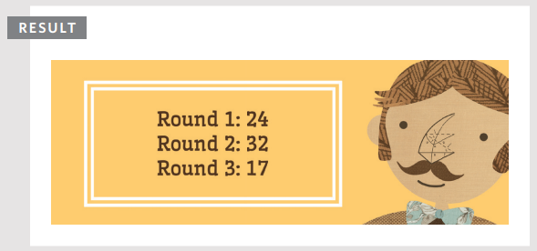

> El contador y el array comienzan desde 0 (en lugar de 1). Por lo tanto, dentro del bucle, para seleccionar el elemento actual del array, usas la variable contador `i` para especificar el elemento del array, ej: `scores[i]`. Pero recuerda que es un número menor de lo que podrías esperar (ej: la primera iteración es 0, la segunda es 1).

Un bucle `for` se usa a menudo para recorrer los elementos de un array. En este ejemplo, las puntuaciones de cada ronda de una prueba se almacenan en un array llamado `scores`.

El número total de elementos en el array se almacena en una variable llamada `arrayLength`. Este número se obtiene usando la propiedad `length` del array.

Hay tres variables más: `roundNumber` contiene la ronda de la prueba; `msg` contiene el mensaje a mostrar; `i` es el contador (declarado fuera del bucle).

El bucle comienza con la palabra clave `for`, luego contiene la condición dentro de los paréntesis. Mientras el contador sea menor que el número total de elementos en el array, el contenido de las llaves continuará ejecutándose. Cada vez que el bucle se ejecuta, el número de ronda se incrementa en 1.

Dentro de las llaves hay reglas que escriben el número de ronda y la puntuación en la variable `msg`. Las variables declaradas fuera del bucle se usan dentro del bucle.

La variable `msg` se escribe luego en la página. Contiene HTML, por lo que se usa la propiedad `innerHTML`. Recuerda que la pág. 228 hablará sobre problemas de seguridad relacionados con esta propiedad.

El contador y el array comienzan desde 0 (en lugar de 1). Por lo tanto, dentro del bucle, para seleccionar el elemento actual del array, usas la variable contador `i` para especificar el elemento del array, ej: `scores[i]`. Pero recuerda que es un número menor de lo que podrías esperar (ej: la primera iteración es 0, la segunda es 1).

## USANDO BUCLES WHILE

La diferencia clave entre un bucle `while` y un bucle `do...while` es que las sentencias en el bloque de código vienen antes de la condición. Esto significa que esas sentencias se ejecutan una vez, se cumpla o no la condición.

Si observas la condición, está verificando que el valor de la variable llamada `i` sea menor que 1, pero esa variable ya se ha establecido en un valor de 1. Por lo tanto, en este ejemplo el resultado es que la tabla del 5 se escribe una vez, aunque el contador no sea menor que 1.

A algunas personas les gusta escribir `while` en una línea separada de la llave de cierre que lo precede.

```js linenums="1"
// c04/js/do-while-loop.js

var i = 1; // Establece el contador a 1
var msg = ''; // Mensaje

// Almacena la tabla del 5 en una variable
do {
  msg += i + ' x 5 = ' + (i * 5) + '<br />';
  i++;
} while (i < 1);
// Observa que esto ya es 1 y aún así se ejecuta

document.getElementById('answer').innerHTML = msg;
```
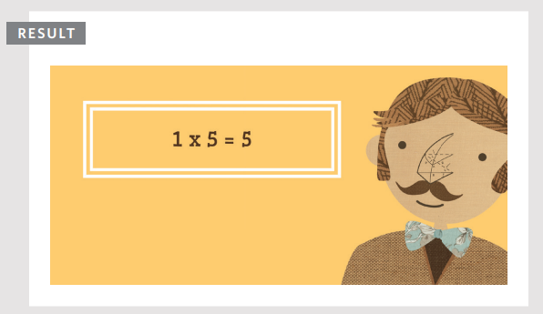

Desglosando la primera sentencia en estos ejemplos:

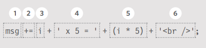

1. Toma la variable llamada `msg`
2. Añade lo siguiente a su valor
3. El número del contador
4. Escribe el string ` x 5 = `
5. El contador multiplicado por 5
6. Añade un salto de línea

## EJEMPLO: DECISIONES Y BUCLES

En este ejemplo, al usuario se le puede mostrar suma o multiplicación de un número dado. El script demuestra el uso tanto de lógica condicional como de bucles.

El ejemplo comienza con dos variables:

1. `number` contiene el número con el que se realizarán los cálculos (en este caso es el número 3)
2. `operator` indica si debe ser suma o multiplicación (en este caso está realizando suma)

Se usa una sentencia `if...else` para decidir si realizar suma o multiplicación con el número. Si la variable llamada `operator` tiene el valor `addition`, los números se sumarán; de lo contrario, se multiplicarán.

Dentro de la sentencia condicional, se usa un bucle `while` para calcular los resultados. Se ejecutará 10 veces porque la condición verifica si el valor del contador es menor que 11.

```html linenums="1"
<!--c04/example.html-->

<!DOCTYPE html>
<html>
  <head>
    <title>Bullseye! Tutoring</title>
    <link rel="stylesheet" href="css/c04.css" />
  </head>
  <body>
    <section id="page2">
      <h1>Bullseye</h1>
      
      <section id="blackboard"></section>
    </section>
    <script src="js/example.js"></script>
  </body>
</html>
```

> El HTML de este ejemplo es ligeramente diferente al de los otros ejemplos de este capítulo porque hay una pizarra sobre la cual se escribe la tabla.

> Puedes ver que el script se añade a la página justo antes de la etiqueta de cierre `</body>`.

```js linenums="1"
// c04/js/example.js

var table = 3; // Unidad de la tabla
var operator = 'addition'; // Tipo de cálculo (por defecto suma)
var i = 1; // Establece el contador a 1
var msg = ''; // Mensaje

if (operator === 'addition') { // Si la variable operator dice addition
  while (i < 11) { // Mientras el contador sea menor que 11
    msg += i + ' + ' + table + ' = ' + (i + table) + '<br />'; // Cálculo
    i++; // Añade 1 al contador
  }
} else { // De lo contrario
  while (i < 11) { // Mientras el contador sea menor que 11
    msg += i + ' x ' + table + ' = ' + (i * table) + '<br />'; // Cálculo
    i++; // Añade 1 al contador
  }
}

// Escribe el mensaje en la página
var el = document.getElementById('blackboard');
el.innerHTML = msg;
```

> Si lees los comentarios en el código, puedes ver cómo funciona este ejemplo. El script comienza declarando cuatro variables y asignándoles valores.

> Luego, una sentencia `if` verifica si el valor de la variable llamada `operator` es `addition`. Si lo es, usa un bucle `while` para realizar los cálculos y almacenar los resultados en una variable llamada `msg`.

> Si cambias el valor de la variable `operator` a cualquier otro que no sea `addition`, la sentencia condicional seleccionará el segundo conjunto de sentencias. Estas también contienen un bucle `while`, pero esta vez realizará multiplicación (en lugar de suma).

> Cuando uno de los bucles ha terminado de ejecutarse, las últimas dos líneas del script seleccionan el elemento cuyo atributo `id` tiene un valor de `blackboard` y actualizan la página con el contenido de la variable `msg`.

## RESUMEN

- [x] Las sentencias condicionales permiten que tu código tome decisiones sobre qué hacer a continuación.
- [x] Los operadores de comparación (`===`, `!==`, `==`, `!=`, `<`, `>`, `<=`, `>=`) se usan para comparar dos operandos.
- [x] Los operadores lógicos te permiten combinar más de un conjunto de operadores de comparación.
- [x] Las sentencias `if...else` te permiten ejecutar un conjunto de código si una condición es `true`, y otro si es `false`.
- [x] Las sentencias `switch` te permiten comparar un valor contra posibles resultados (y también proporcionan una opción `default` si ninguno coincide).
- [x] Los tipos de datos pueden ser coercionados de un tipo a otro.
- [x] Todos los valores se evalúan como truthy o falsy.
- [x] Hay tres tipos de bucles: `for`, `while` y `do...while`. Cada uno repite un conjunto de sentencias.


