# DOCUMENT OBJECT MODEL

El Modelo de Objetos del Documento (DOM) especifica cómo los navegadores deben crear un modelo de una página HTML y cómo JavaScript puede acceder y actualizar el contenido de una página web mientras está en la ventana del navegador.

El DOM no es parte de HTML, ni parte de JavaScript; es un conjunto separado de reglas. Es implementado por todos los principales fabricantes de navegadores y cubre dos áreas principales:

**CREANDO UN MODELO DE LA PÁGINA HTML**

Cuando el navegador carga una página web, crea un modelo de la página en memoria. El DOM especifica la forma en que el navegador debe estructurar este modelo usando un árbol DOM.

El DOM se llama modelo de objetos porque el modelo (el árbol DOM) está hecho de objetos. Cada objeto representa una parte diferente de la página cargada en la ventana del navegador.

**ACCEDIENDO Y CAMBIANDO LA PÁGINA HTML**

El DOM también define métodos y propiedades para acceder y actualizar cada objeto en este modelo, lo que a su vez actualiza lo que el usuario ve en el navegador.

Escucharás a personas llamar al DOM una Interfaz de Programación de Aplicaciones (API). Las interfaces de usuario permiten que los humanos interactúen con programas; las APIs permiten que los programas (y scripts) se comuniquen entre sí. El DOM establece lo que tu script puede preguntarle al navegador sobre la página actual y cómo decirle al navegador que actualice lo que se muestra al usuario.

## EL ÁRBOL DOM ES UN MODELO DE UNA PÁGINA WEB

A medida que un navegador carga una página web, crea un modelo de esa página. El modelo se llama árbol DOM y se almacena en la memoria del navegador. Consiste en cuatro tipos principales de nodos:

### CUERPO DE LA PÁGINA HTML

```html linenums="1"
<html>
  <body>
    <div id="page">
      <h1 id="header">List</h1>
      <h2>Buy groceries</h2>
      <ul>
        <li id="one" class="hot"><em>fresh</em> figs</li>
        <li id="two" class="hot">pine nuts</li>
        <li id="three" class="hot">honey</li>
  <li id="four">balsamic vinegar</li>
</ul>
```

### EL NODO DOCUMENTO

Arriba puedes ver el código HTML de una lista de compras, y en la página derecha está su árbol DOM. Cada elemento, atributo y fragmento de texto en el HTML está representado por su propio nodo DOM.

En la parte superior del árbol se añade un nodo documento; representa la página completa (y también corresponde al objeto `document`, que conociste en la pág. 36).

Cuando accedes a cualquier elemento, atributo o nodo de texto, navegas hacia él a través del nodo documento. Es el punto de partida para todas las visitas al árbol DOM.

### NODOS ELEMENTO

Los elementos HTML describen la estructura de una página HTML. (Los elementos `<h1>` – `<h6>` describen qué partes son encabezados; las etiquetas `<p>` indican dónde comienzan y terminan los párrafos de texto; y así sucesivamente).

Para acceder al árbol DOM, comienzas buscando elementos. Una vez que encuentras el elemento que deseas, entonces puedes acceder a sus nodos de texto y atributos si quieres. Por eso comienzas aprendiendo métodos que te permiten acceder a nodos elemento, antes de aprender a acceder y alterar texto o atributos.

!!! note

    Continuaremos usando este ejemplo de lista a lo largo de este capítulo y los dos siguientes para que puedas ver cómo diferentes técnicas te permiten acceder y actualizar la página web (que está representada por este árbol DOM).

    Las relaciones entre el documento y todos los nodos elemento se describen usando los mismos términos que un árbol genealógico: padres, hijos, hermanos, ancestros y descendientes. (Cada nodo es un descendiente del nodo documento).

Cada nodo es un objeto con métodos y propiedades. Los scripts acceden y actualizan este árbol DOM (no el archivo HTML fuente). Cualquier cambio realizado en el árbol DOM se refleja en el navegador.

### ÁRBOL DOM

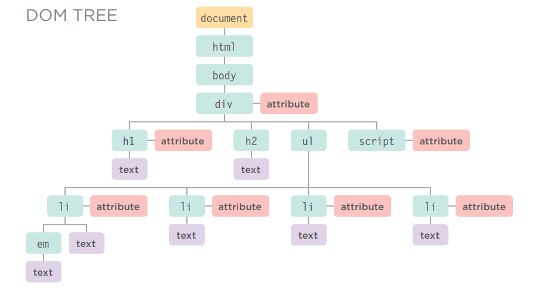

### NODOS ATRIBUTO

Las etiquetas de apertura de los elementos HTML pueden llevar atributos y estos están representados por nodos atributo en el árbol DOM.

Los nodos atributo no son hijos del elemento que los contiene; son parte de ese elemento. Una vez que accedes a un elemento, existen métodos y propiedades específicos de JavaScript para leer o cambiar los atributos de ese elemento. Por ejemplo, es común cambiar los valores de los atributos class para activar nuevas reglas CSS que afecten su presentación.

### NODOS TEXTO

Una vez que has accedido a un nodo elemento, puedes llegar al texto dentro de ese elemento. Este se almacena en su propio nodo texto.

Los nodos texto no pueden tener hijos. Si un elemento contiene texto y otro elemento hijo, el elemento hijo no es hijo del nodo texto sino más bien hijo del elemento contenedor. (Observa el elemento `<em>` en el primer elemento `<li>`). Esto ilustra cómo el nodo texto es siempre una nueva rama del árbol DOM, y no salen más ramas de él.

## TRABAJANDO CON EL ÁRBOL DOM

Acceder y actualizar el árbol DOM implica dos pasos:

- [x] Localiza el nodo que representa el elemento con el que deseas trabajar.
- [x] Utiliza su contenido de texto, elementos hijos y atributos.

### PASO 1: ACCEDER A LOS ELEMENTOS

> Aquí tienes una visión general de los métodos y propiedades que acceden a los elementos cubiertos en las págs. 192 – 211. Las dos primeras filas se conocen como consultas DOM. La última columna se conoce como recorrer el DOM.

#### SELECCIONAR UN NODO ELEMENTO INDIVIDUAL

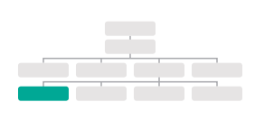

Aquí hay tres formas comunes de seleccionar un elemento individual:

`getElementById()`

: Utiliza el valor del atributo `id` de un elemento (que debería ser único dentro de la página).
Ver pág. 195

`querySelector()`

: Utiliza un selector CSS y devuelve el primer elemento que coincide.
Ver pág. 202

#### SELECCIONAR MÚLTIPLES ELEMENTOS (NODELISTS)

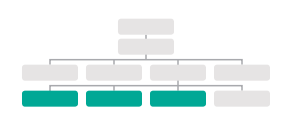

Hay tres formas comunes de seleccionar múltiples elementos.

- [x] `getElementsByClassName()`: Selecciona todos los elementos que tienen un valor específico en su atributo `class`. Ver pág. 200
- [x] `getElementsByTagName()`: Selecciona todos los elementos que tienen el nombre de etiqueta especificado. Ver pág. 201
- [x] `querySelectorAll()` : Utiliza un selector CSS para seleccionar todos los elementos que coinciden. Ver pág. 202

#### RECORRER ENTRE NODOS ELEMENTO

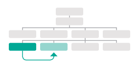

Puedes moverte de un nodo elemento a otro nodo elemento relacionado.

- [x] `parentNode`: Selecciona el padre del nodo elemento actual (devolverá solo un elemento).
Ver pág. 208
- [x] `previousSibling` / `nextSibling` : Selecciona el hermano anterior o siguiente del árbol DOM.
Ver pág. 210
- [x] `firstChild` / `lastChild` : Selecciona el primer o último hijo del elemento actual.
Ver pág. 211

> A lo largo del capítulo verás notas sobre métodos DOM que solo funcionan en ciertos navegadores o que tienen errores. El soporte inconsistente del DOM entre navegadores fue una razón clave por la que jQuery se volvió tan popular.


Los términos **elementos** y **nodos elemento** se usan indistintamente, pero cuando la gente dice que el DOM está trabajando con un elemento, en realidad está trabajando con un nodo que representa ese elemento.

### PASO 2: TRABAJAR CON ESOS ELEMENTOS

> Aquí tienes una visión general de los métodos y propiedades que trabajan con los elementos presentados en la pág. 186.

#### ACCEDER / ACTUALIZAR NODOS TEXTO

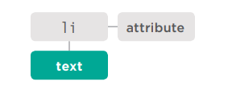

El texto dentro de cualquier elemento se almacena dentro de un nodo texto. Para acceder al nodo texto anterior:

1. Selecciona el elemento `<li>`
2. Usa la propiedad `firstChild` para obtener el nodo texto
3. Usa la única propiedad del nodo texto (`nodeValue`) para obtener el texto del elemento

`nodeValue` : Esta propiedad te permite acceder o actualizar el contenido de un nodo texto.
Ver pág. 214

El nodo texto no incluye el texto dentro de ningún elemento hijo.

#### TRABAJAR CON CONTENIDO HTML

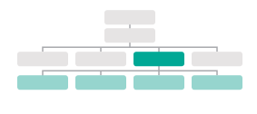

Una propiedad permite acceder a elementos hijos y contenido de texto:

- [x] `innerHTML`
Ver pág. 220

Otra solo al contenido de texto:

- [x] `textContent`
Ver pág. 216

Varios métodos te permiten crear nuevos nodos, agregar nodos a un árbol y eliminar nodos de un árbol:

- [x] `createElement()` 
- [x] `createTextNode()`
- [x] `appendChild()` 
- [x] `removeChild()`

Esto se llama manipulación del DOM.
Ver pág. 222

#### ACCEDER O ACTUALIZAR VALORES DE ATRIBUTOS

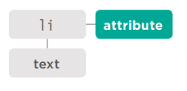

Aquí hay algunas de las propiedades y métodos que puedes usar para trabajar con atributos:

- [x] `className` / `id`

Te permite obtener o actualizar el valor de los atributos `class` e `id`.
Ver pág. 232

Si tu script necesita usar el o los mismos elementos más de una vez, puedes almacenar la ubicación del o los elementos en una variable.

- [x] `hasAttribute()`
- [x] `getAttribute()`
- [x] `setAttribute()`
- [x] `removeAttribute()`

El primero verifica si un atributo existe. El segundo obtiene su valor. El tercero actualiza el valor. El cuarto elimina un atributo.
Ver pág. 232

### ALMACENAR EN CACHÉ CONSULTAS DOM

Los métodos que encuentran elementos en el árbol DOM se llaman consultas DOM.Cuando necesites trabajar con un elemento más de una vez, debes usar una variable para almacenar el resultado de esta consulta.

Cuando un script selecciona un elemento para accederlo o actualizarlo, el intérprete debe encontrar el o los elementos en el árbol DOM.

Abajo, se le indica al intérprete que busque en el árbol DOM un elemento cuyo atributo `id` tenga el valor `one`.

Una vez que ha encontrado el nodo que representa el o los elementos, puedes trabajar con ese nodo, su padre o cualquier hijo.

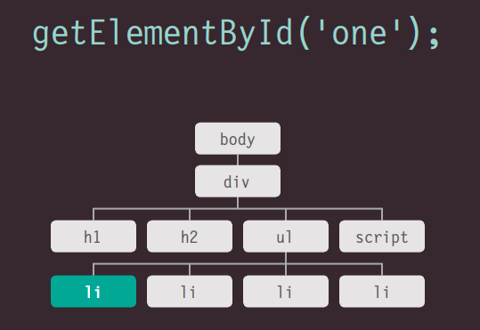

Cuando las personas hablan de almacenar elementos en variables, en realidad están almacenando la ubicación del o los elementos dentro del árbol DOM en una variable. Las propiedades y métodos de ese nodo elemento funcionan sobre la variable.

Si tu script necesita usar el o los mismos elementos más de una vez, puedes almacenar la ubicación del o los elementos en una variable.

Esto evita que el navegador tenga que buscar en el árbol DOM para encontrar el o los mismos elementos nuevamente. Se conoce como almacenar en caché la selección.

Los programadores dirían que la variable almacena una referencia al objeto en el árbol DOM. (Está almacenando la ubicación del nodo).

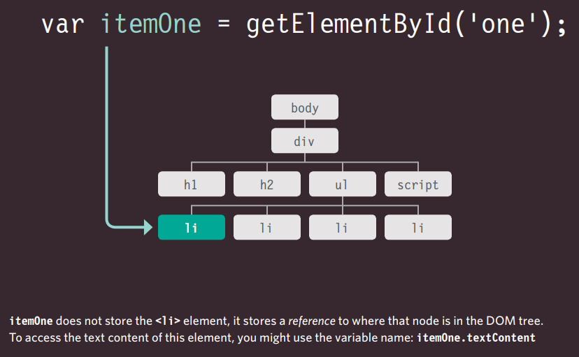

`itemOne` no almacena el elemento `<li>`, almacena una referencia a dónde está ese nodo en el árbol DOM. Para acceder al contenido de texto de este elemento, podrías usar el nombre de la variable: `itemOne.textContent`

## ACCEDIENDO A ELEMENTOS

Las consultas DOM pueden devolver un elemento, o pueden devolver una NodeList, que es una colección de nodos.

A veces solo querrás acceder a un elemento individual (o un fragmento de la página que está almacenado dentro de ese elemento). Otras veces puedes querer seleccionar un grupo de elementos, por ejemplo, cada elemento `<h1>` en la página o cada elemento `<li>` dentro de una lista en particular.

Aquí, el árbol DOM muestra el cuerpo de la página del ejemplo de la lista. Nos enfocamos en acceder a los elementos primero, por lo que solo muestra nodos elemento. Los diagramas en las páginas siguientes resaltan qué elementos devolvería una consulta DOM. (Recuerda, los nodos elemento son la representación DOM de un elemento).

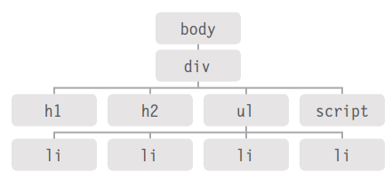

### GRUPOS DE NODOS ELEMENTO

Si un método puede devolver más de un nodo, siempre devolverá una NodeList, que es una colección de nodos (incluso si solo encuentra un elemento coincidente). Luego debes seleccionar el elemento que deseas de esta lista usando un número de índice (lo que significa que la numeración comienza en 0 como los elementos de un arreglo).

Por ejemplo, varios elementos pueden tener el mismo nombre de etiqueta, por lo que `getElementsByTagName()` siempre devolverá una NodeList.

### RUTA MÁS RÁPIDA

Encontrar la forma más rápida de acceder a un elemento dentro de tu página web hará que la página parezca más rápida y/o más receptiva. Esto generalmente significa evaluar el número mínimo de nodos en el camino hacia el elemento con el que deseas trabajar.

Por ejemplo, `getElementById()` devolverá rápidamente un elemento (porque no hay dos elementos en la misma página que deban tener el mismo valor para un atributo `id`), pero solo se puede usar cuando el elemento al que deseas acceder tiene un atributo `id`.

### MÉTODOS QUE DEVUELVEN UN SOLO NODO ELEMENTO:

- [x] `getElementById('id')`
Selecciona un elemento individual dado el valor de su atributo `id`. El HTML debe tener un atributo `id` para que pueda ser seleccionable.


- [x] `querySelector('css selector')`
Utiliza la sintaxis de selectores CSS que seleccionaría uno o más elementos. Este método devuelve solo el primero de los elementos coincidentes.


### MÉTODOS QUE DEVUELVEN UNO O MÁS ELEMENTOS (COMO UNA NODELIST):

- [x] `getElementsByClassName('class')`
Selecciona uno o más elementos dado el valor de su atributo `class`. El HTML debe tener un atributo `class` para que pueda ser seleccionable. Este método es más rápido que `querySelectorAll()`.

- [x] `getElementsByTagName('tagName')`
Selecciona todos los elementos de la página con el nombre de etiqueta especificado. Este método es más rápido que `querySelectorAll()`.

- [x] `querySelectorAll('css selector')`
Utiliza la sintaxis de selectores CSS para seleccionar uno o más elementos y devuelve todos los que coinciden.

### MÉTODOS QUE SELECCIONAN ELEMENTOS INDIVIDUALES

`getElementById()` y `querySelector()` pueden buscar en un documento completo y devolver elementos individuales. Ambos usan una sintaxis similar.

- [x] `getElementById()` es la forma más rápida y eficiente de acceder a un elemento porque no hay dos elementos que puedan compartir el mismo valor para su atributo `id`. La sintaxis de este método se muestra a continuación, y un ejemplo de su uso está en la página de la derecha.

- [x] `querySelector()` es una adición más reciente al DOM, por lo que no es compatible con navegadores antiguos. Pero es muy flexible porque su parámetro es un selector CSS, lo que significa que se puede usar para apuntar con precisión a muchos más elementos.

> `document` se refiere al objeto documento. Siempre debes acceder a los elementos individuales a través del objeto documento.

> El método `getElementById()` indica que deseas encontrar un elemento basado en el valor de su atributo `id`.

> **MEMBER OPERATOR** La notación de punto indica que el método (a la derecha) se está aplicando al nodo a la izquierda del punto.

> **PARAMETER** El método necesita saber el valor del atributo `id` del elemento que deseas. Es el parámetro del método.

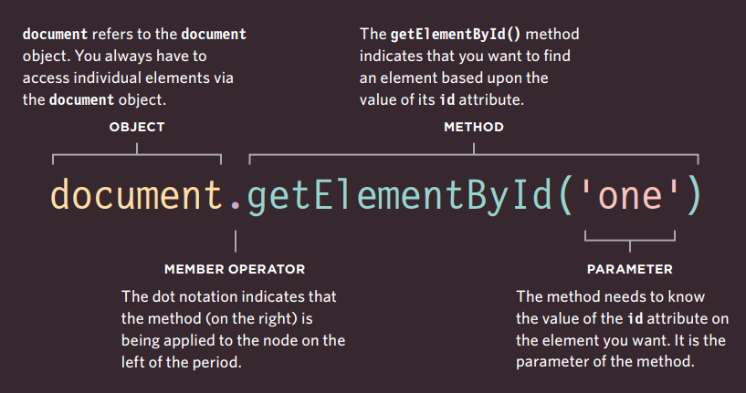

Este código devolverá el nodo elemento para el elemento cuyo atributo `id` tiene el valor `one`. A menudo verás nodos elemento almacenados en una variable para usarlos más adelante en el script (como viste en la pág. 190).

Aquí el método se usa en el objeto documento, por lo que busca ese elemento en cualquier lugar dentro de la página. Los métodos DOM también se pueden usar en nodos elemento dentro de la página para encontrar descendientes de ese nodo.

### SELECCIONAR ELEMENTOS USANDO ATRIBUTOS ID

```html linenums="1"
<!--c05/get-element-by-id.html-->

<h1 id="header">List King</h1>
<h2>Buy groceries</h2>
<ul>
  <li id="one" class="hot"><em>fresh</em> figs</li>
  <li id="two" class="hot">pine nuts</li>
  <li id="three" class="hot">honey</li>
  <li id="four">balsamic vinegar</li>
</ul>
```

```javascript linenums="1"
// c05/js/get-element-by-id.js

// Selecciona el elemento y guárdalo en una variable.
var el = document.getElementById('one');
// Cambia el valor del atributo class.
el.className = 'cool';
```

`getElementById()` te permite seleccionar un solo nodo elemento especificando el valor de su atributo `id`.

Este método tiene un parámetro: el valor del atributo `id` del elemento que deseas seleccionar. Este valor se coloca entre comillas porque es una cadena. Las comillas pueden ser simples o dobles, pero deben coincidir.

En el ejemplo de la izquierda, la primera línea de código JavaScript encuentra el elemento cuyo atributo `id` tiene el valor `one`, y almacena una referencia a ese nodo en una variable llamada `el`.

El código luego usa una propiedad llamada `className` (que conocerás en la pág. 232) para actualizar el valor del atributo `class` del elemento almacenado en esta variable. Su valor es `cool`, y esto activa una nueva regla en el CSS que establece el color de fondo del elemento a aguamarina.

Observa cómo la propiedad `className` se usa en la variable que almacena la referencia al elemento.

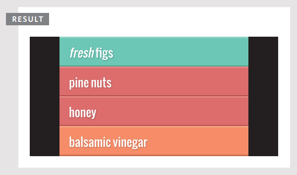

Esta ventana de resultados muestra el ejemplo después de que el script ha actualizado el primer elemento de la lista. El estado original, antes de que el script se ejecutara, se muestra en la pág. 185.

### NODELISTS: CONSULTAS DOM QUE DEVUELVEN MÁS DE UN ELEMENTO

Cuando un método DOM puede devolver más de un elemento, devuelve una NodeList (incluso si solo encuentra un elemento coincidente).

Una NodeList es una colección de nodos elemento. Cada nodo recibe un número de índice (un número que comienza en cero, como un arreglo).

El orden en que los nodos elemento se almacenan en una NodeList es el mismo orden en que aparecieron en la página HTML.

Cuando una consulta DOM devuelve una NodeList, es posible que desees:

- Seleccionar un elemento de la NodeList.
- Recorrer cada elemento de la NodeList y ejecutar las mismas sentencias en cada uno de los nodos elemento.

Las NodeLists se parecen a los arreglos y se numeran como los arreglos, pero en realidad no son arreglos; son un tipo de objeto llamado colección.

Como cualquier otro objeto, una NodeList tiene propiedades y métodos, notablemente:

- La propiedad `length` te indica cuántos elementos hay en la NodeList.
- El método `item()` devuelve un nodo específico de la NodeList cuando le indicas el número de índice del elemento que deseas (entre paréntesis). Sin embargo, es más común usar la sintaxis de arreglos (con corchetes) para recuperar un elemento de una NodeList (como verás en la pág. 199).

### NODELISTS VIVOS Y ESTÁTICOS

Hay ocasiones en las que querrás trabajar con la misma selección de elementos varias veces, por lo que la NodeList se puede almacenar en una variable y reutilizarse (en lugar de recolectar los mismos elementos nuevamente).

En una NodeList viva, cuando tu script actualiza la página, la NodeList se actualiza al mismo tiempo. Los métodos que comienzan con `getElementsBy...` devuelven NodeLists vivas. También suelen ser más rápidas de generar que las NodeLists estáticas.

En una NodeList estática, cuando tu script actualiza la página, la NodeList no se actualiza para reflejar los cambios realizados por el script.

Los nuevos métodos que comienzan con `querySelector...` (que usan sintaxis de selector CSS) devuelven NodeLists estáticas. Reflejan el documento en el momento en que se hizo la consulta. Si el script cambia el contenido de la página, la NodeList no se actualiza para reflejar esos cambios.

Aquí puedes ver cuatro consultas DOM diferentes que todas devuelven una NodeList. Para cada consulta, puedes ver los elementos y sus números de índice en la NodeList que se devuelve.

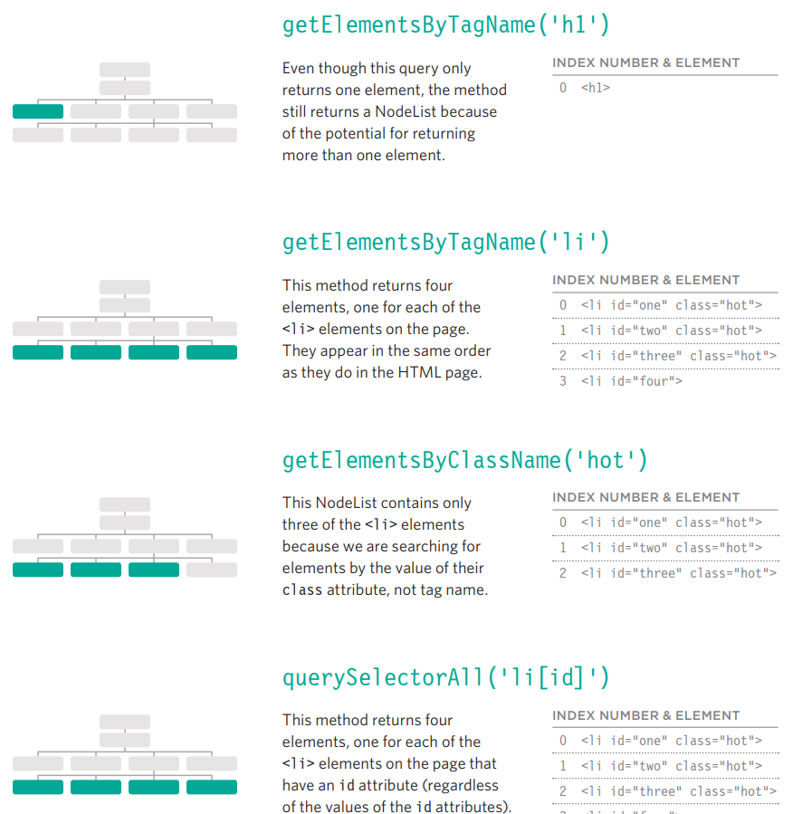

`getElementsByTagName('h1')`
Aunque esta consulta solo devuelve un elemento, el método aún devuelve una NodeList debido a la posibilidad de devolver más de un elemento.

`getElementsByTagName('li')`
Este método devuelve cuatro elementos, uno por cada elemento `<li>` en la página. Aparecen en el mismo orden que en la página HTML.

`getElementsByClassName('hot')`
Esta NodeList contiene solo tres de los elementos `<li>` porque estamos buscando elementos por el valor de su atributo `class`, no por el nombre de etiqueta.

`querySelectorAll('li[id]')`
Este método devuelve cuatro elementos, uno por cada elemento `<li>` en la página que tiene un atributo `id` (independientemente de los valores de los atributos `id`).

### SELECCIONAR UN ELEMENTO DE UNA NODELIST

Hay dos formas de seleccionar un elemento de una NodeList: el método `item()` y la sintaxis de arreglos. Ambos requieren el número de índice del elemento que deseas.

#### EL MÉTODO `item()`

Las NodeLists tienen un método llamado `item()` que devolverá un nodo individual de la NodeList. Especificas el número de índice del elemento que deseas como parámetro del método (dentro del paréntesis).

Ejecutar código cuando no hay elementos con los que trabajar desperdicia recursos. Por lo tanto, los programadores a menudo verifican que haya al menos un elemento en la NodeList antes de ejecutar cualquier código. Para hacer esto, usa la propiedad `length` de la NodeList: te indica cuántos elementos contiene la NodeList.

Aquí puedes ver que se usa una sentencia `if`. La condición para la sentencia `if` es si la propiedad `length` de la NodeList es mayor que cero. Si es así, entonces las sentencias dentro del `if` se ejecutan. Si no, el código continúa ejecutándose después de la segunda llave.

```javascript linenums="1"
var elements = document.getElementsByClassName('hot')
if (elements.length >= 1) {
  var firstItem = elements.item(0);
}
```

1. Selecciona los elementos que tienen un atributo `class` cuyo valor es `hot` y almacena la NodeList en una variable llamada `elements`.

2. Usa la propiedad `length` para verificar cuántos elementos se encontraron. Si se encontraron 1 o más, ejecuta el código dentro de la sentencia `if`.

3. Almacena el primer elemento de la NodeList en una variable llamada `firstItem`. (Dice 0 porque los números de índice comienzan en cero).

La sintaxis de arreglos se prefiere sobre el método `item()` porque es más rápida. Antes de seleccionar un nodo de una NodeList, verifica que contenga nodos. Si usas la NodeList repetidamente, guárdala en una variable.

#### SINTAXIS DE ARREGLOS

Puedes acceder a nodos individuales usando una sintaxis de corchetes similar a la que se usa para acceder a elementos individuales de un arreglo. Especificas el número de índice del elemento que deseas dentro de corchetes que siguen a la NodeList.

Como con todas las consultas DOM, si necesitas acceder a la misma NodeList varias veces, almacena el resultado de la consulta DOM en una variable. En los ejemplos de ambas páginas, la NodeList se almacena en una variable llamada `elements`.

Si creas una variable para contener una NodeList pero no hay elementos coincidentes, la variable será una NodeList vacía. Cuando verificas la propiedad `length` de la variable, devolverá el número 0 porque no contiene ningún elemento.

```javascript linenums="1"
var elements = document.getElementsByClassName('hot');
if (elements.length >= 1) {
  var firstItem = elements[0];
}
```

1. Crea una NodeList que contenga elementos que tienen un atributo `class` cuyo valor es `hot`, y guárdala en la variable `elements`.

2. Si ese número es mayor o igual a uno, ejecuta el código dentro de la sentencia `if`.

3. Obtén el primer elemento de la NodeList (dice 0 porque los números de índice comienzan en cero).

### SELECCIONAR ELEMENTOS USANDO ATRIBUTOS CLASS

El método `getElementsByClassName()` te permite seleccionar elementos cuyo atributo `class` contiene un valor específico.

El método tiene un parámetro: el nombre de la clase que se indica entre comillas dentro del paréntesis después del nombre del método.

Debido a que varios elementos pueden tener el mismo valor para su atributo `class`, este método siempre devuelve una NodeList.

```javascript linenums="1"
// c05/js/get-elements-by-class-name.js

var elements = document.getElementsByClassName('hot'); // Encuentra elementos hot

if (elements.length > 2) { // Si se encuentran 3 o más
  var el = elements[2]; // Selecciona el tercero de la NodeList
  el.className = 'cool'; // Cambia el valor de su atributo class
}
```

Este ejemplo comienza buscando elementos cuyo atributo `class` contiene `hot`. (El valor de un atributo `class` puede contener varios nombres de clase, cada uno separado por un espacio). El resultado de esta consulta DOM se almacena en una variable llamada `elements` porque se usa más de una vez en el ejemplo.

Una sentencia `if` verifica si la consulta encontró más de dos elementos. Si es así, el tercero se selecciona y se almacena en una variable llamada `el`. El atributo `class` de ese elemento se actualiza luego a `cool`. (A su vez, esto activa un nuevo estilo CSS, cambiando la presentación de ese elemento).

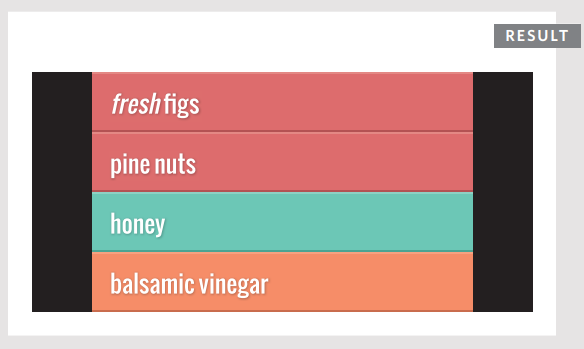

### SELECCIONAR ELEMENTOS POR NOMBRE DE ETIQUETA

El método `getElementsByTagName()` te permite seleccionar elementos usando su nombre de etiqueta.

El nombre del elemento se especifica como parámetro, por lo que se coloca dentro del paréntesis y está contenido entre comillas.

Ten en cuenta que no incluyes los corchetes angulares que rodean el nombre de la etiqueta en el HTML (solo las letras dentro de los corchetes).

```javascript linenums="1"
// c05/js/get-elements-by-tag-name.js

var elements = document.getElementsByTagName('li'); // Encuentra elementos <li>
if (elements.length > 0) { // Si se encuentra 1 o más
  var el = elements[0]; // Selecciona el primero usando sintaxis de arreglos
  el.className = 'cool'; // Cambia el valor del atributo class
}
```

Este ejemplo busca cualquier elemento `<li>` en el documento. Almacena el resultado en una variable llamada `elements` porque el resultado se usa más de una vez en este ejemplo.

Una sentencia `if` verifica si se encontró algún elemento `<li>`. Como con cualquier elemento que puede devolver una NodeList, verificas que haya un elemento adecuado antes de intentar trabajar con él.

Si se encontraron elementos coincidentes, se selecciona el primero y se actualiza su atributo `class`. Esto cambia el color del elemento de la lista a aguamarina.

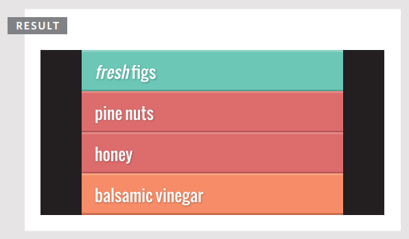

### SELECCIONAR ELEMENTOS USANDO SELECTORES CSS

`querySelector()` devuelve el primer nodo elemento que coincide con el selector de estilo CSS. `querySelectorAll()` devuelve una NodeList de todas las coincidencias.

Ambos métodos toman un selector CSS como su único parámetro. La sintaxis de selectores CSS ofrece más flexibilidad y precisión al seleccionar un elemento que solo especificar un nombre de clase o un nombre de etiqueta, y también debería ser familiar para los desarrolladores web front-end que están acostumbrados a apuntar a elementos usando CSS.

```javascript linenums="1"
// c05/js/query-selector.js

// querySelector() solo devuelve la primera coincidencia
var el = document.querySelector('li.hot');
el.className = 'cool';
// querySelectorAll devuelve una NodeList
// El segundo elemento coincidente (el tercer elemento de la lista) se selecciona y cambia
var els = document.querySelectorAll('li.hot');
els[1].className = 'cool';
```

Estos dos métodos fueron introducidos por los fabricantes de navegadores porque muchos desarrolladores estaban incluyendo scripts como jQuery en sus páginas para poder seleccionar elementos usando selectores CSS. (Conocerás jQuery en el Capítulo 7).

Si observas la última línea de código, se usa sintaxis de arreglos para seleccionar el segundo elemento de la NodeList, aunque esa NodeList está almacenada en una variable.

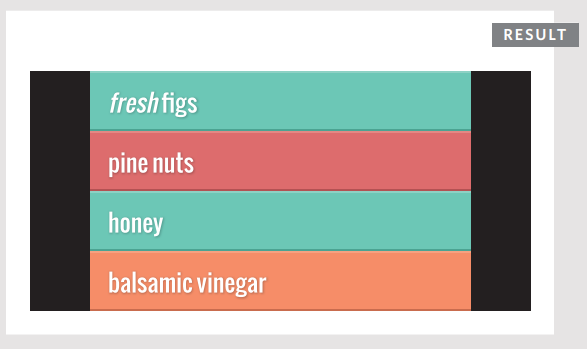

El código JavaScript se ejecuta línea por línea, y las sentencias afectan el contenido de una página a medida que el intérprete las procesa.

Si una consulta DOM se ejecuta cuando se carga una página, la misma consulta podría devolver diferentes elementos si se usa nuevamente más adelante en la página.

A continuación puedes ver cómo el ejemplo de la página izquierda (query-selector.js) cambia el árbol DOM a medida que se ejecuta.

**1: CUANDO LA PÁGINA CARGA POR PRIMERA VEZ**

```html linenums="1"
<!--c05/query-selector.html-->

<ul>
  <li id="one" class="hot"><em>fresh</em> figs</li>
  <li id="two" class="hot">pine nuts</li>
  <li id="three" class="hot">honey</li>
  <li id="four">balsamic vinegar</li>
</ul>
```

Así es como comienza la página. Hay tres elementos `<li>` que tienen un atributo `class` cuyo valor es `hot`. El método `querySelector()` encuentra el primero y actualiza el valor de su atributo `class` de `hot` a `cool`. Esto también actualiza el árbol DOM almacenado en memoria, por lo que —después de que esta línea se haya ejecutado— solo el segundo y tercer elemento `<li>` tienen un atributo `class` con un valor de `hot`.

**2: DESPUÉS DEL PRIMER CONJUNTO DE SENTENCIAS**

```html linenums="1"
<!--c05/query-selector.html-->

<ul>
  <li id="one" class="cool"><em>fresh</em> figs</li>
  <li id="two" class="hot">pine nuts</li>
  <li id="three" class="hot">honey</li>
  <li id="four">balsamic vinegar</li>
</ul>
```

Cuando se ejecuta el segundo selector, ahora solo hay dos elementos `<li>` cuyos atributos `class` tienen un valor de `hot` (ver izquierda), por lo que solo selecciona estos dos. Esta vez, se usa sintaxis de arreglos para trabajar con el segundo de los elementos coincidentes (que es el tercer elemento de la lista). Nuevamente, el valor de su atributo `class` se cambia de `hot` a `cool`.

**3: DESPUÉS DEL SEGUNDO CONJUNTO DE SENTENCIAS**

```html linenums="1"
<!--c05/query-selector.html-->

<ul>
  <li id="one" class="cool"><em>fresh</em> figs</li>
  <li id="two" class="hot">pine nuts</li>
  <li id="three" class="cool">honey</li>
  <li id="four">balsamic vinegar</li>
</ul>
```

Cuando el segundo selector ha hecho su trabajo, el árbol DOM ahora solo contiene un elemento `<li>` cuyo atributo `class` tiene un valor de `hot`. Cualquier código adicional que busque elementos `<li>` cuyo atributo `class` tenga un valor de `hot` encontraría solo este. Sin embargo, si estuvieran buscando elementos `<li>` cuyo atributo `class` tiene un valor de `cool`, encontrarían dos nodos elemento coincidentes.


