# DOCUMENT OBJECT MODEL

El Modelo de Objetos del Documento (DOM) especifica cómo los navegadores deben crear un modelo de una página HTML y cómo JavaScript puede acceder y actualizar el contenido de una página web mientras está en la ventana del navegador.

El DOM no es parte de HTML, ni parte de JavaScript; es un conjunto separado de reglas. Es implementado por todos los principales fabricantes de navegadores y cubre dos áreas principales:

**CREANDO UN MODELO DE LA PÁGINA HTML**

Cuando el navegador carga una página web, crea un modelo de la página en memoria. El DOM especifica la forma en que el navegador debe estructurar este modelo usando un árbol DOM.

El DOM se llama modelo de objetos porque el modelo (el árbol DOM) está hecho de objetos. Cada objeto representa una parte diferente de la página cargada en la ventana del navegador.

**ACCEDIENDO Y CAMBIANDO LA PÁGINA HTML**

El DOM también define métodos y propiedades para acceder y actualizar cada objeto en este modelo, lo que a su vez actualiza lo que el usuario ve en el navegador.

Escucharás a personas llamar al DOM una Interfaz de Programación de Aplicaciones (API). Las interfaces de usuario permiten que los humanos interactúen con programas; las APIs permiten que los programas (y scripts) se comuniquen entre sí. El DOM establece lo que tu script puede preguntarle al navegador sobre la página actual y cómo decirle al navegador que actualice lo que se muestra al usuario.

## EL ÁRBOL DOM ES UN MODELO DE UNA PÁGINA WEB

A medida que un navegador carga una página web, crea un modelo de esa página. El modelo se llama árbol DOM y se almacena en la memoria del navegador. Consiste en cuatro tipos principales de nodos:

### CUERPO DE LA PÁGINA HTML

```html linenums="1"
<html>
  <body>
    <div id="page">
      <h1 id="header">List</h1>
      <h2>Buy groceries</h2>
      <ul>
        <li id="one" class="hot"><em>fresh</em> figs</li>
        <li id="two" class="hot">pine nuts</li>
        <li id="three" class="hot">honey</li>
  <li id="four">balsamic vinegar</li>
</ul>
```

### EL NODO DOCUMENTO

Arriba puedes ver el código HTML de una lista de compras, y en la página derecha está su árbol DOM. Cada elemento, atributo y fragmento de texto en el HTML está representado por su propio nodo DOM.

En la parte superior del árbol se añade un nodo documento; representa la página completa (y también corresponde al objeto `document`, que conociste en la pág. 36).

Cuando accedes a cualquier elemento, atributo o nodo de texto, navegas hacia él a través del nodo documento. Es el punto de partida para todas las visitas al árbol DOM.

### NODOS ELEMENTO

Los elementos HTML describen la estructura de una página HTML. (Los elementos `<h1>` – `<h6>` describen qué partes son encabezados; las etiquetas `<p>` indican dónde comienzan y terminan los párrafos de texto; y así sucesivamente).

Para acceder al árbol DOM, comienzas buscando elementos. Una vez que encuentras el elemento que deseas, entonces puedes acceder a sus nodos de texto y atributos si quieres. Por eso comienzas aprendiendo métodos que te permiten acceder a nodos elemento, antes de aprender a acceder y alterar texto o atributos.

!!! note

    Continuaremos usando este ejemplo de lista a lo largo de este capítulo y los dos siguientes para que puedas ver cómo diferentes técnicas te permiten acceder y actualizar la página web (que está representada por este árbol DOM).

    Las relaciones entre el documento y todos los nodos elemento se describen usando los mismos términos que un árbol genealógico: padres, hijos, hermanos, ancestros y descendientes. (Cada nodo es un descendiente del nodo documento).

Cada nodo es un objeto con métodos y propiedades. Los scripts acceden y actualizan este árbol DOM (no el archivo HTML fuente). Cualquier cambio realizado en el árbol DOM se refleja en el navegador.

### ÁRBOL DOM


### NODOS ATRIBUTO

Las etiquetas de apertura de los elementos HTML pueden llevar atributos y estos están representados por nodos atributo en el árbol DOM.

Los nodos atributo no son hijos del elemento que los contiene; son parte de ese elemento. Una vez que accedes a un elemento, existen métodos y propiedades específicos de JavaScript para leer o cambiar los atributos de ese elemento. Por ejemplo, es común cambiar los valores de los atributos class para activar nuevas reglas CSS que afecten su presentación.

### NODOS TEXTO

Una vez que has accedido a un nodo elemento, puedes llegar al texto dentro de ese elemento. Este se almacena en su propio nodo texto.

Los nodos texto no pueden tener hijos. Si un elemento contiene texto y otro elemento hijo, el elemento hijo no es hijo del nodo texto sino más bien hijo del elemento contenedor. (Observa el elemento `<em>` en el primer elemento `<li>`). Esto ilustra cómo el nodo texto es siempre una nueva rama del árbol DOM, y no salen más ramas de él.

## TRABAJANDO CON EL ÁRBOL DOM

Acceder y actualizar el árbol DOM implica dos pasos:

- [x] Localiza el nodo que representa el elemento con el que deseas trabajar.
- [x] Utiliza su contenido de texto, elementos hijos y atributos.

### PASO 1: ACCEDER A LOS ELEMENTOS

> Aquí tienes una visión general de los métodos y propiedades que acceden a los elementos cubiertos en las págs. 192 – 211. Las dos primeras filas se conocen como consultas DOM. La última columna se conoce como recorrer el DOM.

#### SELECCIONAR UN NODO ELEMENTO INDIVIDUAL


Aquí hay tres formas comunes de seleccionar un elemento individual:

`getElementById()`

: Utiliza el valor del atributo `id` de un elemento (que debería ser único dentro de la página).
Ver pág. 195

`querySelector()`

: Utiliza un selector CSS y devuelve el primer elemento que coincide.
Ver pág. 202

#### SELECCIONAR MÚLTIPLES ELEMENTOS (NODELISTS)


Hay tres formas comunes de seleccionar múltiples elementos.

- [x] `getElementsByClassName()`: Selecciona todos los elementos que tienen un valor específico en su atributo `class`. Ver pág. 200
- [x] `getElementsByTagName()`: Selecciona todos los elementos que tienen el nombre de etiqueta especificado. Ver pág. 201
- [x] `querySelectorAll()` : Utiliza un selector CSS para seleccionar todos los elementos que coinciden. Ver pág. 202

#### RECORRER ENTRE NODOS ELEMENTO


Puedes moverte de un nodo elemento a otro nodo elemento relacionado.

- [x] `parentNode`: Selecciona el padre del nodo elemento actual (devolverá solo un elemento).
Ver pág. 208
- [x] `previousSibling` / `nextSibling` : Selecciona el hermano anterior o siguiente del árbol DOM.
Ver pág. 210
- [x] `firstChild` / `lastChild` : Selecciona el primer o último hijo del elemento actual.
Ver pág. 211

> A lo largo del capítulo verás notas sobre métodos DOM que solo funcionan en ciertos navegadores o que tienen errores. El soporte inconsistente del DOM entre navegadores fue una razón clave por la que jQuery se volvió tan popular.


Los términos **elementos** y **nodos elemento** se usan indistintamente, pero cuando la gente dice que el DOM está trabajando con un elemento, en realidad está trabajando con un nodo que representa ese elemento.

### PASO 2: TRABAJAR CON ESOS ELEMENTOS

> Aquí tienes una visión general de los métodos y propiedades que trabajan con los elementos presentados en la pág. 186.

#### ACCEDER / ACTUALIZAR NODOS TEXTO


El texto dentro de cualquier elemento se almacena dentro de un nodo texto. Para acceder al nodo texto anterior:

1. Selecciona el elemento `<li>`
2. Usa la propiedad `firstChild` para obtener el nodo texto
3. Usa la única propiedad del nodo texto (`nodeValue`) para obtener el texto del elemento

`nodeValue` : Esta propiedad te permite acceder o actualizar el contenido de un nodo texto.
Ver pág. 214

El nodo texto no incluye el texto dentro de ningún elemento hijo.

#### TRABAJAR CON CONTENIDO HTML


Una propiedad permite acceder a elementos hijos y contenido de texto:

- [x] `innerHTML`
Ver pág. 220

Otra solo al contenido de texto:

- [x] `textContent`
Ver pág. 216

Varios métodos te permiten crear nuevos nodos, agregar nodos a un árbol y eliminar nodos de un árbol:

- [x] `createElement()` 
- [x] `createTextNode()`
- [x] `appendChild()` 
- [x] `removeChild()`

Esto se llama manipulación del DOM.
Ver pág. 222

#### ACCEDER O ACTUALIZAR VALORES DE ATRIBUTOS


Aquí hay algunas de las propiedades y métodos que puedes usar para trabajar con atributos:

- [x] `className` / `id`

Te permite obtener o actualizar el valor de los atributos `class` e `id`.
Ver pág. 232

Si tu script necesita usar el o los mismos elementos más de una vez, puedes almacenar la ubicación del o los elementos en una variable.

- [x] `hasAttribute()`
- [x] `getAttribute()`
- [x] `setAttribute()`
- [x] `removeAttribute()`

El primero verifica si un atributo existe. El segundo obtiene su valor. El tercero actualiza el valor. El cuarto elimina un atributo.
Ver pág. 232

### ALMACENAR EN CACHÉ CONSULTAS DOM

Los métodos que encuentran elementos en el árbol DOM se llaman consultas DOM.Cuando necesites trabajar con un elemento más de una vez, debes usar una variable para almacenar el resultado de esta consulta.

Cuando un script selecciona un elemento para accederlo o actualizarlo, el intérprete debe encontrar el o los elementos en el árbol DOM.

Abajo, se le indica al intérprete que busque en el árbol DOM un elemento cuyo atributo `id` tenga el valor `one`.

Una vez que ha encontrado el nodo que representa el o los elementos, puedes trabajar con ese nodo, su padre o cualquier hijo.


Cuando las personas hablan de almacenar elementos en variables, en realidad están almacenando la ubicación del o los elementos dentro del árbol DOM en una variable. Las propiedades y métodos de ese nodo elemento funcionan sobre la variable.

Si tu script necesita usar el o los mismos elementos más de una vez, puedes almacenar la ubicación del o los elementos en una variable.

Esto evita que el navegador tenga que buscar en el árbol DOM para encontrar el o los mismos elementos nuevamente. Se conoce como almacenar en caché la selección.

Los programadores dirían que la variable almacena una referencia al objeto en el árbol DOM. (Está almacenando la ubicación del nodo).


`itemOne` no almacena el elemento `<li>`, almacena una referencia a dónde está ese nodo en el árbol DOM. Para acceder al contenido de texto de este elemento, podrías usar el nombre de la variable: `itemOne.textContent`

## ACCEDIENDO A ELEMENTOS

Las consultas DOM pueden devolver un elemento, o pueden devolver una NodeList, que es una colección de nodos.

A veces solo querrás acceder a un elemento individual (o un fragmento de la página que está almacenado dentro de ese elemento). Otras veces puedes querer seleccionar un grupo de elementos, por ejemplo, cada elemento `<h1>` en la página o cada elemento `<li>` dentro de una lista en particular.

Aquí, el árbol DOM muestra el cuerpo de la página del ejemplo de la lista. Nos enfocamos en acceder a los elementos primero, por lo que solo muestra nodos elemento. Los diagramas en las páginas siguientes resaltan qué elementos devolvería una consulta DOM. (Recuerda, los nodos elemento son la representación DOM de un elemento).


### GRUPOS DE NODOS ELEMENTO

Si un método puede devolver más de un nodo, siempre devolverá una NodeList, que es una colección de nodos (incluso si solo encuentra un elemento coincidente). Luego debes seleccionar el elemento que deseas de esta lista usando un número de índice (lo que significa que la numeración comienza en 0 como los elementos de un arreglo).

Por ejemplo, varios elementos pueden tener el mismo nombre de etiqueta, por lo que `getElementsByTagName()` siempre devolverá una NodeList.

### RUTA MÁS RÁPIDA

Encontrar la forma más rápida de acceder a un elemento dentro de tu página web hará que la página parezca más rápida y/o más receptiva. Esto generalmente significa evaluar el número mínimo de nodos en el camino hacia el elemento con el que deseas trabajar.

Por ejemplo, `getElementById()` devolverá rápidamente un elemento (porque no hay dos elementos en la misma página que deban tener el mismo valor para un atributo `id`), pero solo se puede usar cuando el elemento al que deseas acceder tiene un atributo `id`.

### MÉTODOS QUE DEVUELVEN UN SOLO NODO ELEMENTO:

- [x] `getElementById('id')`
Selecciona un elemento individual dado el valor de su atributo `id`. El HTML debe tener un atributo `id` para que pueda ser seleccionable.


- [x] `querySelector('css selector')`
Utiliza la sintaxis de selectores CSS que seleccionaría uno o más elementos. Este método devuelve solo el primero de los elementos coincidentes.


### MÉTODOS QUE DEVUELVEN UNO O MÁS ELEMENTOS (COMO UNA NODELIST):

- [x] `getElementsByClassName('class')`
Selecciona uno o más elementos dado el valor de su atributo `class`. El HTML debe tener un atributo `class` para que pueda ser seleccionable. Este método es más rápido que `querySelectorAll()`.

- [x] `getElementsByTagName('tagName')`
Selecciona todos los elementos de la página con el nombre de etiqueta especificado. Este método es más rápido que `querySelectorAll()`.

- [x] `querySelectorAll('css selector')`
Utiliza la sintaxis de selectores CSS para seleccionar uno o más elementos y devuelve todos los que coinciden.

### MÉTODOS QUE SELECCIONAN ELEMENTOS INDIVIDUALES

`getElementById()` y `querySelector()` pueden buscar en un documento completo y devolver elementos individuales. Ambos usan una sintaxis similar.

- [x] `getElementById()` es la forma más rápida y eficiente de acceder a un elemento porque no hay dos elementos que puedan compartir el mismo valor para su atributo `id`. La sintaxis de este método se muestra a continuación, y un ejemplo de su uso está en la página de la derecha.

- [x] `querySelector()` es una adición más reciente al DOM, por lo que no es compatible con navegadores antiguos. Pero es muy flexible porque su parámetro es un selector CSS, lo que significa que se puede usar para apuntar con precisión a muchos más elementos.

> `document` se refiere al objeto documento. Siempre debes acceder a los elementos individuales a través del objeto documento.

> El método `getElementById()` indica que deseas encontrar un elemento basado en el valor de su atributo `id`.

> **MEMBER OPERATOR** La notación de punto indica que el método (a la derecha) se está aplicando al nodo a la izquierda del punto.

> **PARAMETER** El método necesita saber el valor del atributo `id` del elemento que deseas. Es el parámetro del método.


Este código devolverá el nodo elemento para el elemento cuyo atributo `id` tiene el valor `one`. A menudo verás nodos elemento almacenados en una variable para usarlos más adelante en el script (como viste en la pág. 190).

Aquí el método se usa en el objeto documento, por lo que busca ese elemento en cualquier lugar dentro de la página. Los métodos DOM también se pueden usar en nodos elemento dentro de la página para encontrar descendientes de ese nodo.

### SELECCIONAR ELEMENTOS USANDO ATRIBUTOS ID

```html linenums="1"
<!--c05/get-element-by-id.html-->

<h1 id="header">List King</h1>
<h2>Buy groceries</h2>
<ul>
  <li id="one" class="hot"><em>fresh</em> figs</li>
  <li id="two" class="hot">pine nuts</li>
  <li id="three" class="hot">honey</li>
  <li id="four">balsamic vinegar</li>
</ul>
```

```javascript linenums="1"
// c05/js/get-element-by-id.js

// Selecciona el elemento y guárdalo en una variable.
var el = document.getElementById('one');
// Cambia el valor del atributo class.
el.className = 'cool';
```

`getElementById()` te permite seleccionar un solo nodo elemento especificando el valor de su atributo `id`.

Este método tiene un parámetro: el valor del atributo `id` del elemento que deseas seleccionar. Este valor se coloca entre comillas porque es una cadena. Las comillas pueden ser simples o dobles, pero deben coincidir.

En el ejemplo de la izquierda, la primera línea de código JavaScript encuentra el elemento cuyo atributo `id` tiene el valor `one`, y almacena una referencia a ese nodo en una variable llamada `el`.

El código luego usa una propiedad llamada `className` (que conocerás en la pág. 232) para actualizar el valor del atributo `class` del elemento almacenado en esta variable. Su valor es `cool`, y esto activa una nueva regla en el CSS que establece el color de fondo del elemento a aguamarina.

Observa cómo la propiedad `className` se usa en la variable que almacena la referencia al elemento.


Esta ventana de resultados muestra el ejemplo después de que el script ha actualizado el primer elemento de la lista. El estado original, antes de que el script se ejecutara, se muestra en la pág. 185.

### NODELISTS: CONSULTAS DOM QUE DEVUELVEN MÁS DE UN ELEMENTO

Cuando un método DOM puede devolver más de un elemento, devuelve una NodeList (incluso si solo encuentra un elemento coincidente).

Una NodeList es una colección de nodos elemento. Cada nodo recibe un número de índice (un número que comienza en cero, como un arreglo).

El orden en que los nodos elemento se almacenan en una NodeList es el mismo orden en que aparecieron en la página HTML.

Cuando una consulta DOM devuelve una NodeList, es posible que desees:

- Seleccionar un elemento de la NodeList.
- Recorrer cada elemento de la NodeList y ejecutar las mismas sentencias en cada uno de los nodos elemento.

Las NodeLists se parecen a los arreglos y se numeran como los arreglos, pero en realidad no son arreglos; son un tipo de objeto llamado colección.

Como cualquier otro objeto, una NodeList tiene propiedades y métodos, notablemente:

- La propiedad `length` te indica cuántos elementos hay en la NodeList.
- El método `item()` devuelve un nodo específico de la NodeList cuando le indicas el número de índice del elemento que deseas (entre paréntesis). Sin embargo, es más común usar la sintaxis de arreglos (con corchetes) para recuperar un elemento de una NodeList (como verás en la pág. 199).

### NODELISTS VIVOS Y ESTÁTICOS

Hay ocasiones en las que querrás trabajar con la misma selección de elementos varias veces, por lo que la NodeList se puede almacenar en una variable y reutilizarse (en lugar de recolectar los mismos elementos nuevamente).

En una NodeList viva, cuando tu script actualiza la página, la NodeList se actualiza al mismo tiempo. Los métodos que comienzan con `getElementsBy...` devuelven NodeLists vivas. También suelen ser más rápidas de generar que las NodeLists estáticas.

En una NodeList estática, cuando tu script actualiza la página, la NodeList no se actualiza para reflejar los cambios realizados por el script.

Los nuevos métodos que comienzan con `querySelector...` (que usan sintaxis de selector CSS) devuelven NodeLists estáticas. Reflejan el documento en el momento en que se hizo la consulta. Si el script cambia el contenido de la página, la NodeList no se actualiza para reflejar esos cambios.

Aquí puedes ver cuatro consultas DOM diferentes que todas devuelven una NodeList. Para cada consulta, puedes ver los elementos y sus números de índice en la NodeList que se devuelve.


`getElementsByTagName('h1')`
Aunque esta consulta solo devuelve un elemento, el método aún devuelve una NodeList debido a la posibilidad de devolver más de un elemento.

`getElementsByTagName('li')`
Este método devuelve cuatro elementos, uno por cada elemento `<li>` en la página. Aparecen en el mismo orden que en la página HTML.

`getElementsByClassName('hot')`
Esta NodeList contiene solo tres de los elementos `<li>` porque estamos buscando elementos por el valor de su atributo `class`, no por el nombre de etiqueta.

`querySelectorAll('li[id]')`
Este método devuelve cuatro elementos, uno por cada elemento `<li>` en la página que tiene un atributo `id` (independientemente de los valores de los atributos `id`).

### SELECCIONAR UN ELEMENTO DE UNA NODELIST

Hay dos formas de seleccionar un elemento de una NodeList: el método `item()` y la sintaxis de arreglos. Ambos requieren el número de índice del elemento que deseas.

#### EL MÉTODO `item()`

Las NodeLists tienen un método llamado `item()` que devolverá un nodo individual de la NodeList. Especificas el número de índice del elemento que deseas como parámetro del método (dentro del paréntesis).

Ejecutar código cuando no hay elementos con los que trabajar desperdicia recursos. Por lo tanto, los programadores a menudo verifican que haya al menos un elemento en la NodeList antes de ejecutar cualquier código. Para hacer esto, usa la propiedad `length` de la NodeList: te indica cuántos elementos contiene la NodeList.

Aquí puedes ver que se usa una sentencia `if`. La condición para la sentencia `if` es si la propiedad `length` de la NodeList es mayor que cero. Si es así, entonces las sentencias dentro del `if` se ejecutan. Si no, el código continúa ejecutándose después de la segunda llave.

```javascript linenums="1"
var elements = document.getElementsByClassName('hot')
if (elements.length >= 1) {
  var firstItem = elements.item(0);
}
```

1. Selecciona los elementos que tienen un atributo `class` cuyo valor es `hot` y almacena la NodeList en una variable llamada `elements`.

2. Usa la propiedad `length` para verificar cuántos elementos se encontraron. Si se encontraron 1 o más, ejecuta el código dentro de la sentencia `if`.

3. Almacena el primer elemento de la NodeList en una variable llamada `firstItem`. (Dice 0 porque los números de índice comienzan en cero).

La sintaxis de arreglos se prefiere sobre el método `item()` porque es más rápida. Antes de seleccionar un nodo de una NodeList, verifica que contenga nodos. Si usas la NodeList repetidamente, guárdala en una variable.

#### SINTAXIS DE ARREGLOS

Puedes acceder a nodos individuales usando una sintaxis de corchetes similar a la que se usa para acceder a elementos individuales de un arreglo. Especificas el número de índice del elemento que deseas dentro de corchetes que siguen a la NodeList.

Como con todas las consultas DOM, si necesitas acceder a la misma NodeList varias veces, almacena el resultado de la consulta DOM en una variable. En los ejemplos de ambas páginas, la NodeList se almacena en una variable llamada `elements`.

Si creas una variable para contener una NodeList pero no hay elementos coincidentes, la variable será una NodeList vacía. Cuando verificas la propiedad `length` de la variable, devolverá el número 0 porque no contiene ningún elemento.

```javascript linenums="1"
var elements = document.getElementsByClassName('hot');
if (elements.length >= 1) {
  var firstItem = elements[0];
}
```

1. Crea una NodeList que contenga elementos que tienen un atributo `class` cuyo valor es `hot`, y guárdala en la variable `elements`.

2. Si ese número es mayor o igual a uno, ejecuta el código dentro de la sentencia `if`.

3. Obtén el primer elemento de la NodeList (dice 0 porque los números de índice comienzan en cero).

### SELECCIONAR ELEMENTOS USANDO ATRIBUTOS CLASS

El método `getElementsByClassName()` te permite seleccionar elementos cuyo atributo `class` contiene un valor específico.

El método tiene un parámetro: el nombre de la clase que se indica entre comillas dentro del paréntesis después del nombre del método.

Debido a que varios elementos pueden tener el mismo valor para su atributo `class`, este método siempre devuelve una NodeList.

```javascript linenums="1"
// c05/js/get-elements-by-class-name.js

var elements = document.getElementsByClassName('hot'); // Encuentra elementos hot

if (elements.length > 2) { // Si se encuentran 3 o más
  var el = elements[2]; // Selecciona el tercero de la NodeList
  el.className = 'cool'; // Cambia el valor de su atributo class
}
```

Este ejemplo comienza buscando elementos cuyo atributo `class` contiene `hot`. (El valor de un atributo `class` puede contener varios nombres de clase, cada uno separado por un espacio). El resultado de esta consulta DOM se almacena en una variable llamada `elements` porque se usa más de una vez en el ejemplo.

Una sentencia `if` verifica si la consulta encontró más de dos elementos. Si es así, el tercero se selecciona y se almacena en una variable llamada `el`. El atributo `class` de ese elemento se actualiza luego a `cool`. (A su vez, esto activa un nuevo estilo CSS, cambiando la presentación de ese elemento).


### SELECCIONAR ELEMENTOS POR NOMBRE DE ETIQUETA

El método `getElementsByTagName()` te permite seleccionar elementos usando su nombre de etiqueta.

El nombre del elemento se especifica como parámetro, por lo que se coloca dentro del paréntesis y está contenido entre comillas.

Ten en cuenta que no incluyes los corchetes angulares que rodean el nombre de la etiqueta en el HTML (solo las letras dentro de los corchetes).

```javascript linenums="1"
// c05/js/get-elements-by-tag-name.js

var elements = document.getElementsByTagName('li'); // Encuentra elementos <li>
if (elements.length > 0) { // Si se encuentra 1 o más
  var el = elements[0]; // Selecciona el primero usando sintaxis de arreglos
  el.className = 'cool'; // Cambia el valor del atributo class
}
```

Este ejemplo busca cualquier elemento `<li>` en el documento. Almacena el resultado en una variable llamada `elements` porque el resultado se usa más de una vez en este ejemplo.

Una sentencia `if` verifica si se encontró algún elemento `<li>`. Como con cualquier elemento que puede devolver una NodeList, verificas que haya un elemento adecuado antes de intentar trabajar con él.

Si se encontraron elementos coincidentes, se selecciona el primero y se actualiza su atributo `class`. Esto cambia el color del elemento de la lista a aguamarina.


### SELECCIONAR ELEMENTOS USANDO SELECTORES CSS

`querySelector()` devuelve el primer nodo elemento que coincide con el selector de estilo CSS. `querySelectorAll()` devuelve una NodeList de todas las coincidencias.

Ambos métodos toman un selector CSS como su único parámetro. La sintaxis de selectores CSS ofrece más flexibilidad y precisión al seleccionar un elemento que solo especificar un nombre de clase o un nombre de etiqueta, y también debería ser familiar para los desarrolladores web front-end que están acostumbrados a apuntar a elementos usando CSS.

```javascript linenums="1"
// c05/js/query-selector.js

// querySelector() solo devuelve la primera coincidencia
var el = document.querySelector('li.hot');
el.className = 'cool';
// querySelectorAll devuelve una NodeList
// El segundo elemento coincidente (el tercer elemento de la lista) se selecciona y cambia
var els = document.querySelectorAll('li.hot');
els[1].className = 'cool';
```

Estos dos métodos fueron introducidos por los fabricantes de navegadores porque muchos desarrolladores estaban incluyendo scripts como jQuery en sus páginas para poder seleccionar elementos usando selectores CSS. (Conocerás jQuery en el Capítulo 7).

Si observas la última línea de código, se usa sintaxis de arreglos para seleccionar el segundo elemento de la NodeList, aunque esa NodeList está almacenada en una variable.


El código JavaScript se ejecuta línea por línea, y las sentencias afectan el contenido de una página a medida que el intérprete las procesa.

Si una consulta DOM se ejecuta cuando se carga una página, la misma consulta podría devolver diferentes elementos si se usa nuevamente más adelante en la página.

A continuación puedes ver cómo el ejemplo de la página izquierda (query-selector.js) cambia el árbol DOM a medida que se ejecuta.

**1: CUANDO LA PÁGINA CARGA POR PRIMERA VEZ**

```html linenums="1"
<!--c05/query-selector.html-->

<ul>
  <li id="one" class="hot"><em>fresh</em> figs</li>
  <li id="two" class="hot">pine nuts</li>
  <li id="three" class="hot">honey</li>
  <li id="four">balsamic vinegar</li>
</ul>
```

Así es como comienza la página. Hay tres elementos `<li>` que tienen un atributo `class` cuyo valor es `hot`. El método `querySelector()` encuentra el primero y actualiza el valor de su atributo `class` de `hot` a `cool`. Esto también actualiza el árbol DOM almacenado en memoria, por lo que —después de que esta línea se haya ejecutado— solo el segundo y tercer elemento `<li>` tienen un atributo `class` con un valor de `hot`.

**2: DESPUÉS DEL PRIMER CONJUNTO DE SENTENCIAS**

```html linenums="1"
<!--c05/query-selector.html-->

<ul>
  <li id="one" class="cool"><em>fresh</em> figs</li>
  <li id="two" class="hot">pine nuts</li>
  <li id="three" class="hot">honey</li>
  <li id="four">balsamic vinegar</li>
</ul>
```

Cuando se ejecuta el segundo selector, ahora solo hay dos elementos `<li>` cuyos atributos `class` tienen un valor de `hot` (ver izquierda), por lo que solo selecciona estos dos. Esta vez, se usa sintaxis de arreglos para trabajar con el segundo de los elementos coincidentes (que es el tercer elemento de la lista). Nuevamente, el valor de su atributo `class` se cambia de `hot` a `cool`.

**3: DESPUÉS DEL SEGUNDO CONJUNTO DE SENTENCIAS**

```html linenums="1"
<!--c05/query-selector.html-->

<ul>
  <li id="one" class="cool"><em>fresh</em> figs</li>
  <li id="two" class="hot">pine nuts</li>
  <li id="three" class="cool">honey</li>
  <li id="four">balsamic vinegar</li>
</ul>
```

Cuando el segundo selector ha hecho su trabajo, el árbol DOM ahora solo contiene un elemento `<li>` cuyo atributo `class` tiene un valor de `hot`. Cualquier código adicional que busque elementos `<li>` cuyo atributo `class` tenga un valor de `hot` encontraría solo este. Sin embargo, si estuvieran buscando elementos `<li>` cuyo atributo `class` tiene un valor de `cool`, encontrarían dos nodos elemento coincidentes.

### REPETIR ACCIONES PARA TODA UNA NODELIST

Cuando tienes una NodeList, puedes recorrer cada nodo en la colección y aplicar las mismas sentencias a cada uno.

En este ejemplo, una vez que se ha creado una NodeList, se usa un bucle `for` para recorrer cada elemento de la NodeList.

Todas las sentencias dentro de las llaves del bucle `for` se aplican a cada elemento de la NodeList uno por uno.

Para indicar con qué elemento de la NodeList se está trabajando actualmente, se usa el contador `i` en la sintaxis de estilo de arreglo.

```javascript linenums="1"
var hotItems = document.querySelectorAll('li.hot');
for (var i = 0; i < hotItems.length; i++) {
  hotItems[i].className = 'cool';
}
```

1. La variable `hotItems` contiene una NodeList. Contiene todos los elementos de la lista cuyo atributo `class` tiene un valor de `hot`. Se recogen usando el método `querySelectorAll()`.

2. La propiedad `length` de la NodeList indica cuántos elementos hay en la NodeList. El número de elementos determina cuántas veces debe ejecutarse el bucle.

3. La sintaxis de arreglo se usa para indicar con qué elemento de la NodeList se está trabajando actualmente: `hotItems[i]`. Usa la variable del contador dentro de los corchetes.

### RECORRIENDO UNA NODELIST

Si quieres aplicar el mismo código a numerosos elementos, recorrer una NodeList es una técnica poderosa. Implica averiguar cuántos elementos hay en la NodeList y luego establecer un contador para recorrerlos uno por uno.

Cada vez que el bucle se ejecuta, el script verifica que el contador sea menor que el número total de elementos en la NodeList.

```javascript linenums="1"
// c05/js/node-list.js
var hotItems = document.querySelectorAll('li.hot'); // Almacena la NodeList en una variable
if (hotItems.length > 0) { // Si contiene elementos
  for (var i = 0; i < hotItems.length; i++) { // Recorre cada elemento
    hotItems[i].className = 'cool'; // Cambia el valor del atributo class
  }
}
```

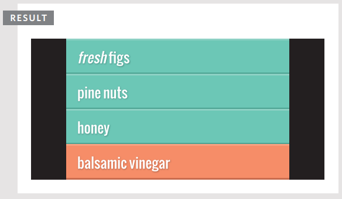

En este ejemplo, la NodeList se genera usando `querySelectorAll()`, y busca cualquier elemento `<li>` que tenga un atributo `class` cuyo valor sea `hot`. La NodeList se almacena en una variable llamada `hotItems`, y el número de elementos en la lista se obtiene usando la propiedad `length`. Para cada uno de los elementos en la NodeList, el valor del atributo `class` se cambia a `cool`.

### RECORRIENDO UNA NODELIST: PASO A PASO

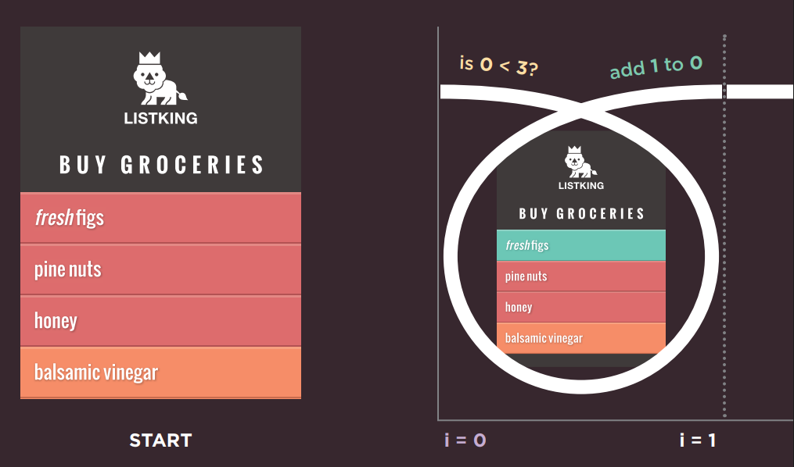

Al comienzo de este ejemplo, hay tres elementos de lista con un atributo `class` cuyo valor es `hot`, por lo que el valor de `hotItems.length` es 3.

Al principio, el valor del contador se establece en 0, por lo que el primer elemento de la NodeList (que tiene un índice de 0) es seleccionado y el valor de su atributo `class` se establece en `cool`.

```javascript linenums="1"
for (var i = 0; i < hotItems.length; i++) {
  hotItems[i].className = 'cool';
}
```

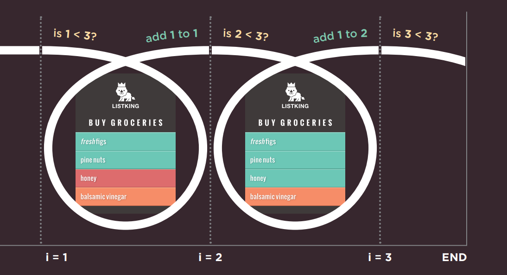

Cuando el valor del contador es 1, el segundo elemento de la NodeList (que tiene un índice de 1) es seleccionado y el valor de su atributo `class` se establece en `cool`.

Cuando el valor del contador es 2, el tercer elemento de la NodeList (que tiene un índice de 2) es seleccionado y el valor de su atributo `class` se establece en `cool`.

Cuando el valor del contador es 3, la condición ya no devuelve `true`, por lo que el bucle termina. El script continúa entonces con la primera línea de código después del bucle.

## RECORRIENDO EL DOM

Cuando tienes un nodo elemento, puedes seleccionar otro elemento en relación con él usando estas cinco propiedades. Esto se conoce como recorrer el DOM.

#### parentNode

Esta propiedad encuentra el nodo elemento del elemento contenedor (o padre) en el HTML.

(1) Si comenzaras con el primer elemento `<li>`, entonces su nodo padre sería el que representa al elemento `<ul>`.

#### previousSibling / nextSibling

Estas propiedades encuentran el hermano anterior o siguiente de un nodo, si hay hermanos.

Si comenzaras con el primer elemento `<li>`, no tendría un hermano anterior. Sin embargo, su siguiente hermano (2) sería el nodo que representa al segundo `<li>`.

#### firstChild / lastChild

Estas propiedades encuentran el primer o último hijo del elemento actual.

Si comenzaras con el elemento `<ul>`, el primer hijo sería el nodo que representa al primer elemento `<li>`, y (3) el último hijo sería el último `<li>`.

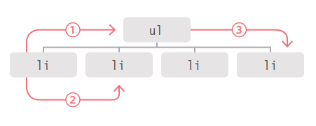

Estas son propiedades del nodo actual (no métodos para seleccionar un elemento); por lo tanto, no terminan en paréntesis.

Si usas estas propiedades y no tienen un hermano anterior/siguiente, o un primer/último hijo, el resultado será `null`.

Estas propiedades son de solo lectura; solo se pueden usar para seleccionar un nuevo nodo, no para actualizar un padre, hermano o hijo.

## NODOS DE ESPACIO EN BLANCO

Recorrer el DOM puede ser difícil porque algunos navegadores añaden un nodo de texto cada vez que encuentran espacio en blanco entre elementos.

La mayoría de los navegadores, excepto IE, tratan el espacio en blanco entre elementos (como espacios o retornos de carro) como un nodo de texto, por lo que las siguientes propiedades devuelven diferentes elementos en diferentes navegadores:

- `previousSibling`
- `nextSibling`
- `firstChild`
- `lastChild`

A continuación, puedes ver todos los nodos de espacio en blanco añadidos al árbol DOM para el ejemplo de la lista. Cada uno está representado por un cuadrado verde. Podrías eliminar todo el espacio en blanco de una página antes de servirla al navegador. Esto también haría la página más pequeña y más rápida de servir/cargar. Sin embargo, también haría el código mucho más difícil de leer.

Otra forma de evitar este problema es no usar estas propiedades DOM en absoluto. Una de las formas más populares de abordar este tipo de problema es usar una biblioteca de JavaScript como jQuery, que ayuda a resolver estos inconvenientes. Este tipo de inconsistencias entre navegadores fueron un factor importante en la popularidad de jQuery.

Internet Explorer (mostrado arriba) ignora el espacio en blanco y no crea nodos de texto adicionales.

Chrome, Firefox, Safari y Opera crean nodos de texto a partir del espacio en blanco (espacios y retornos de carro).

#### HERMANO ANTERIOR Y SIGUIENTE

Has visto que estas propiedades pueden devolver resultados inconsistentes en diferentes navegadores. Sin embargo, es seguro usarlas cuando no hay espacio en blanco entre elementos.

Para este ejemplo, se han eliminado todos los espacios entre los elementos HTML. Para demostrar estas propiedades, el segundo elemento de la lista se selecciona usando `getElementById()`.

Desde este nodo elemento, la propiedad `previousSibling` devolverá el primer elemento `<li>`, y la propiedad `nextSibling` devolverá el tercer elemento `<li>`.

```html linenums="1"
<!--c05/sibling.html-->

<ul>
 <li id="one" class="hot"><em>fresh</em> figs</li>
 <li id="two" class="hot">pine nuts</li>
 <li id="three" class="hot">honey</li>
 <li id="four">balsamic vinegar</li>
</ul>
```

```javascript linenums="1"
//c05/js/sibling.js

// Selecciona el punto de partida y encuentra sus hermanos
var startItem = document.getElementById('two');
var prevItem = startItem.previousSibling;
var nextItem = startItem.nextSibling;
// Cambia los valores de los atributos class de los hermanos
prevItem.className = 'complete';
nextItem.className = 'cool';
```

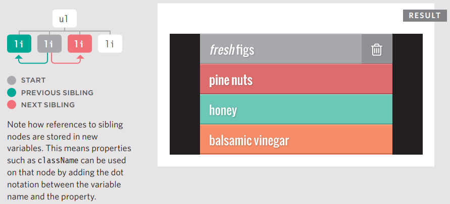

Observa cómo las referencias a los nodos hermanos se almacenan en nuevas variables. Esto significa que propiedades como `className` se pueden usar en ese nodo añadiendo la notación de punto entre el nombre de la variable y la propiedad.

#### PRIMER Y ÚLTIMO HIJO

Estas propiedades también devuelven resultados inconsistentes si hay espacio en blanco entre elementos. En este ejemplo, se usa una solución ligeramente diferente en el HTML – las etiquetas de cierre se ponen junto a las etiquetas de apertura del siguiente elemento, haciéndolo un poco más legible. El ejemplo comienza usando el método `getElementsByTagName()` para seleccionar el elemento `<ul>` de la página. Desde este nodo elemento, la propiedad `firstChild` devolverá el primer elemento `<li>`, y la propiedad `lastChild` devolverá el último elemento `<li>`.

```html linenums="1"
<!--c05/child.html-->

<ul
  ><li id="one" class="hot"><em>fresh</em> figs</li
  ><li id="two" class="hot">pine nuts</li
  ><li id="three" class="hot">honey</li
  ><li id="four">balsamic vinegar</li
></ul>
```

```javascript linenums="1"
// c05/js/child.js

// Selecciona el punto de partida y encuentra sus hijos
var startItem = document.getElementsByTagName('ul')[0];
var firstItem = startItem.firstChild;
var lastItem = startItem.lastChild;
// Cambia los valores de los atributos class de los hijos
firstItem.setAttribute('class', 'complete');
lastItem.setAttribute('class', 'cool');
```
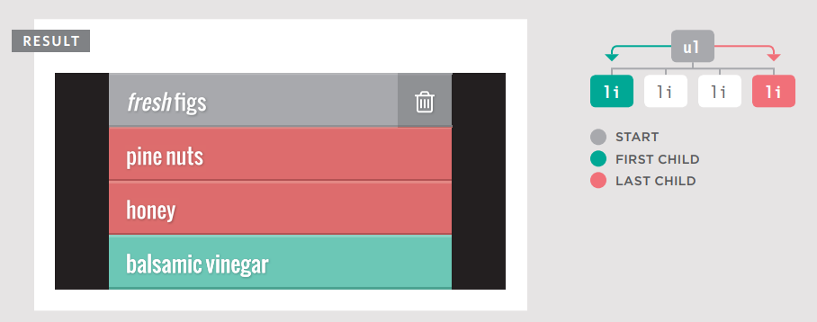

## CÓMO OBTENER/ACTUALIZAR EL CONTENIDO DE UN ELEMENTO

Hasta ahora este capítulo se ha centrado en encontrar elementos en el árbol DOM. El resto de este capítulo muestra cómo acceder/actualizar el contenido de un elemento. Tu elección de técnicas depende de lo que contenga el elemento.

Observa los tres ejemplos de elementos `<li>` que se muestran a la derecha: `<li id="one">figs</li>` Cada uno añade algo más de marcado y, como resultado, el fragmento del árbol DOM para cada elemento de la lista es muy diferente.

- El primero (en esta página) solo contiene texto.
- El segundo y el tercero (en la página derecha) contienen una mezcla de texto y un elemento `<em>`.

Puedes ver que añadiendo algo tan simple como un elemento `<em>`, la estructura del árbol DOM cambia significativamente. A su vez, esto afecta cómo podrías trabajar con ese elemento de la lista. Cuando un elemento contiene una mezcla de texto y otros elementos, es más probable que trabajes con el elemento contenedor en lugar de con los nodos individuales de cada descendiente.

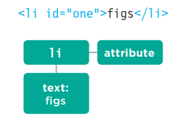

Arriba, el elemento `<li>` tiene:

- Un nodo hijo que contiene la palabra que puedes ver en el elemento de la lista: `figs`
- Un nodo atributo que contiene el atributo `id`

---

Para trabajar con el contenido de los elementos puedes:

- Navegar a los nodos de texto. Esto funciona mejor cuando el elemento solo contiene texto, sin otros elementos.
- Trabajar con el elemento contenedor. Esto te permite acceder a sus nodos de texto y elementos hijo. Funciona mejor cuando un elemento tiene nodos de texto y elementos hijo que son hermanos.

### NODOS DE TEXTO

Una vez que has navegado de un elemento a su nodo de texto, hay una propiedad que usarás comúnmente:

| PROPIEDAD | DESCRIPCIÓN |
|-----------|-------------|
| `nodeValue` | Accede al texto desde el nodo

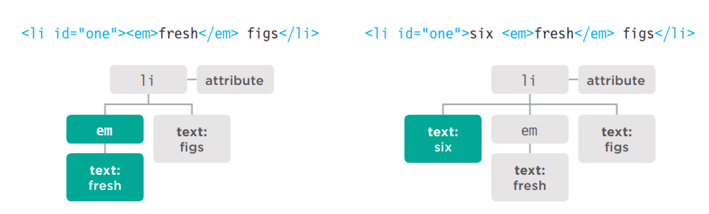

Se añade un elemento `<em>`. Se convierte en el primer hijo.

- El nodo elemento `<em>` tiene su propio nodo hijo de texto que contiene la palabra `fresh`.
- El nodo de texto original ahora es hermano del nodo que representa al elemento `<em>`.

Cuando se añade texto antes del elemento `<em>`:

- El primer hijo del elemento `<li>` es un nodo de texto, que contiene la palabra `six`.
- Tiene un hermano que es un nodo elemento para el elemento `<em>`. A su vez, ese nodo elemento `<em>` tiene un nodo hijo de texto que contiene la palabra `fresh`.
- Finalmente, hay un nodo de texto que contiene la palabra `figs`, que es hermano tanto del nodo de texto de la palabra `six` como del nodo elemento `<em>`.

### ELEMENTO CONTENEDOR

Cuando trabajas con un nodo elemento (en lugar de su nodo de texto), ese elemento puede contener marcado. Tienes que elegir si deseas recuperar (obtener) o actualizar (establecer) el marcado además del texto.

| PROPIEDAD | DESCRIPCIÓN |
|-----------|-------------|
| `innerHTML` | Obtiene/establece texto y marcado |
| `textContent` | Obtiene/establece solo texto |
| `innerText` | Obtiene/establece solo texto |

Cuando usas estas propiedades para actualizar el contenido de un elemento, el nuevo contenido sobrescribirá todo el contenido del elemento (tanto texto como marcado).

Por ejemplo, si usaras cualquiera de estas propiedades para actualizar el contenido del elemento `<body>`, se actualizaría toda la página web.

#### ACCEDER Y ACTUALIZAR UN NODO DE TEXTO CON `nodeValue`

Cuando seleccionas un nodo de texto, puedes recuperar o modificar su contenido usando la propiedad `nodeValue`.

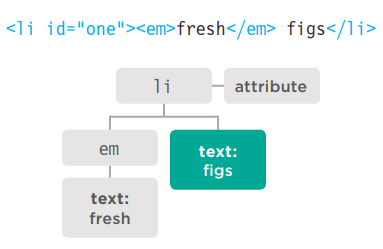

El código siguiente muestra cómo acceder al segundo nodo de texto. Devolverá el resultado: `figs`

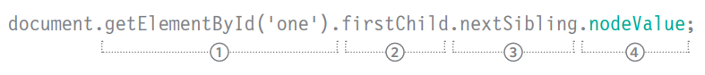

Para usar `nodeValue`, debes estar en un nodo de texto, no en el elemento que contiene el texto. Este ejemplo muestra que navegar desde el nodo elemento hasta un nodo de texto puede ser complicado.

Si no sabes si habrá nodos elemento junto a nodos de texto, es más fácil trabajar con el elemento contenedor.

1. El nodo elemento `<li>` se selecciona usando el método `getElementById()`.
2. El primer hijo de `<li>` es el elemento `<em>`.
3. El nodo de texto es el siguiente hermano de ese elemento `<em>`.
4. Tienes el nodo de texto y puedes acceder a su contenido usando `nodeValue`.

### ACCEDIENDO Y CAMBIANDO UN NODO DE TEXTO

Para trabajar con texto en un elemento, primero se accede al nodo elemento y luego a su nodo de texto.

El nodo de texto tiene una propiedad llamada `nodeValue` que devuelve el texto en ese nodo de texto.

También puedes usar la propiedad `nodeValue` para actualizar el contenido de un nodo de texto.

```javascript linenums="1"
// c05/js/node-value.js
var itemTwo = document.getElementById('two'); // Obtiene el segundo elemento de la lista
var elText = itemTwo.firstChild.nodeValue; // Obtiene su contenido de texto
elText = elText.replace('pine nuts', 'kale'); // Cambia pine nuts por kale
itemTwo.firstChild.nodeValue = elText; // Actualiza el elemento de la lista
```
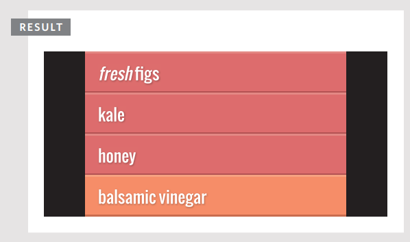

Este ejemplo toma el contenido de texto del segundo elemento de la lista y lo cambia de `pine nuts` a `kale`.

La primera línea obtiene el segundo elemento de la lista. Se almacena en una variable llamada `itemTwo`.

Luego, el contenido de texto de ese elemento se almacena en una variable llamada `elText`.

La tercera línea de texto reemplaza las palabras `pine nuts` por `kale` usando el método `replace()` del objeto `String`.

La última línea usa la propiedad `nodeValue` para actualizar el contenido del nodo de texto con el valor actualizado.

### ACCEDER Y ACTUALIZAR TEXTO CON `textContent` (& `innerText`)

La propiedad `textContent` te permite obtener o actualizar solo el texto que está en el elemento contenedor (y sus hijos).

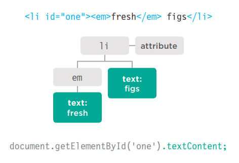

#### textContent

Para recoger el texto de los elementos `<li>` en nuestro ejemplo (e ignorar cualquier marcado dentro del elemento), puedes usar la propiedad `textContent` en el elemento `<li>` contenedor. En este caso devolvería el valor: `fresh figs`.

También puedes usar esta propiedad para actualizar el contenido del elemento; reemplaza todo el contenido del mismo (incluyendo cualquier marcado).

Un problema con la propiedad `textContent` es que Internet Explorer no la soportó hasta IE9. (Todos los demás navegadores principales la soportan.)

#### innerText

También puedes encontrarte con una propiedad llamada `innerText`, pero generalmente deberías evitarla por tres razones clave:

**OBEDECE A CSS**

No mostrará ningún contenido que haya sido ocultado por CSS. Por ejemplo, si hubiera una regla CSS que ocultara los elementos `<em>`, la propiedad `innerText` devolvería solo la palabra `figs`.

**SOPORTE**

Aunque la mayoría de los fabricantes de navegadores adoptaron la propiedad, Firefox no lo hizo porque `innerText` no es parte de ningún estándar.

**RENDIMIENTO**

Debido a que la propiedad `innerText` tiene en cuenta las reglas de diseño que especifican si el elemento es visible o no, puede ser más lenta para recuperar el contenido que la propiedad `textContent`.

### ACCEDIENDO SOLO AL TEXTO

Para demostrar la diferencia entre `textContent` e `innerText`, este ejemplo incluye una regla CSS para ocultar el contenido del elemento `<em>`.

El script comienza obteniendo el contenido del primer elemento de la lista usando tanto la propiedad `textContent` como `innerText`. Luego escribe los valores después de la lista.

Finalmente, el valor del primer elemento de la lista se actualiza para decir `sourdough bread`. Esto se hace usando la propiedad `textContent`.

```javascript linenums="1"
// c05/js/inner-text-and-text-content.js

var firstItem = document.getElementById('one'); // Encuentra el primer elemento de la lista
var showTextContent = firstItem.textContent; // Obtiene el valor de textContent
var showInnerText = firstItem.innerText; // Obtiene el valor de innerText
// Muestra el contenido de estas dos propiedades al final de la lista
var msg = '<p>textContent: ' + showTextContent + '</p>';
msg += '<p>innerText: ' + showInnerText + '</p>';
var el = document.getElementById('scriptResults');
el.innerHTML = msg;
firstItem.textContent = 'sourdough bread'; // Actualiza el primer elemento de la lista
```

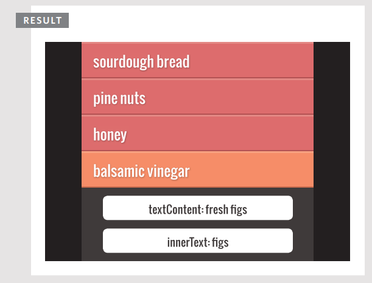

En la mayoría de los navegadores:

- `textContent` recoge las palabras `fresh figs`.
- `innerText` solo muestra `figs` (porque `fresh` estaba oculto por el CSS).

Pero:

- En IE8 o anterior, la propiedad `textContent` no funciona.
- En Firefox, la propiedad `innerText` devolverá `undefined` porque nunca fue implementada en Firefox.

## AÑADIR O ELIMINAR CONTENIDO HTML

Hay dos enfoques muy diferentes para añadir y eliminar contenido de un árbol DOM: la propiedad `innerHTML` y la manipulación del DOM.

### LA PROPIEDAD `innerHTML`

!!! note 

    hay riesgos de seguridad asociados con el uso de `innerHTML` – estos problemas se describen en la pág. 228."

### ENFOQUE

`innerHTML` se puede usar en cualquier nodo elemento. Se usa tanto para recuperar como para reemplazar contenido.

Para actualizar un elemento, se proporciona nuevo contenido como una cadena. Puede contener marcado para elementos descendientes.

### AÑADIR CONTENIDO

Para añadir nuevo contenido:

1. Almacena el nuevo contenido (incluyendo marcado) como una cadena en una variable.
2. Selecciona el elemento cuyo contenido deseas reemplazar.
3. Establece la propiedad `innerHTML` del elemento para que sea la nueva cadena.

### ELIMINAR CONTENIDO

Para eliminar todo el contenido de un elemento, estableces `innerHTML` a una cadena vacía. Para eliminar un elemento de un fragmento DOM, por ejemplo, un `<li>` de un `<ul>`, necesitas proporcionar el fragmento completo menos ese elemento.

#### EJEMPLO: CAMBIAR UN ELEMENTO DE LA LISTA

**1: Crea una variable que contenga el marcado**

```javascript linenums="1"
var item;
item = '<em>Fresh</em> figs';
```

Puedes tener tanto o tan poco marcado en la variable como quieras. Es una forma rápida de añadir mucho marcado al árbol DOM.

**2: Selecciona el elemento cuyo contenido deseas actualizar**

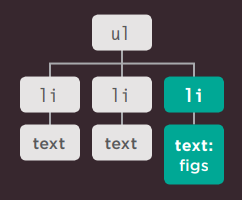

**3: Actualiza el contenido del elemento seleccionado con el nuevo marcado**

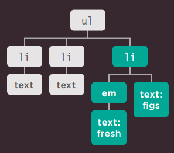

La manipulación del DOM apunta fácilmente a nodos individuales en el árbol DOM, mientras que `innerHTML` es más adecuado para actualizar fragmentos completos.

### MANIPULACIÓN DEL DOM

La manipulación del DOM se refiere a un conjunto de métodos del DOM que te permiten crear nodos elemento y de texto, y luego adjuntarlos al árbol DOM o eliminarlos del árbol DOM.

La manipulación del DOM puede ser más segura que usar `innerHTML`, pero requiere más código y puede ser más lenta.

#### AÑADIR CONTENIDO

Para añadir contenido, usas un método DOM para crear nuevo contenido un nodo a la vez y almacenarlo en una variable. Luego se usa otro método DOM para adjuntarlo al lugar correcto en el árbol DOM.

#### ELIMINAR CONTENIDO

Puedes eliminar un elemento (junto con cualquier contenido y elementos hijo que pueda contener) del árbol DOM usando un solo método.

#### EJEMPLO: AÑADIR UN ELEMENTO DE LA LISTA

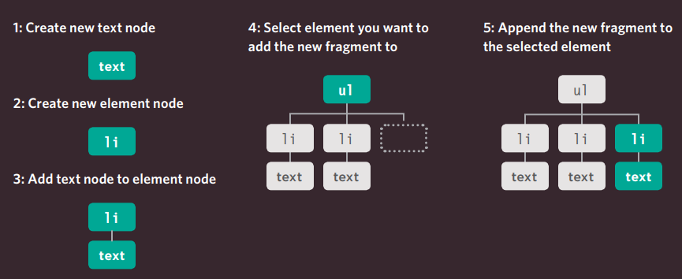

## ACCEDER Y ACTUALIZAR TEXTO Y MARCADO CON `innerHTML`

Usando la propiedad `innerHTML`, puedes acceder y modificar el contenido de un elemento, incluyendo cualquier elemento hijo.

#### innerHTML

Al obtener HTML de un elemento, la propiedad `innerHTML` obtendrá el contenido de un elemento y lo devolverá como una larga cadena, incluyendo cualquier marcado que contenga el elemento.

Cuando se usa para establecer nuevo contenido para un elemento, tomará una cadena que puede contener marcado y procesará esa cadena, añadiendo cualquier elemento dentro de ella al árbol DOM.

Al añadir nuevo contenido usando `innerHTML`, ten en cuenta que una sola etiqueta de cierre faltante podría alterar el diseño de toda la página. Peor aún, si `innerHTML` se usa para añadir contenido creado por tus usuarios a una página, podrían añadir contenido malicioso. Ver pág. 228.

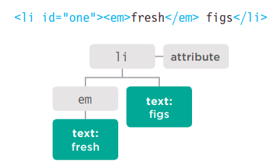

#### OBTENER CONTENIDO

La siguiente línea de código recoge el contenido del elemento de la lista y lo añade a una variable llamada `elContent`:

```javascript linenums="1"
var elContent = document.getElementById('one').innerHTML;
```

La variable `elContent` ahora contendría la cadena: `'<em>fresh</em> figs'`

#### ESTABLECER CONTENIDO

La siguiente línea de código añade el contenido de la variable `elContent` (incluyendo cualquier marcado) al primer elemento de la lista:

```javascript linenums="1"
document.getElementById('one').innerHTML = elContent;
```

### ACTUALIZAR TEXTO Y MARCADO

Este ejemplo comienza almacenando el primer elemento de la lista en una variable llamada `firstItem`.

Luego recupera el contenido de este elemento de la lista y lo almacena en una variable llamada `itemContent`.

Finalmente, el contenido del elemento de la lista se coloca dentro de un enlace. Observa cómo las comillas se escapan.

```javascript linenums="1"
// c05/js/inner-html.js

// Almacena el primer elemento de la lista en una variable
var firstItem = document.getElementById('one');
// Obtiene el contenido del primer elemento de la lista
var itemContent = firstItem.innerHTML;
// Actualiza el contenido del primer elemento de la lista para que sea un enlace
firstItem.innerHTML = '<a href=\"http://example.org\">' + itemContent + '</a>';
```
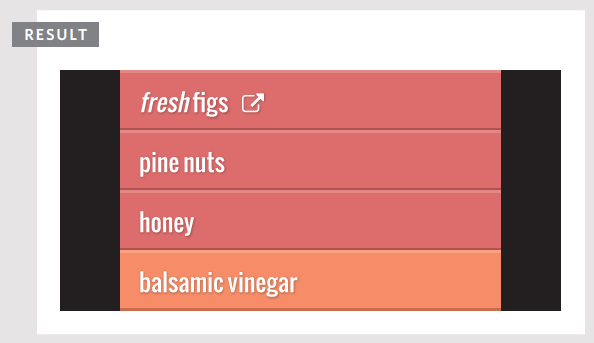

A medida que el contenido de la cadena se añade al elemento usando la propiedad `innerHTML`, el navegador añadirá cualquier elemento de la cadena al DOM. En este ejemplo, se ha añadido un elemento `<a>` a la página. (Cualquier elemento nuevo también estará disponible para otros scripts en la página.)

Si usas atributos en tu código HTML, escapar las comillas usando el carácter de barra invertida `\` puede hacer más claro que esos caracteres no son parte del script.

## AÑADIR ELEMENTOS USANDO MANIPULACIÓN DEL DOM

La manipulación del DOM ofrece otra técnica para añadir nuevo contenido a una página (en lugar de `innerHTML`). Implica tres pasos:

### 1. CREAR EL ELEMENTO: `createElement()`

Empiezas creando un nuevo nodo elemento usando el método `createElement()`. Este nodo elemento se almacena en una variable.

Cuando se crea el nodo elemento, aún no es parte del árbol DOM. No se añade al árbol DOM hasta el paso 3.

### 2. DARLE CONTENIDO: `createTextNode()`

`createTextNode()` crea un nuevo nodo de texto. De nuevo, el nodo se almacena en una variable. Se puede añadir al nodo elemento usando el método `appendChild()`. Esto proporciona el contenido para el elemento, aunque puedes omitir este paso si quieres adjuntar un elemento vacío al árbol DOM.

### 3. AÑADIRLO AL DOM: `appendChild()`

Ahora que tienes tu elemento (opcionalmente con algo de contenido en un nodo de texto), puedes añadirlo al árbol DOM usando el método `appendChild()`.

El método `appendChild()` te permite especificar a qué elemento quieres añadir este nodo, como hijo del mismo.

> En el ejemplo al final del capítulo, verás otro método que se puede usar para insertar un elemento en el árbol DOM. El método `insertBefore()` se usa para añadir un nuevo elemento antes del nodo DOM seleccionado.

> Tanto la manipulación del DOM como `innerHTML` tienen sus usos. Verás una discusión sobre cuándo elegir cada método en la pág. 226.

!!! note

    Puedes ver que los desarrolladores a veces dejan un elemento vacío en sus páginas HTML para adjuntar nuevo contenido a ese elemento, pero esta práctica es mejor evitarla a menos que sea absolutamente necesario.

### AÑADIR UN ELEMENTO AL ÁRBOL DOM

`createElement()` crea un elemento que se puede añadir al árbol DOM, en este caso un elemento `<li>` vacío para la lista.

Este nuevo elemento se almacena dentro de una variable llamada `newEl` hasta que se adjunte al árbol DOM más adelante.

`createTextNode()` te permite crear un nuevo nodo de texto para adjuntar a un elemento. Se almacena en una variable llamada `newText`.

```javascript linenums="1"
// c05/js/add-element.js

// Crea un nuevo elemento y lo almacena en una variable.
var newEl = document.createElement('li');
// Crea un nodo de texto y lo almacena en una variable.
var newText = document.createTextNode('quinoa');
// Adjunta el nuevo nodo de texto al nuevo elemento.
newEl.appendChild(newText);
// Encuentra la posición donde se debe añadir el nuevo elemento.
var position = document.getElementsByTagName('ul')[0];
// Inserta el nuevo elemento en su posición.
position.appendChild(newEl);
```

El nodo de texto se añade al nuevo nodo elemento usando `appendChild()`.

El método `getElementsByTagName()` selecciona la posición en el árbol DOM para insertar el nuevo elemento (el primer elemento `<ul>` en la página).

Finalmente, `appendChild()` se usa de nuevo – esta vez para insertar el nuevo elemento y su contenido en el árbol DOM.

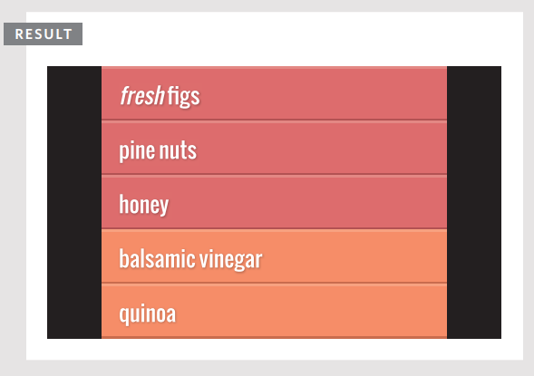

## ELIMINAR ELEMENTOS MEDIANTE MANIPULACIÓN DEL DOM

La manipulación del DOM se puede usar para eliminar elementos del árbol DOM.

#### 1. ALMACENAR EL ELEMENTO A ELIMINAR EN UNA VARIABLE

Empiezas seleccionando el elemento que va a ser eliminado y almacenas ese nodo elemento en una variable.

Puedes usar cualquiera de los métodos que viste en la sección sobre consultas DOM para seleccionar el elemento.

#### 2. ALMACENAR EL PADRE DE ESE ELEMENTO EN UNA VARIABLE

A continuación, encuentras el elemento padre que contiene el elemento que deseas eliminar y almacenas ese nodo elemento en una variable.

La forma más sencilla de obtener este elemento es usar la propiedad `parentNode` de este elemento.

#### 3. ELIMINAR EL ELEMENTO DE SU ELEMENTO CONTENEDOR

El método `removeChild()` se usa en el elemento contenedor que seleccionaste en el paso 2.

El método `removeChild()` toma un parámetro: la referencia al elemento que ya no deseas.

> Cuando eliminas un elemento del DOM, también eliminará cualquier elemento hijo.

> El ejemplo de la derecha es bastante simple, pero esta técnica puede alterar significativamente el árbol DOM.

> Eliminar elementos del DOM afectará el número de índice de los hermanos en una NodeList.

### ELIMINAR UN ELEMENTO DEL ÁRBOL DOM

Este ejemplo usa el método `removeChild()` para eliminar el cuarto elemento de la lista (junto con su contenido).

La primera variable, `removeEl`, almacena el elemento real que deseas eliminar de la página (el cuarto elemento de la lista).

```javascript linenums="1"
// c05/js/remove-element.js

var removeEl = document.getElementsByTagName('li')[3]; // El elemento a eliminar
var containerEl = removeEl.parentNode; // Su elemento contenedor
containerEl.removeChild(removeEl); // Elimina el elemento
```
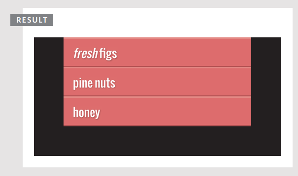

El método `removeChild()` se usa en la variable que contiene el nodo contenedor.

Requiere un parámetro: el elemento que deseas eliminar (que está almacenado en la segunda variable).

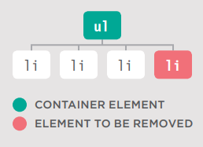

## COMPARANDO TÉCNICAS: ACTUALIZAR CONTENIDO HTML

Hasta ahora, has visto tres técnicas para añadir HTML a una página web. Es momento de comparar cuándo deberías usar cada una.

En cualquier lenguaje de programación, a menudo hay varias formas de lograr la misma tarea. De hecho, si le pidieras a diez programadores que escribieran el mismo script, bien podrías encontrar diez enfoques diferentes.

Algunos programadores pueden tener opiniones bastante firmes y creer que su forma es siempre la forma "correcta" de hacer las cosas – cuando a menudo hay varias formas correctas. Si entiendes por qué las personas prefieren unos enfoques sobre otros, entonces estás en una buena posición para decidir si cumple con las necesidades de tu proyecto.

#### document.write()

El método `write()` del objeto `document` es una forma sencilla de añadir contenido que no estaba en el código fuente original a la página, pero su uso rara vez se recomienda.

**VENTAJAS**

- Es una forma rápida y fácil de mostrar a principiantes cómo se puede añadir contenido a una página.

**DESVENTAJAS**

- Solo funciona cuando la página se carga inicialmente.
- Si lo usas después de que la página se haya cargado, puede:
  1. Sobrescribir toda la página
  2. No añadir el contenido a la página
  3. Crear una nueva página
- Puede causar problemas con páginas XHTML que están estrictamente validadas.
- Este método es muy raramente usado por los programadores hoy en día y generalmente está mal visto.

Puedes elegir diferentes técnicas dependiendo de la tarea (y teniendo en cuenta cómo el sitio podría desarrollarse en el futuro).

#### element.innerHTML

La propiedad `innerHTML` te permite obtener/actualizar todo el contenido de cualquier elemento (incluyendo marcado) como una cadena.

**VENTAJAS**

- Puedes usarla para añadir mucho marcado nuevo usando menos código que los métodos de manipulación del DOM.
- Puede ser más rápida que la manipulación del DOM al añadir muchos elementos nuevos a una página web.
- Es una forma sencilla de eliminar todo el contenido de un elemento (asignándole una cadena vacía).

**DESVENTAJAS**

- No debería usarse para añadir contenido que provenga de un usuario (como un nombre de usuario o comentario de blog), ya que puede suponer un riesgo de seguridad significativo, que se discute en las siguientes cuatro páginas.
- Puede ser difícil aislar elementos individuales que deseas actualizar dentro de un fragmento DOM más grande.
- Los manejadores de eventos pueden dejar de funcionar como se esperaba.

### MANIPULACIÓN DEL DOM

La manipulación del DOM se refiere al uso de un conjunto de métodos y propiedades para acceder, crear y actualizar elementos y nodos de texto.

**VENTAJAS**

- Es adecuada para cambiar un elemento de un fragmento DOM donde hay muchos hermanos.
- No afecta a los manejadores de eventos.
- Permite fácilmente que un script añada elementos de forma incremental (cuando no quieres alterar mucho código de una vez).

**DESVENTAJAS**

- Si tienes que hacer muchos cambios en el contenido de una página, es más lento que `innerHTML`.
- Necesitas escribir más código para lograr lo mismo en comparación con `innerHTML`.

## ATAQUES DE CROSS-SITE SCRIPTING (XSS)

Si añades HTML a una página usando `innerHTML` (o varios métodos de jQuery), debes estar al tanto de los Ataques de Cross-Site Scripting o XSS; de lo contrario, un atacante podría obtener acceso a las cuentas de tus usuarios.

Este libro tiene varias advertencias sobre problemas de seguridad cuando añades HTML a una página usando `innerHTML`. (También hay notas al respecto cuando se usa jQuery.)

### CÓMO OCURRE EL XSS

XSS implica que un atacante coloque código malicioso en un sitio. Los sitios web a menudo presentan contenido creado por muchas personas diferentes. Por ejemplo:

- Los usuarios pueden crear perfiles o añadir comentarios.
- Varios autores pueden contribuir con artículos.
- Los datos pueden provenir de sitios de terceros como Facebook, Twitter, tickers de noticias y otros feeds.
- Se pueden subir archivos como imágenes y videos.

Los datos sobre los que no tienes control completo se conocen como datos no confiables; deben manejarse con cuidado.

Las siguientes cuatro páginas describen los problemas que debes tener en cuenta y cómo hacer que tu sitio sea seguro contra este tipo de ataques.

### ¿QUÉ PUEDEN HACER ESTOS ATAQUES?

XSS puede dar al atacante acceso a información en:

- El DOM (incluyendo datos de formularios)
- Las cookies de ese sitio web
- Tokens de sesión: información que te identifica de otros usuarios cuando inicias sesión en un sitio

Esto podría permitir al atacante acceder a una cuenta de usuario y:

- Hacer compras con esa cuenta
- Publicar contenido difamatorio
- Difundir su código malicioso más lejos / más rápido

### INCLUSO EL CÓDIGO SIMPLE PUEDE CAUSAR PROBLEMAS

El código malicioso a menudo mezcla HTML y JavaScript (aunque las URL y CSS también pueden usarse para desencadenar ataques XSS).

Los dos ejemplos siguientes demuestran cómo un código bastante simple podría ayudar a un atacante a acceder a la cuenta de un usuario.

Este primer ejemplo almacena datos de cookies en una variable, que luego podría enviarse a un servidor de terceros:

```html linenums="1"
<script>var adr='http://example.com/xss.php?cookie=' + escape(document.cookie);</script>
```

Este código muestra cómo una imagen faltante puede usarse con un atributo HTML para desencadenar código malicioso:

```html linenums="1"

```

Cualquier HTML de fuentes no confiables abre tu sitio a ataques XSS. Pero la amenaza solo proviene de ciertos caracteres.

### DEFENDIÉNDOSE CONTRA EL CROSS-SITE SCRIPTING

#### VALIDAR LA ENTRADA QUE VA AL SERVIDOR

1. Solo permite que los visitantes ingresen el tipo de caracteres que necesitan cuando proporcionan información. Esto se conoce como validación. No permitas que usuarios no confiables envíen marcado HTML o JavaScript.

2. Vuelve a verificar la validación en el servidor antes de mostrar el contenido del usuario o almacenarlo en una base de datos. Esto es importante porque los usuarios podrían omitir la validación en el navegador desactivando JavaScript.

3. La base de datos puede contener de forma segura marcado y scripts de fuentes confiables (por ejemplo, tu sistema de gestión de contenidos). Esto se debe a que no intenta procesar el código; solo lo almacena.

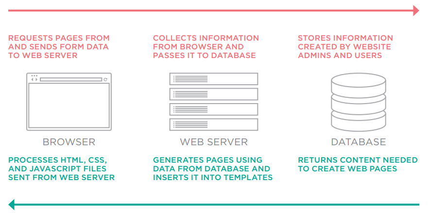

4. Cuando tus datos salgan de la base de datos, todos los caracteres potencialmente peligrosos deberían escaparse (ver pág. 231).

5. Asegúrate de que solo estás insertando contenido generado por usuarios en ciertas partes de los archivos de plantilla (ver pág. 230).

6. No crees fragmentos DOM que contengan HTML de fuentes no confiables. Solo debería añadirse como texto una vez que haya sido escapado.

Por lo tanto, puedes usar `innerHTML` de forma segura para añadir marcado a una página si has escrito el código – pero el contenido de cualquier fuente no confiable debería escaparse y añadirse como texto (no como marcado), usando propiedades como `textContent`.

### XSS: VALIDACIÓN Y PLANTILLAS

Asegúrate de que tus usuarios solo puedan ingresar los caracteres que necesitan usar y limita dónde se mostrará este contenido en la página.

#### FILTRAR O VALIDAR LA ENTRADA

La defensa más básica es evitar que los usuarios ingresen caracteres en los campos de formulario que no necesitan usar al proporcionar ese tipo de información.

Por ejemplo, los nombres de usuarios y las direcciones de correo electrónico no contendrán corchetes angulares, ampersands o paréntesis, por lo que puedes validar los datos para evitar que se usen caracteres como estos.

Esto se puede hacer en el navegador, pero también debe hacerse en el servidor (en caso de que el usuario tenga JavaScript desactivado). Aprenderás sobre validación en el Capítulo 13.

#### LIMITAR DÓNDE VA EL CONTENIDO DEL USUARIO

Los usuarios malintencionados no solo usarán etiquetas `<script>` para intentar crear un ataque XSS. Como viste en la pág. 228, el código malicioso puede vivir en un atributo de manejador de eventos sin estar envuelto en etiquetas `<script>`. XSS también puede ser desencadenado por código malicioso en CSS o URL.

Los navegadores procesan HTML, CSS y JavaScript de diferentes maneras (o contextos de ejecución), y en cada lenguaje diferentes caracteres pueden causar problemas.

Por lo tanto, solo debes añadir contenido de fuentes no confiables como texto (no como marcado), y colocar ese texto en elementos que sean visibles en el viewport.

Puede que hayas visto que las secciones de comentarios en los sitios web rara vez permiten ingresar mucho marcado (a veces permiten un subconjunto limitado de HTML). Esto es para evitar que las personas ingresen código malicioso como etiquetas `<script>`, o cualquier otro carácter con un atributo de manejador de eventos.

Incluso los editores HTML utilizados en muchos sistemas de gestión de contenidos limitarán el código que se permite usar dentro de ellos, y automáticamente intentarán corregir cualquier marcado que parezca malicioso.

Nunca coloques ningún contenido de usuario en los siguientes lugares sin experiencia detallada en los problemas involucrados (que están más allá del alcance de este libro):

- Etiquetas `<script>`: `<script>aquí no</script>`
- Comentarios HTML: `<!-- aquí no -->`
- Nombres de etiquetas: `<noAquí href="/test" />`
- Atributos: `<div noAquí="tampocoAquí" />`
- Valores CSS: `{color: aquí no}`

### XSS: ESCAPAR Y CONTROLAR EL MARCADO

Cualquier contenido generado por usuarios que contenga caracteres que se usan en código debería escaparse en el servidor. Debes controlar cualquier marcado añadido a la página.

#### ESCAPAR EL CONTENIDO DEL USUARIO

Todos los datos de fuentes no confiables deberían escaparse en el servidor antes de mostrarse en la página.

La mayoría de los lenguajes del lado del servidor ofrecen funciones auxiliares que eliminarán o escaparán el código malicioso.

**HTML**

Escapa estos caracteres para que se muestren como caracteres (no se procesen como código):

| Carácter | Entidad |
|----------|---------|
| `&` | `&amp;` |
| `<` | `&lt;` |
| `>` | `&gt;` |
| `"` | `&quot;` |
| `'` | `&#x27;` (no `&apos;`) |
| `/` | `&#x2F;` |
| `` ` `` | `&#x60;` |

**JAVASCRIPT**

Nunca incluyas datos de fuentes no confiables en JavaScript. Implica escapar todos los caracteres ASCII con un valor menor a 256 que no sean caracteres alfanuméricos (y puede ser un riesgo de seguridad).

**URLS**

Si tienes enlaces que contienen entrada del usuario (por ejemplo, enlaces a un perfil de usuario o consultas de búsqueda), usa el método `encodeURIComponent()` de JavaScript para codificar la entrada del usuario. Codifica los siguientes caracteres: `, / ? : @ & = + $ #`

#### AÑADIR CONTENIDO DEL USUARIO

Cuando añades contenido no confiable a una página HTML, una vez que ha sido escapado en el servidor, aún debería añadirse a la página como texto. JavaScript y jQuery ofrecen herramientas para hacer esto:

**JAVASCRIPT**

- **SÍ usa:** `textContent` o `innerText` (ver pág. 216)
- **NO uses:** `innerHTML` (ver pág. 220)

**JQUERY**

- **SÍ usa:** `.text()` (ver pág. 316)
- **NO uses:** `.html()` (ver pág. 316)

Aún puedes usar la propiedad `innerHTML` y el método `.html()` de jQuery para añadir HTML al DOM, pero debes asegurarte de que:

- Tú controlas todo el marcado que se genera (no permitas contenido de usuario que pueda contener marcado).
- El contenido del usuario se escapa y se añade como texto usando los enfoques indicados anteriormente, en lugar de añadir el contenido del usuario como HTML.

## NODOS ATRIBUTO

Una vez que tienes un nodo elemento, puedes usar otras propiedades y métodos en ese nodo elemento para acceder y cambiar sus atributos.

Hay dos pasos para acceder y actualizar atributos.

Primero, selecciona el nodo elemento que lleva el atributo y seguidamente coloca un símbolo de punto. 

Luego, usa uno de los métodos o propiedades siguientes para trabajar con los atributos de ese elemento.

> Encuentra el nodo elemento (funciona con cualquier técnica cubierta en este capítulo).

> Obtiene el valor del atributo que se dio como parámetro del método.

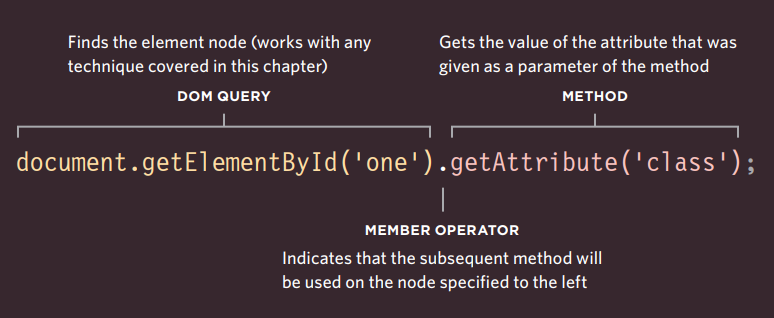

> Indica que el método subsiguiente se usará en el nodo especificado a la izquierda.

Antes de trabajar con un atributo, es una buena práctica verificar si existe. Esto ahorrará recursos si el atributo no se encuentra.

**MÉTODOS**

| Método | Descripción |
|--------|-------------|
| `getAttribute()` | Obtiene el valor del atributo |
| `hasAttribute()` | Comprueba si existe el atributo |
| `setAttribute()` | Establece el valor del atributo |
| `removeAttribute()` | Elimina el atributo |

**PROPIEDADES**

| Propiedad | Descripción |
|-----------|-------------|
| `className` | Obtiene o establece el valor del atributo `class` |
| `id` | Obtiene o establece el valor del atributo `id` |


Has visto que el DOM trata cada elemento HTML como su propio objeto en el árbol DOM. Las propiedades del objeto corresponden a los atributos que ese tipo de elemento puede llevar.

A la izquierda, puedes ver las propiedades `className` e `id`. (Otras incluyen `accessKey`, `checked`, `href`, `lang` y `title`).

### VERIFICAR UN ATRIBUTO Y OBTENER SUS VALORES

Antes de trabajar con un atributo, es una buena práctica verificar si existe. Esto ahorrará recursos si el atributo no se encuentra.

El método `hasAttribute()` de cualquier nodo elemento te permite verificar si existe un atributo. El nombre del atributo se da como argumento entre paréntesis.

Usar `hasAttribute()` en una sentencia `if` como esta significa que el código dentro de las llaves se ejecutará solo si el atributo existe en el elemento dado.

```javascript linenums="1"
// c05/js/get-attribute.js
var firstItem = document.getElementById('one'); // Obtiene el primer elemento de la lista
if (firstItem.hasAttribute('class')) { // Si tiene un atributo class
  var attr = firstItem.getAttribute('class'); // Obtiene el atributo
  // Añade el valor del atributo después de la lista
  var el = document.getElementById('scriptResults');
  el.innerHTML = '<p>El primer elemento tiene un nombre de clase: ' + attr + '</p>';
}
```
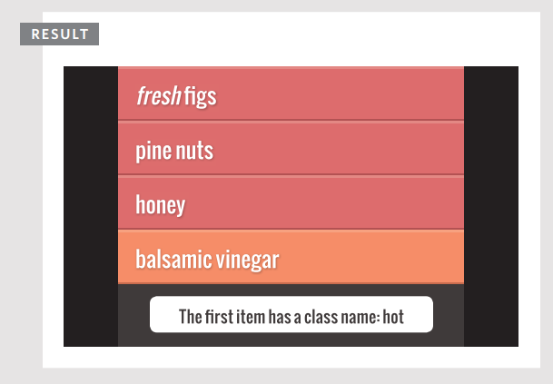

En este ejemplo, la consulta DOM `getElementById()` devuelve el elemento cuyo atributo `id` tiene un valor de `one`.

El método `hasAttribute()` se usa para verificar si este elemento tiene un atributo `class`, y devuelve un booleano. Esto se usa con una sentencia `if` para que el código dentro de las llaves se ejecute solo si el atributo `class` existe.

El método `getAttribute()` devuelve el valor del atributo `class`, que luego se escribe en la página.

**Soporte del navegador:** Ambos métodos tienen buen soporte en todos los navegadores principales.

### CREAR ATRIBUTOS Y CAMBIAR SUS VALORES

La propiedad `className` te permite cambiar el valor del atributo `class`. Si el atributo no existe, se creará y se le dará el valor especificado.

Has visto esta propiedad usada a lo largo del capítulo para actualizar el estado de los elementos de la lista. A continuación, puedes ver otra forma de lograr la tarea.

El método `setAttribute()` te permite actualizar el valor de cualquier atributo. Toma dos parámetros: el nombre del atributo y el valor para el atributo.

```javascript linenums="1"
// c05/js/set-attribute.js

var firstItem = document.getElementById('one'); // Obtiene el primer elemento
firstItem.className = 'complete'; // Cambia su atributo class
var fourthItem = document.getElementsByTagName('li').item(3); // Obtiene el cuarto elemento
fourthItem.setAttribute('class', 'cool'); // Añade un atributo a este
```

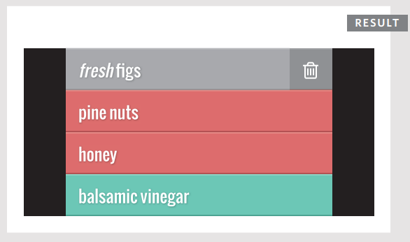

Cuando existe una propiedad (como las propiedades `className` o `id`), generalmente se considera mejor actualizar las propiedades en lugar de usar un método (porque, detrás de escena, el método solo estaría estableciendo las propiedades de todos modos).

Cuando actualizas el valor de un atributo (especialmente el atributo `class`), puede usarse para activar nuevas reglas CSS y, por lo tanto, cambiar la apariencia de los elementos.

!!! note 

    Estas técnicas sobrescriben todo el valor del atributo `class`. No añaden un nuevo valor al valor existente del atributo `class`.

    Si quisieras añadir un nuevo valor al valor existente del atributo `class`, necesitarías leer primero el contenido del atributo, luego añadir el nuevo texto a ese valor existente del atributo (o usar el método `.addClass()` de jQuery cubierto en la pág. 320).

### ELIMINAR ATRIBUTOS

Para eliminar un atributo de un elemento, primero selecciona el elemento, luego llama a `removeAttribute()`.

Tiene un parámetro: el nombre del atributo a eliminar.

Intentar eliminar un atributo que no existe no causará un error, pero es una buena práctica verificar su existencia antes de intentar eliminarlo.

En este ejemplo, el método `getElementById()` se usa para recuperar el primer elemento de esta lista, que tiene un atributo `id` con un valor de `one`.

```javascript linenums="1"
// c05/js/remove-attribute.js

var firstItem = document.getElementById('one'); // Obtiene el primer elemento
if (firstItem.hasAttribute('class')) { // Si tiene un atributo class
  firstItem.removeAttribute('class'); // Elimina su atributo class
}
```
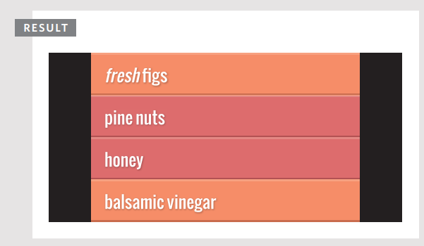

El script verifica si el elemento seleccionado tiene un atributo `class` y, si es así, se elimina.

#### EJEMPLO: MODELO DE OBJETOS DEL DOCUMENTO

Este ejemplo reúne una selección de las técnicas que has visto a lo largo del capítulo para actualizar el contenido de la lista.

Tiene tres objetivos principales:

**1: Añadir un nuevo elemento al inicio y al final de la lista**

Añadir un elemento al inicio de una lista requiere el uso de un método diferente que añadir un elemento al final de la lista.

**2: Establecer un atributo class en todos los elementos**

Esto implica recorrer cada uno de los elementos `<li>` y actualizar el valor del atributo `class` a `cool`.

**3: Añadir el número de elementos de la lista al encabezado**

Esto implica cuatro pasos:

1. Leer el contenido del encabezado
2. Contar el número de elementos `<li>` en la página
3. Añadir el número de elementos al contenido del encabezado
4. Actualizar el encabezado con este nuevo contenido

```javascript linenums="1"
// c05/js/example.js

// AÑADIR ELEMENTOS AL INICIO Y AL FINAL DE LA LISTA
var list = document.getElementsByTagName('ul')[0]; // Obtiene el elemento <ul>

// AÑADIR NUEVO ELEMENTO AL FINAL DE LA LISTA
var newItemLast = document.createElement('li'); // Crea elemento
var newTextLast = document.createTextNode('cream'); // Crea nodo de texto
newItemLast.appendChild(newTextLast); // Añade nodo de texto al elemento
list.appendChild(newItemLast); // Añade elemento al final de la lista

// AÑADIR NUEVO ELEMENTO AL INICIO DE LA LISTA
var newItemFirst = document.createElement('li'); // Crea elemento
var newTextFirst = document.createTextNode('kale'); // Crea nodo de texto
newItemFirst.appendChild(newTextFirst); // Añade nodo de texto al elemento
list.insertBefore(newItemFirst, list.firstChild); // Añade elemento al inicio de la lista
```

Esta parte del ejemplo añade dos nuevos elementos de lista al elemento `<ul>`: uno al final de la lista y otro al inicio. La técnica utilizada aquí es la manipulación del DOM y hay cuatro pasos para crear un nuevo nodo elemento y añadirlo al árbol DOM:

1. Crear el nodo elemento
2. Crear el nodo de texto
3. Añadir el nodo de texto al nodo elemento
4. Añadir el elemento al árbol DOM

Para lograr el paso cuatro, primero debes especificar el padre que contendrá el nuevo nodo. En ambos casos, este es el elemento `<ul>`. El nodo para este elemento se almacena en una variable llamada `list` porque se usa muchas veces.

El método `appendChild()` añade nuevos nodos como hijo del elemento padre. Tiene un parámetro: el nuevo contenido a añadir al árbol DOM. Si el elemento padre ya tiene elementos hijo, se añadirá después del último de ellos (y por lo tanto será el último hijo del elemento padre).

```javascript
parent.appendChild(newItem);
```

(Has visto este método usado varias veces tanto para añadir nuevos elementos al árbol como para añadir nodos de texto a nodos elemento.)

Para añadir el elemento al inicio de la lista, se usa el método `insertBefore()`. Esto requiere un dato adicional: el elemento antes del cual quieres añadir el nuevo contenido (el elemento destino).

```javascript
parent.insertBefore(newItem, target);
```

```javascript linenums="1"
//c05/js/example.js

var listItems = document.querySelectorAll('li'); // Todos los elementos <li>

// AÑADE UNA CLASE COOL A TODOS LOS ELEMENTOS DE LA LISTA
var i; // Variable de contador
for (i = 0; i < listItems.length; i++) { // Recorre los elementos
  listItems[i].className = 'cool'; // Cambia la clase a cool
}

// AÑADE EL NÚMERO DE ELEMENTOS DE LA LISTA AL ENCABEZADO
var heading = document.querySelector('h2'); // Elemento h2
var headingText = heading.firstChild.nodeValue; // Texto de h2
var totalItems = listItems.length; // Nº de elementos <li>
var newHeading = headingText + '<span>' + totalItems + '</span>'; // Contenido
heading.innerHTML = newHeading; // Actualiza h2
```

El siguiente paso de este ejemplo es recorrer todos los elementos de la lista y actualizar el valor de sus atributos `class`, estableciéndolos a `cool`.

Esto se logra primero recogiendo todos los elementos de la lista y almacenándolos en una variable llamada `listItems`. Luego se usa un bucle `for` para recorrer cada uno de ellos. Para saber cuántas veces debe ejecutarse el bucle, se usa la propiedad `length`.

Finalmente, el código actualiza el encabezado para incluir el número de elementos de la lista. Lo actualiza usando la propiedad `innerHTML` en lugar de las técnicas de manipulación del DOM utilizadas anteriormente en el script.

Esto demuestra cómo puedes añadir al contenido de un elemento existente leyendo su valor actual y añadiéndole contenido. Podrías usar una técnica similar si necesitaras añadir un valor a un atributo – sin sobrescribir su valor existente.

Para actualizar el encabezado con el número de elementos de la lista, necesitas dos datos:

1. El contenido original del encabezado para poder añadirle el número de elementos de la lista. Se recoge usando la propiedad `nodeValue` (aunque `innerHTML` o `textContent` harían lo mismo).
2. El número de elementos de la lista, que se puede encontrar usando la propiedad `length` en la variable `listItems`.

Con esta información lista, hay dos pasos para actualizar el contenido del elemento `<h2>`:

1. Crear el nuevo encabezado y almacenarlo en una variable – el nuevo encabezado estará compuesto por el contenido original del encabezado, seguido del número de elementos de la lista.
2. Actualizar el encabezado, lo que se hace actualizando el contenido del elemento de encabezado usando la propiedad `innerHTML` de ese nodo.

## RESUMEN

- El navegador representa la página usando un árbol DOM.
- Los árboles DOM tienen cuatro tipos de nodos: nodos documento, nodos elemento, nodos atributo y nodos de texto.
- Puedes seleccionar nodos elemento por su atributo `id` o `class`, por nombre de etiqueta, o usando sintaxis de selectores CSS.
- Siempre que una consulta DOM puede devolver más de un nodo, devolverá una NodeList.
- Desde un nodo elemento, puedes acceder y actualizar su contenido usando propiedades como `textContent` e `innerHTML`, o usando técnicas de manipulación del DOM.
- Un nodo elemento puede contener múltiples nodos de texto y elementos hijo que son hermanos entre sí.
- En navegadores antiguos, la implementación del DOM es inconsistente (y es una razón popular para usar jQuery).
- Los navegadores ofrecen herramientas para ver el árbol DOM.


