# EVENTOS

Cuando navegas por la web, tu navegador registra diferentes tipos de eventos. Es la forma del navegador de decir: "Oye, esto acaba de suceder". Tu script puede entonces responder a estos eventos.

Los scripts a menudo responden a estos eventos actualizando el contenido de la página web (a través del Modelo de Objetos del Documento) lo que hace que la página se sienta más interactiva. En este capítulo, aprenderás cómo:

#### INTERACCIONES: CREAR EVENTOS

Los eventos ocurren cuando los usuarios hacen clic o tocan un enlace, pasan el ratón o deslizan sobre un elemento, escriben en el teclado, redimensionan la ventana, o cuando la página que solicitaron se ha cargado.

#### LOS EVENTOS DISPARAN CÓDIGO

Cuando ocurre un evento, o se dispara, puede ser usado para ejecutar una función específica. Diferente código puede ser ejecutado cuando los usuarios interactúan con diferentes partes de la página.

#### EL CÓDIGO RESPONDE A LOS USUARIOS

En el último capítulo, viste cómo el DOM puede ser usado para actualizar una página. Los eventos pueden desencadenar los tipos de cambios que el DOM es capaz de hacer. Así es como una página web reacciona a los usuarios.

## DIFERENTES TIPOS DE EVENTOS

Aquí hay una selección de los eventos que ocurren en el navegador mientras navegas por la web. Cualquiera de estos eventos puede ser usado para ejecutar una función en tu código JavaScript.

#### EVENTOS DE UI (INTERFAZ DE USUARIO)

Ocurren cuando un usuario interactúa con la interfaz de usuario del navegador en lugar de con la página web.

| Evento     | Descripción                                                        |
|------------|--------------------------------------------------------------------|
| `load`     | La página web ha terminado de cargarse                             |
| `unload`   | La página web se está cerrando (generalmente porque se solicitó una nueva página) |
| `error`    | El navegador encuentra un error de JavaScript o un recurso no existe |
| `resize`   | La ventana del navegador ha sido redimensionada                    |
| `scroll`   | El usuario ha desplazado la página hacia arriba o abajo            |

#### EVENTOS DE TECLADO

Ocurren cuando un usuario interactúa con el teclado (ver también el evento `input`).

| Evento      | Descripción                                                      |
|-------------|------------------------------------------------------------------|
| `keydown`   | El usuario presiona una tecla (se repite mientras la tecla está presionada) |
| `keyup`     | El usuario suelta una tecla                                      |
| `keypress`  | Se está insertando un carácter (se repite mientras la tecla está presionada) |

### EVENTOS DE RATÓN

Los eventos de ratón se disparan cuando el ratón se mueve y también cuando sus botones se hacen clic. Todos los elementos en una página soportan los eventos de ratón, y todos estos burbujean. Ten en cuenta que las acciones son diferentes en dispositivos de pantalla táctil.

| Evento       | Disparo y notas                                                                                                                                                                                                                                 |
|--------------|-------------------------------------------------------------------------------------------------------------------------------------------------------------------------------------------------------------------------------------------------|
| `click`      | Se dispara cuando el usuario hace clic en el botón primario del ratón (generalmente el botón izquierdo si hay más de uno). El evento `click` se disparará para el elemento sobre el que está el ratón. También se dispara si el usuario presiona la tecla Enter en el teclado cuando un elemento tiene foco. Un toque en la pantalla táctil se tratará como un solo clic izquierdo. |
| `dblclick`   | Se dispara cuando el usuario hace clic en el botón primario del ratón dos veces en rápida sucesión. Un doble toque se tratará como un doble clic izquierdo.                                                                                                                                      |
| `mousedown`  | Se dispara cuando el usuario presiona cualquier botón del ratón. (No puede ser disparado por teclado.) Puedes usar el evento `touchstart`.                                                                                                       |
| `mouseup`    | Se dispara cuando el usuario suelta un botón del ratón. (No puede ser disparado por teclado.) Puedes usar el evento `touchend`.                                                                                                                   |
| `mouseover`  | Se dispara cuando el cursor estaba fuera de un elemento y luego se mueve dentro de él. (No puede ser disparado por teclado.) Se dispara cuando el cursor se mueve sobre un elemento.                                                              |
| `mouseout`   | Se dispara cuando el cursor está sobre un elemento, y luego se mueve a otro elemento – fuera del elemento actual o un hijo de él. (No puede ser disparado por teclado.) Se dispara cuando el cursor se mueve fuera de un elemento.               |
| `mousemove`  | Se dispara cuando el cursor se mueve alrededor de un elemento. Este evento se dispara repetidamente. (No puede ser disparado por teclado.) Se dispara cuando el cursor se mueve.                                                                  |


Todos los elementos en una página soportan los eventos de ratón, y todos estos burbujean. Ten en cuenta que las acciones son diferentes en dispositivos de pantalla táctil.

Prevenir un comportamiento predeterminado puede tener resultados inesperados. Por ejemplo, un evento `click` solo se dispara cuando ambos eventos `mousedown` y `mouseup` se han disparado.

Ocurren cuando un usuario interactúa con un ratón, trackpad o pantalla táctil.

| Evento       | Descripción                                                       |
|--------------|-------------------------------------------------------------------|
| `click`      | El usuario presiona y suelta un botón sobre el mismo elemento     |
| `dblclick`   | El usuario presiona y suelta un botón dos veces sobre el mismo elemento |
| `mousedown`  | El usuario presiona un botón del ratón mientras está sobre un elemento |
| `mouseup`    | El usuario suelta un botón del ratón mientras está sobre un elemento |
| `mousemove`  | El usuario mueve el ratón (no en pantalla táctil)                 |
| `mouseover`  | El usuario mueve el ratón sobre un elemento (no en pantalla táctil) |
| `mouseout`   | El usuario mueve el ratón fuera de un elemento (no en pantalla táctil) |

## TERMINOLOGÍA

#### LOS EVENTOS SE DISPARAN O SE ELEVAN

Cuando un evento ha ocurrido, a menudo se describe como que se ha disparado o elevado. En el diagrama de la derecha, si el usuario está tocando un enlace, un evento `click` se dispararía en el navegador.

#### LOS EVENTOS DISPARAN SCRIPTS

Se dice que los eventos disparan una función o script. Cuando el evento `click` se dispara en el elemento de este diagrama, podría desencadenar un script que agrande el elemento seleccionado.

#### EVENTOS DE ENFOQUE (FOCUS)

Ocurren cuando un elemento (por ejemplo, un enlace o campo de formulario) gana o pierde el foco.

#### EVENTOS DE FORMULARIO

| Evento    | Descripción                                                          |
|-----------|----------------------------------------------------------------------|
| `input`   | El valor en cualquier elemento `<input>` o `<textarea>` ha cambiado (IE9+) o cualquier elemento con el atributo `contenteditable` |
| `change`  | El valor en un select, checkbox o radio button cambia (IE9+)         |
| `submit`  | El usuario envía un formulario (usando un botón o una tecla)         |
| `reset`   | El usuario hace clic en el botón de reinicio de un formulario (rara vez usado hoy en día) |
| `cut`     | El usuario corta contenido de un campo de formulario                 |
| `copy`    | El usuario copia contenido de un campo de formulario                 |
| `paste`   | El usuario pega contenido en un campo de formulario                  |
| `select`  | El usuario selecciona algo de texto en un campo de formulario        |

#### EVENTOS DE MUTACIÓN*

Ocurren cuando la estructura del DOM ha sido cambiada por un script.

*Serán reemplazados por mutation observers (ver p284)

| Evento                        | Descripción                                                         |
|-------------------------------|---------------------------------------------------------------------|
| `DOMSubtreeModified`          | Se ha realizado un cambio en el documento                           |
| `DOMNodeInserted`             | Se ha insertado un nodo como hijo directo de otro nodo              |
| `DOMNodeRemoved`              | Se ha eliminado un nodo de otro nodo                                |
| `DOMNodeInsertedIntoDocument` | Se ha insertado un nodo como descendiente de otro nodo              |
| `DOMNodeRemovedFromDocument`  | Se ha eliminado un nodo como descendiente de otro nodo              |

## CÓMO LOS EVENTOS DISPARAN CÓDIGO JAVASCRIPT

Cuando el usuario interactúa con el HTML en una página web, hay tres pasos involucrados para lograr que esto ejecute código JavaScript. Juntos, estos pasos se conocen como manejo de eventos.

### 1. SELECCIONAR EL ELEMENTO

Selecciona el elemento o nodo del elemento al que quieres que el script responda. Por ejemplo, si quieres ejecutar una función cuando un usuario hace clic en un enlace específico, necesitas obtener el nodo DOM para ese elemento de enlace. Esto se hace usando una consulta DOM (ver Capítulo 5).

### 2. INDICAR EL EVENTO

Indica qué evento en el nodo o nodos seleccionados ejecutará la respuesta. Los programadores llaman a esto vincular un evento a un nodo DOM. Las dos páginas anteriores mostraron una selección de los eventos populares que puedes monitorear.

### 3. ESPECIFICAR EL CÓDIGO

Indica el código que quieres ejecutar cuando ocurra el evento. Cuando el evento ocurre en un elemento especificado, ejecutará una función. Esta puede ser una función nombrada o anónima.

> Los eventos de UI que se relacionan con la ventana del navegador (en lugar de la página HTML cargada en ella) funcionan con el objeto `window` en lugar de un nodo elemento. Ejemplos incluyen los eventos que ocurren cuando una página solicitada ha terminado de cargarse, o cuando el usuario hace scroll. Aprenderás sobre su uso en la p272.

> Algunos eventos funcionan con la mayoría de los nodos elemento, como el evento `mouseover`, que se ejecuta cuando el usuario pasa el ratón sobre cualquier elemento. Otros eventos solo funcionan con nodos elemento específicos, como el evento `submit`, que solo funciona con un formulario.

Aquí puedes ver cómo el manejo de eventos puede ser usado para proporcionar retroalimentación a los usuarios que completan un formulario de registro. Mostrará un mensaje de error si su nombre de usuario es demasiado corto.

### 1. SELECCIONAR EL ELEMENTO

El elemento con el que los usuarios están interactuando es la entrada de texto donde ingresan el nombre de usuario.

### 2. ESPECIFICAR EL EVENTO

Cuando los usuarios salen de la entrada de texto, este pierde el foco y el evento `blur` se dispara en este elemento.

### 3. EJECUTAR EL CÓDIGO

Cuando el evento `blur` se dispara en el input de nombre de usuario, ejecutará una función llamada `checkUsername()`. Esta función verifica si el nombre de usuario tiene menos de 5 caracteres.

Si no hay suficientes caracteres, muestra un mensaje de error que le pide al usuario que ingrese un nombre de usuario más largo.

Si hay suficientes caracteres, el elemento que contiene el mensaje de error debe limpiarse. Esto es porque ya se puede haber mostrado un mensaje de error al usuario y posteriormente corrigió su error. (Si el mensaje de error todavía fuera visible cuando hubieran llenado el formulario correctamente, sería confuso.)

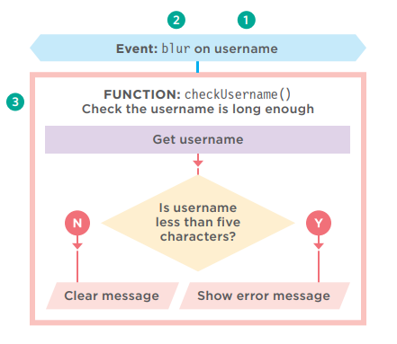

## TRES FORMAS DE VINCULAR UN EVENTO A UN ELEMENTO

Los manejadores de eventos te permiten indicar qué evento estás esperando en cualquier elemento en particular. Hay tres tipos de manejadores de eventos.

### MANEJADORES DE EVENTOS HTML

Ver p251

Esta es una mala práctica, pero debes conocerla porque puedes verla en código antiguo. Las versiones tempranas de HTML incluían un conjunto de atributos que podían responder a eventos en el elemento al que se agregaban. Los nombres de los atributos coincidían con los nombres de los eventos. Sus valores llamaban a la función que se ejecutaba cuando ocurría ese evento. Por ejemplo, lo siguiente:

```html linenums="1"
<a onclick="hide()">

```
Este método de manejo de eventos ya no se usa porque es mejor separar el JavaScript del HTML. Deberías usar uno de los otros enfoques mostrados en esta página en su lugar.

### MANEJADORES DE EVENTOS DOM TRADICIONALES

Ver p252

Los manejadores de eventos DOM fueron introducidos en la especificación original del DOM. Se consideran mejores que los manejadores de eventos HTML porque permiten separar el JavaScript del HTML. El soporte en todos los navegadores principales es muy sólido para este enfoque.

El principal inconveniente es que solo puedes adjuntar una sola función a cualquier evento. Por ejemplo, el evento `submit` de un formulario no puede ejecutar una función que verifique el contenido de un formulario y una segunda para enviar los datos del formulario si pasa las verificaciones.

Como resultado de esta limitación, si se usa más de un script en la misma página, y ambos scripts responden al mismo evento, entonces uno o ambos scripts pueden no funcionar como se espera.

### LISTENERS DE EVENTOS DOM LEVEL 2

Ver p254

Los listeners de eventos fueron introducidos en una actualización de la especificación del DOM (DOM level 2, publicada en el año 2000). Ahora son la forma preferida de manejar eventos.

La sintaxis es bastante diferente y, a diferencia de los manejadores de eventos tradicionales, estos nuevos listeners de eventos permiten que un evento ejecute múltiples funciones. Como resultado, es menos probable que haya conflictos entre diferentes scripts que se ejecutan en la misma página.

Este enfoque no funciona con IE8 (o versiones anteriores de IE) pero encontrarás una solución en p258. Las diferencias en el soporte del navegador para el DOM y los eventos ayudaron a acelerar la adopción de jQuery (pero necesitas saber cómo funcionan los eventos para entender cómo jQuery los usa).

## ATRIBUTOS DE MANEJADORES DE EVENTOS HTML (NO USAR)

Por favor ten en cuenta: este enfoque ahora se considera una mala práctica; sin embargo, debes conocerlo porque puedes verlo si estás revisando código antiguo. (Ver página anterior.)

En el HTML, el primer elemento `<input>` tiene un atributo llamado `onblur` (se ejecuta cuando el usuario sale del elemento). El valor del atributo es el nombre de la función que debe ejecutar.

El valor de los atributos del manejador de eventos sería JavaScript. A menudo llamaría a una función que estaba escrita ya sea en el elemento `<head>` o en un archivo JavaScript separado (como se muestra a continuación).

```html linenums="1"
<!--c06/event-attributes.html-->

<form method="post" action="http://www.example.org/register">
 <label for="username">Create a username: </label>
 <input type="text" id="username" onblur="checkUsername()" />
 <div id="feedback"></div>
 <label for="password">Create a password: </label>
 <input type="password" id="password" />
 <input type="submit" value="Sign up!" />
</form>
...
<script type="text/javascript" src="js/event-attributes.js"></script>
```

```javascript linenums="1"
// c06/js/event-attributes.js

function checkUsername() {
 var elMsg = document.getElementById('feedback');
 var elUsername = document.getElementById('username');
 if (elUsername.value.length < 5) {
 elMsg.textContent = 'Username must be 5 characters or more';
 } else {
 elMsg.textContent = '';
 }
}
```

Los nombres de los atributos del manejador de eventos HTML son idénticos a los nombres de los eventos mostrados en p246 – p247, precedidos por la palabra "on".

Por ejemplo:
- Los elementos `<a>` pueden tener `onclick`, `onmouseover`, `onmouseout`
- Los elementos `<form>` pueden tener `onsubmit`
- Los elementos `<input>` para texto pueden tener `onkeypress`, `onfocus`, `onblur`

## MANEJADORES DE EVENTOS DOM TRADICIONALES

Todos los navegadores modernos entienden esta forma de crear un manejador de eventos, pero solo puedes adjuntar una función a cada manejador de eventos.

Aquí está la sintaxis para vincular un evento a un elemento usando un manejador de eventos, e indicar qué función debe ejecutarse cuando ese evento se dispara:

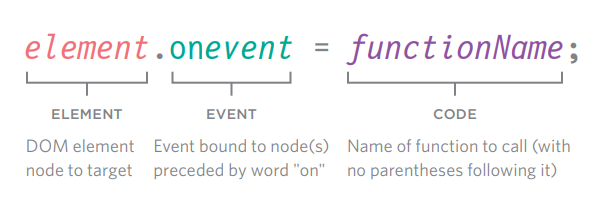

> **ELEMENT**: Nodo elemento del DOM al que apuntar

> **EVENT**: Evento vinculado al nodo(s) precedido por la palabra "on"

> **CODE**: Nombre de la función a llamar (sin paréntesis después)

A continuación, el manejador de eventos está en la última línea (después de que la función ha sido definida y el nodo o nodos del elemento DOM han sido seleccionados).

Cuando se llama a una función, los paréntesis que siguen a su nombre le indican al intérprete de JavaScript que "ejecute este código ahora".

No queremos que el código se ejecute hasta que el evento se dispare, por lo que los paréntesis se omiten en el manejador de eventos en la última línea.

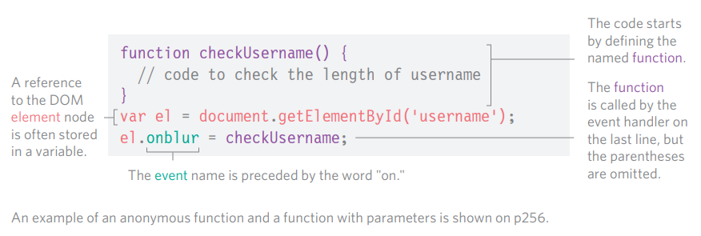

> Una referencia al nodo **elemento** del DOM a menudo se almacena en una variable.

> El código comienza definiendo la **función** nombrada.

> La **función** es llamada por el manejador de eventos en la última línea, pero los paréntesis se omiten.

> Un ejemplo de una función anónima y una función con parámetros se muestra en p256.

## USANDO MANEJADORES DE EVENTOS DOM

En este ejemplo, el manejador de eventos aparece en la última línea del JavaScript. Antes del manejador de eventos DOM, dos cosas se establecen:

1) Si usas una función nombrada, cuando el evento se dispare en el nodo DOM elegido, escribe esa función primero. (También podrías usar una función anónima.)

2) El nodo elemento del DOM se almacena en una variable. Aquí, el input de texto (cuyo atributo `id` tiene un valor de `username`) se coloca en una variable llamada `elUsername`.

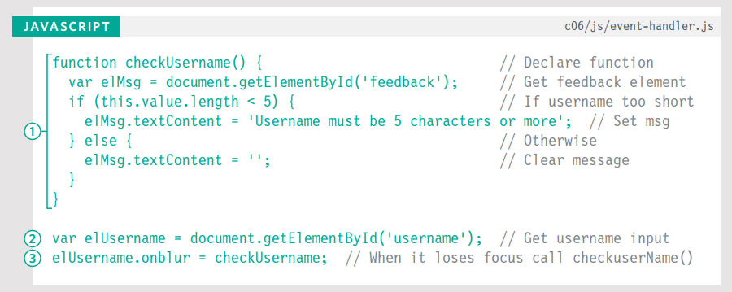

Cuando se usan manejadores de eventos, el nombre del evento está precedido por la palabra "on" (`onsubmit`, `onchange`, `onfocus`, `onblur`, `onmouseover`, `onmouseout`, etc.).

3) En la última línea del ejemplo de código anterior, el manejador de eventos `elUsername.onblur` indica que el código está esperando que el evento `blur` se dispare en el elemento almacenado en la variable llamada `elUsername`.

A esto le sigue un signo igual, luego el nombre de la función que se ejecutará cuando el evento se dispare en ese elemento. Ten en cuenta que no hay paréntesis en el nombre de la función. Esto significa que no puedes pasar argumentos a esta función. (Si quieres pasar argumentos a una función en un manejador de eventos, ver p256.)

El HTML es el mismo que se muestra en p251 pero sin el atributo de evento `onblur`. Esto significa que el manejador de eventos está en el JavaScript, no en el HTML.

Soporte del navegador: En la línea 3, la función `checkUsername()` usa la palabra clave `this` en la sentencia condicional para verificar el número de caracteres que el usuario ingresó. Funciona en la mayoría de los navegadores porque saben que `this` se refiere al elemento en el que ocurrió el evento.

Sin embargo, en Internet Explorer 8 o versiones anteriores, IE trataba `this` como el objeto `window`. Como resultado, no sabría en qué elemento ocurrió el evento y no habría ningún valor del cual verificar la longitud, por lo que generaría un error. Aprenderás una solución para este problema en p264.

## LISTENERS DE EVENTOS

Los listeners de eventos son un enfoque más reciente para el manejo de eventos. Pueden manejar más de una función a la vez pero no son compatibles con navegadores antiguos.

Aquí está la sintaxis para vincular un evento a un elemento usando un listener de eventos, e indicar qué función debe ejecutarse cuando ese evento se dispara:

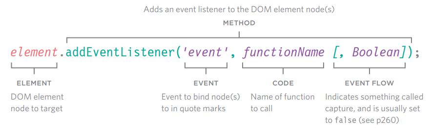

> **ELEMENT**: Nodo elemento del DOM al que apuntar

> **EVENT** Evento a vincular al nodo(s) entre comillas

> **CODE** Nombre de la función a llamar

> **EVENT FLOW** Indica algo llamado captura, y generalmente se establece en `false` (ver p260)

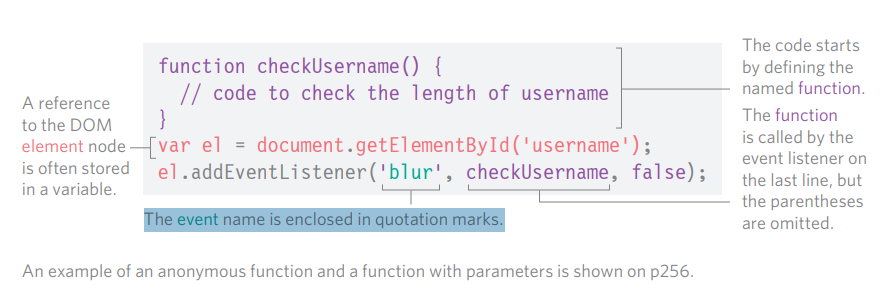

> Una referencia al nodo **elemento** del DOM a menudo se almacena en una variable.

> El nombre del **evento** está encerrado entre comillas.

> El código comienza definiendo la **función** nombrada.

> La **función** es llamada por el listener de eventos en la última línea, pero los paréntesis se omiten.

## USANDO LISTENERS DE EVENTOS

En este ejemplo, el listener de eventos aparece en la última línea del JavaScript. Antes de escribir un listener de eventos, dos cosas se establecen:

1. Si usas una función nombrada, cuando el evento se dispare en el nodo DOM elegido, escribe esa función primero. (También podrías usar una función anónima.)

2. El nodo o nodos del elemento DOM se almacenan en una variable. Aquí, el input de texto (cuyo atributo `id` tiene un valor de `username`) se coloca en una variable llamada `elUsername`.

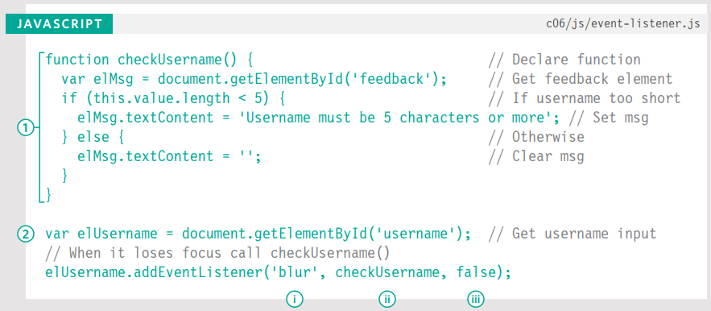

El método `addEventListener()` recibe tres parámetros:

i) El evento que quieres que escuche. En este caso, el evento `blur`.

ii) El código que quieres que ejecute cuando el evento se dispare. En este ejemplo, es la función `checkUsername()`. Ten en cuenta que los paréntesis se omiten donde se llama a la función porque indicarían que la función debería ejecutarse cuando la página se carga (en lugar de cuando el evento se dispara).

iii) Un booleano que indica cómo fluyen los eventos, ver p260. (Generalmente se establece en `false`).

### SOPORTE DEL NAVEGADOR

Internet Explorer 8 y versiones anteriores de IE no soportan el método `addEventListener()`, pero sí soportan un método llamado `attachEvent()` y verás cómo usarlo en p258.

Además, como en el ejemplo anterior, IE8 y versiones antiguas de IE no sabrían a qué se refería `this` en la sentencia condicional. Un enfoque alternativo para manejarlo se muestra en p270.

### NOMBRES DE EVENTOS

A diferencia de los manejadores de eventos HTML y DOM tradicionales, cuando especificas el nombre del evento al que quieres reaccionar, el nombre del evento no está precedido por la palabra "on".

Si necesitas eliminar un listener de eventos, existe una función llamada `removeEventListener()` que elimina el listener de eventos del elemento especificado (tiene los mismos parámetros).

## USANDO PARÁMETROS CON MANEJADORES DE EVENTOS Y LISTENERS

Debido a que no puedes tener paréntesis después de los nombres de las funciones en los manejadores de eventos o listeners, pasar argumentos requiere una solución alternativa.

Normalmente, cuando una función necesita alguna información para hacer su trabajo, pasas argumentos dentro de los paréntesis que siguen al nombre de la función.

Cuando el intérprete ve los paréntesis después de una llamada a función, ejecuta el código de inmediato. En un manejador de eventos, quieres que espere hasta que el evento lo active.

Por lo tanto, si necesitas pasar argumentos a una función que es llamada por un manejador de eventos o listener, envuelves la llamada a la función en una función anónima.

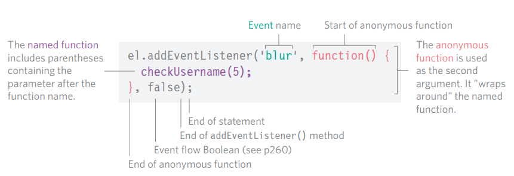

La función nombrada que requiere los argumentos vive dentro de la función anónima.

Aunque la función anónima tiene paréntesis, solo se ejecuta cuando el evento se activa.

La función nombrada puede usar argumentos ya que solo se ejecuta si se llama a la función anónima.

## USANDO PARÁMETROS CON LISTENERS DE EVENTOS

La primera línea de este ejemplo muestra la función `checkUsername()` actualizada. El parámetro `minLength` especifica el número mínimo de caracteres que debe tener el nombre de usuario.

El valor que se pasa a la función `checkUsername()` se usa en la sentencia condicional para verificar si el nombre es suficientemente largo, y proporcionar retroalimentación si el nombre de usuario es demasiado corto.

```javascript linenums="1"
// c06/js/event-listener-with-parameters.js

var elUsername = document.getElementById('username');
var elMsg = document.getElementById('feedback');
function checkUsername(minLength) {
 if (elUsername.value.length < minLength) {
 elMsg.textContent = 'Username must be ' + minLength + ' characters or more';
 } else {
 elMsg.innerHTML = '';
 }
}
elUsername.addEventListener('blur', function() {
 checkUsername(5);
}, false);
```

El listener de eventos en las últimas tres líneas es más largo que el ejemplo anterior porque la llamada a la función `checkUsername()` necesita incluir el valor para el parámetro `minLength`.

Para recibir esta información, el listener de eventos usa una función anónima, que actúa como un envoltorio. Dentro de ese envoltorio, se llama a la función `checkUsername()` y se le pasa un argumento.

## SOPORTE PARA VERSIONES ANTIGUAS DE IE

IE5–8 tenía un modelo de eventos diferente y no soportaba `addEventListener()` pero puedes proporcionar código de respaldo para hacer que los listeners de eventos funcionen con versiones antiguas de IE.

IE5–IE8 no soportaba el método `addEventListener()`. En su lugar, usaba su propio método llamado `attachEvent()` que hacía el mismo trabajo, pero solo estaba disponible en Internet Explorer. Si quieres usar listeners de eventos y necesitas soportar Internet Explorer 8 o anterior, puedes usar una sentencia condicional como se ilustra a continuación.

Usando una sentencia `if...else`, puedes verificar si el navegador soporta el método `addEventListener()`. La condición en la sentencia `if` devolverá `true` si el navegador soporta el método `addEventListener()`, y puedes usarlo. Si el navegador no soporta ese método, devuelve `false`, y el código intentará usar el método `attachEvent()`.

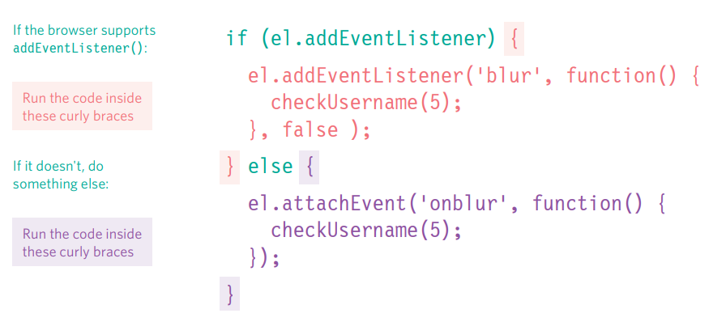

## RESPALDO PARA USAR LISTENERS DE EVENTOS EN IE8

El código de manejo de eventos se basa en el último ejemplo, pero es mucho más largo esta vez porque contiene el respaldo para Internet Explorer 5–8.

Después de la función `checkUsername()`, una sentencia `if` verifica si `addEventListener()` es soportado o no; devuelve `true` si el nodo elemento soporta este método, y `false` si no.

Si el navegador soporta el método `addEventListener()`, el código dentro del primer conjunto de llaves se ejecuta usando `addEventListener()`.

Si no es soportado, entonces el navegador usará el método `attachEvent()` que las versiones antiguas de IE entienden. En la versión de IE, ten en cuenta que el nombre del evento debe estar precedido por la palabra "on".

```javascript linenums="1"
// c06/js/event-listener-with-ie-fallback.js

var elUsername = document.getElementById('username');
var elMsg = document.getElementById('feedback');
function checkUsername(minLength) {
 if (elUsername.value.length < minLength) {
 elMsg.innerHTML = 'Username must be ' + minLength + ' characters or more';
 } else {
 elMsg.innerHTML = '';
 }
}
if (elUsername.addEventListener) {
 elUsername.addEventListener('blur', function() {
 checkUsername(5);
 }, false);
} else {
 elUsername.attachEvent('onblur', function() {
 checkUsername(5);
 });
}
```

Si necesitas soportar IE8 (o anterior), en lugar de escribir este código de respaldo para cada evento al que respondes, es mejor escribir tu propia función (conocida como función auxiliar) que cree el manejador de eventos apropiado para ti. Verás una demostración de esto en el Capítulo 13, que cubre mejora y validación de formularios.

Sin embargo, es importante entender esta sintaxis, usada por IE8 (y anteriores) para que sepas por qué se usa la función auxiliar y qué está haciendo.

Como verás en el próximo capítulo, este es otro tipo de inconsistencia entre navegadores que jQuery puede manejar por ti.

## FLUJO DE EVENTOS

Los elementos HTML se anidan dentro de otros elementos. Si pasas el ratón o haces clic en un enlace, también estarás pasando el ratón o haciendo clic en sus elementos padre.

Imagina que un elemento de lista contiene un enlace. Cuando pasas el ratón sobre el enlace o haces clic en él, JavaScript puede ejecutar eventos en el elemento `<a>`, y también en cualquier elemento en el que el elemento `<a>` esté contenido.

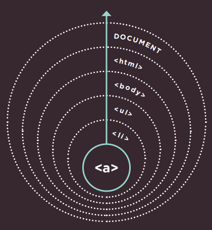


### BURBUJEO DE EVENTOS

El evento comienza en el nodo más específico y fluye hacia afuera hasta el menos específico. Este es el tipo de flujo de eventos predeterminado con un soporte de navegador muy amplio.

---

Los manejadores/listeners de eventos pueden vincularse a los elementos `<li>`, `<ul>`, `<body>`, y `<html>` que los contienen, además del objeto `document`, y el objeto `window`. El orden en que se disparan los eventos se conoce como flujo de eventos, y los eventos fluyen en dos direcciones.

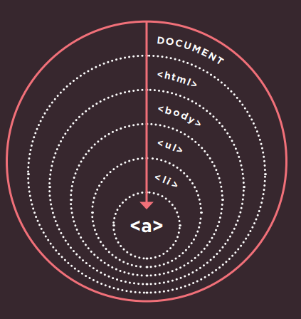

### CAPTURA DE EVENTOS

El evento comienza en el nodo menos específico y fluye hacia adentro hasta el más específico. Esto no es soportado en Internet Explorer 8 y anteriores.

## POR QUÉ IMPORTA EL FLUJO

El flujo de eventos solo realmente importa cuando tu código tiene manejadores de eventos en un elemento y en uno de sus elementos ancestros o descendientes.

El siguiente ejemplo tiene listeners de eventos que responden al evento `click` en cada uno de los siguientes elementos:

- Uno en el elemento `<ul>`
- Uno en el elemento `<li>`
- Uno en el elemento `<a>` dentro del elemento de lista

El evento mostrará el contenido HTML de ese elemento en un cuadro de alerta, y el flujo de eventos te dirá en qué elemento se registra el clic primero.

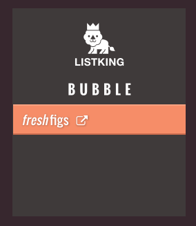

Para los manejadores de eventos DOM tradicionales (y los atributos de eventos HTML), todos los navegadores modernos usan por defecto el burbujeo de eventos en lugar de la captura.

Con los listeners de eventos, el parámetro final en el método `addEventListener()` te permite elegir la dirección para ejecutar los eventos:

- `true` = fase de captura
- `false` = fase de burbujeo (`false` es a menudo la opción predeterminada porque la captura no era soportada en IE8 o anteriores).


El archivo `event-flow.js` (mostrado a la izquierda, y disponible en el código de descarga) demuestra la diferencia entre burbujeo y captura. En este ejemplo, los manejadores de eventos tienen un valor de `false` para su último parámetro, indicando que los eventos deben seguirse en fase de burbujeo. Así que el primer cuadro de alerta muestra el contenido del elemento `<a>` más interno, y va hacia afuera. También puedes ver la versión de captura en el código de descarga.

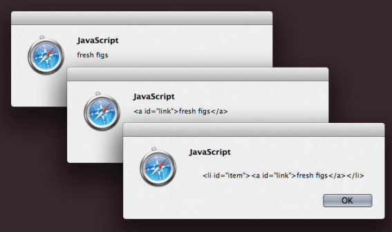

## EL OBJETO EVENTO

Cuando ocurre un evento, el objeto evento te informa sobre el evento y el elemento en el que ocurrió.

Cada vez que un evento se dispara, el objeto evento contiene datos útiles sobre el evento, tales como:

- En qué elemento ocurrió el evento
- Qué tecla fue presionada para un evento `keypress`
- En qué parte del viewport el usuario hizo clic para un evento `click` (el viewport es la parte de la ventana del navegador que muestra la página web)

El objeto evento se pasa a cualquier función que sea el manejador o listener del evento.

Si necesitas pasar argumentos a una función nombrada, el objeto evento primero se pasará a la función anónima envolvente (esto sucede automáticamente); luego debes especificarlo como un parámetro de la función nombrada (como se muestra en la página siguiente).

Cuando el objeto evento se pasa a una función, a menudo se le da el nombre de parámetro `e` (por evento). Es una abreviatura ampliamente utilizada (y la verás adoptada a lo largo de este libro). Ten en cuenta, sin embargo, que algunos programadores también usan el nombre de parámetro `e` para referirse al objeto de error; así que `e` puede significar evento o error en algunos scripts.

No solo IE8 tenía una sintaxis diferente para los listeners de eventos (como se muestra en p258), el objeto evento en IE5-8 también tenía diferentes nombres para las propiedades y métodos mostrados en las tablas a continuación, y en el ejemplo de p265.

| Propiedad     | Equivalente IE5–8 | Propósito                                                    |
|---------------|-------------------|--------------------------------------------------------------|
| `target`      | `srcElement`      | El objetivo del evento (elemento más específico con el que se interactuó) |
| `type`        | `type`            | Tipo de evento que se disparó                                |
| `cancelable`  | no soportado      | Indica si puedes cancelar el comportamiento predeterminado de un elemento |

| Método            | Equivalente IE5–8 | Propósito                                                    |
|-------------------|-------------------|--------------------------------------------------------------|
| `preventDefault()`| `returnValue`     | Cancela el comportamiento predeterminado del evento (si se puede cancelar) |
| `stopPropagation()`| `cancelBubble`   | Detiene que el evento burbujee o se capture más allá         |

#### LISTENER DE EVENTOS SIN PARÁMETROS

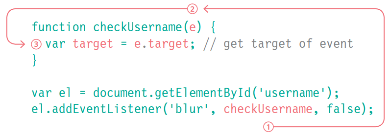

1. Sin que hagas nada, una referencia al objeto evento se pasa automáticamente desde el número 1, donde el listener de eventos llama a la función...

2. Hasta aquí, donde la función está definida. En este punto, el parámetro debe tener un nombre. A menudo se le da el nombre `e` de evento.

3. Este nombre puede ser usado dentro de la función como referencia al objeto evento. Ahora puedes usar las propiedades y métodos del objeto evento.

#### LISTENER DE EVENTOS CON PARÁMETROS

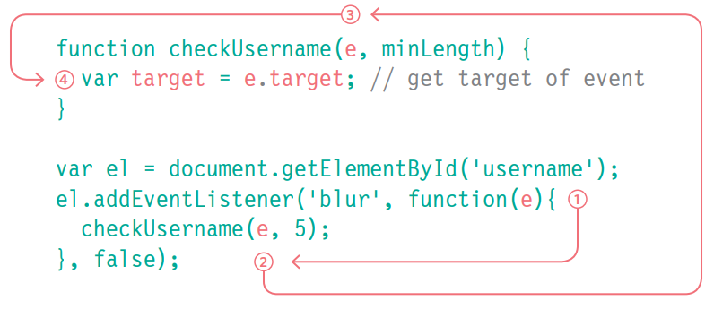

1. La referencia al objeto evento se pasa automáticamente a la función anónima, pero debe tener un nombre en los paréntesis.

2. La referencia al objeto evento puede entonces pasarse a la función nombrada. Se da como el primer argumento de la función nombrada.

3. La función nombrada recibe la referencia al objeto evento como el primer parámetro del método.

4. Ahora puede ser usado por este nombre en la función nombrada.

## EL OBJETO EVENTO EN IE5–8

A continuación puedes ver cómo obtener el objeto evento en IE5–8. No se pasa automáticamente a las funciones de manejador/listener de eventos; pero está disponible como un hijo del objeto `window`.

```javascript linenums="1"
function checkUsername(e) {
 if (!e) {
 e = window.event;
 }
}
```

Arriba, una sentencia `if` verifica si el objeto evento ha sido pasado a la función. Como viste en p168, la existencia de un objeto se trata como un valor truthy, así que la condición aquí está diciendo "si el objeto evento no existe..."

En IE8 y anteriores, `e` no contendrá un objeto, así que el siguiente bloque de código se ejecuta y `e` se establece como el objeto evento que es un hijo del objeto `window`.

#### OBTENER PROPIEDADES

```javascript linenums="1"
var target;
target = e.target || e.srcElement;
```
Una vez que tienes una referencia al objeto evento, puedes obtener sus propiedades usando la técnica de la derecha. Esto funciona mediante evaluación de cortocircuito (ver p169).

#### UNA FUNCIÓN PARA OBTENER EL OBJETIVO DE UN EVENTO

```javascript linenums="1"
function getEventTarget(e) {
 if (!e) {
 e = window.event;
 }
 return e.target || e.srcElement;
}
```
Si necesitas asignar listeners de eventos a varios elementos, aquí hay una función que devolverá una referencia al elemento en el que ocurrió el evento.

## USANDO LISTENERS DE EVENTOS CON EL OBJETO EVENTO

Aquí está el ejemplo que se ha usado a lo largo del capítulo hasta ahora con algunas modificaciones:

1. La función se llama `checkLength()` en lugar de `checkUsername()`. Puede ser usada en cualquier entrada de texto.
2. El objeto evento se pasa al listener de eventos. El código incluye respaldos para IE5–8 (el Capítulo 13 demuestra cómo usar funciones auxiliares para hacer esto).
3. Para determinar con qué elemento estaba interactuando el usuario, la función usa la propiedad `target` del objeto evento (y para IE5–8 usa la propiedad equivalente `srcElement`).

Esta función es ahora mucho más flexible que el código anterior que has visto en este capítulo porque:

1. Puede ser usada para verificar la longitud de cualquier entrada de texto siempre que esa entrada esté directamente seguida por un elemento vacío que pueda contener un mensaje de retroalimentación para el usuario. (No debe haber espacio o retornos de carro entre los dos elementos; de lo contrario, algunos navegadores podrían devolver un nodo de espacio en blanco).

2. El código funcionará con IE5–8 porque prueba si el navegador soporta las características más recientes (o si necesita recurrir a usar técnicas antiguas).

```javascript linenums="1"
// c06/js/event-listener-with-event-object.js

function checkLength(e, minLength) {
 var el, elMsg;
 if (!e) {
 e = window.event;
 }
 el = e.target || e.srcElement;
 elMsg = el.nextSibling;
 if (el.value.length < minLength) {
 elMsg.innerHTML = 'Username must be ' + minLength + ' characters or more';
 } else {
 elMsg.innerHTML = '';
 }
}
var elUsername = document.getElementById('username');
if (elUsername.addEventListener) {
 elUsername.addEventListener('blur', function(e) {
 checkLength(e, 5);
 }, false);
} else {
 elUsername.attachEvent('onblur', function(e){
 checkLength(e, 5);
 });
}
```

## DELEGACIÓN DE EVENTOS

Crear listeners de eventos para muchos elementos puede ralentizar una página, pero el flujo de eventos te permite escuchar un evento en un elemento padre.

Si los usuarios pueden interactuar con muchos elementos en la página, tales como:

- muchos botones en la interfaz de usuario
- una lista larga
- cada celda de una tabla

agregar listeners de eventos a cada elemento puede usar mucha memoria y ralentizar el rendimiento. Debido a que los eventos afectan a los elementos contenedores (o ancestros) (debido al flujo de eventos – p260), puedes colocar manejadores de eventos en un elemento contenedor y usar la propiedad `target` del objeto evento para encontrar en cuál de sus hijos ocurrió el evento.

Al adjuntar un listener de eventos a un elemento contenedor, solo estás respondiendo a un elemento (en lugar de tener un manejador de eventos para cada elemento hijo). Estás delegando el trabajo del listener de eventos a un padre de los elementos. En la lista mostrada aquí, si colocas el listener de eventos en el elemento `<ul>` en lugar de en los enlaces de cada elemento `<li>`, solo necesitas un listener de eventos. Esto proporciona un mejor rendimiento, y si agregas o eliminas elementos de la lista, seguiría funcionando igual. (El código para este ejemplo se muestra en p269.)

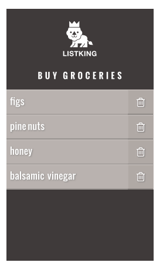

### BENEFICIOS ADICIONALES DE LA DELEGACIÓN DE EVENTOS

**SIMPLIFICA TU CÓDIGO**

Requiere que se escriban menos funciones, y hay menos vínculos entre el DOM y tu código, lo que ayuda al mantenimiento.

**SOLUCIONA LIMITACIONES CON LA PALABRA CLAVE this**

Anteriormente en el capítulo, la palabra clave `this` se usaba para identificar el objetivo de un evento, pero esa técnica no funcionaba en IE8, o cuando una función necesitaba parámetros.

**FUNCIONA CON NUEVOS ELEMENTOS**

Si agregas nuevos elementos al árbol DOM, no tienes que agregar manejadores de eventos a los nuevos elementos porque el trabajo ha sido delegado a un ancestro.

## CAMBIANDO EL COMPORTAMIENTO PREDETERMINADO

El objeto evento tiene métodos que cambian: el comportamiento predeterminado de un elemento y cómo los elementos ancestros responden al evento.

#### preventDefault()

Algunos eventos, como hacer clic en enlaces y enviar formularios, llevan al usuario a otra página. Para prevenir el comportamiento predeterminado de dichos elementos (por ejemplo, para mantener al usuario en la misma página en lugar de seguir un enlace o ser llevado a una nueva página después de enviar un formulario), puedes usar el método `preventDefault()` del objeto evento.

IE5–8 tienen una propiedad equivalente llamada `returnValue` que puede establecerse en `false`. Una sentencia condicional puede verificar si el método `preventDefault()` es soportado, y usar el enfoque de IE8 si no lo es:

```javascript linenums="1"
function setup() {
 var textInput;
 textInput = document.getElementById('username');
 textInput.focus();
}
window.addEventListener('load', setup, false);
```

Ten en cuenta que el listener de eventos se adjunta al objeto `window` (no al objeto `document` – ya que esto puede causar problemas de compatibilidad entre navegadores).

Si el elemento `<script>` está al final de la página HTML, entonces el DOM habría cargado los elementos del formulario antes de que el script se ejecute, y no habría necesidad de esperar al evento `load`. (Ver también: el evento `DOMContentLoaded` en p286 y el método `document.ready()` de jQuery en p312.)

#### stopPropagation()

Una vez que has manejado un evento usando un elemento, es posible que quieras detener que ese evento burbujee hacia sus elementos ancestros (especialmente si hay manejadores de eventos separados respondiendo a los mismos eventos en los elementos contenedores).

Para detener el burbujeo del evento, puedes usar el método `stopPropagation()` del objeto evento. El equivalente en IE8 y anteriores es la propiedad `cancelBubble` que puede establecerse en `true`. Nuevamente, una sentencia condicional puede verificar si el método `stopPropagation()` es soportado y usar el enfoque de IE8 si no:

```javascript linenums="1"
if (event.stopPropagation) {
 event.stopPropagation();
} else {
 event.cancelBubble = true;
}
```

#### USANDO AMBOS MÉTODOS

A veces verás lo siguiente usado en situaciones similares dentro de una función:

```javascript linenums="1"
return false;
```

Previene el comportamiento predeterminado del elemento, y previene que el evento burbujee o se capture más allá. También funciona en todos los navegadores, por lo que es popular.

Ten en cuenta, sin embargo, cuando el intérprete encuentra la sentencia `return false`, deja de procesar cualquier código subsiguiente dentro de esa función y se mueve a la siguiente sentencia después de que la función fue llamada.

Dado que esto bloquea cualquier código adicional dentro de la función, a menudo es mejor usar el método `preventDefault()` del objeto evento en lugar de `return false`.

## USANDO DELEGACIÓN DE EVENTOS

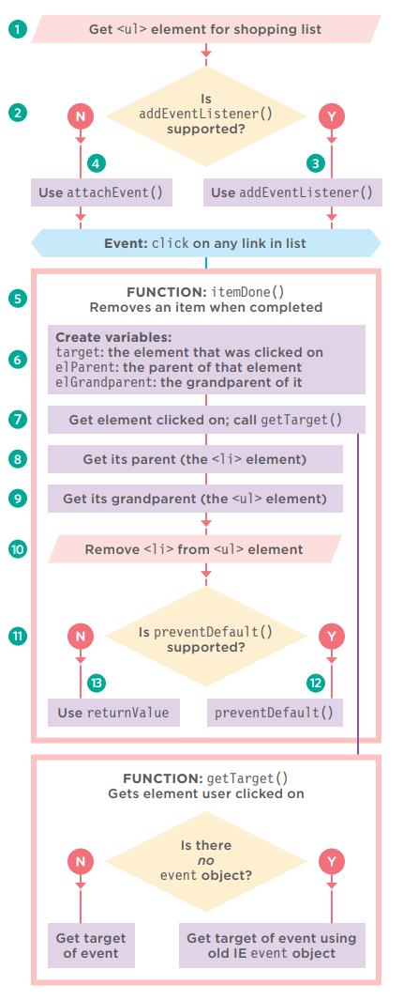

Este ejemplo reunirá gran parte de lo que has aprendido en el capítulo hasta ahora. Cada elemento de la lista contiene un enlace. Cuando el usuario hace clic en ese enlace (para indicar que ha completado esa tarea), el elemento se eliminará de la lista.

- Hay una captura de pantalla del ejemplo en p266.
- A la derecha hay un diagrama de flujo que ayuda a explicar el orden en que se procesa el código.
- La página derecha tiene el código del ejemplo.

1) El listener de eventos se agregará al elemento `<ul>`, por lo que esto necesita ser seleccionado.
   
2) Verificar si el navegador soporta `addEventListener()`.
   
3) Si es así, usarlo para llamar a la función `itemDone()` cuando el usuario haga clic en cualquier lugar de esa lista.
   
4) Si no, usar el método `attachEvent()`.
   
5) La función `itemDone()` eliminará el elemento de la lista. Requiere tres piezas de información.
   
6) Se declaran tres variables para contener la información.
   
7) `target` contiene el elemento en el que el usuario hizo clic. Para obtener esto, se llama a la función `getTarget()`. Esta se crea al inicio del script, y se muestra en la parte inferior del diagrama de flujo.
   
8) `elParent` contiene el padre de ese elemento (el `<li>`)
   
9)  `elGrandparent` contiene el abuelo de ese elemento
    
10) El elemento `<li>` se elimina del elemento `<ul>`.
    
11) Verificar si el navegador soporta `preventDefault()` para evitar que el enlace lleve al usuario a una nueva página.
    
12) Si es así, usarlo.
    
13) Si no, usar la propiedad `returnValue` de IE anterior.

En el HTML, los enlaces te llevarían a `itemDone.php` si el navegador no soportara JavaScript. (El archivo PHP no se suministra con la descarga del código porque los lenguajes del lado del servidor están más allá del alcance de este libro.)

```html linenums="1"
<ul id="shoppingList">
 <li class="complete"><a href="itemDone.php?id=1"><em>fresh</em> figs</a></li>
 <li class="complete"><a href="itemDone.php?id=2">pine nuts</a></li>
 <li class="complete"><a href="itemDone.php?id=3">honey</a></li>
 <li class="complete"><a href="itemDone.php?id=4">balsamic vinegar</a></li>
</ul>
```
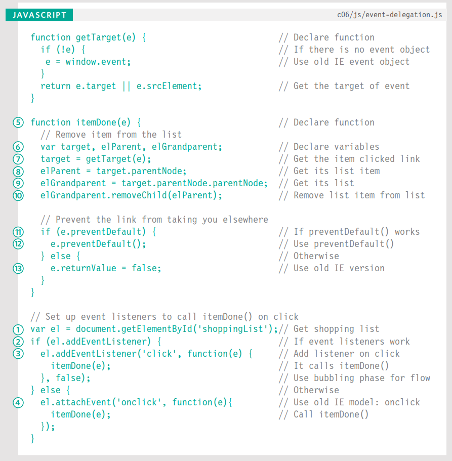

## ¿EN QUÉ ELEMENTO OCURRIÓ UN EVENTO?

Cuando llamas a una función, la propiedad `target` del objeto evento es la mejor manera de determinar en qué elemento ocurrió el evento. Pero puedes ver el enfoque siguiente usado; se basa en la palabra clave `this`.

#### LA PALABRA CLAVE this

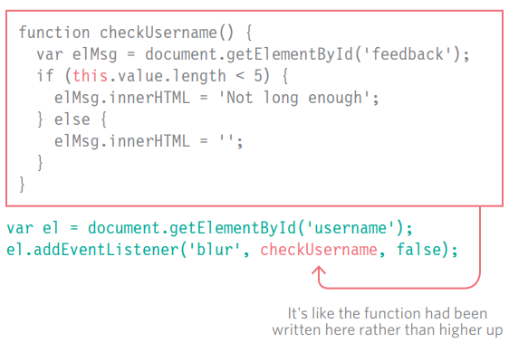

La palabra clave `this` se refiere al propietario de una función. A la derecha, `this` se refiere al elemento en el que está el evento.

Esto funciona cuando no se están pasando parámetros a la función (y por lo tanto no se llama desde una función anónima).

#### USANDO PARÁMETROS

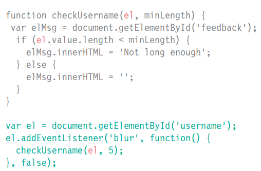

Si pasas parámetros a la función, la palabra clave `this` ya no funciona porque el propietario de la función ya no es el elemento al que el listener de eventos estaba vinculado, es una función anónima.

Podrías pasar el elemento en el que se llamó al evento como otro parámetro de la función.

En ambos casos, el objeto evento es el enfoque preferido.


## DIFERENTES TIPOS DE EVENTOS

En el resto del capítulo, aprenderás sobre los diferentes tipos de eventos a los que puedes responder.

Los eventos están definidos en:
- La especificación W3C del DOM
- La especificación HTML5
- En Modelos de Objetos del Navegador

### EVENTOS W3C DOM

La especificación de eventos DOM es gestionada por el W3C (quienes también supervisan otras especificaciones incluyendo HTML, CSS y XML). La mayoría de los eventos que encontrarás en este capítulo son parte de esta especificación de eventos DOM.

Los navegadores implementan todos los eventos usando el mismo objeto evento que ya conociste. También proporciona retroalimentación como en qué elemento ocurrió el evento, qué tecla presionó un usuario, o dónde está posicionado el cursor.

Sin embargo, hay algunos eventos que no están cubiertos en el modelo de eventos DOM – en particular aquellos que tratan con elementos de formulario. (Solían ser parte del DOM, pero fueron movidos a la especificación HTML5.) La mayoría son resultado de la interacción del usuario con el HTML, pero hay algunos que reaccionan al navegador u otros eventos DOM.

### EVENTOS HTML5

La especificación HTML5 (que todavía está siendo desarrollada) detalla eventos que se espera que los navegadores soporten y que son usados específicamente con HTML. Por ejemplo, eventos que se disparan cuando se envía un formulario o cuando los elementos del formulario cambian (que encontrarás en p282):

`submit`, `input`, `change`

También hay nuevos eventos introducidos con la especificación HTML5 que solo son soportados por navegadores más recientes. Aquí hay algunos (que encontrarás en p286):

`readystatechange`, `DOMContentLoaded`, `hashchange`

No mostramos todos los eventos, pero los ejemplos que ves deberían enseñarte lo suficiente para que puedas trabajar con todos los tipos de eventos.

### EVENTOS BOM

Los fabricantes de navegadores también implementan algunos eventos como parte de su Modelo de Objetos del Navegador (o BOM). Típicamente son eventos no cubiertos (aún) por las especificaciones W3C (aunque algunos serán añadidos a las especificaciones W3C en el futuro).

Varios de estos eventos tratan con dispositivos de pantalla táctil:

`touchstart`, `touchend`, `touchmove`, `orientationchange`

Otros eventos están siendo añadidos para capturar gestos y aprovechar acelerómetros. Se necesita cuidado al usar tales características, ya que diferentes navegadores a menudo crean implementaciones diferentes de funcionalidades similares.

## EVENTOS DE INTERFAZ DE USUARIO

Los eventos de interfaz de usuario (UI) ocurren como resultado de la interacción con la ventana del navegador en lugar de con la página HTML contenida en ella, por ejemplo, una página que se ha cargado o la ventana del navegador que se ha redimensionado.

El manejador / listener de eventos para eventos UI debe adjuntarse a la ventana del navegador.

> En código HTML antiguo, puedes ver estos eventos usados como atributos en la etiqueta de apertura `<body>`. (Por ejemplo, código antiguo usaba el atributo `onload` para ejecutar código cuando la página se había cargado.)

| Evento    | Soporte del navegador y detalles                                                                                     |
|-----------|----------------------------------------------------------------------------------------------------------------------|
| `load`    | Se dispara cuando la página web ha terminado de cargarse. También puede dispararse en nodos de otros elementos que cargan, como imágenes, scripts u objetos. DOM Level 2 (Nov 2000) indica que se dispara en el objeto `document`, pero antes de esto se disparaba en el objeto `window`. Los navegadores soportan ambos para compatibilidad hacia atrás, y los desarrolladores a menudo todavía adjuntan manejadores de eventos `load` al objeto `window` (no `document`). |
| `unload`  | Se dispara cuando la página web se está cerrando (generalmente porque se ha solicitado una nueva página). Ver también el evento `beforeunload` (en p286) que se dispara antes de que el usuario salga de una página. DOM Level 2 indica que se dispara en el nodo del elemento `<body>`, pero en navegadores antiguos se disparaba en el objeto `window` (esto se usa a menudo para compatibilidad hacia atrás). |
| `error`   | Se dispara cuando el navegador encuentra un error de JavaScript o un recurso no existe. El soporte para este evento es inconsistente entre navegadores por lo que no es confiable para el manejo de errores, un tema que aprenderás más en el Capítulo 10. |
| `resize`  | Se dispara cuando la ventana del navegador ha sido redimensionada. Los navegadores disparan repetidamente el evento `resize` mientras la ventana se está redimensionando, así que evita usar este evento para ejecutar código complicado porque podría hacer que la página parezca menos responsive. |
| `scroll`  | Se dispara cuando el usuario ha desplazado la página hacia arriba o abajo. Puede relacionarse con toda la página o con un elemento específico en la página (como un `<textarea>` que tiene barras de desplazamiento). |

### LOAD

El evento `load` se usa comúnmente para ejecutar scripts que acceden al contenido de la página. En este ejemplo, una función llamada `setup()` le da foco al input de texto cuando la página se ha cargado. El evento es elevado automáticamente por el objeto `window` cuando una página ha terminado de cargar el HTML y todos sus recursos: imágenes, CSS, scripts (incluso contenido de terceros como anuncios publicitarios).

La función `setup()` no funcionaría antes de que la página se cargue porque depende de encontrar el elemento cuyo atributo `id` tiene un valor de `username`, para darle foco.

```javascript linenums="1"
// c06/js/load.js

function setup() {
 var textInput;
 textInput = document.getElementById('username');
 textInput.focus();
}
window.addEventListener('load', setup, false);
```

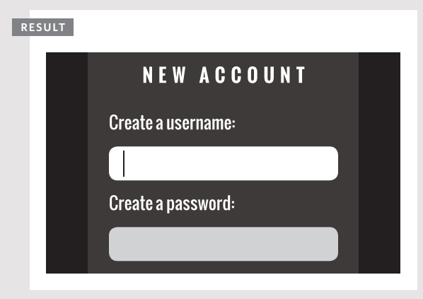

Ten en cuenta que el listener de eventos se adjunta al objeto `window` (no al objeto `document` – ya que esto puede causar problemas de compatibilidad entre navegadores).

> Si el elemento `<script>` está al final de la página HTML, entonces el DOM habría cargado los elementos del formulario antes de que el script se ejecute, y no habría necesidad de esperar al evento `load`. (Ver también: el evento `DOMContentLoaded` en p286 y el método `document.ready()` de jQuery en p312.)

> Debido a que el evento `load` solo se dispara cuando todo lo demás en la página se ha cargado (imágenes, scripts, incluso anuncios), el usuario ya podría haber comenzado a usar la página antes de que el script haya comenzado a ejecutarse. Los usuarios notan particularmente cuando un script cambia la apariencia de la página, cambia el foco o selecciona elementos del formulario después de que han comenzado a usarlo. (Puede hacer que un sitio parezca más lento al cargar.)

> Imagina que este formulario tuviera más inputs; el usuario podría estar llenando el segundo o tercer campo cuando el script se dispara – moviendo el foco de vuelta al primer campo demasiado tarde e interrumpiendo al usuario.

## EVENTOS DE FOCO Y BLUR

Los elementos HTML con los que puedes interactuar, como enlaces y elementos de formulario, pueden ganar foco. Estos eventos se disparan cuando ganan o pierden el foco.

Si puedes interactuar con un elemento HTML, entonces puede ganar (y perder) foco. También puedes tabular entre los elementos que pueden ganar foco (una técnica a menudo usada por personas con discapacidades visuales).

En scripts antiguos, los eventos `focus` y `blur` se usaban a menudo para cambiar la apariencia de un elemento cuando ganaba foco, pero ahora la pseudoclase CSS `:focus` es una mejor solución (a menos que necesites afectar a un elemento diferente del que ganó foco).

Los eventos `focus` y `blur` se usan más comúnmente en formularios. Pueden ser particularmente útiles cuando:

- Quieres mostrar consejos o retroalimentación a los usuarios mientras interactúan con un elemento individual dentro de un formulario (los consejos generalmente se muestran en otros elementos y no en el que están interactuando)
- Necesitas ejecutar validación de formulario a medida que un usuario se mueve de un control al siguiente (en lugar de esperar a que envíen el formulario completo primero)

| Evento     | Disparo                                           | Flujo   |
|------------|---------------------------------------------------|---------|
| `focus`    | Cuando un elemento gana foco, el evento `focus` se dispara para ese nodo DOM | Captura |
| `blur`     | Cuando un elemento pierde foco, el evento `blur` se dispara para ese nodo DOM | Captura |
| `focusin`  | Igual que focus (ver arriba pero no soportado en Firefox al momento de escribir) | Burbuja y captura |
| `focusout`  | Igual que blur (ver arriba pero no soportado en Firefox al momento de escribir) | Burbuja y captura |

### FOCUS & BLUR

En este ejemplo, a medida que el input de texto gana y pierde foco, se muestra retroalimentación al usuario en el elemento `<div>` debajo del input de texto.

La retroalimentación se da usando dos funciones. `tipUsername()` se ejecuta cuando el input de texto gana foco. Cambia el atributo `class` del elemento que contiene el mensaje, y actualiza el contenido del elemento.

`checkUsername()` se ejecuta cuando el input de texto pierde foco. Añade un mensaje y cambia la clase si el nombre de usuario tiene menos de 5 caracteres; de lo contrario, limpia el mensaje.

```javascript linenums="1"
// c06/js/focus-blur.js

function checkUsername() {
 var username = el.value;
 if (username.length < 5) {
 elMsg.className = 'warning';
 elMsg.textContent = 'Not long enough, yet...';
 } else {
 elMsg.textContent = '';
 }
}
function tipUsername() {
 elMsg.className = 'tip';
 elMsg.innerHTML = 'Username must be at least 5 characters';
}
var el = document.getElementById('username');
var elMsg = document.getElementById('feedback');
el.addEventListener('focus', tipUsername, false);
el.addEventListener('blur', checkUsername, false);
```
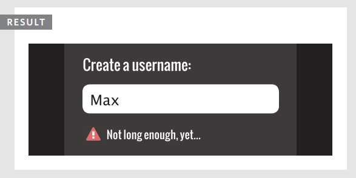

## EVENTOS DE RATÓN

Los eventos de ratón se disparan cuando el ratón se mueve y también cuando sus botones se hacen clic. 

Todos los elementos en una página soportan los eventos de ratón, y todos estos burbujean. Ten en cuenta que las acciones son diferentes en dispositivos de pantalla táctil.

Prevenir un comportamiento predeterminado puede tener resultados inesperados. Por ejemplo, un evento `click` solo se dispara cuando ambos eventos `mousedown` y `mouseup` se han disparado.

| Evento       | Disparo y notas                                                                                                                                                                                                                                 |
|--------------|-------------------------------------------------------------------------------------------------------------------------------------------------------------------------------------------------------------------------------------------------|
| `click`      | Se dispara cuando el usuario hace clic en el botón primario del ratón (generalmente el botón izquierdo si hay más de uno). El evento `click` se disparará para el elemento sobre el que está el ratón. También se dispara si el usuario presiona la tecla Enter en el teclado cuando un elemento tiene foco. Un toque en la pantalla táctil se tratará como un solo clic izquierdo. |
| `dblclick`   | Se dispara cuando el usuario hace clic en el botón primario del ratón dos veces en rápida sucesión. Un doble toque se tratará como un doble clic izquierdo.                                                                                                                                      |
| `mousedown`  | Se dispara cuando el usuario presiona cualquier botón del ratón. (No puede ser disparado por teclado.) Puedes usar el evento `touchstart`.                                                                                                       |
| `mouseup`    | Se dispara cuando el usuario suelta un botón del ratón. (No puede ser disparado por teclado.) Puedes usar el evento `touchend`.                                                                                                                   |
| `mouseover`  | Se dispara cuando el cursor estaba fuera de un elemento y luego se mueve dentro de él. (No puede ser disparado por teclado.) Se dispara cuando el cursor se mueve sobre un elemento.                                                              |
| `mouseout`   | Se dispara cuando el cursor está sobre un elemento, y luego se mueve a otro elemento – fuera del elemento actual o un hijo de él. (No puede ser disparado por teclado.) Se dispara cuando el cursor se mueve fuera de un elemento.               |
| `mousemove`  | Se dispara cuando el cursor se mueve alrededor de un elemento. Este evento se dispara repetidamente. (No puede ser disparado por teclado.) Se dispara cuando el cursor se mueve.                                                                  |

### CUÁNDO USAR CSS

Los eventos `mouseover` y `mouseout` se usaban a menudo para cambiar la apariencia de cajas o para cambiar imágenes cuando el usuario pasaba el ratón sobre ellos. Para cambiar la apariencia del elemento, una técnica preferible sería usar la pseudoclase CSS `:hover`.

### POR QUÉ SEPARAR MOUSEDOWN Y MOUSEUP

Los eventos `mousedown` y `mouseup` separan la presión y liberación de un botón del ratón. Se usan comúnmente para agregar funcionalidad de arrastrar y soltar, o para agregar controles en el desarrollo de juegos.

### CLICK

El objetivo de este ejemplo es usar el evento `click` para eliminar la nota grande que se ha añadido en medio de la página. Pero primero, el script tiene que crear esa nota.

Debido a que la nota está sobre la página, solo queremos mostrarla a los usuarios que tienen JavaScript habilitado (de lo contrario no podrían ocultarla).

Cuando el evento `click` se dispara en el enlace de cerrar, se llama a la función `dismissNote()`. Esta función eliminará la nota que fue añadida por el mismo script.

```javascript linenums="1"
// c06/js/click.js

var msg = '<div class="header"><a id="close" href="#">close X</a></div>';
msg += '<div><h2>System Maintenance</h2>';
msg += 'Our servers are being updated between 3 and 4 a.m. ';
msg += 'During this time, there may be minor disruptions to service.</div>';
var elNote = document.createElement('div'); // Create a new element
elNote.setAttribute('id', 'note'); // Add an id of note
elNote.innerHTML = msg; // Add the message
document.body.appendChild(elNote); // Add it to the page
function dismissNote() { // Declare function
 document.body.removeChild(elNote); // Remove the note
}
var elClose = document.getElementById('close'); // Get the close button
elClose.addEventListener('click', dismissNote, false); // Click close-clear note
```
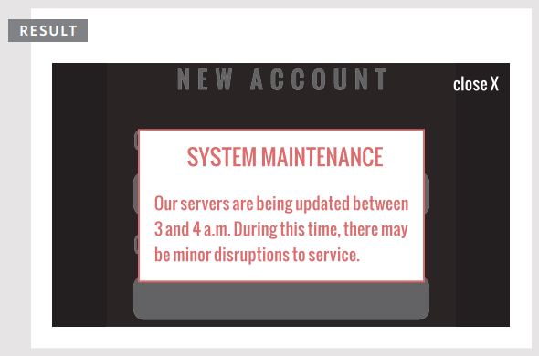


#### ACCESIBILIDAD

El evento `click` puede aplicarse a cualquier elemento, pero es mejor usarlo solo en elementos sobre los que normalmente se hace clic o no será accesible para las personas que dependen de la navegación por teclado.

También puedes sentirte tentado a usar el evento `click` para ejecutar un script cuando un usuario hace clic en un elemento de formulario, pero es mejor usar el evento `focus` porque ese se dispara cuando el usuario accede a ese control usando la tecla tab.

## DÓNDE OCURREN LOS EVENTOS

El objeto evento puede decirte dónde estaba posicionado el cursor cuando se disparó un evento.

#### PANTALLA (SCREEN)

Las propiedades `screenX` y `screenY` indican la posición del cursor dentro de toda la pantalla de tu monitor, midiendo desde la esquina superior izquierda de la pantalla (en lugar del navegador).

#### PÁGINA (PAGE)

Las propiedades `pageX` y `pageY` indican la posición del cursor dentro de toda la página. La parte superior de la página puede estar fuera del viewport, así que incluso si el cursor está en la misma posición, las coordenadas de página y cliente pueden ser diferentes.

#### CLIENTE (CLIENT)

Las propiedades `clientX` y `clientY` indican la posición del cursor dentro del viewport del navegador. Si el usuario ha desplazado hacia abajo y la parte superior de la página ya no está visible, no afectará las coordenadas del cliente.


### DETERMINANDO LA POSICIÓN

En este ejemplo, a medida que mueves tu ratón por la pantalla, los inputs de texto en la parte superior de la página se actualizan con la posición actual del ratón.

Esto demuestra las tres posiciones diferentes que puedes recuperar cuando el ratón se mueve o cuando se hace clic en uno de los botones.

Observa cómo `showPosition()` recibe `event` como parámetro, que se refiere al objeto evento. Las posiciones son todas propiedades de este objeto evento.

```javascript linenums="1"
// c06/js/position.js

var sx = document.getElementById('sx'); // Elemento para contener screenX
var sy = document.getElementById('sy'); // Elemento para contener screenY
var px = document.getElementById('px'); // Elemento para contener pageX
var py = document.getElementById('py'); // Elemento para contener pageY
var cx = document.getElementById('cx'); // Elemento para contener clientX
var cy = document.getElementById('cy'); // Elemento para contener clientY
function showPosition(event) { // Declarar función
 sx.value = event.screenX; // Actualizar elemento con screenX
 sy.value = event.screenY; // Actualizar elemento con screenY
 px.value = event.pageX; // Actualizar elemento con pageX
 py.value = event.pageY; // Actualizar elemento con pageY
 cx.value = event.clientX; // Actualizar elemento con clientX
 cy.value = event.clientY; // Actualizar elemento con clientY
}
var el = document.getElementById('body'); // Obtener elemento body
el.addEventListener('mousemove', showPosition, false); // Movimiento actualiza posición
```
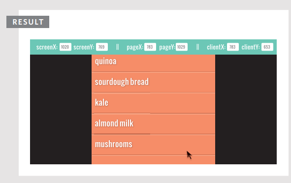

## EVENTOS DE TECLADO

Los eventos de teclado se disparan cuando un usuario interactúa con el teclado (se disparan en cualquier tipo de dispositivo con teclado).

| Evento     | Disparo                                                                                                                                                                                                                           |
|------------|------------------------------------------------------------------------------------------------------------------------------------------------------------------------------------------------------------------------------------|
| `input`    | Se dispara cuando el valor de un elemento `<input>` o `<textarea>` cambia. Soportado por primera vez en IE9 (aunque no se dispara al eliminar texto en IE9). Para navegadores antiguos, puedes usar `keydown` como respaldo.       |
| `keydown`  | Se dispara cuando el usuario presiona cualquier tecla en el teclado. Si el usuario mantiene presionada una tecla, el evento continúa disparándose repetidamente. Esto es importante porque imita lo que sucedería en un input de texto si el usuario mantiene presionada una tecla (el mismo carácter se añadiría repetidamente mientras la tecla esté presionada). |
| `keypress` | Se dispara cuando el usuario presiona una tecla que resultaría en un carácter mostrado en la pantalla. Por ejemplo, este evento no se dispararía cuando el usuario presiona las teclas de flecha, mientras que el evento `keydown` sí. Si el usuario mantiene presionada una tecla, el evento continúa disparándose repetidamente. |
| `keyup`    | Se dispara cuando el usuario suelta una tecla en el teclado. Los eventos `keydown` y `keypress` se disparan antes de que un carácter se muestre en pantalla, mientras que `keyup` se dispara después de que aparezca.               |

Los tres eventos que comienzan con key... se disparan en este orden:

1. `keydown` – el usuario presiona una tecla
2. `keypress` – el usuario ha presionado o está manteniendo una tecla que añade un carácter en la página
3. `keyup` – el usuario suelta la tecla

### ¿QUÉ TECLA SE PRESIONÓ?

En este ejemplo, el elemento `<textarea>` solo debe tener 180 caracteres. Cuando el usuario ingresa texto, el script mostrará cuántos caracteres le quedan disponibles para usar.

El listener de eventos verifica el evento `keypress` en el elemento `<textarea>`. Cada vez que se dispara, la función `charCount()` actualiza el contador de caracteres y muestra el último carácter utilizado.

El evento `input` funcionaría bien para actualizar el contador cuando el usuario pega texto o usa teclas como retroceso, pero no dice qué tecla fue la última en presionarse.


```javascript linenums="1"
// c06/js/keypress.js

var el; // Declarar variables
function charCount(e) { // Declarar función
 var textEntered, charDisplay, counter, lastkey; // Declarar variables
 textEntered = document.getElementById('message').value; // Texto del usuario
 charDisplay = document.getElementById('charactersLeft'); // Elemento contador
 counter = (180 - (textEntered.length)); // Número de caracteres restantes
 charDisplay.textContent = counter; // Mostrar caracteres restantes
 lastkey = document.getElementById('lastkey'); // Obtener última tecla usada
 lastkey.textContent = 'Última tecla en código ASCII: ' + e.keyCode; // Crear mensaje
}
el = document.getElementById('message'); // Obtener elemento message
el.addEventListener('keypress', charCount, false); // Evento keypress
```

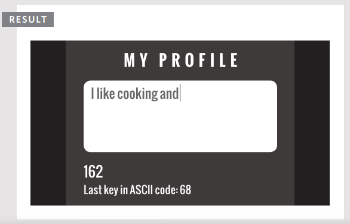

## EVENTOS DE FORMULARIO

Hay dos eventos que se usan comúnmente con formularios. En particular, es probable que veas `submit` usado en la validación de formularios.

| EVENTO   | DESENCADENANTE                                                                                                                                                           |
|----------|--------------------------------------------------------------------------------------------------------------------------------------------------------------------------|
| `submit` | Cuando se envía un formulario, el evento `submit` se dispara en el nodo que representa el elemento `<form>`. Se usa más comúnmente al verificar los valores que un usuario ha ingresado en un formulario antes de enviarlo al servidor. |
| `change` | Se dispara cuando el estado de varios elementos de formulario cambia. Por ejemplo, cuando: se hace una selección de un cuadro de selección desplegable, se selecciona un botón de opción, o se selecciona o deselecciona una casilla de verificación. Suele ser mejor usar el evento `change` en lugar del evento `click` porque hacer clic no es la única forma en que los usuarios interactúan con los elementos del formulario (por ejemplo, pueden usar las teclas tab, flecha o Enter). |
| `input`  | El evento `input`, que viste en la página anterior, se usa comúnmente con elementos `<input>` y `<textarea>`.                                                                                                                           |

#### FOCO Y DESENFOQUE (FOCUS Y BLUR)

Los eventos `focus` y `blur` (que viste en la pág. 274) se usan a menudo con formularios, pero también pueden usarse junto con otros elementos, como enlaces (por lo que no están específicamente relacionados con formularios).

#### VALIDACIÓN

Verificar los valores de los formularios se conoce como **validación**. Si los usuarios omiten información requerida o ingresan información incorrecta, verificarla usando JavaScript es más rápido que enviar los datos al servidor para que sean revisados. La validación se cubre en el Capítulo 13.

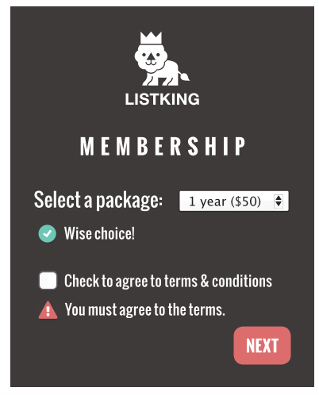

### USANDO EVENTOS DE FORMULARIO

Cuando un usuario interactúa con el cuadro de selección desplegable, el evento `change` activará la función `packageHint()`. Esta muestra mensajes debajo del cuadro de selección que reflejan la elección.

Cuando se envía el formulario, se llama a la función `checkTerms()`. Esta verifica si el usuario ha marcado la casilla que indica que acepta los términos y condiciones.

Si no es así, el script evitará el comportamiento predeterminado del elemento del formulario (y evitará que envíe los datos del formulario al servidor) y mostrará un mensaje de error al usuario.

```javascript linenums="1"
// c06/js/form.js

var elForm, elSelectPackage, elPackageHint, elTerms, elTermsHint; // Declarar variables
elForm = document.getElementById('formSignup'); // Almacenar elementos
elSelectPackage = document.getElementById('package');
elPackageHint = document.getElementById('packageHint');
elTerms = document.getElementById('terms');
elTermsHint = document.getElementById('termsHint');
function packageHint() { // Declarar función
 var pack = this.options[this.selectedIndex].value; // Obtener opción seleccionada
 if (pack == 'monthly') { // Si es paquete mensual
 elPackageHint.innerHTML = '¡Ahorra $10 si pagas por 1 año!'; // Mostrar mensaje
 } else { // De lo contrario
 elPackageHint.innerHTML = '¡Buena elección!'; // Mostrar mensaje
 }
}
function checkTerms(event) { // Declarar función
 if (!elTerms.checked) { // Si la casilla NO está marcada
 elTermsHint.innerHTML = 'Debes aceptar los términos.'; // Mostrar mensaje
 event.preventDefault(); // No enviar formulario
 }
}
// Crear listeners: submit llama a checkTerms(), change llama a packageHint()
elForm.addEventListener('submit', checkTerms, false);
elSelectPackage.addEventListener('change', packageHint, false);
```

## EVENTOS DE MUTACIÓN Y OBSERVADORES

Cada vez que se añaden o eliminan elementos del DOM, su estructura cambia. Este cambio desencadena un evento de mutación.

Cuando tu script añade o elimina contenido de una página, está actualizando el árbol DOM. Hay muchas razones por las que podrías querer responder a la actualización del árbol DOM; por ejemplo, podrías querer informar al usuario de que la página ha cambiado.

A continuación se muestran algunos eventos que se desencadenan cuando el DOM cambia. Estos eventos de mutación se introdujeron en Firefox 3, IE9, Safari 3 y todas las versiones de Chrome. Pero ya están programados para ser reemplazados por una alternativa llamada **observadores de mutación** (mutation observers).

| EVENTO | DESENCADENANTE |
|---|---|
| `DOMNodeInserted` | Se dispara cuando un nodo se inserta en el árbol DOM, ej. usando `appendChild()`, `replaceChild()` o `insertBefore()`. |
| `DOMNodeRemoved` | Se dispara cuando un nodo se elimina del árbol DOM, ej. usando `removeChild()` o `replaceChild()`. |
| `DOMSubtreeModified` | Se dispara cuando la estructura del DOM cambia. Se dispara después de que ocurren los dos eventos anteriores. |
| `DOMNodeInsertedIntoDocument` | Se dispara cuando un nodo se inserta en el árbol DOM como descendiente de otro nodo que ya está en el documento. |
| `DOMNodeRemovedFromDocument` | Se dispara cuando un nodo se elimina del árbol DOM como descendiente de otro nodo que ya está en el documento. |

### PROBLEMAS CON LOS EVENTOS DE MUTACIÓN

Si tu script hace muchos cambios en una página, terminas con muchos eventos de mutación disparándose. Esto puede hacer que una página se sienta lenta o no responda. También pueden desencadenar otros listeners de eventos a medida que se propagan a través del DOM, que modifican otras partes del DOM, provocando más eventos de mutación. Por lo tanto, están siendo reemplazados por observadores de mutación.

